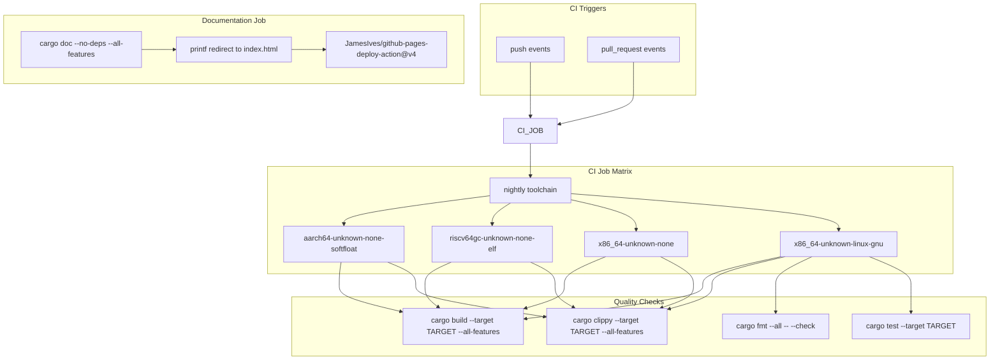
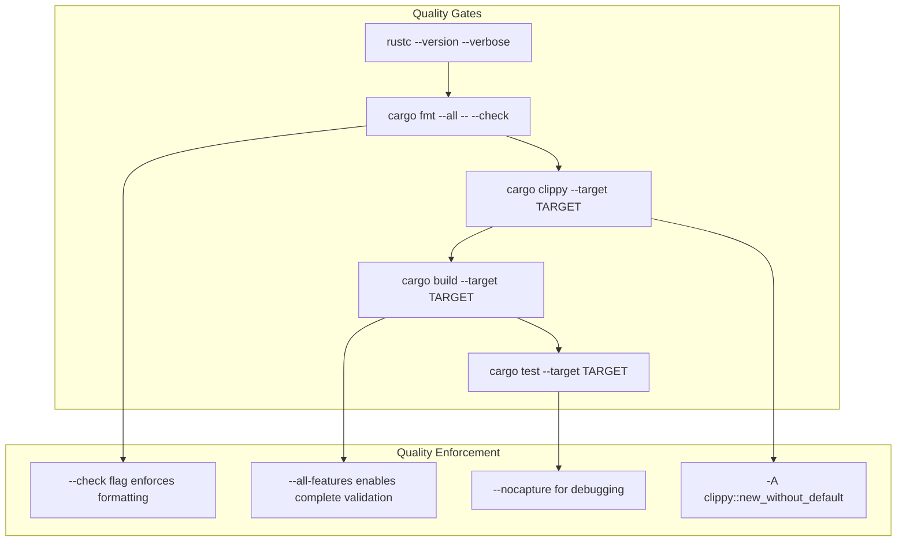
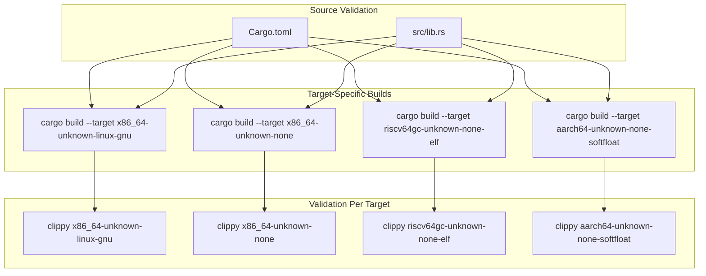

# Build System and CI

> **Relevant source files**
> * [.github/workflows/ci.yml](https://github.com/arceos-org/cap_access/blob/ad71552e/.github/workflows/ci.yml)
> * [Cargo.toml](https://github.com/arceos-org/cap_access/blob/ad71552e/Cargo.toml)

This document covers the build system configuration, continuous integration pipeline, and multi-target support for the cap_access library. It explains how the project maintains code quality across multiple embedded and systems programming targets, automates testing and documentation generation, and ensures compatibility with no_std environments.

For information about the specific target architectures and their embedded considerations, see [Multi-Platform Support](/arceos-org/cap_access/5.2-multi-platform-support).

## Package Configuration

The cap_access library is configured as a Rust crate with specific metadata optimized for embedded and systems programming environments. The package configuration emphasizes no_std compatibility and integration with the ArceOS ecosystem.

### Core Package Metadata

The project is defined in [Cargo.toml(L1 - L12)&emsp;](https://github.com/arceos-org/cap_access/blob/ad71552e/Cargo.toml#L1-L12) with the following key characteristics:

|Property|Value|Purpose|
| --- | --- | --- |
|name|cap_access|Primary crate identifier|
|version|0.1.0|Initial release version|
|edition|2021|Rust 2021 edition features|
|categories|["os", "no-std"]|Operating systems and no_std environments|
|keywords|["arceos", "capabilities", "permission", "access-control"]|Discovery and classification|

The triple licensing scheme specified in [Cargo.toml(L7)&emsp;](https://github.com/arceos-org/cap_access/blob/ad71552e/Cargo.toml#L7-L7) (`GPL-3.0-or-later OR Apache-2.0 OR MulanPSL-2.0`) provides maximum compatibility with different project requirements, particularly important for kernel and embedded development where licensing constraints vary.

### Dependencies

The crate maintains minimal dependencies to support no_std environments:

```
[dependencies]
bitflags = "2.6"
```

The single dependency on `bitflags` version 2.6 [Cargo.toml(L14 - L15)&emsp;](https://github.com/arceos-org/cap_access/blob/ad71552e/Cargo.toml#L14-L15) provides efficient flag operations for the capability system while maintaining no_std compatibility.

**Sources:** [Cargo.toml(L1 - L16)&emsp;](https://github.com/arceos-org/cap_access/blob/ad71552e/Cargo.toml#L1-L16)

## CI Pipeline Architecture

The continuous integration system implements a comprehensive multi-target testing strategy designed for embedded and systems programming environments. The pipeline validates code quality, builds across multiple architectures, and automates documentation deployment.

### Pipeline Structure



**Sources:** [.github/workflows/ci.yml(L1 - L56)&emsp;](https://github.com/arceos-org/cap_access/blob/ad71552e/.github/workflows/ci.yml#L1-L56)

### Job Configuration Matrix

The CI pipeline uses a matrix strategy to test across multiple targets simultaneously. The configuration in [.github/workflows/ci.yml(L8 - L12)&emsp;](https://github.com/arceos-org/cap_access/blob/ad71552e/.github/workflows/ci.yml#L8-L12) defines:

```yaml
strategy:
  fail-fast: false
  matrix:
    rust-toolchain: [nightly]
    targets: [x86_64-unknown-linux-gnu, x86_64-unknown-none, riscv64gc-unknown-none-elf, aarch64-unknown-none-softfloat]
```

The `fail-fast: false` setting ensures that failures on one target don't prevent testing of other targets, crucial for multi-architecture development.

**Sources:** [.github/workflows/ci.yml(L8 - L12)&emsp;](https://github.com/arceos-org/cap_access/blob/ad71552e/.github/workflows/ci.yml#L8-L12)

## Quality Assurance Pipeline

The quality assurance process implements multiple validation stages to ensure code correctness and consistency across all supported targets.

### Toolchain Setup

Each CI run establishes a complete Rust development environment using [.github/workflows/ci.yml(L15 - L19)&emsp;](https://github.com/arceos-org/cap_access/blob/ad71552e/.github/workflows/ci.yml#L15-L19):

```css
- uses: dtolnay/rust-toolchain@nightly
  with:
    toolchain: ${{ matrix.rust-toolchain }}
    components: rust-src, clippy, rustfmt
    targets: ${{ matrix.targets }}
```

The `rust-src` component enables building for bare-metal targets that require custom standard libraries.

### Code Quality Checks



The pipeline enforces strict code formatting through [.github/workflows/ci.yml(L22 - L23)&emsp;](https://github.com/arceos-org/cap_access/blob/ad71552e/.github/workflows/ci.yml#L22-L23) and comprehensive linting via [.github/workflows/ci.yml(L24 - L25)&emsp;](https://github.com/arceos-org/cap_access/blob/ad71552e/.github/workflows/ci.yml#L24-L25) The clippy configuration includes `-A clippy::new_without_default` to suppress warnings about missing `Default` implementations, which may not be appropriate for capability-wrapped types.

### Testing Strategy

Unit tests execute only on the `x86_64-unknown-linux-gnu` target [.github/workflows/ci.yml(L28 - L30)&emsp;](https://github.com/arceos-org/cap_access/blob/ad71552e/.github/workflows/ci.yml#L28-L30) as bare-metal targets cannot run standard test frameworks. The test command includes `--nocapture` to display all output for debugging purposes.

**Sources:** [.github/workflows/ci.yml(L20 - L30)&emsp;](https://github.com/arceos-org/cap_access/blob/ad71552e/.github/workflows/ci.yml#L20-L30)

## Multi-Target Build Matrix

The build system supports diverse execution environments ranging from standard Linux development to bare-metal embedded systems.

### Target Architecture Mapping

|Target Triple|Architecture|Environment|Use Case|
| --- | --- | --- | --- |
|x86_64-unknown-linux-gnu|x86_64|Standard Linux|Development and testing|
|x86_64-unknown-none|x86_64|Bare metal|Kernel development|
|riscv64gc-unknown-none-elf|RISC-V 64-bit|Embedded ELF|IoT and embedded systems|
|aarch64-unknown-none-softfloat|ARM64|Embedded soft-float|Resource-constrained ARM systems|

### Build Process Flow



Each target undergoes identical validation through [.github/workflows/ci.yml(L24 - L27)&emsp;](https://github.com/arceos-org/cap_access/blob/ad71552e/.github/workflows/ci.yml#L24-L27) ensuring consistent behavior across all supported platforms.

**Sources:** [.github/workflows/ci.yml(L12)&emsp;](https://github.com/arceos-org/cap_access/blob/ad71552e/.github/workflows/ci.yml#L12-L12) [.github/workflows/ci.yml(L24 - L27)&emsp;](https://github.com/arceos-org/cap_access/blob/ad71552e/.github/workflows/ci.yml#L24-L27)

## Documentation Generation and Deployment

The documentation system automatically generates and deploys API documentation to GitHub Pages, providing accessible reference material for library users.

### Documentation Build Process

The documentation job runs independently of the main CI pipeline [.github/workflows/ci.yml(L32 - L56)&emsp;](https://github.com/arceos-org/cap_access/blob/ad71552e/.github/workflows/ci.yml#L32-L56) and includes sophisticated error handling for different branch contexts:

```css
- name: Build docs
  continue-on-error: ${{ github.ref != env.default-branch && github.event_name != 'pull_request' }}
  run: |
    cargo doc --no-deps --all-features
    printf '<meta http-equiv="refresh" content="0;url=%s/index.html">' $(cargo tree | head -1 | cut -d' ' -f1) > target/doc/index.html
```

The `continue-on-error` condition in [.github/workflows/ci.yml(L45)&emsp;](https://github.com/arceos-org/cap_access/blob/ad71552e/.github/workflows/ci.yml#L45-L45) allows documentation failures on non-default branches while ensuring they block merges to the main branch.

### Automated Index Generation

The documentation build process includes automatic index page creation [.github/workflows/ci.yml(L46 - L48)&emsp;](https://github.com/arceos-org/cap_access/blob/ad71552e/.github/workflows/ci.yml#L46-L48) that redirects to the main crate documentation, improving user experience when accessing the documentation site.

### GitHub Pages Deployment

Documentation deployment uses the `JamesIves/github-pages-deploy-action@v4` action [.github/workflows/ci.yml(L49 - L55)&emsp;](https://github.com/arceos-org/cap_access/blob/ad71552e/.github/workflows/ci.yml#L49-L55) with single-commit deployment to the `gh-pages` branch, ensuring clean deployment history.

The deployment only triggers on pushes to the default branch [.github/workflows/ci.yml(L50)&emsp;](https://github.com/arceos-org/cap_access/blob/ad71552e/.github/workflows/ci.yml#L50-L50) preventing unnecessary deployments from feature branches.

**Sources:** [.github/workflows/ci.yml(L32 - L56)&emsp;](https://github.com/arceos-org/cap_access/blob/ad71552e/.github/workflows/ci.yml#L32-L56)

## Build Environment Configuration

### Environment Variables and Flags

The documentation build process configures strict linting through the `RUSTDOCFLAGS` environment variable [.github/workflows/ci.yml(L40)&emsp;](https://github.com/arceos-org/cap_access/blob/ad71552e/.github/workflows/ci.yml#L40-L40):

```yaml
RUSTDOCFLAGS: -D rustdoc::broken_intra_doc_links -D missing-docs
```

This configuration treats broken documentation links and missing documentation as errors, ensuring comprehensive and correct documentation.

### Permission Configuration

The documentation job requires special permissions [.github/workflows/ci.yml(L36 - L37)&emsp;](https://github.com/arceos-org/cap_access/blob/ad71552e/.github/workflows/ci.yml#L36-L37) to write to the repository for GitHub Pages deployment:

```yaml
permissions:
  contents: write
```

**Sources:** [.github/workflows/ci.yml(L36 - L40)&emsp;](https://github.com/arceos-org/cap_access/blob/ad71552e/.github/workflows/ci.yml#L36-L40)