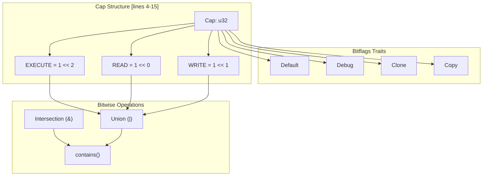
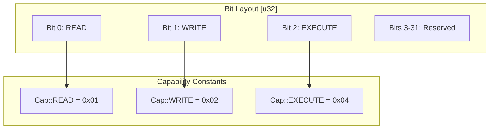
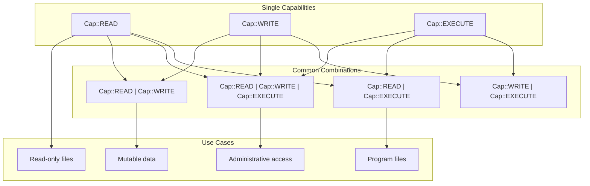
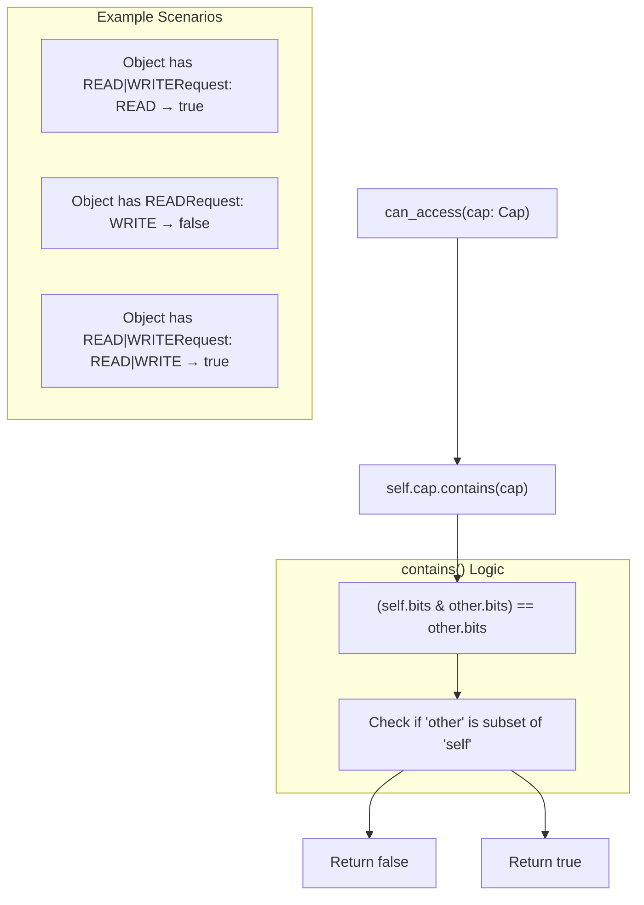

# Capability System

> **Relevant source files**
> * [src/lib.rs](https://github.com/arceos-org/cap_access/blob/ad71552e/src/lib.rs)

## Purpose and Scope

The Capability System forms the foundation of access control in the cap_access library. This document covers the `Cap` bitflags structure, the three fundamental capability types (READ, WRITE, EXECUTE), and the mechanisms for combining and checking capabilities. For information about how capabilities are used with protected objects, see [Object Protection with WithCap](/arceos-org/cap_access/2.2-object-protection-with-withcap). For details on access control methods that utilize these capabilities, see [Access Control Methods](/arceos-org/cap_access/2.3-access-control-methods).

## Cap Bitflags Structure

The capability system is implemented using the `bitflags` crate to provide efficient bit-level operations for permission management. The `Cap` structure represents unforgeable access tokens that can be combined using bitwise operations.

**Cap Bitflags Architecture**

The `Cap` struct is defined as a bitflags structure that wraps a `u32` value, providing type-safe capability manipulation with automatic trait derivations for common operations.

Sources: [src/lib.rs(L4 - L15)&emsp;](https://github.com/arceos-org/cap_access/blob/ad71552e/src/lib.rs#L4-L15)

## Basic Capability Types

The capability system defines three fundamental access rights that correspond to common operating system permissions:

|Capability|Bit Position|Value|Purpose|
| --- | --- | --- | --- |
|READ|0|1 << 0(1)|Grants readable access to protected data|
|WRITE|1|1 << 1(2)|Grants writable access to protected data|
|EXECUTE|2|1 << 2(4)|Grants executable access to protected data|

**Capability Bit Layout**

Each capability type occupies a specific bit position, allowing for efficient combination and checking operations using bitwise arithmetic.

Sources: [src/lib.rs(L8 - L14)&emsp;](https://github.com/arceos-org/cap_access/blob/ad71552e/src/lib.rs#L8-L14)

## Capability Combinations

Capabilities can be combined using bitwise OR operations to create composite permissions. The bitflags implementation provides natural syntax for capability composition:

**Capability Combination Patterns**

The bitflags design enables natural combination of capabilities to express complex permission requirements.

Sources: [src/lib.rs(L4 - L15)&emsp;](https://github.com/arceos-org/cap_access/blob/ad71552e/src/lib.rs#L4-L15)

## Capability Checking Logic

The capability system provides the `contains` method for checking whether a set of capabilities includes required permissions. This forms the foundation for all access control decisions in the system.

**Capability Checking Flow**

The `can_access` method uses bitwise operations to determine if the requested capabilities are a subset of the available capabilities.

Sources: [src/lib.rs(L46 - L48)&emsp;](https://github.com/arceos-org/cap_access/blob/ad71552e/src/lib.rs#L46-L48)

## Implementation Details

The `Cap` structure leverages several key design patterns for efficient and safe capability management:

### Bitflags Integration

The implementation uses the `bitflags!` macro to generate a complete capability management API, including:

* Automatic implementation of bitwise operations (`|`, `&`, `^`, `!`)
* Type-safe flag manipulation methods
* Built-in `contains()` method for subset checking
* Standard trait implementations (`Debug`, `Clone`, `Copy`, `Default`)

### Memory Efficiency

The `Cap` structure occupies only 4 bytes (`u32`) regardless of capability combinations, making it suitable for embedded environments where memory usage is critical.

### Constant Evaluation

The `can_access` method is marked as `const fn`, enabling compile-time capability checking when capability values are known at compile time.

Sources: [src/lib.rs(L4 - L15)&emsp;](https://github.com/arceos-org/cap_access/blob/ad71552e/src/lib.rs#L4-L15) [src/lib.rs(L46 - L48)&emsp;](https://github.com/arceos-org/cap_access/blob/ad71552e/src/lib.rs#L46-L48)