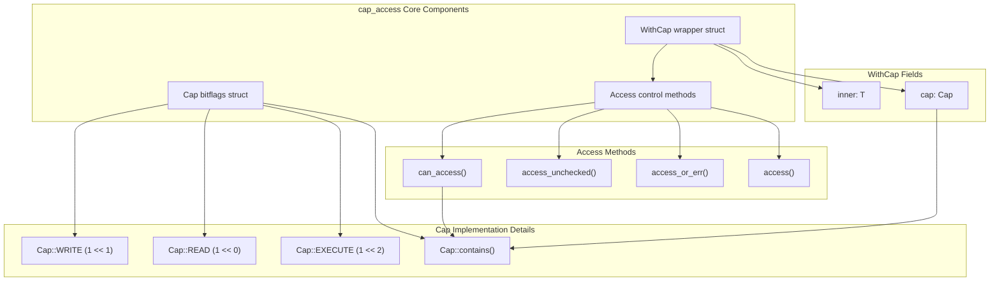
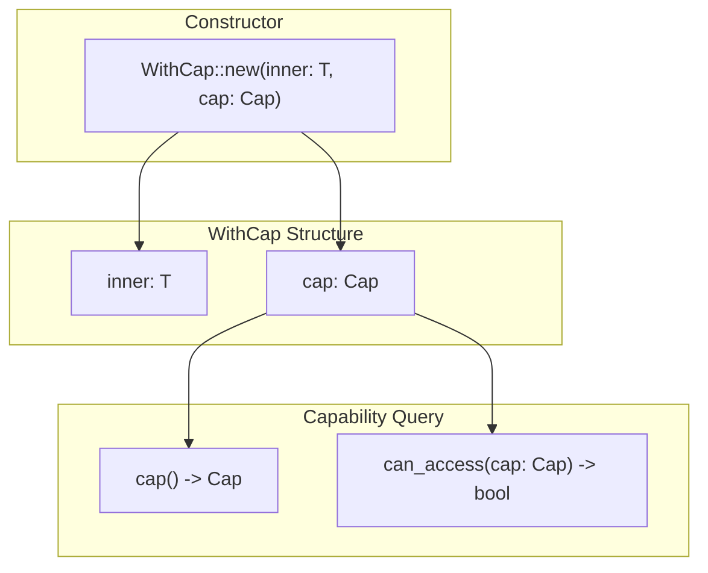
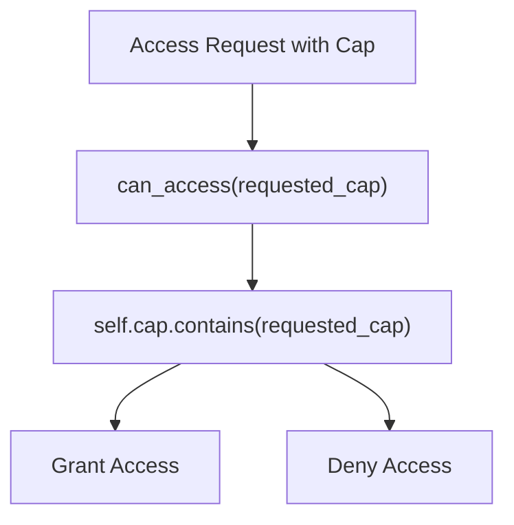
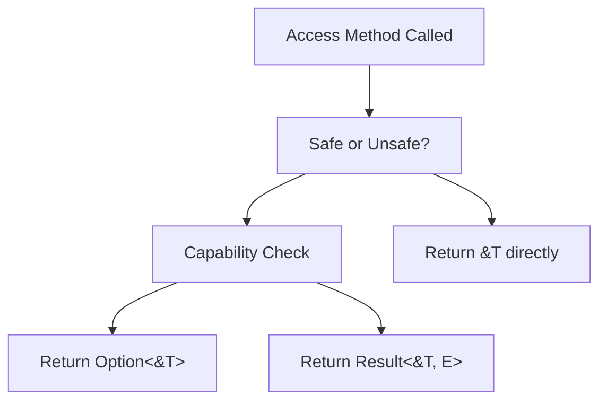

# Core Architecture

> **Relevant source files**
> * [src/lib.rs](https://github.com/arceos-org/cap_access/blob/ad71552e/src/lib.rs)

## Purpose and Scope

This document provides a comprehensive overview of the fundamental architecture underlying the cap_access capability-based access control system. It covers the core components that enable secure object protection through unforgeable capability tokens and controlled access patterns.

For specific implementation details of the capability flags system, see [Capability System](/arceos-org/cap_access/2.1-capability-system). For in-depth coverage of the object wrapper mechanics, see [Object Protection with WithCap](/arceos-org/cap_access/2.2-object-protection-with-withcap). For detailed access method implementations, see [Access Control Methods](/arceos-org/cap_access/2.3-access-control-methods).

## System Overview

The cap_access library implements a capability-based access control model built around two primary components: capability tokens (`Cap`) and protected object wrappers (`WithCap<T>`). The architecture enforces access control at compile time and runtime through a combination of type safety and capability checking.

### Core Architecture Diagram

Sources: [src/lib.rs(L4 - L15)&emsp;](https://github.com/arceos-org/cap_access/blob/ad71552e/src/lib.rs#L4-L15) [src/lib.rs(L17 - L21)&emsp;](https://github.com/arceos-org/cap_access/blob/ad71552e/src/lib.rs#L17-L21) [src/lib.rs(L23 - L100)&emsp;](https://github.com/arceos-org/cap_access/blob/ad71552e/src/lib.rs#L23-L100)

## Core Components

### Capability Token System

The `Cap` struct serves as the foundational security primitive, implemented using the `bitflags` crate to provide efficient bitwise operations on capability flags. The three basic capabilities can be combined using bitwise OR operations to create compound permissions.

|Capability|Value|Purpose|
| --- | --- | --- |
|Cap::READ|1 << 0|Allows reading access to protected data|
|Cap::WRITE|1 << 1|Enables modification of protected data|
|Cap::EXECUTE|1 << 2|Permits execution of protected code|

### Protected Object Wrapper

The `WithCap<T>` generic struct encapsulates any type `T` along with its associated capabilities. This wrapper ensures that access to the inner object is mediated through capability checks, preventing unauthorized operations.

Sources: [src/lib.rs(L17 - L21)&emsp;](https://github.com/arceos-org/cap_access/blob/ad71552e/src/lib.rs#L17-L21) [src/lib.rs(L24 - L27)&emsp;](https://github.com/arceos-org/cap_access/blob/ad71552e/src/lib.rs#L24-L27) [src/lib.rs(L29 - L32)&emsp;](https://github.com/arceos-org/cap_access/blob/ad71552e/src/lib.rs#L29-L32) [src/lib.rs(L34 - L48)&emsp;](https://github.com/arceos-org/cap_access/blob/ad71552e/src/lib.rs#L34-L48)

## Access Control Implementation

### Capability Checking Logic

The core access control mechanism centers on the `can_access` method, which uses the `Cap::contains` operation to verify that the wrapper's capability set includes all bits required by the requested capability.

Sources: [src/lib.rs(L46 - L48)&emsp;](https://github.com/arceos-org/cap_access/blob/ad71552e/src/lib.rs#L46-L48)

### Access Pattern Variants

The architecture provides three distinct access patterns, each with different safety and error handling characteristics:

|Method|Return Type|Safety|Use Case|
| --- | --- | --- | --- |
|access(cap)|Option<&T>|Safe|Optional access with None on failure|
|access_or_err(cap, err)|Result<&T, E>|Safe|Error propagation with custom error types|
|access_unchecked()|&T|Unsafe|Performance-critical code with guaranteed valid capabilities|

### Access Method Flow

Sources: [src/lib.rs(L50 - L57)&emsp;](https://github.com/arceos-org/cap_access/blob/ad71552e/src/lib.rs#L50-L57) [src/lib.rs(L59 - L78)&emsp;](https://github.com/arceos-org/cap_access/blob/ad71552e/src/lib.rs#L59-L78) [src/lib.rs(L80 - L99)&emsp;](https://github.com/arceos-org/cap_access/blob/ad71552e/src/lib.rs#L80-L99)

## Type Safety and Memory Safety

The architecture leverages Rust's type system to enforce capability-based access control at compile time while providing runtime capability validation. The `WithCap<T>` wrapper prevents direct access to the inner object, forcing all access through the controlled interface methods.

The unsafe `access_unchecked` method provides an escape hatch for performance-critical scenarios where the caller can guarantee capability validity, while maintaining clear documentation of the safety requirements.

Sources: [src/lib.rs(L1 - L101)&emsp;](https://github.com/arceos-org/cap_access/blob/ad71552e/src/lib.rs#L1-L101)