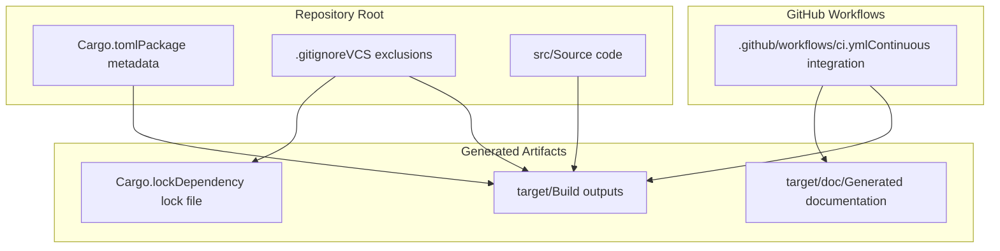
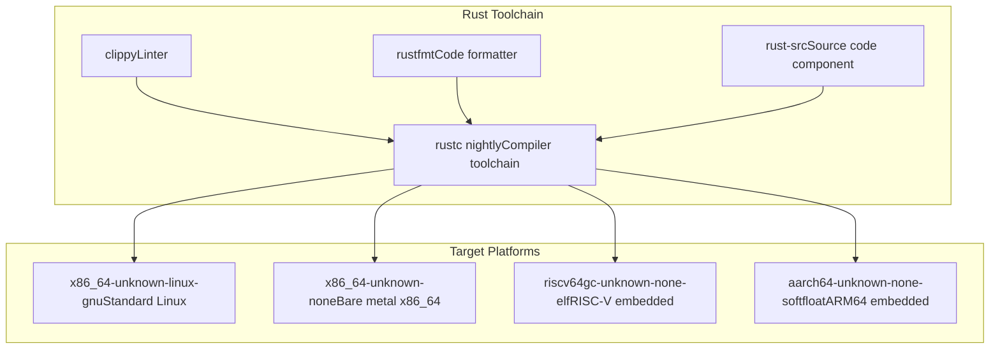
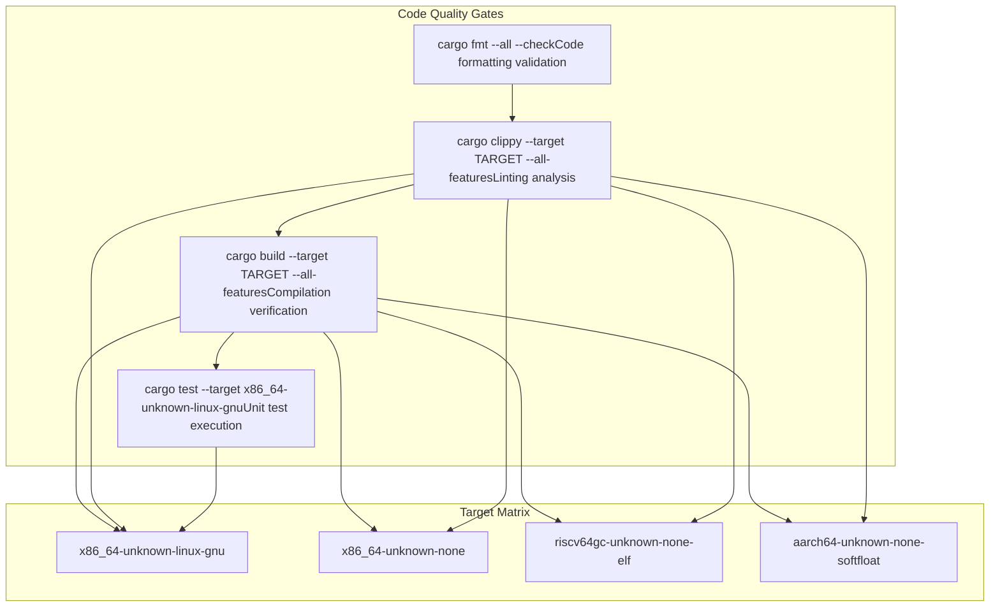
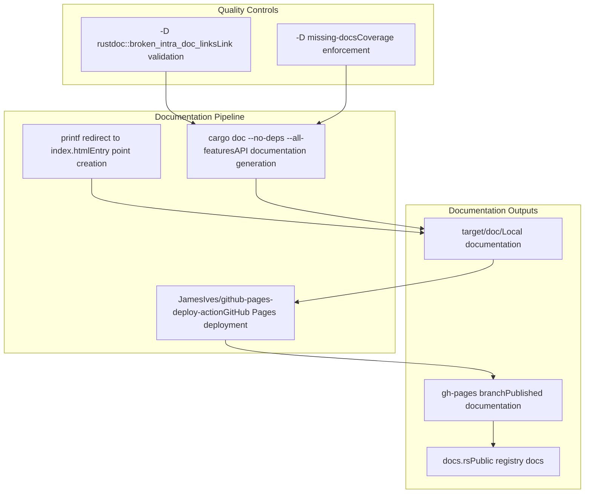

# Development Guide

> **Relevant source files**
> * [.github/workflows/ci.yml](https://github.com/arceos-org/cap_access/blob/ad71552e/.github/workflows/ci.yml)
> * [.gitignore](https://github.com/arceos-org/cap_access/blob/ad71552e/.gitignore)
> * [Cargo.toml](https://github.com/arceos-org/cap_access/blob/ad71552e/Cargo.toml)

This document provides guidance for developers contributing to the `cap_access` library. It covers the project structure, development environment setup, testing procedures, and contribution workflow. For detailed information about the build system and CI pipeline, see [Build System and CI](/arceos-org/cap_access/5.1-build-system-and-ci). For platform-specific development considerations, see [Multi-Platform Support](/arceos-org/cap_access/5.2-multi-platform-support).

## Project Structure

The `cap_access` project follows a standard Rust library structure with emphasis on embedded and `no_std` compatibility. The codebase is designed as a foundational security primitive for the ArceOS operating system ecosystem.

### Repository Organization

**Sources:** [Cargo.toml(L1 - L16)&emsp;](https://github.com/arceos-org/cap_access/blob/ad71552e/Cargo.toml#L1-L16) [.gitignore(L1 - L5)&emsp;](https://github.com/arceos-org/cap_access/blob/ad71552e/.gitignore#L1-L5) [.github/workflows/ci.yml(L1 - L56)&emsp;](https://github.com/arceos-org/cap_access/blob/ad71552e/.github/workflows/ci.yml#L1-L56)

### Package Configuration

The project is configured as a multi-licensed Rust library with specific focus on operating systems and embedded development:

|Property|Value|
| --- | --- |
|Name|cap_access|
|Version|0.1.0|
|Edition|2021|
|License|GPL-3.0-or-later OR Apache-2.0 OR MulanPSL-2.0|
|Categories|os,no-std|
|Keywords|arceos,capabilities,permission,access-control|

**Sources:** [Cargo.toml(L1 - L12)&emsp;](https://github.com/arceos-org/cap_access/blob/ad71552e/Cargo.toml#L1-L12)

## Development Environment

### Required Tools

The development environment requires the Rust nightly toolchain with specific components for cross-compilation and code quality:

**Sources:** [.github/workflows/ci.yml(L15 - L19)&emsp;](https://github.com/arceos-org/cap_access/blob/ad71552e/.github/workflows/ci.yml#L15-L19) [.github/workflows/ci.yml(L11 - L12)&emsp;](https://github.com/arceos-org/cap_access/blob/ad71552e/.github/workflows/ci.yml#L11-L12)

### Dependencies

The project maintains minimal dependencies to ensure compatibility with embedded environments:

* **bitflags 2.6**: Provides efficient bit flag operations for the `Cap` permission system

**Sources:** [Cargo.toml(L14 - L15)&emsp;](https://github.com/arceos-org/cap_access/blob/ad71552e/Cargo.toml#L14-L15)

## Quality Assurance Pipeline

### Automated Checks

The CI pipeline enforces code quality through multiple automated checks:

**Sources:** [.github/workflows/ci.yml(L22 - L30)&emsp;](https://github.com/arceos-org/cap_access/blob/ad71552e/.github/workflows/ci.yml#L22-L30)

### Clippy Configuration

The linting process uses Clippy with specific allowances for the project's design patterns:

* Allows `clippy::new_without_default` due to the `WithCap::new` design requiring explicit capability parameters

**Sources:** [.github/workflows/ci.yml(L25)&emsp;](https://github.com/arceos-org/cap_access/blob/ad71552e/.github/workflows/ci.yml#L25-L25)

## Documentation System

### Documentation Generation

The project uses a dual documentation system for both development and public consumption:

**Sources:** [.github/workflows/ci.yml(L32 - L55)&emsp;](https://github.com/arceos-org/cap_access/blob/ad71552e/.github/workflows/ci.yml#L32-L55) [.github/workflows/ci.yml(L40)&emsp;](https://github.com/arceos-org/cap_access/blob/ad71552e/.github/workflows/ci.yml#L40-L40)

### Documentation Standards

The documentation system enforces strict quality standards:

* **Broken Link Detection**: All intra-documentation links must be valid
* **Coverage Requirement**: All public APIs must be documented
* **Automatic Deployment**: Documentation updates are automatically published on the default branch

**Sources:** [.github/workflows/ci.yml(L40)&emsp;](https://github.com/arceos-org/cap_access/blob/ad71552e/.github/workflows/ci.yml#L40-L40)

## Contributing Workflow

### Pre-Commit Requirements

Before submitting changes, ensure all quality gates pass:

1. **Format Check**: `cargo fmt --all -- --check`
2. **Lint Check**: `cargo clippy --all-features`
3. **Build Verification**: Test on all supported targets
4. **Unit Tests**: `cargo test` on `x86_64-unknown-linux-gnu`

### Supported Platforms

Development must consider compatibility across multiple target architectures:

|Target|Environment|Purpose|
| --- | --- | --- |
|x86_64-unknown-linux-gnu|Standard Linux|Development and testing|
|x86_64-unknown-none|Bare metal x86_64|Embedded systems|
|riscv64gc-unknown-none-elf|RISC-V embedded|IoT and embedded|
|aarch64-unknown-none-softfloat|ARM64 embedded|Mobile and embedded|

**Sources:** [.github/workflows/ci.yml(L12)&emsp;](https://github.com/arceos-org/cap_access/blob/ad71552e/.github/workflows/ci.yml#L12-L12)

The development process is designed to maintain the library's core principles of security, performance, and broad platform compatibility while ensuring code quality through automated verification.