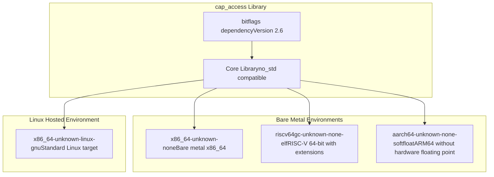
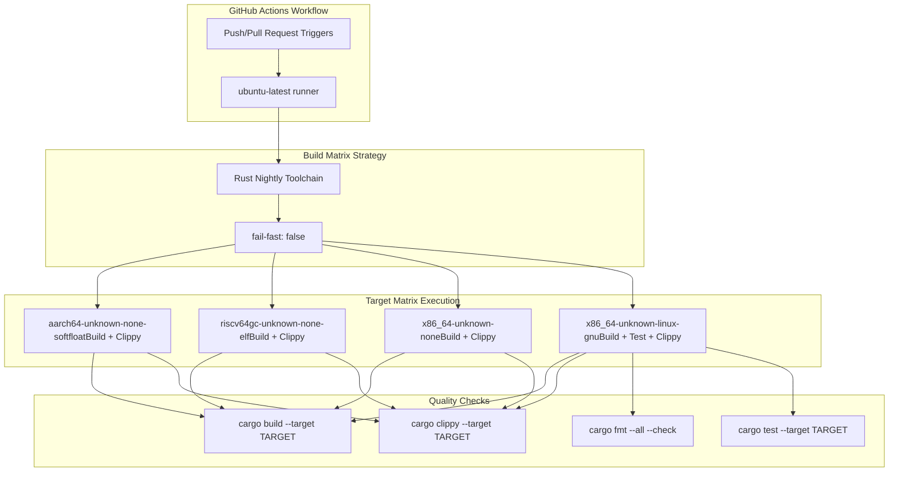
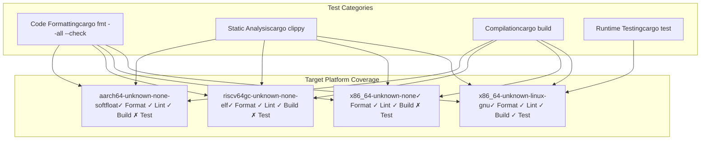

# Multi-Platform Support

> **Relevant source files**
> * [.github/workflows/ci.yml](https://github.com/arceos-org/cap_access/blob/ad71552e/.github/workflows/ci.yml)
> * [Cargo.toml](https://github.com/arceos-org/cap_access/blob/ad71552e/Cargo.toml)

This document covers the multi-platform architecture support implemented in `cap_access`, including the supported target architectures, build matrix configuration, and platform-specific considerations for embedded and bare-metal environments.

For information about the overall build system and continuous integration setup, see [Build System and CI](/arceos-org/cap_access/5.1-build-system-and-ci). For details about how `cap_access` integrates with ArceOS across different platforms, see [ArceOS Integration](/arceos-org/cap_access/4-arceos-integration).

## Supported Target Architectures

The `cap_access` library is designed to run across multiple hardware architectures and execution environments, with a particular focus on embedded and systems programming contexts. The library supports both hosted and bare-metal execution environments.

### Target Architecture Matrix



**Target Architecture Details**

|Target|Environment|Use Case|Floating Point|
| --- | --- | --- | --- |
|x86_64-unknown-linux-gnu|Hosted Linux|Development, testing|Hardware|
|x86_64-unknown-none|Bare metal|Embedded x86_64 systems|Software|
|riscv64gc-unknown-none-elf|Bare metal|RISC-V embedded boards|Software|
|aarch64-unknown-none-softfloat|Bare metal|ARM64 embedded devices|Software|

Sources: [.github/workflows/ci.yml(L12)&emsp;](https://github.com/arceos-org/cap_access/blob/ad71552e/.github/workflows/ci.yml#L12-L12) [Cargo.toml(L12)&emsp;](https://github.com/arceos-org/cap_access/blob/ad71552e/Cargo.toml#L12-L12)

## Continuous Integration Build Matrix

The multi-platform support is validated through a comprehensive CI pipeline that builds and tests the library across all supported architectures.

### CI Pipeline Architecture



**CI Pipeline Configuration Details**

The CI pipeline implements a matrix strategy with the following characteristics:

* **Rust Toolchain**: Nightly with `rust-src`, `clippy`, and `rustfmt` components
* **Failure Strategy**: `fail-fast: false` allows all targets to complete even if one fails
* **Testing Scope**: Unit tests only run on `x86_64-unknown-linux-gnu` due to hosted environment requirements
* **Quality Checks**: All targets undergo formatting, linting, and build verification

Sources: [.github/workflows/ci.yml(L8 - L12)&emsp;](https://github.com/arceos-org/cap_access/blob/ad71552e/.github/workflows/ci.yml#L8-L12) [.github/workflows/ci.yml(L15 - L19)&emsp;](https://github.com/arceos-org/cap_access/blob/ad71552e/.github/workflows/ci.yml#L15-L19) [.github/workflows/ci.yml(L28 - L30)&emsp;](https://github.com/arceos-org/cap_access/blob/ad71552e/.github/workflows/ci.yml#L28-L30)

## Platform-Specific Considerations

### No Standard Library Compatibility

The `cap_access` library is designed with `no_std` compatibility as a primary requirement, enabling deployment in resource-constrained embedded environments.

**Dependency Management**

```

```

The library maintains a minimal dependency footprint with only the `bitflags` crate as an external dependency, ensuring compatibility with embedded environments that cannot support the full Rust standard library.

Sources: [Cargo.toml(L14 - L15)&emsp;](https://github.com/arceos-org/cap_access/blob/ad71552e/Cargo.toml#L14-L15) [Cargo.toml(L12)&emsp;](https://github.com/arceos-org/cap_access/blob/ad71552e/Cargo.toml#L12-L12)

### Architecture-Specific Build Considerations

Each target architecture has specific build requirements and constraints:

**x86_64 Targets**

* `x86_64-unknown-linux-gnu`: Full hosted environment with standard library support for development and testing
* `x86_64-unknown-none`: Bare metal target requiring `#![no_std]` and custom runtime support

**RISC-V Target**

* `riscv64gc-unknown-none-elf`: Supports RISC-V 64-bit with general extensions (G) and compressed instructions (C)
* Requires software floating-point operations
* Common target for embedded RISC-V development boards

**ARM64 Target**

* `aarch64-unknown-none-softfloat`: ARM64 architecture without hardware floating-point unit
* Optimized for embedded ARM64 devices with software floating-point implementation
* Suitable for resource-constrained ARM-based systems

Sources: [.github/workflows/ci.yml(L12)&emsp;](https://github.com/arceos-org/cap_access/blob/ad71552e/.github/workflows/ci.yml#L12-L12)

## Testing and Validation Strategy

The multi-platform support validation employs a targeted testing strategy that accounts for the constraints of different execution environments.

### Platform Testing Matrix



**Testing Constraints by Platform**

* **Hosted Platforms**: Full test suite including unit tests can execute in the hosted Linux environment
* **Bare Metal Platforms**: Limited to static analysis and compilation verification due to lack of test runtime
* **Cross-Compilation**: All bare metal targets are cross-compiled from the x86_64 Linux host environment

The testing strategy ensures that while runtime testing is limited to hosted environments, all platforms receive comprehensive static analysis and successful compilation verification.

Sources: [.github/workflows/ci.yml(L22 - L30)&emsp;](https://github.com/arceos-org/cap_access/blob/ad71552e/.github/workflows/ci.yml#L22-L30) [.github/workflows/ci.yml(L25)&emsp;](https://github.com/arceos-org/cap_access/blob/ad71552e/.github/workflows/ci.yml#L25-L25) [.github/workflows/ci.yml(L29)&emsp;](https://github.com/arceos-org/cap_access/blob/ad71552e/.github/workflows/ci.yml#L29-L29)