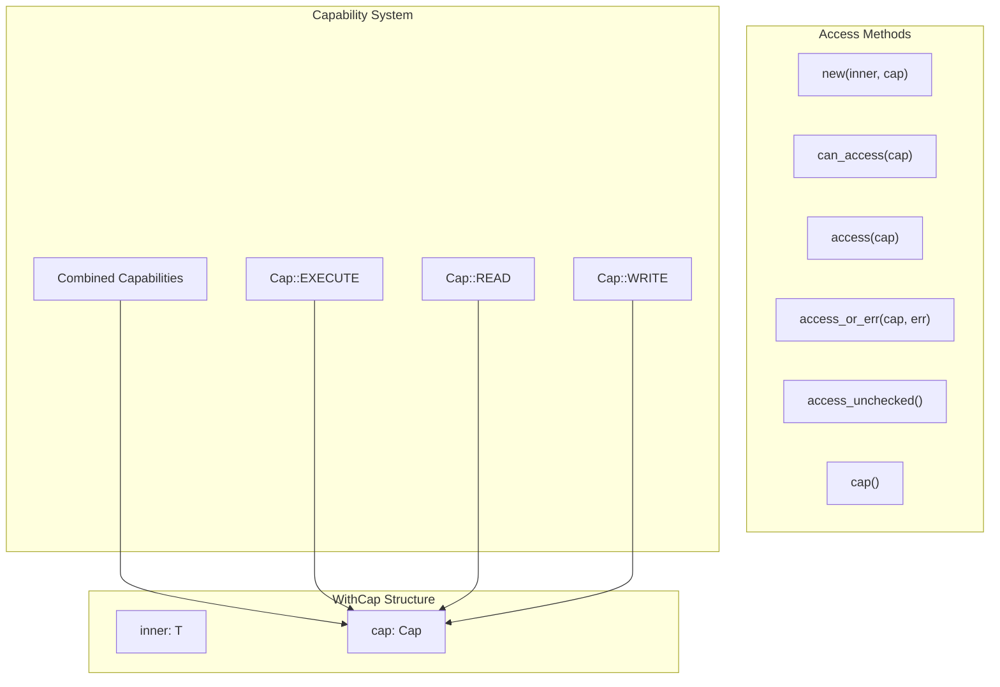
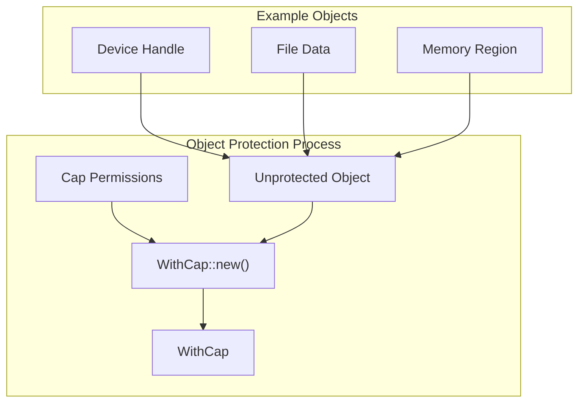
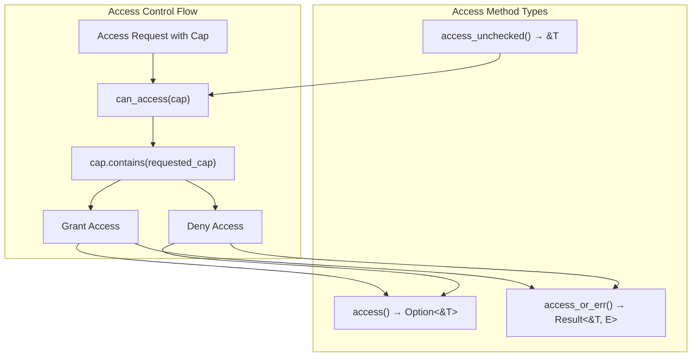
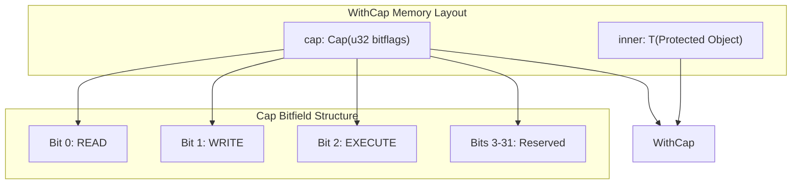

# Object Protection with WithCap

> **Relevant source files**
> * [src/lib.rs](https://github.com/arceos-org/cap_access/blob/ad71552e/src/lib.rs)

## Purpose and Scope

This document covers the `WithCap<T>` wrapper struct, which serves as the core object protection mechanism in the cap_access library. The `WithCap<T>` struct associates any object of type `T` with a specific capability (`Cap`), providing controlled access to the wrapped object through capability checking.

For details about the underlying capability system and `Cap` bitflags, see [Capability System](/arceos-org/cap_access/2.1-capability-system). For comprehensive coverage of the access control methods provided by `WithCap<T>`, see [Access Control Methods](/arceos-org/cap_access/2.3-access-control-methods).

## WithCap Structure Overview

The `WithCap<T>` struct provides a simple but powerful abstraction for capability-based object protection. It wraps any object with an associated capability, ensuring that access to the object is mediated through capability checks.

### Core Architecture

*Sources: [src/lib.rs(L18 - L21)&emsp;](https://github.com/arceos-org/cap_access/blob/ad71552e/src/lib.rs#L18-L21) [src/lib.rs(L23 - L100)&emsp;](https://github.com/arceos-org/cap_access/blob/ad71552e/src/lib.rs#L23-L100)*

### Struct Definition

The `WithCap<T>` struct contains exactly two fields that work together to provide controlled access:

|Field|Type|Purpose|
| --- | --- | --- |
|inner|T|The protected object of arbitrary type|
|cap|Cap|The capability bitflags defining allowed access|

The struct is generic over type `T`, allowing any object to be protected with capabilities.

*Sources: [src/lib.rs(L18 - L21)&emsp;](https://github.com/arceos-org/cap_access/blob/ad71552e/src/lib.rs#L18-L21)*

## Object Wrapping Process

### Creating Protected Objects

The `WithCap::new()` constructor associates an object with specific capabilities, creating an immutable binding between the object and its access permissions.

*Sources: [src/lib.rs(L24 - L27)&emsp;](https://github.com/arceos-org/cap_access/blob/ad71552e/src/lib.rs#L24-L27)*

### Capability Association

The `new()` method permanently associates the provided capability with the object. Once created, the capability cannot be modified, ensuring the integrity of the access control policy.

The constructor signature demonstrates this immutable binding:

* `pub fn new(inner: T, cap: Cap) -> Self`

*Sources: [src/lib.rs(L24 - L27)&emsp;](https://github.com/arceos-org/cap_access/blob/ad71552e/src/lib.rs#L24-L27)*

## Access Control Implementation

### Capability Checking Logic

The core access control mechanism relies on the `can_access()` method, which performs bitwise capability checking using the underlying `Cap::contains()` operation.

*Sources: [src/lib.rs(L46 - L48)&emsp;](https://github.com/arceos-org/cap_access/blob/ad71552e/src/lib.rs#L46-L48) [src/lib.rs(L72 - L78)&emsp;](https://github.com/arceos-org/cap_access/blob/ad71552e/src/lib.rs#L72-L78) [src/lib.rs(L93 - L99)&emsp;](https://github.com/arceos-org/cap_access/blob/ad71552e/src/lib.rs#L93-L99) [src/lib.rs(L55 - L57)&emsp;](https://github.com/arceos-org/cap_access/blob/ad71552e/src/lib.rs#L55-L57)*

### Method Categories

The `WithCap<T>` struct provides three categories of access methods:

|Method Category|Safety|Return Type|Use Case|
| --- | --- | --- | --- |
|Checked Access|Safe|Option<&T>|General-purpose access|
|Error-based Access|Safe|Result<&T, E>|When custom error handling needed|
|Unchecked Access|Unsafe|&T|Performance-critical code paths|

*Sources: [src/lib.rs(L72 - L78)&emsp;](https://github.com/arceos-org/cap_access/blob/ad71552e/src/lib.rs#L72-L78) [src/lib.rs(L93 - L99)&emsp;](https://github.com/arceos-org/cap_access/blob/ad71552e/src/lib.rs#L93-L99) [src/lib.rs(L55 - L57)&emsp;](https://github.com/arceos-org/cap_access/blob/ad71552e/src/lib.rs#L55-L57)*

## Internal Architecture Details

### Capability Storage

The `WithCap<T>` struct stores capabilities as `Cap` bitflags, enabling efficient bitwise operations for permission checking. The `cap()` getter method provides read-only access to the stored capability.

### Memory Layout Considerations

The struct maintains a simple memory layout with the protected object and capability stored adjacently. This design minimizes overhead while maintaining clear separation between the object and its access permissions.

*Sources: [src/lib.rs(L18 - L21)&emsp;](https://github.com/arceos-org/cap_access/blob/ad71552e/src/lib.rs#L18-L21) [src/lib.rs(L29 - L32)&emsp;](https://github.com/arceos-org/cap_access/blob/ad71552e/src/lib.rs#L29-L32)*

### Const Methods

Several methods are declared as `const fn`, enabling compile-time evaluation when possible:

* `cap()` - capability getter
* `can_access()` - capability checking
* `access()` - checked access

This design supports zero-cost abstractions in performance-critical embedded environments.

*Sources: [src/lib.rs(L30)&emsp;](https://github.com/arceos-org/cap_access/blob/ad71552e/src/lib.rs#L30-L30) [src/lib.rs(L46)&emsp;](https://github.com/arceos-org/cap_access/blob/ad71552e/src/lib.rs#L46-L46) [src/lib.rs(L72)&emsp;](https://github.com/arceos-org/cap_access/blob/ad71552e/src/lib.rs#L72-L72)*