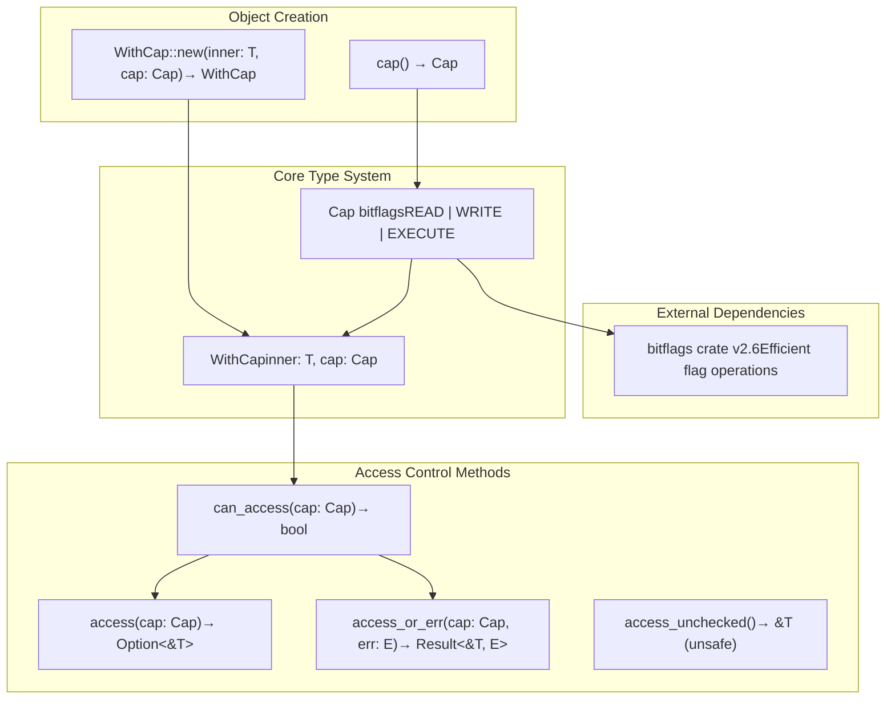

# Overview

> **Relevant source files**
> * [Cargo.toml](https://github.com/arceos-org/cap_access/blob/ad71552e/Cargo.toml)
> * [README.md](https://github.com/arceos-org/cap_access/blob/ad71552e/README.md)
> * [src/lib.rs](https://github.com/arceos-org/cap_access/blob/ad71552e/src/lib.rs)

## Purpose and Scope

This document provides an introduction to the `cap_access` library, a capability-based access control system designed for ArceOS and embedded environments. This overview covers the library's fundamental purpose, core components, and architectural design. For detailed implementation specifics of the capability system, see [Capability System](/arceos-org/cap_access/2.1-capability-system). For practical usage examples and integration patterns, see [Usage Guide](/arceos-org/cap_access/3-usage-guide). For information about ArceOS-specific integration details, see [ArceOS Integration](/arceos-org/cap_access/4-arceos-integration).

## What is cap_access

The `cap_access` library implements a capability-based access control mechanism that provides unforgeable access tokens for protected objects. It serves as a foundational security primitive within the ArceOS operating system ecosystem, enabling fine-grained permission management in resource-constrained environments.

The library centers around two primary components defined in [src/lib.rs(L4 - L15)&emsp;](https://github.com/arceos-org/cap_access/blob/ad71552e/src/lib.rs#L4-L15):

* `Cap` bitflags representing access permissions (`READ`, `WRITE`, `EXECUTE`)
* `WithCap<T>` wrapper struct that associates objects with their required capabilities

Unlike traditional access control lists or ownership models, capability-based security provides direct, unforgeable references to objects along with the permissions needed to access them. This approach eliminates ambient authority and reduces the attack surface in system security.

**Sources:** [Cargo.toml(L1 - L16)&emsp;](https://github.com/arceos-org/cap_access/blob/ad71552e/Cargo.toml#L1-L16) [src/lib.rs(L1 - L21)&emsp;](https://github.com/arceos-org/cap_access/blob/ad71552e/src/lib.rs#L1-L21) [README.md(L7 - L12)&emsp;](https://github.com/arceos-org/cap_access/blob/ad71552e/README.md#L7-L12)

## Core Components Overview

The `cap_access` library consists of three fundamental layers that work together to provide secure object access:

|Component|Location|Purpose|
| --- | --- | --- |
|Capbitflags|src/lib.rs4-15|Define access permissions using efficient bit operations|
|WithCap<T>wrapper|src/lib.rs17-21|Associate any object type with capability requirements|
|Access control methods|src/lib.rs46-99|Provide safe and unsafe access patterns with capability validation|

The system leverages the `bitflags` crate v2.6 for efficient permission operations, enabling combinations like `Cap::READ | Cap::WRITE` while maintaining `no_std` compatibility for embedded environments.

**Sources:** [src/lib.rs(L4 - L15)&emsp;](https://github.com/arceos-org/cap_access/blob/ad71552e/src/lib.rs#L4-L15) [src/lib.rs(L17 - L21)&emsp;](https://github.com/arceos-org/cap_access/blob/ad71552e/src/lib.rs#L17-L21) [Cargo.toml(L14 - L15)&emsp;](https://github.com/arceos-org/cap_access/blob/ad71552e/Cargo.toml#L14-L15)

## System Architecture



This architecture diagram shows the relationship between the core types and the methods that operate on them. The `Cap` bitflags provide the foundation for permission representation, while `WithCap<T>` wraps arbitrary objects with capability requirements. Access control methods then enforce these requirements through various safe and unsafe interfaces.

**Sources:** [src/lib.rs(L4 - L15)&emsp;](https://github.com/arceos-org/cap_access/blob/ad71552e/src/lib.rs#L4-L15) [src/lib.rs(L17 - L27)&emsp;](https://github.com/arceos-org/cap_access/blob/ad71552e/src/lib.rs#L17-L27) [src/lib.rs(L46 - L99)&emsp;](https://github.com/arceos-org/cap_access/blob/ad71552e/src/lib.rs#L46-L99) [Cargo.toml(L14 - L15)&emsp;](https://github.com/arceos-org/cap_access/blob/ad71552e/Cargo.toml#L14-L15)

## Access Control Flow

```

```

This sequence diagram illustrates the different access patterns available in the `cap_access` system. The `can_access()` method serves as the core validation function used by all safe access methods, while `access_unchecked()` bypasses capability validation entirely for performance-critical scenarios.

**Sources:** [src/lib.rs(L46 - L48)&emsp;](https://github.com/arceos-org/cap_access/blob/ad71552e/src/lib.rs#L46-L48) [src/lib.rs(L72 - L78)&emsp;](https://github.com/arceos-org/cap_access/blob/ad71552e/src/lib.rs#L72-L78) [src/lib.rs(L93 - L99)&emsp;](https://github.com/arceos-org/cap_access/blob/ad71552e/src/lib.rs#L93-L99) [src/lib.rs(L55 - L57)&emsp;](https://github.com/arceos-org/cap_access/blob/ad71552e/src/lib.rs#L55-L57)

## Target Environments and Use Cases

The `cap_access` library is specifically designed for system-level programming environments where security and resource constraints are primary concerns:

### no_std Compatibility

The library operates in `no_std` environments as specified in [src/lib.rs(L1)&emsp;](https://github.com/arceos-org/cap_access/blob/ad71552e/src/lib.rs#L1-L1) making it suitable for:

* Embedded systems with limited memory
* Kernel modules without standard library access
* Bare-metal applications on microcontrollers

### ArceOS Integration

As indicated by the package metadata in [Cargo.toml(L8 - L11)&emsp;](https://github.com/arceos-org/cap_access/blob/ad71552e/Cargo.toml#L8-L11) `cap_access` serves as a foundational component within the ArceOS operating system, providing:

* Memory region access control
* File system permission enforcement
* Device driver capability management
* Process isolation mechanisms

### Multi-Architecture Support

The library supports multiple target architectures through its build system, including x86_64, RISC-V, and ARM64 platforms in both hosted and bare-metal configurations.

**Sources:** [src/lib.rs(L1)&emsp;](https://github.com/arceos-org/cap_access/blob/ad71552e/src/lib.rs#L1-L1) [Cargo.toml(L8 - L12)&emsp;](https://github.com/arceos-org/cap_access/blob/ad71552e/Cargo.toml#L8-L12) [README.md(L7 - L8)&emsp;](https://github.com/arceos-org/cap_access/blob/ad71552e/README.md#L7-L8)

## Key Design Principles

The `cap_access` library embodies several important design principles that distinguish it from traditional access control mechanisms:

1. **Unforgeable Capabilities**: The `Cap` bitflags cannot be arbitrarily created or modified, ensuring that only authorized code can grant permissions
2. **Zero-Cost Abstractions**: Capability checks compile to efficient bitwise operations with minimal runtime overhead
3. **Type Safety**: The `WithCap<T>` wrapper preserves the original type while adding capability enforcement
4. **Flexible Access Patterns**: Multiple access methods (`access()`, `access_or_err()`, `access_unchecked()`) accommodate different error handling strategies and performance requirements

This capability-based approach provides stronger security guarantees than discretionary access control while maintaining the performance characteristics required for systems programming.

**Sources:** [src/lib.rs(L4 - L15)&emsp;](https://github.com/arceos-org/cap_access/blob/ad71552e/src/lib.rs#L4-L15) [src/lib.rs(L46 - L99)&emsp;](https://github.com/arceos-org/cap_access/blob/ad71552e/src/lib.rs#L46-L99) [README.md(L9 - L12)&emsp;](https://github.com/arceos-org/cap_access/blob/ad71552e/README.md#L9-L12)