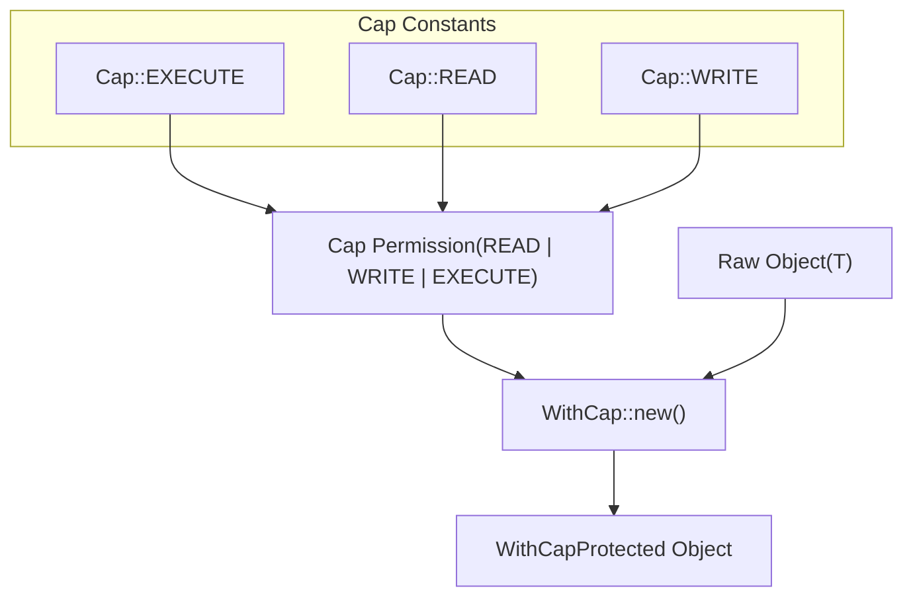
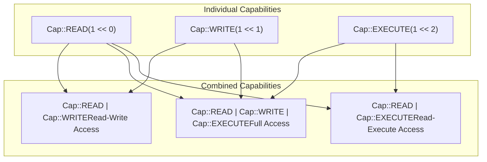
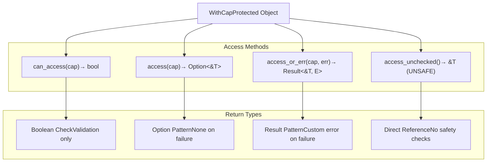
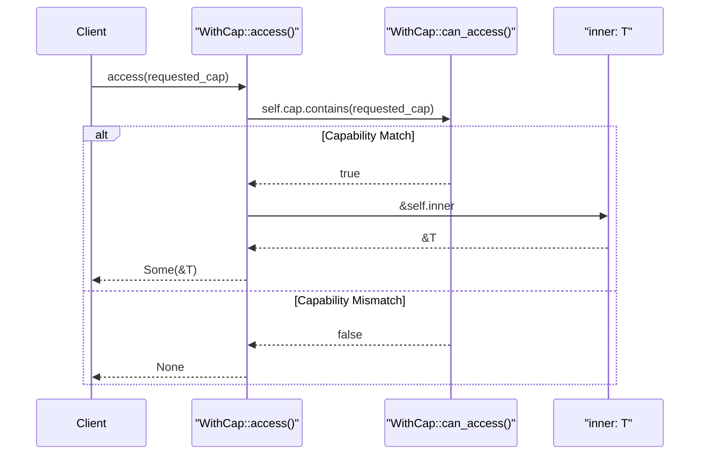
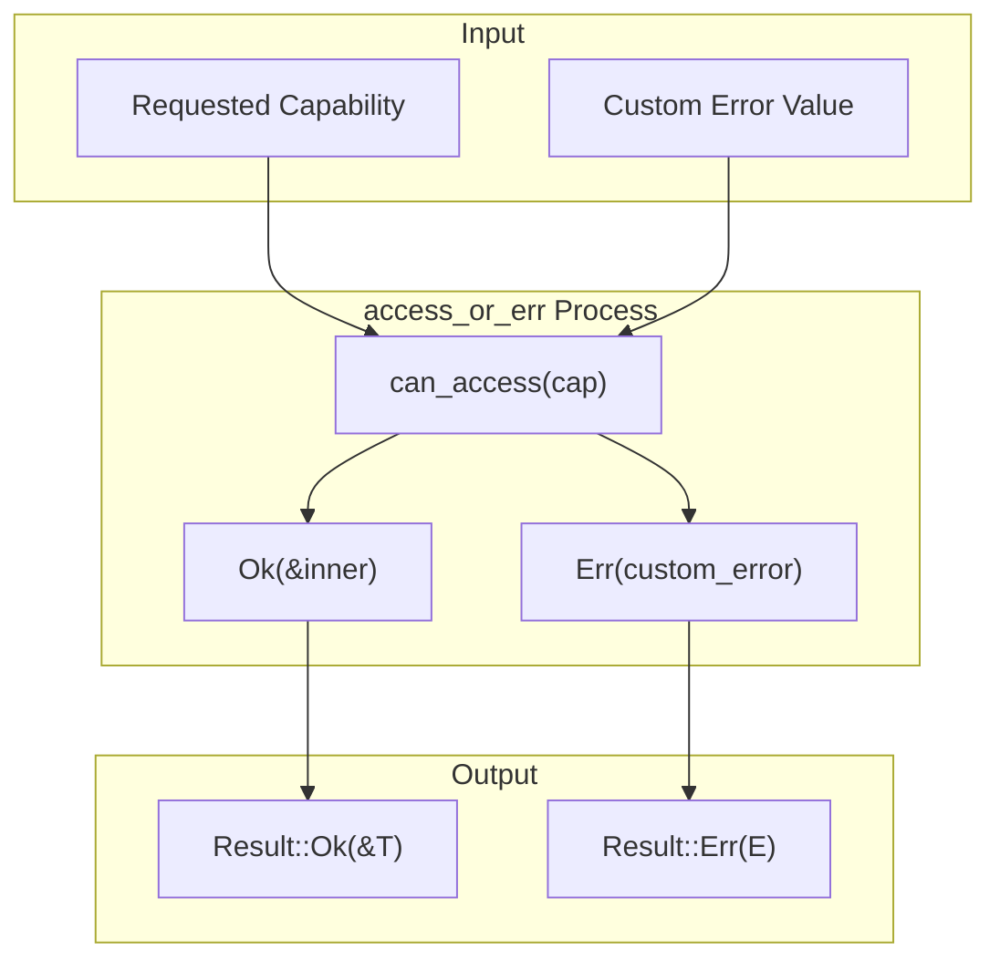
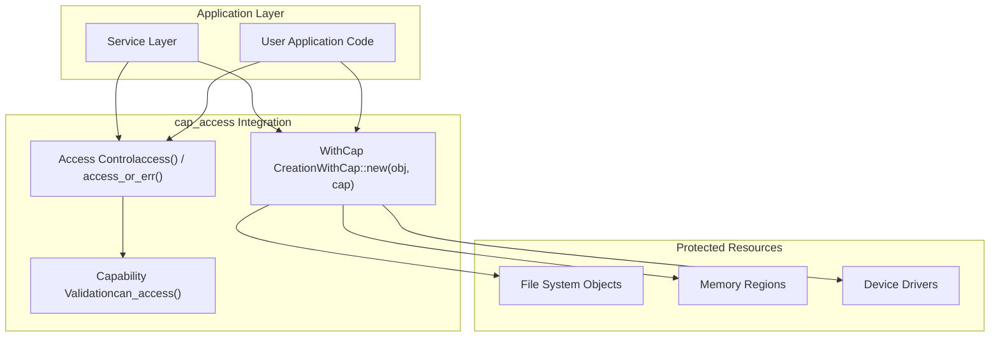
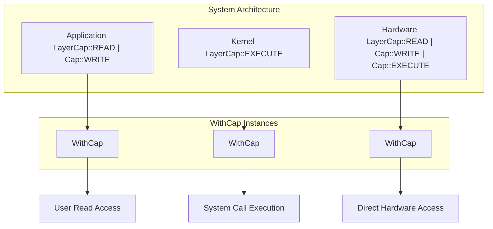

# Usage Guide

> **Relevant source files**
> * [README.md](https://github.com/arceos-org/cap_access/blob/ad71552e/README.md)
> * [src/lib.rs](https://github.com/arceos-org/cap_access/blob/ad71552e/src/lib.rs)

This guide provides practical examples and patterns for using the `cap_access` library in real applications. It covers the essential usage patterns, access methods, and best practices for implementing capability-based access control in your code.

For architectural details about the underlying capability system, see [Core Architecture](/arceos-org/cap_access/2-core-architecture). For information about integrating with ArceOS, see [ArceOS Integration](/arceos-org/cap_access/4-arceos-integration).

## Basic Usage Patterns

The fundamental workflow with `cap_access` involves creating protected objects with `WithCap::new()` and accessing them through capability-checked methods.

### Creating Protected Objects



The most common pattern is to wrap objects at creation time with appropriate capabilities:

|Object Type|Typical Capabilities|Use Case|
| --- | --- | --- |
|Configuration Data|Cap::READ|Read-only system settings|
|User Files|Cap::READ \| Cap::WRITE|Editable user content|
|Executable Code|Cap::READ \| Cap::EXECUTE|Program binaries|
|System Resources|Cap::READ \| Cap::WRITE \| Cap::EXECUTE|Full access resources|

Sources: [src/lib.rs(L4 - L15)&emsp;](https://github.com/arceos-org/cap_access/blob/ad71552e/src/lib.rs#L4-L15) [src/lib.rs(L23 - L27)&emsp;](https://github.com/arceos-org/cap_access/blob/ad71552e/src/lib.rs#L23-L27)

### Capability Composition

Capabilities can be combined using bitwise operations to create complex permission sets:



Sources: [src/lib.rs(L4 - L15)&emsp;](https://github.com/arceos-org/cap_access/blob/ad71552e/src/lib.rs#L4-L15) [README.md(L16 - L29)&emsp;](https://github.com/arceos-org/cap_access/blob/ad71552e/README.md#L16-L29)

## Access Method Comparison

The `WithCap<T>` struct provides three distinct access patterns, each with different safety and error handling characteristics:



### Method Selection Guidelines

|Method|When to Use|Safety Level|Performance|
| --- | --- | --- | --- |
|can_access()|Pre-flight validation checks|Safe|Fastest|
|access()|Optional access patterns|Safe|Fast|
|access_or_err()|Error handling with context|Safe|Fast|
|access_unchecked()|Performance-critical paths|Unsafe|Fastest|

Sources: [src/lib.rs(L34 - L48)&emsp;](https://github.com/arceos-org/cap_access/blob/ad71552e/src/lib.rs#L34-L48) [src/lib.rs(L59 - L78)&emsp;](https://github.com/arceos-org/cap_access/blob/ad71552e/src/lib.rs#L59-L78) [src/lib.rs(L80 - L99)&emsp;](https://github.com/arceos-org/cap_access/blob/ad71552e/src/lib.rs#L80-L99) [src/lib.rs(L50 - L57)&emsp;](https://github.com/arceos-org/cap_access/blob/ad71552e/src/lib.rs#L50-L57)

## Practical Access Patterns

### Safe Access with Option Handling

The `access()` method returns `Option<&T>` and is ideal for scenarios where access failure is expected and should be handled gracefully:



This pattern is demonstrated in the README examples where checking for `Cap::EXECUTE` on a read-write object returns `None`.

Sources: [src/lib.rs(L72 - L78)&emsp;](https://github.com/arceos-org/cap_access/blob/ad71552e/src/lib.rs#L72-L78) [README.md(L22 - L28)&emsp;](https://github.com/arceos-org/cap_access/blob/ad71552e/README.md#L22-L28)

### Error-Based Access with Context

The `access_or_err()` method provides custom error messages for better debugging and user feedback:



This method is particularly useful in system programming contexts where specific error codes or messages are required for debugging.

Sources: [src/lib.rs(L93 - L99)&emsp;](https://github.com/arceos-org/cap_access/blob/ad71552e/src/lib.rs#L93-L99)

### Unsafe High-Performance Access

The `access_unchecked()` method bypasses capability validation for performance-critical code paths:

**Safety Requirements:**

* Caller must manually verify capability compliance
* Should only be used in trusted, performance-critical contexts
* Requires `unsafe` block, making the safety contract explicit

Sources: [src/lib.rs(L55 - L57)&emsp;](https://github.com/arceos-org/cap_access/blob/ad71552e/src/lib.rs#L55-L57)

## Best Practices

### Capability Design Patterns

1. **Principle of Least Privilege**: Grant minimal necessary capabilities
2. **Capability Composition**: Use bitwise OR to combine permissions
3. **Validation at Boundaries**: Check capabilities at system boundaries
4. **Consistent Error Handling**: Choose one access method per subsystem

### Integration Patterns



### Common Usage Scenarios

|Scenario|Recommended Pattern|Example|
| --- | --- | --- |
|File Access Control|WithCap::new(file, Cap::READ \| Cap::WRITE)|User file permissions|
|Memory Protection|WithCap::new(region, Cap::READ \| Cap::EXECUTE)|Code segment protection|
|Device Driver Access|WithCap::new(device, Cap::WRITE)|Hardware write-only access|
|Configuration Data|WithCap::new(config, Cap::READ)|Read-only system settings|

Sources: [src/lib.rs(L23 - L27)&emsp;](https://github.com/arceos-org/cap_access/blob/ad71552e/src/lib.rs#L23-L27) [README.md(L19 - L24)&emsp;](https://github.com/arceos-org/cap_access/blob/ad71552e/README.md#L19-L24)

## Advanced Usage Patterns

### Dynamic Capability Checking

The `can_access()` method enables sophisticated access control logic:

```

```

This pattern is essential for security-sensitive applications that need comprehensive access logging and audit trails.

Sources: [src/lib.rs(L46 - L48)&emsp;](https://github.com/arceos-org/cap_access/blob/ad71552e/src/lib.rs#L46-L48)

### Multi-Level Access Control

Complex systems often require nested capability checks across multiple abstraction layers:



This layered approach ensures that capability validation occurs at appropriate system boundaries while maintaining performance where needed.

Sources: [src/lib.rs(L1 - L101)&emsp;](https://github.com/arceos-org/cap_access/blob/ad71552e/src/lib.rs#L1-L101)