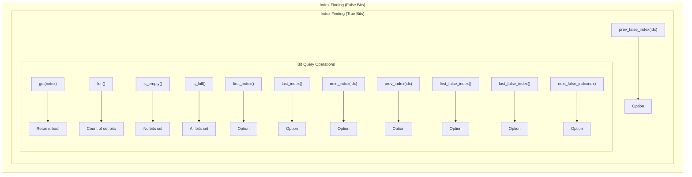
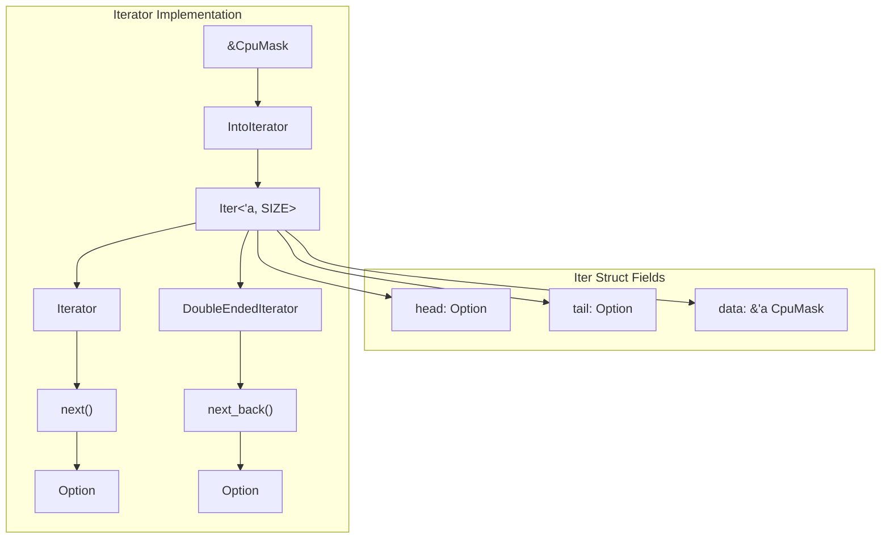
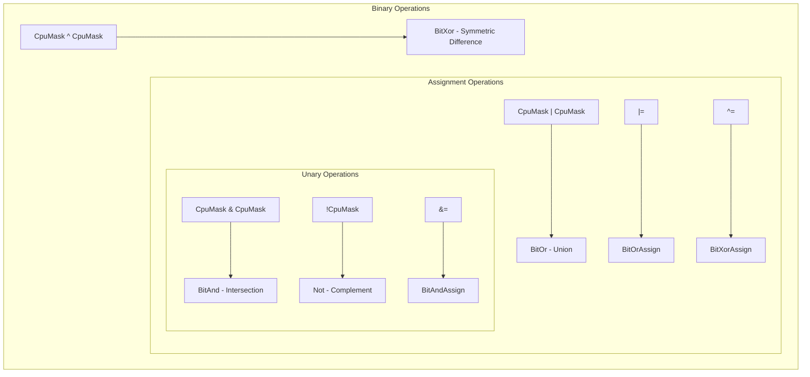

# API Reference

> **Relevant source files**
> * [src/lib.rs](https://github.com/arceos-org/cpumask/blob/a7cfa639/src/lib.rs)

This document provides complete reference documentation for the `CpuMask<SIZE>` struct and its associated types, methods, and trait implementations. The API enables efficient CPU affinity management through bitset operations optimized for different CPU count scenarios.

For architectural details and storage optimization strategies, see [Architecture and Design](/arceos-org/cpumask/3-architecture-and-design). For practical usage examples and common patterns, see [Usage Guide and Examples](/arceos-org/cpumask/4-usage-guide-and-examples).

## Core Types and Structure

```mermaid
flowchart TD
subgraph subGraph3["Iterator Interface"]
    G1["IntoIterator trait"]
    G2["Iter<'a, SIZE>"]
    G3["Iterator + DoubleEndedIterator"]
end
subgraph subGraph2["Query Operations"]
    D1["get(index)"]
    D2["len()"]
    D3["is_empty()"]
    D4["is_full()"]
    D5["first_index()"]
    D6["last_index()"]
    D7["next_index(index)"]
    D8["prev_index(index)"]
    D9["*_false_index variants"]
end
subgraph subGraph1["Construction Methods"]
    C1["new()"]
    C2["full()"]
    C3["mask(bits)"]
    C4["from_value(data)"]
    C5["from_raw_bits(value)"]
    C6["one_shot(index)"]
end
subgraph subGraph0["Core API Structure"]
    A["CpuMask<SIZE>"]
    B["Bitmap<SIZE> value"]
    C["Construction Methods"]
    D["Query Operations"]
    E["Modification Methods"]
    F["Bitwise Operations"]
    G["Iterator Interface"]
end

A --> B
A --> C
A --> D
A --> E
A --> F
A --> G
C --> C1
C --> C2
C --> C3
C --> C4
C --> C5
C --> C6
D --> D1
D --> D2
D --> D3
D --> D4
D --> D5
D --> D6
D --> D7
D --> D8
D --> D9
G --> G1
G --> G2
G --> G3
```

The cpumask library centers around the `CpuMask<const SIZE: usize>` generic struct, which provides a compile-time sized bitset for representing CPU sets.

Sources: [src/lib.rs(L18 - L23)&emsp;](https://github.com/arceos-org/cpumask/blob/a7cfa639/src/lib.rs#L18-L23) [src/lib.rs(L68 - L235)&emsp;](https://github.com/arceos-org/cpumask/blob/a7cfa639/src/lib.rs#L68-L235)

## Type Definitions and Constraints

|Type|Definition|Constraints|
| --- | --- | --- |
|CpuMask<const SIZE: usize>|Main bitset struct|BitsImpl<SIZE>: Bits|
|Iter<'a, const SIZE: usize>|Iterator over set bit indices|BitsImpl<SIZE>: Bits|
|Storage Type|<BitsImpl<SIZE> as Bits>::Store|Automatically selected based on SIZE|

The storage type is automatically optimized based on the `SIZE` parameter:

|SIZE Range|Storage Type|Memory Usage|
| --- | --- | --- |
|1|bool|1 bit|
|2-8|u8|8 bits|
|9-16|u16|16 bits|
|17-32|u32|32 bits|
|33-64|u64|64 bits|
|65-128|u128|128 bits|
|129-1024|[u128; N]|N × 128 bits|

Sources: [src/lib.rs(L12 - L16)&emsp;](https://github.com/arceos-org/cpumask/blob/a7cfa639/src/lib.rs#L12-L16) [src/lib.rs(L18 - L23)&emsp;](https://github.com/arceos-org/cpumask/blob/a7cfa639/src/lib.rs#L18-L23)

## Construction and Conversion Methods

The `CpuMask` type provides multiple ways to create and convert between different representations.

### Basic Construction

|Method|Signature|Description|Time Complexity|
| --- | --- | --- | --- |
|new()|fn new() -> Self|Creates empty mask (all bits false)|O(1)|
|full()|fn full() -> Self|Creates full mask (all bits true)|O(1)|
|mask(bits)|fn mask(bits: usize) -> Self|Creates mask with firstbitsset to true|O(1)|
|one_shot(index)|fn one_shot(index: usize) -> Self|Creates mask with single bit set atindex|O(1)|

### Advanced Construction

|Method|Signature|Description|Panics|
| --- | --- | --- | --- |
|from_value(data)|fn from_value(data: Store) -> Self|Creates from backing store value|Never|
|from_raw_bits(value)|fn from_raw_bits(value: usize) -> Self|Creates from raw usize bits|Ifvalue >= 2^SIZE|

### Conversion Methods

|Method|Signature|Description|
| --- | --- | --- |
|into_value(self)|fn into_value(self) -> Store|Converts to backing store value|
|as_value(&self)|fn as_value(&self) -> &Store|Gets reference to backing store|
|as_bytes(&self)|fn as_bytes(&self) -> &[u8]|Gets byte slice representation|

Sources: [src/lib.rs(L72 - L146)&emsp;](https://github.com/arceos-org/cpumask/blob/a7cfa639/src/lib.rs#L72-L146)

## Query and Inspection Operations

### Bit Testing Operations

|Method|Return Type|Description|Time Complexity|
| --- | --- | --- | --- |
|get(index)|bool|Tests if bit at index is set|O(1)|
|len()|usize|Counts number of set bits|O(n) for arrays, O(1) for primitives|
|is_empty()|bool|Tests if no bits are set|O(log n)|
|is_full()|bool|Tests if all bits are set|O(log n)|

### Index Finding Operations

|Method|Return Type|Description|Time Complexity|
| --- | --- | --- | --- |
|first_index()|Option<usize>|Finds first set bit|O(log n)|
|last_index()|Option<usize>|Finds last set bit|O(log n)|
|next_index(index)|Option<usize>|Finds next set bit after index|O(log n)|
|prev_index(index)|Option<usize>|Finds previous set bit before index|O(log n)|
|first_false_index()|Option<usize>|Finds first unset bit|O(log n)|
|last_false_index()|Option<usize>|Finds last unset bit|O(log n)|
|next_false_index(index)|Option<usize>|Finds next unset bit after index|O(log n)|
|prev_false_index(index)|Option<usize>|Finds previous unset bit before index|O(log n)|

Sources: [src/lib.rs(L148 - L228)&emsp;](https://github.com/arceos-org/cpumask/blob/a7cfa639/src/lib.rs#L148-L228)

## Modification and Iteration

### Modification Operations

|Method|Signature|Description|Returns|
| --- | --- | --- | --- |
|set(&mut self, index, value)|fn set(&mut self, index: usize, value: bool) -> bool|Sets bit at index|Previous value|
|invert(&mut self)|fn invert(&mut self)|Inverts all bits|()|

### Iterator Interface

The `CpuMask` implements `IntoIterator` for `&CpuMask<SIZE>`, yielding indices of set bits.

|Iterator Type|Item Type|Description|
| --- | --- | --- |
|Iter<'a, SIZE>|usize|Iterates over indices of set bits|

|Trait Implementation|Methods|Description|
| --- | --- | --- |
|Iterator|next()|Forward iteration through set bit indices|
|DoubleEndedIterator|next_back()|Reverse iteration through set bit indices|

Sources: [src/lib.rs(L172 - L180)&emsp;](https://github.com/arceos-org/cpumask/blob/a7cfa639/src/lib.rs#L172-L180) [src/lib.rs(L230 - L234)&emsp;](https://github.com/arceos-org/cpumask/blob/a7cfa639/src/lib.rs#L230-L234) [src/lib.rs(L237 - L251)&emsp;](https://github.com/arceos-org/cpumask/blob/a7cfa639/src/lib.rs#L237-L251) [src/lib.rs(L412 - L518)&emsp;](https://github.com/arceos-org/cpumask/blob/a7cfa639/src/lib.rs#L412-L518)

## Bitwise Operations and Trait Implementations

### Binary Bitwise Operations

|Operator|Trait|Description|Result|
| --- | --- | --- | --- |
|&|BitAnd|Intersection of two masks|Set bits present in both|
|\||BitOr|Union of two masks|Set bits present in either|
|^|BitXor|Symmetric difference|Set bits present in exactly one|
|!|Not|Complement of mask|Inverts all bits|
|&=|BitAndAssign|In-place intersection|Modifies left operand|
|\|=|BitOrAssign|In-place union|Modifies left operand|
|^=|BitXorAssign|In-place symmetric difference|Modifies left operand|

### Standard Trait Implementations

|Trait|Implementation|Notes|
| --- | --- | --- |
|Clone|Derived|Bitwise copy|
|Copy|Derived|Trivial copy semantics|
|Default|Derived|Creates empty mask|
|Eq|Derived|Bitwise equality|
|PartialEq|Derived|Bitwise equality|
|Debug|Custom|Displays as "cpumask: [idx1, idx2, ...]"|
|Hash|Custom|Hashes underlying storage value|
|PartialOrd|Custom|Compares underlying storage value|
|Ord|Custom|Compares underlying storage value|

Sources: [src/lib.rs(L17)&emsp;](https://github.com/arceos-org/cpumask/blob/a7cfa639/src/lib.rs#L17-L17) [src/lib.rs(L25 - L66)&emsp;](https://github.com/arceos-org/cpumask/blob/a7cfa639/src/lib.rs#L25-L66) [src/lib.rs(L253 - L326)&emsp;](https://github.com/arceos-org/cpumask/blob/a7cfa639/src/lib.rs#L253-L326)

## Array Conversion Implementations

For large CPU counts, the library provides `From` trait implementations for array conversions:

|Array Size|CpuMask Size|Conversion|
| --- | --- | --- |
|[u128; 2]|CpuMask<256>|BidirectionalFrom|
|[u128; 3]|CpuMask<384>|BidirectionalFrom|
|[u128; 4]|CpuMask<512>|BidirectionalFrom|
|[u128; 5]|CpuMask<640>|BidirectionalFrom|
|[u128; 6]|CpuMask<768>|BidirectionalFrom|
|[u128; 7]|CpuMask<896>|BidirectionalFrom|
|[u128; 8]|CpuMask<1024>|BidirectionalFrom|

These implementations enable direct conversion between `CpuMask` instances and their underlying array storage for sizes exceeding 128 bits.

Sources: [src/lib.rs(L328 - L410)&emsp;](https://github.com/arceos-org/cpumask/blob/a7cfa639/src/lib.rs#L328-L410)