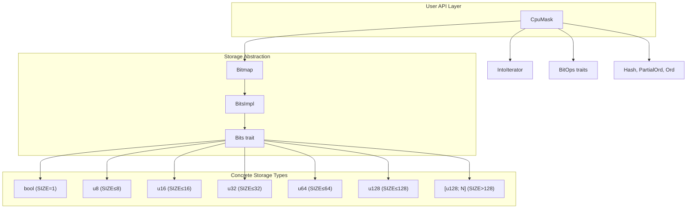
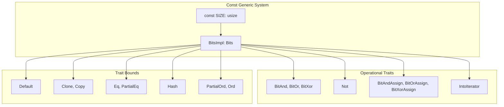
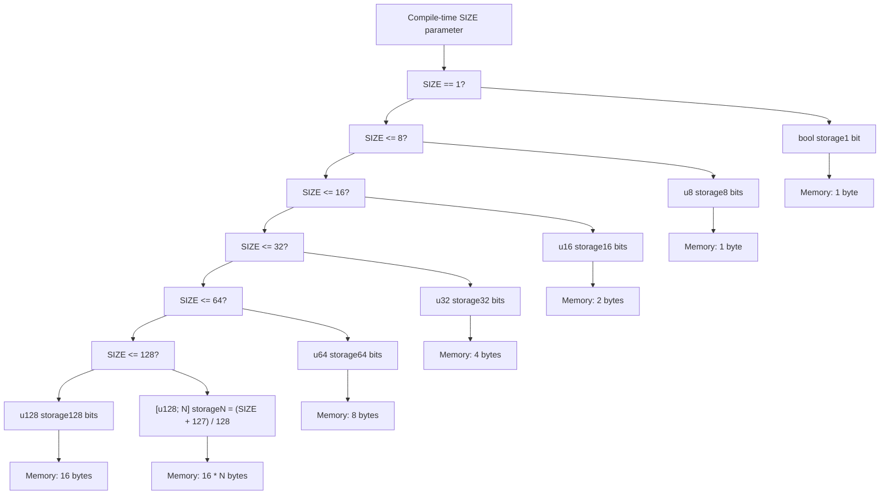
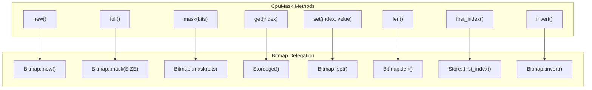
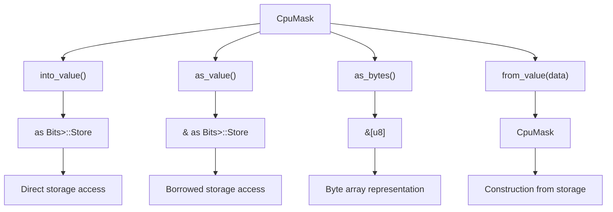
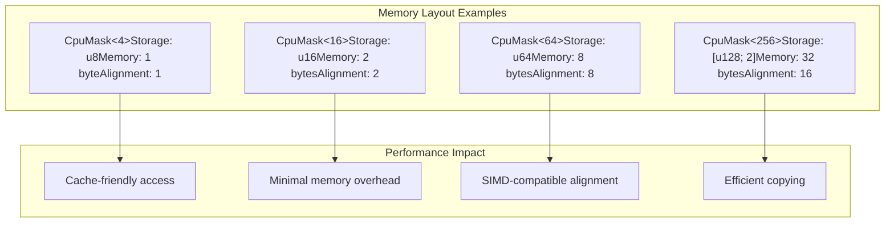
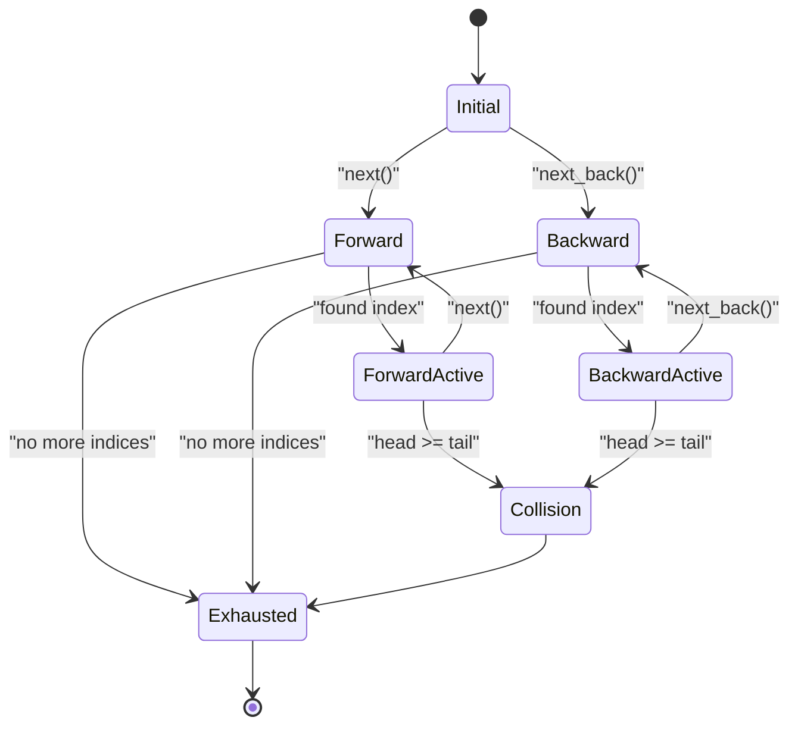
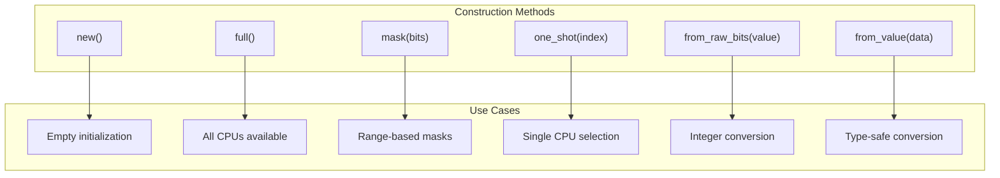

# Architecture and Design

> **Relevant source files**
> * [Cargo.toml](https://github.com/arceos-org/cpumask/blob/a7cfa639/Cargo.toml)
> * [src/lib.rs](https://github.com/arceos-org/cpumask/blob/a7cfa639/src/lib.rs)

This document covers the internal implementation details, storage optimization strategy, performance characteristics, and architectural decisions of the cpumask library. It explains how the `CpuMask` struct integrates with the `bitmaps` crate to provide efficient CPU affinity management. For API usage patterns and practical examples, see [Usage Guide and Examples](/arceos-org/cpumask/4-usage-guide-and-examples). For complete API documentation, see [API Reference](/arceos-org/cpumask/2-api-reference).

## Core Architecture

The cpumask library is built around a single primary type `CpuMask<const SIZE: usize>` that provides a type-safe, compile-time sized bitmap for CPU affinity management. The architecture leverages Rust's const generics and the `bitmaps` crate's automatic storage optimization to provide efficient memory usage across different CPU count scenarios.

### Primary Components

**Core Architecture Design**

The `CpuMask` struct wraps a `Bitmap<SIZE>` from the bitmaps crate, which automatically selects the most efficient storage type based on the compile-time `SIZE` parameter. The `BitsImpl<SIZE>` type alias resolves to the appropriate concrete storage type, and the `Bits` trait provides uniform operations across all storage variants.

Sources: [src/lib.rs(L18 - L23)&emsp;](https://github.com/arceos-org/cpumask/blob/a7cfa639/src/lib.rs#L18-L23) [src/lib.rs(L7)&emsp;](https://github.com/arceos-org/cpumask/blob/a7cfa639/src/lib.rs#L7-L7) [src/lib.rs(L98 - L102)&emsp;](https://github.com/arceos-org/cpumask/blob/a7cfa639/src/lib.rs#L98-L102)

### Type System Integration

**Type System Design**

The library extensively uses Rust's trait system to provide consistent behavior across different storage types. All traits are conditionally implemented based on the capabilities of the underlying storage type, ensuring type safety while maintaining performance.

Sources: [src/lib.rs(L17)&emsp;](https://github.com/arceos-org/cpumask/blob/a7cfa639/src/lib.rs#L17-L17) [src/lib.rs(L25 - L66)&emsp;](https://github.com/arceos-org/cpumask/blob/a7cfa639/src/lib.rs#L25-L66) [src/lib.rs(L253 - L326)&emsp;](https://github.com/arceos-org/cpumask/blob/a7cfa639/src/lib.rs#L253-L326)

## Storage Optimization Strategy

The most significant architectural feature is the automatic storage optimization that occurs at compile time based on the `SIZE` parameter. This optimization is handled entirely by the `bitmaps` crate's `BitsImpl` type system.

### Storage Selection Logic

**Storage Selection Algorithm**

The storage selection is determined by the `BitsImpl<SIZE>` type alias from the bitmaps crate. This provides optimal memory usage by selecting the smallest storage type that can accommodate the required number of bits, with special handling for the single-bit case using `bool`.

Sources: [src/lib.rs(L12 - L16)&emsp;](https://github.com/arceos-org/cpumask/blob/a7cfa639/src/lib.rs#L12-L16) [src/lib.rs(L20)&emsp;](https://github.com/arceos-org/cpumask/blob/a7cfa639/src/lib.rs#L20-L20)

### Array Storage for Large Sizes

For CPU masks exceeding 128 bits, the library uses arrays of `u128` values. The implementation provides explicit conversion traits for common large sizes used in high-core-count systems.

|Size|Storage Type|Conversion Traits|
| --- | --- | --- |
|256|[u128; 2]|From<[u128; 2]>,Into<[u128; 2]>|
|384|[u128; 3]|From<[u128; 3]>,Into<[u128; 3]>|
|512|[u128; 4]|From<[u128; 4]>,Into<[u128; 4]>|
|640|[u128; 5]|From<[u128; 5]>,Into<[u128; 5]>|
|768|[u128; 6]|From<[u128; 6]>,Into<[u128; 6]>|
|896|[u128; 7]|From<[u128; 7]>,Into<[u128; 7]>|
|1024|[u128; 8]|From<[u128; 8]>,Into<[u128; 8]>|

Sources: [src/lib.rs(L328 - L410)&emsp;](https://github.com/arceos-org/cpumask/blob/a7cfa639/src/lib.rs#L328-L410)

## Integration with Bitmaps Crate

The cpumask library is designed as a domain-specific wrapper around the `bitmaps` crate, leveraging its efficient bitmap implementation while providing CPU-focused semantics and additional functionality.

### Delegation Pattern

**Method Delegation Architecture**

Most `CpuMask` methods directly delegate to the underlying `Bitmap<SIZE>` implementation, providing a thin wrapper that maintains the CPU-specific semantics while leveraging the optimized bitmap operations.

Sources: [src/lib.rs(L74 - L84)&emsp;](https://github.com/arceos-org/cpumask/blob/a7cfa639/src/lib.rs#L74-L84) [src/lib.rs(L167 - L234)&emsp;](https://github.com/arceos-org/cpumask/blob/a7cfa639/src/lib.rs#L167-L234)

### Storage Access Methods

The library provides multiple ways to access the underlying storage, enabling efficient integration with system APIs that expect raw bit representations:

**Storage Access Patterns**

These methods enable zero-copy conversions between `CpuMask` and its underlying storage representation, facilitating efficient interaction with system calls and external APIs that work with raw bit data.

Sources: [src/lib.rs(L131 - L146)&emsp;](https://github.com/arceos-org/cpumask/blob/a7cfa639/src/lib.rs#L131-L146)

## Performance Characteristics

The architectural design prioritizes performance through several key strategies:

### Operation Complexity

|Operation Category|Time Complexity|Space Complexity|Implementation|
| --- | --- | --- | --- |
|Construction|O(1)|O(1)|Direct storage initialization|
|Single bit access (get,set)|O(1)|O(1)|Direct bit manipulation|
|Bit counting (len)|O(log n)|O(1)|Hardware population count|
|Index finding (first_index,last_index)|O(log n)|O(1)|Hardware bit scan|
|Iteration|O(k)|O(1)|Where k = number of set bits|
|Bitwise operations|O(1)|O(1)|Single instruction for small sizes|

### Memory Layout Optimization

**Memory Efficiency Design**

The automatic storage selection ensures that CPU masks consume the minimum possible memory while maintaining optimal alignment for the target architecture. This reduces cache pressure and enables efficient copying and comparison operations.

Sources: [src/lib.rs(L12 - L16)&emsp;](https://github.com/arceos-org/cpumask/blob/a7cfa639/src/lib.rs#L12-L16)

## Iterator Implementation

The iterator design provides efficient traversal of set bits without allocating additional memory, supporting both forward and backward iteration.

### Iterator State Management

**Iterator State Machine**

The `Iter<'a, SIZE>` struct maintains head and tail pointers to support bidirectional iteration while detecting when the iterators meet to avoid double-yielding indices.

Sources: [src/lib.rs(L428 - L518)&emsp;](https://github.com/arceos-org/cpumask/blob/a7cfa639/src/lib.rs#L428-L518)

### Iterator Performance

The iterator implementation leverages the underlying bitmap's efficient index-finding operations:

* `first_index()`: Hardware-accelerated bit scanning
* `next_index(index)`: Continues from previous position
* `prev_index(index)`: Reverse bit scanning
* Memory usage: Fixed 24 bytes (two `Option<usize>` + reference)

Sources: [src/lib.rs(L444 - L479)&emsp;](https://github.com/arceos-org/cpumask/blob/a7cfa639/src/lib.rs#L444-L479) [src/lib.rs(L486 - L517)&emsp;](https://github.com/arceos-org/cpumask/blob/a7cfa639/src/lib.rs#L486-L517)

## API Design Patterns

The library follows consistent design patterns that enhance usability and performance:

### Constructor Patterns

**Constructor Design Philosophy**

Each constructor serves a specific use case common in CPU affinity management, from empty masks for incremental building to full masks for restriction-based workflows.

Sources: [src/lib.rs(L72 - L128)&emsp;](https://github.com/arceos-org/cpumask/blob/a7cfa639/src/lib.rs#L72-L128)

### Error Handling Strategy

The library uses a combination of compile-time guarantees and runtime assertions to ensure correctness:

* **Compile-time**: `SIZE` parameter ensures storage adequacy
* **Debug assertions**: Index bounds checking in debug builds
* **Runtime panics**: Explicit validation for user-provided values

Sources: [src/lib.rs(L90)&emsp;](https://github.com/arceos-org/cpumask/blob/a7cfa639/src/lib.rs#L90-L90) [src/lib.rs(L107)&emsp;](https://github.com/arceos-org/cpumask/blob/a7cfa639/src/lib.rs#L107-L107) [src/lib.rs(L124)&emsp;](https://github.com/arceos-org/cpumask/blob/a7cfa639/src/lib.rs#L124-L124) [src/lib.rs(L169)&emsp;](https://github.com/arceos-org/cpumask/blob/a7cfa639/src/lib.rs#L169-L169) [src/lib.rs(L178)&emsp;](https://github.com/arceos-org/cpumask/blob/a7cfa639/src/lib.rs#L178-L178)

This architectural design provides a balance between performance, safety, and usability, making the cpumask library suitable for high-performance operating system kernels while maintaining Rust's safety guarantees.