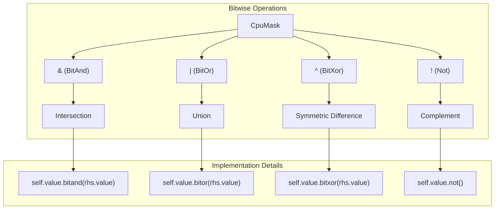
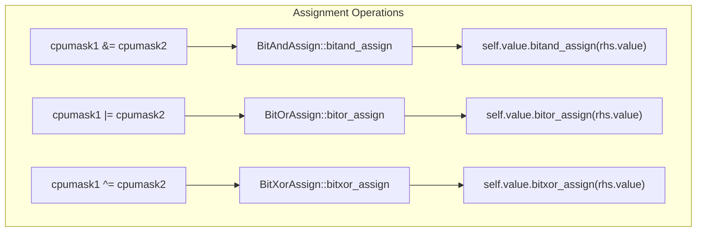
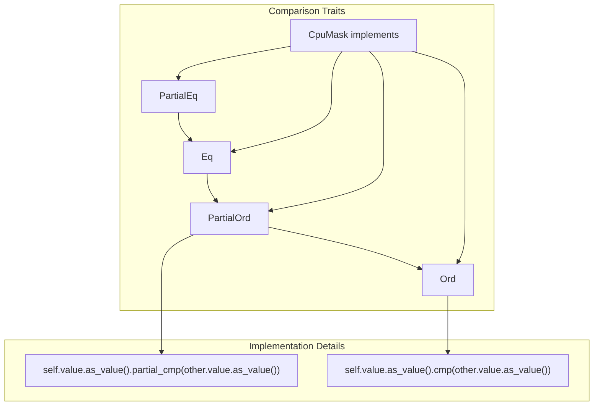
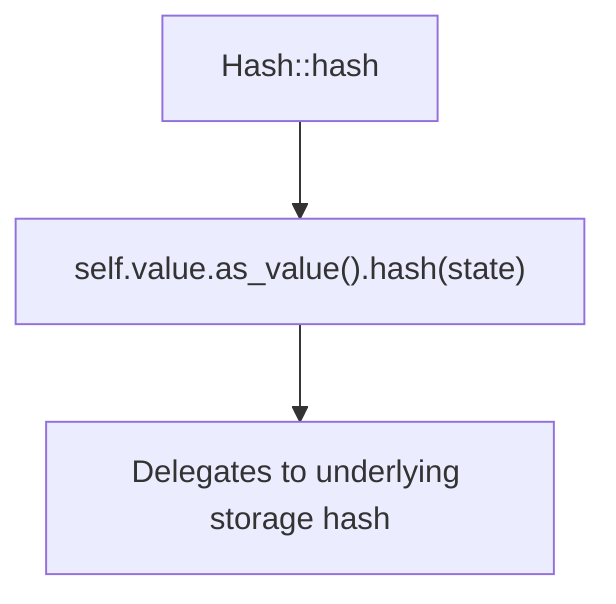
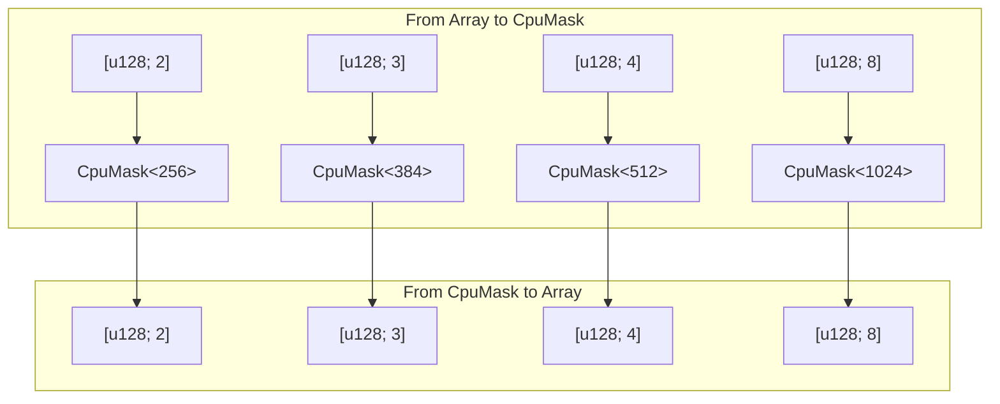
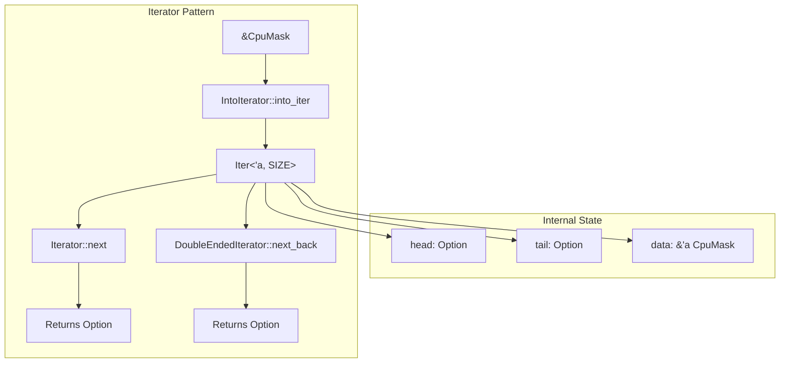

# Bitwise Operations and Traits

> **Relevant source files**
> * [src/lib.rs](https://github.com/arceos-org/cpumask/blob/a7cfa639/src/lib.rs)

This page documents the operator overloads, trait implementations, and set operations available on `CpuMask` instances. These operations enable intuitive mathematical set operations, comparisons, and conversions between CPU mask representations.

For information about basic construction and conversion methods, see [Construction and Conversion Methods](/arceos-org/cpumask/2.1-construction-and-conversion-methods). For details about query operations and bit manipulation, see [Query and Inspection Operations](/arceos-org/cpumask/2.2-query-and-inspection-operations).

## Bitwise Set Operations

The `CpuMask` type implements standard bitwise operators that correspond to mathematical set operations on CPU collections.

### Binary Operators

The `CpuMask` struct implements four core binary bitwise operations:

|Operator|Trait|Set Operation|Description|
| --- | --- | --- | --- |
|&|BitAnd|Intersection|CPUs present in both masks|
|\||BitOr|Union|CPUs present in either mask|
|^|BitXor|Symmetric Difference|CPUs present in exactly one mask|
|!|Not|Complement|Invert all CPU bits|

Each operator returns a new `CpuMask` instance without modifying the operands.



**Sources:** [src/lib.rs(L253 - L299)&emsp;](https://github.com/arceos-org/cpumask/blob/a7cfa639/src/lib.rs#L253-L299)

### Assignment Operators

The `CpuMask` type also implements in-place assignment variants for efficiency:

|Operator|Trait|Description|
| --- | --- | --- |
|&=|BitAndAssign|In-place intersection|
|\|=|BitOrAssign|In-place union|
|^=|BitXorAssign|In-place symmetric difference|

These operators modify the left operand directly, avoiding temporary allocations.



**Sources:** [src/lib.rs(L301 - L326)&emsp;](https://github.com/arceos-org/cpumask/blob/a7cfa639/src/lib.rs#L301-L326)

## Comparison and Ordering Traits

The `CpuMask` type implements a complete hierarchy of comparison traits, enabling sorting and ordering operations on CPU mask collections.

### Trait Implementation Hierarchy



The comparison operations delegate to the underlying storage type's comparison methods, ensuring consistent ordering across different storage implementations.

**Sources:** [src/lib.rs(L17)&emsp;](https://github.com/arceos-org/cpumask/blob/a7cfa639/src/lib.rs#L17-L17) [src/lib.rs(L48 - L66)&emsp;](https://github.com/arceos-org/cpumask/blob/a7cfa639/src/lib.rs#L48-L66)

## Utility Traits

### Debug Formatting

The `Debug` trait provides a human-readable representation showing the indices of set CPU bits:

```

```

**Sources:** [src/lib.rs(L25 - L36)&emsp;](https://github.com/arceos-org/cpumask/blob/a7cfa639/src/lib.rs#L25-L36)

### Hash Implementation

The `Hash` trait enables use of `CpuMask` instances as keys in hash-based collections:



The hash implementation requires that the underlying storage type implement `Hash`, which is satisfied by all primitive integer types used for storage.

**Sources:** [src/lib.rs(L38 - L46)&emsp;](https://github.com/arceos-org/cpumask/blob/a7cfa639/src/lib.rs#L38-L46)

### Derived Traits

The `CpuMask` struct automatically derives several fundamental traits:

|Trait|Purpose|
| --- | --- |
|Clone|Creates deep copies of CPU masks|
|Copy|Enables pass-by-value for smaller masks|
|Default|Creates empty CPU masks|
|Eq|Enables exact equality comparisons|
|PartialEq|Enables equality comparisons|

**Sources:** [src/lib.rs(L17)&emsp;](https://github.com/arceos-org/cpumask/blob/a7cfa639/src/lib.rs#L17-L17)

## Conversion Traits

The library provides specialized `From` trait implementations for converting between `CpuMask` instances and `u128` arrays for larger mask sizes.

### Array Conversion Support



These implementations enable seamless conversion between raw array representations and type-safe CPU mask instances for masks requiring more than 128 bits of storage.

**Sources:** [src/lib.rs(L328 - L410)&emsp;](https://github.com/arceos-org/cpumask/blob/a7cfa639/src/lib.rs#L328-L410)

## Iterator Trait Implementation

The `IntoIterator` trait enables `CpuMask` instances to be used directly in `for` loops and with iterator methods.

### Iterator Implementation Structure



The iterator yields the indices of set bits as `usize` values, enabling direct access to CPU indices without needing to manually scan the mask.

**Sources:** [src/lib.rs(L237 - L251)&emsp;](https://github.com/arceos-org/cpumask/blob/a7cfa639/src/lib.rs#L237-L251) [src/lib.rs(L412 - L518)&emsp;](https://github.com/arceos-org/cpumask/blob/a7cfa639/src/lib.rs#L412-L518)