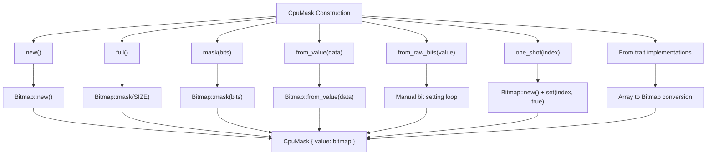
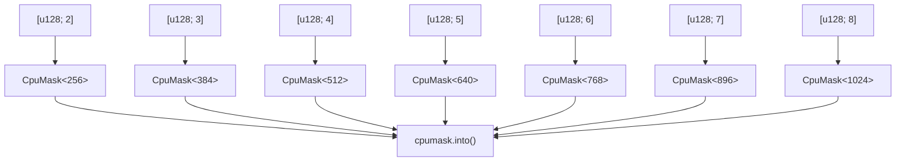
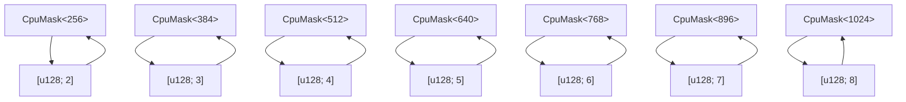
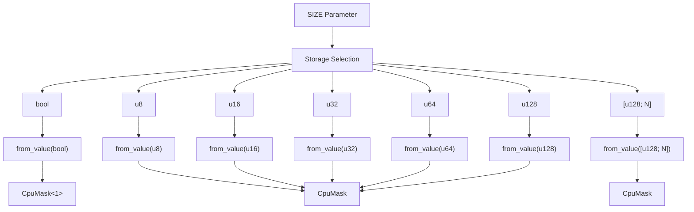

# Construction and Conversion Methods

> **Relevant source files**
> * [README.md](https://github.com/arceos-org/cpumask/blob/a7cfa639/README.md)
> * [src/lib.rs](https://github.com/arceos-org/cpumask/blob/a7cfa639/src/lib.rs)

This page documents all methods for creating `CpuMask` instances and converting between different representations. It covers the complete set of constructors, factory methods, and type conversion utilities provided by the `CpuMask<SIZE>` struct.

For information about querying and inspecting existing `CpuMask` instances, see [Query and Inspection Operations](/arceos-org/cpumask/2.2-query-and-inspection-operations). For modifying `CpuMask` state after construction, see [Modification and Iteration](/arceos-org/cpumask/2.3-modification-and-iteration).

## Construction Methods

The `CpuMask<SIZE>` struct provides multiple construction patterns to accommodate different use cases and data sources.

### Basic Construction

The most fundamental construction methods create `CpuMask` instances with predefined bit patterns:

|Method|Purpose|Bit Pattern|
| --- | --- | --- |
|new()|Empty cpumask|All bits set tofalse|
|full()|Complete cpumask|All bits set totrue|
|mask(bits: usize)|Range-based mask|Firstbitsindices set totrue|

The `new()` method [src/lib.rs(L74 - L76)&emsp;](https://github.com/arceos-org/cpumask/blob/a7cfa639/src/lib.rs#L74-L76) creates an empty cpumask by delegating to the `Default` trait implementation. The `full()` method [src/lib.rs(L79 - L84)&emsp;](https://github.com/arceos-org/cpumask/blob/a7cfa639/src/lib.rs#L79-L84) creates a cpumask with all valid bits set using the underlying `Bitmap::mask(SIZE)` operation. The `mask(bits: usize)` method [src/lib.rs(L89 - L94)&emsp;](https://github.com/arceos-org/cpumask/blob/a7cfa639/src/lib.rs#L89-L94) creates a mask where indices `0` through `bits-1` are set to `true`.

### Data-Driven Construction

For scenarios where `CpuMask` instances must be created from existing data, several factory methods accept different input formats:

The `from_value(data)` method [src/lib.rs(L97 - L102)&emsp;](https://github.com/arceos-org/cpumask/blob/a7cfa639/src/lib.rs#L97-L102) accepts data of the backing store type, which varies based on the `SIZE` parameter due to storage optimization. The `from_raw_bits(value: usize)` method [src/lib.rs(L106 - L119)&emsp;](https://github.com/arceos-org/cpumask/blob/a7cfa639/src/lib.rs#L106-L119) constructs a cpumask from a raw `usize` value, with assertion checking to ensure the value fits within the specified size. The `one_shot(index: usize)` method [src/lib.rs(L123 - L128)&emsp;](https://github.com/arceos-org/cpumask/blob/a7cfa639/src/lib.rs#L123-L128) creates a cpumask with exactly one bit set at the specified index.

### Construction Method Flow

Sources: [src/lib.rs(L74 - L128)&emsp;](https://github.com/arceos-org/cpumask/blob/a7cfa639/src/lib.rs#L74-L128)

### Array-Based Construction

For larger cpumasks that use array backing storage, the library provides `From` trait implementations for `u128` arrays of various sizes. These implementations support cpumasks with sizes 256, 384, 512, 640, 768, 896, and 1024 bits:

Sources: [src/lib.rs(L328 - L368)&emsp;](https://github.com/arceos-org/cpumask/blob/a7cfa639/src/lib.rs#L328-L368)

## Conversion Methods

The `CpuMask` struct provides multiple methods for extracting data in different formats, enabling interoperability with various system interfaces and storage requirements.

### Value Extraction

The primary conversion methods expose the underlying storage in different forms:

The `into_value(self)` method [src/lib.rs(L131 - L134)&emsp;](https://github.com/arceos-org/cpumask/blob/a7cfa639/src/lib.rs#L131-L134) consumes the cpumask and returns the backing store value. The `as_value(&self)` method [src/lib.rs(L137 - L140)&emsp;](https://github.com/arceos-org/cpumask/blob/a7cfa639/src/lib.rs#L137-L140) provides a reference to the backing store without transferring ownership. The `as_bytes(&self)` method [src/lib.rs(L143 - L146)&emsp;](https://github.com/arceos-org/cpumask/blob/a7cfa639/src/lib.rs#L143-L146) returns a byte slice representation of the cpumask data.

### Bidirectional Array Conversion

The library implements bidirectional conversion between `CpuMask` instances and `u128` arrays, enabling seamless integration with external APIs that expect array representations:

Sources: [src/lib.rs(L370 - L410)&emsp;](https://github.com/arceos-org/cpumask/blob/a7cfa639/src/lib.rs#L370-L410)

### Storage Type Relationships

The conversion methods interact with the automatic storage optimization system, where the backing store type depends on the `SIZE` parameter:

Sources: [src/lib.rs(L97 - L102)&emsp;](https://github.com/arceos-org/cpumask/blob/a7cfa639/src/lib.rs#L97-L102) [src/lib.rs(L12 - L16)&emsp;](https://github.com/arceos-org/cpumask/blob/a7cfa639/src/lib.rs#L12-L16)

## Type Safety and Validation

Construction methods incorporate compile-time and runtime validation to ensure cpumask integrity:

* The `mask(bits)` method includes a debug assertion [src/lib.rs(L90)&emsp;](https://github.com/arceos-org/cpumask/blob/a7cfa639/src/lib.rs#L90-L90) that `bits <= SIZE`
* The `from_raw_bits(value)` method validates [src/lib.rs(L107)&emsp;](https://github.com/arceos-org/cpumask/blob/a7cfa639/src/lib.rs#L107-L107) that `value >> SIZE == 0`
* The `one_shot(index)` method asserts [src/lib.rs(L124)&emsp;](https://github.com/arceos-org/cpumask/blob/a7cfa639/src/lib.rs#L124-L124) that `index < SIZE`
* Array-based `From` implementations use const generics to enforce size compatibility at compile time

These validation mechanisms prevent buffer overflows and ensure that cpumask operations remain within the defined size boundaries.

Sources: [src/lib.rs(L90)&emsp;](https://github.com/arceos-org/cpumask/blob/a7cfa639/src/lib.rs#L90-L90) [src/lib.rs(L107)&emsp;](https://github.com/arceos-org/cpumask/blob/a7cfa639/src/lib.rs#L107-L107) [src/lib.rs(L124)&emsp;](https://github.com/arceos-org/cpumask/blob/a7cfa639/src/lib.rs#L124-L124) [src/lib.rs(L328 - L410)&emsp;](https://github.com/arceos-org/cpumask/blob/a7cfa639/src/lib.rs#L328-L410)