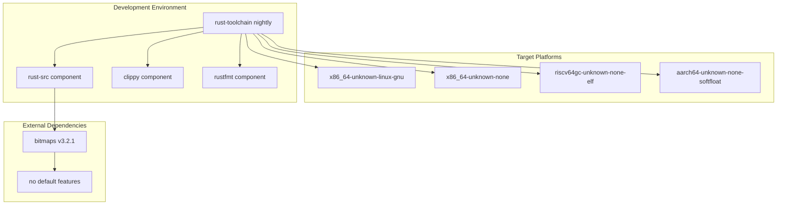
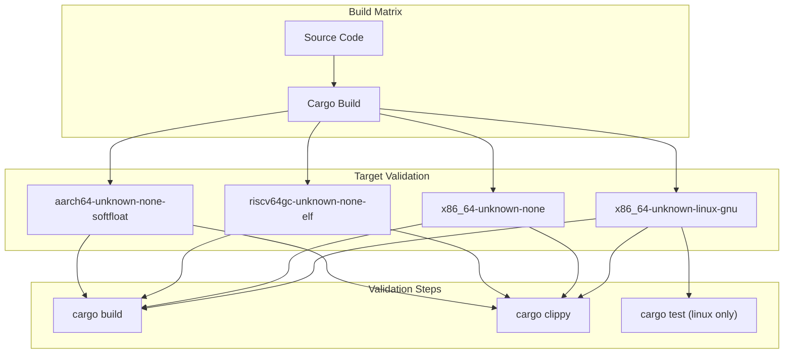
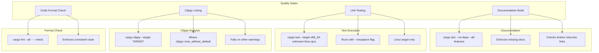
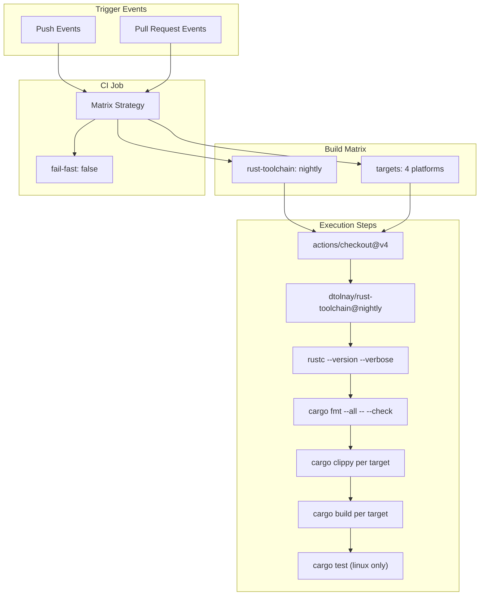
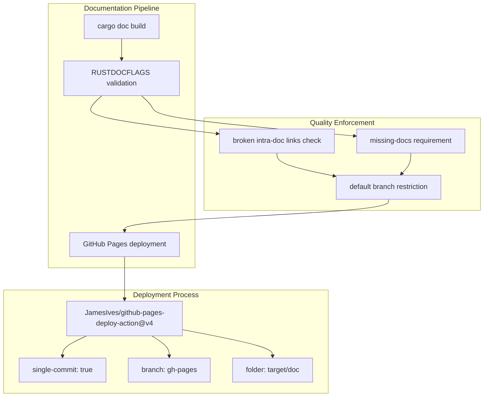

# Development and Contribution

> **Relevant source files**
> * [.github/workflows/ci.yml](https://github.com/arceos-org/cpumask/blob/a7cfa639/.github/workflows/ci.yml)
> * [.gitignore](https://github.com/arceos-org/cpumask/blob/a7cfa639/.gitignore)
> * [Cargo.toml](https://github.com/arceos-org/cpumask/blob/a7cfa639/Cargo.toml)

This document provides comprehensive guidance for developing and contributing to the cpumask library. It covers the development environment setup, build processes, testing procedures, code quality standards, and the continuous integration pipeline that ensures the library maintains compatibility across multiple target platforms.

For information about the library's API and usage patterns, see [API Reference](/arceos-org/cpumask/2-api-reference) and [Usage Guide and Examples](/arceos-org/cpumask/4-usage-guide-and-examples). For architectural details about the implementation, see [Architecture and Design](/arceos-org/cpumask/3-architecture-and-design).

## Development Environment Setup

The cpumask library requires a Rust nightly toolchain due to its no-std compatibility and advanced const generic features. The development environment must support cross-compilation for multiple target architectures.

### Required Tools and Dependencies



The toolchain configuration requires nightly Rust with specific components and target support as defined in [.github/workflows/ci.yml(L15 - L19)&emsp;](https://github.com/arceos-org/cpumask/blob/a7cfa639/.github/workflows/ci.yml#L15-L19)

**Sources:** [.github/workflows/ci.yml(L11 - L19)&emsp;](https://github.com/arceos-org/cpumask/blob/a7cfa639/.github/workflows/ci.yml#L11-L19) [Cargo.toml(L14 - L15)&emsp;](https://github.com/arceos-org/cpumask/blob/a7cfa639/Cargo.toml#L14-L15)

### Package Configuration

The crate is configured for multi-environment compatibility with the following key characteristics:

|Configuration|Value|Purpose|
| --- | --- | --- |
|Edition|2021|Modern Rust features|
|License|GPL-3.0-or-later OR Apache-2.0 OR MulanPSL-2.0|Triple licensing for flexibility|
|Categories|os, no-std|Operating system and embedded use|
|Dependencies|bitmaps 3.2.1 (no default features)|Minimal dependency footprint|

The `no-std` compatibility and minimal dependencies ensure the library can be used in kernel-space and embedded environments as specified in [Cargo.toml(L12)&emsp;](https://github.com/arceos-org/cpumask/blob/a7cfa639/Cargo.toml#L12-L12) and [Cargo.toml(L15)&emsp;](https://github.com/arceos-org/cpumask/blob/a7cfa639/Cargo.toml#L15-L15)

**Sources:** [Cargo.toml(L1 - L15)&emsp;](https://github.com/arceos-org/cpumask/blob/a7cfa639/Cargo.toml#L1-L15)

## Build System and Compilation

### Multi-Target Build Process



The build system validates compilation across four distinct target architectures to ensure compatibility with hosted Linux environments, bare-metal x86_64 systems, RISC-V embedded systems, and ARM64 embedded systems.

**Sources:** [.github/workflows/ci.yml(L12)&emsp;](https://github.com/arceos-org/cpumask/blob/a7cfa639/.github/workflows/ci.yml#L12-L12) [.github/workflows/ci.yml(L26 - L27)&emsp;](https://github.com/arceos-org/cpumask/blob/a7cfa639/.github/workflows/ci.yml#L26-L27)

### Local Development Commands

Standard development workflow commands:

```markdown
# Build for default target
cargo build --all-features

# Build for specific target 
cargo build --target x86_64-unknown-none --all-features

# Run tests (only supported on hosted targets)
cargo test -- --nocapture

# Format check
cargo fmt --all -- --check

# Lint check
cargo clippy --all-features -- -A clippy::new_without_default
```

**Sources:** [.github/workflows/ci.yml(L23 - L30)&emsp;](https://github.com/arceos-org/cpumask/blob/a7cfa639/.github/workflows/ci.yml#L23-L30)

## Quality Assurance Pipeline

### Code Quality Checks

The CI pipeline enforces multiple code quality standards through automated checks:



**Sources:** [.github/workflows/ci.yml(L22 - L30)&emsp;](https://github.com/arceos-org/cpumask/blob/a7cfa639/.github/workflows/ci.yml#L22-L30) [.github/workflows/ci.yml(L40)&emsp;](https://github.com/arceos-org/cpumask/blob/a7cfa639/.github/workflows/ci.yml#L40-L40)

### Testing Strategy

Testing is limited to the `x86_64-unknown-linux-gnu` target due to the hosted environment requirements for test execution. The test suite runs with the `--nocapture` flag to provide detailed output for debugging as configured in [.github/workflows/ci.yml(L29 - L30)&emsp;](https://github.com/arceos-org/cpumask/blob/a7cfa639/.github/workflows/ci.yml#L29-L30)

**Sources:** [.github/workflows/ci.yml(L28 - L30)&emsp;](https://github.com/arceos-org/cpumask/blob/a7cfa639/.github/workflows/ci.yml#L28-L30)

## Continuous Integration Workflow

### CI Pipeline Architecture



The CI system uses a fail-fast disabled strategy to ensure all target platforms are validated even if one fails, providing comprehensive feedback on compatibility issues.

**Sources:** [.github/workflows/ci.yml(L3)&emsp;](https://github.com/arceos-org/cpumask/blob/a7cfa639/.github/workflows/ci.yml#L3-L3) [.github/workflows/ci.yml(L8 - L12)&emsp;](https://github.com/arceos-org/cpumask/blob/a7cfa639/.github/workflows/ci.yml#L8-L12)

### Documentation Deployment



Documentation is automatically built and deployed to GitHub Pages, but only from the default branch to prevent documentation pollution from development branches.

**Sources:** [.github/workflows/ci.yml(L32 - L55)&emsp;](https://github.com/arceos-org/cpumask/blob/a7cfa639/.github/workflows/ci.yml#L32-L55) [.github/workflows/ci.yml(L40)&emsp;](https://github.com/arceos-org/cpumask/blob/a7cfa639/.github/workflows/ci.yml#L40-L40)

## Contribution Guidelines

### Repository Structure

The repository follows a minimal structure optimized for a single-crate library:

|Path|Purpose|Managed By|
| --- | --- | --- |
|src/lib.rs|Core implementation|Developers|
|Cargo.toml|Package configuration|Maintainers|
|.github/workflows/ci.yml|CI pipeline|Maintainers|
|.gitignore|Git exclusions|Maintainers|
|target/|Build artifacts|Git ignored|

**Sources:** [.gitignore(L1 - L4)&emsp;](https://github.com/arceos-org/cpumask/blob/a7cfa639/.gitignore#L1-L4)

### Development Workflow

1. **Environment Setup**: Install nightly Rust with required components
2. **Local Testing**: Verify code compiles for all targets
3. **Quality Checks**: Run `cargo fmt` and `cargo clippy`
4. **Documentation**: Ensure all public APIs are documented
5. **Submission**: Create pull request with clear description

The CI system will automatically validate all changes against the full target matrix and quality standards.

**Sources:** [.github/workflows/ci.yml(L13 - L30)&emsp;](https://github.com/arceos-org/cpumask/blob/a7cfa639/.github/workflows/ci.yml#L13-L30)

### License Compliance

The library uses triple licensing (GPL-3.0-or-later OR Apache-2.0 OR MulanPSL-2.0) as specified in [Cargo.toml(L7)&emsp;](https://github.com/arceos-org/cpumask/blob/a7cfa639/Cargo.toml#L7-L7) Contributors must ensure their submissions are compatible with all three license options.

**Sources:** [Cargo.toml(L7)&emsp;](https://github.com/arceos-org/cpumask/blob/a7cfa639/Cargo.toml#L7-L7)