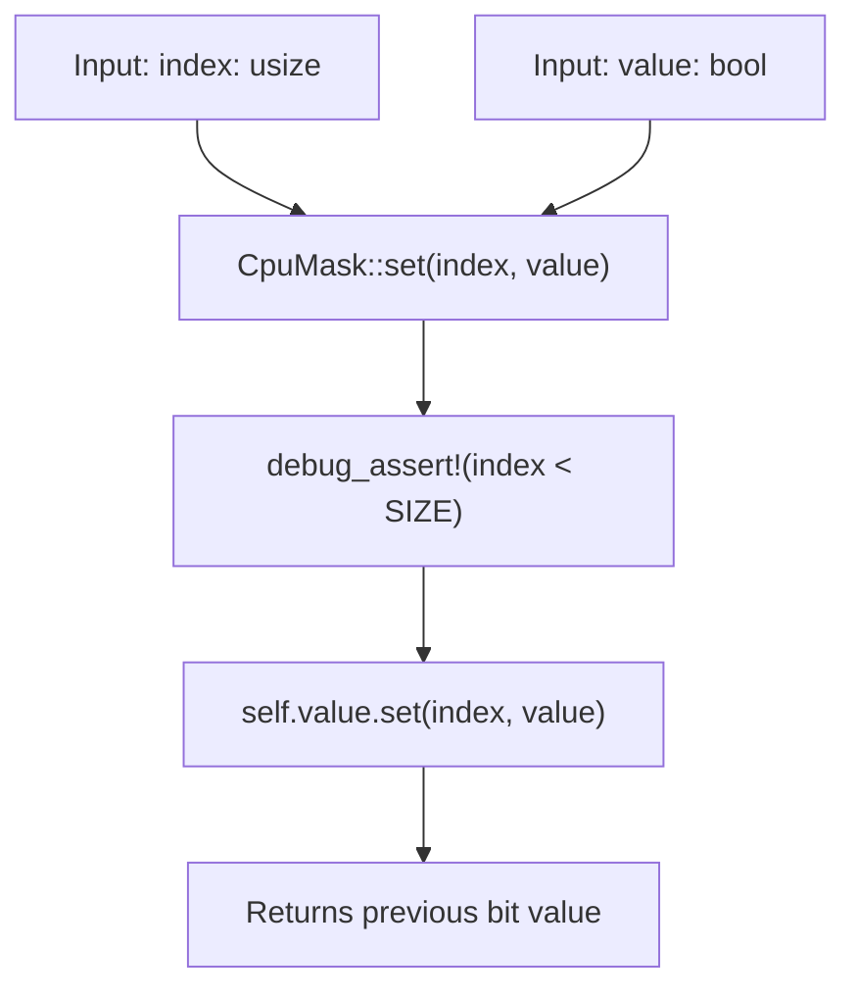
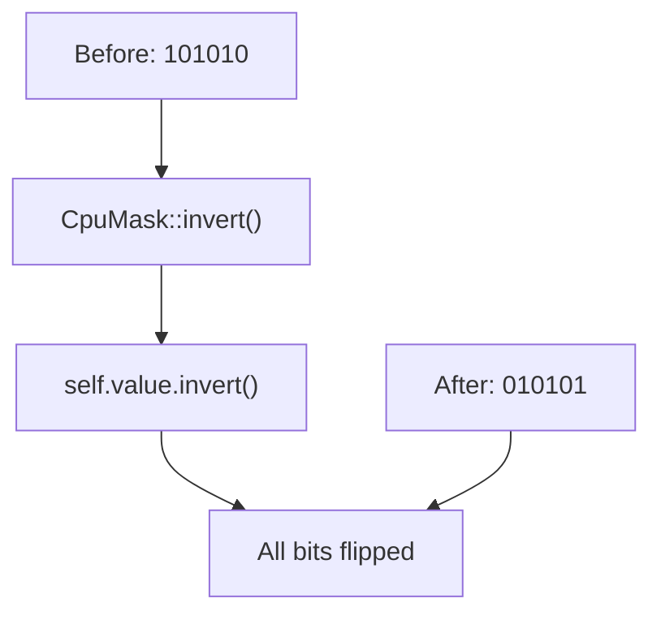
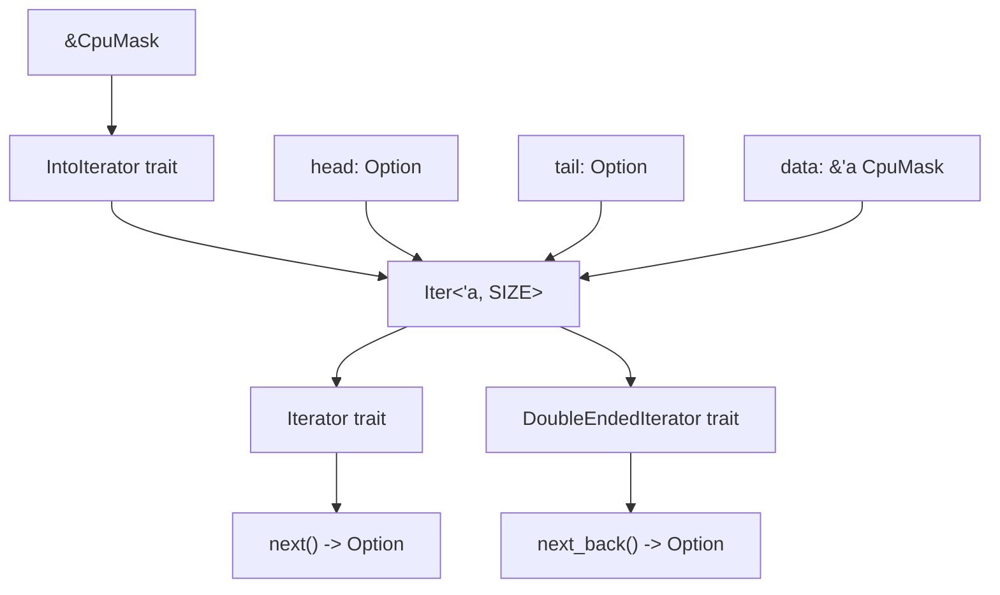
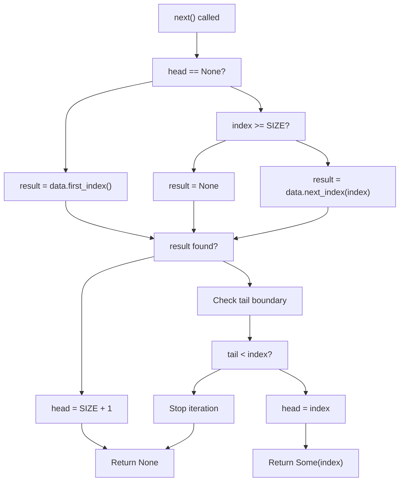
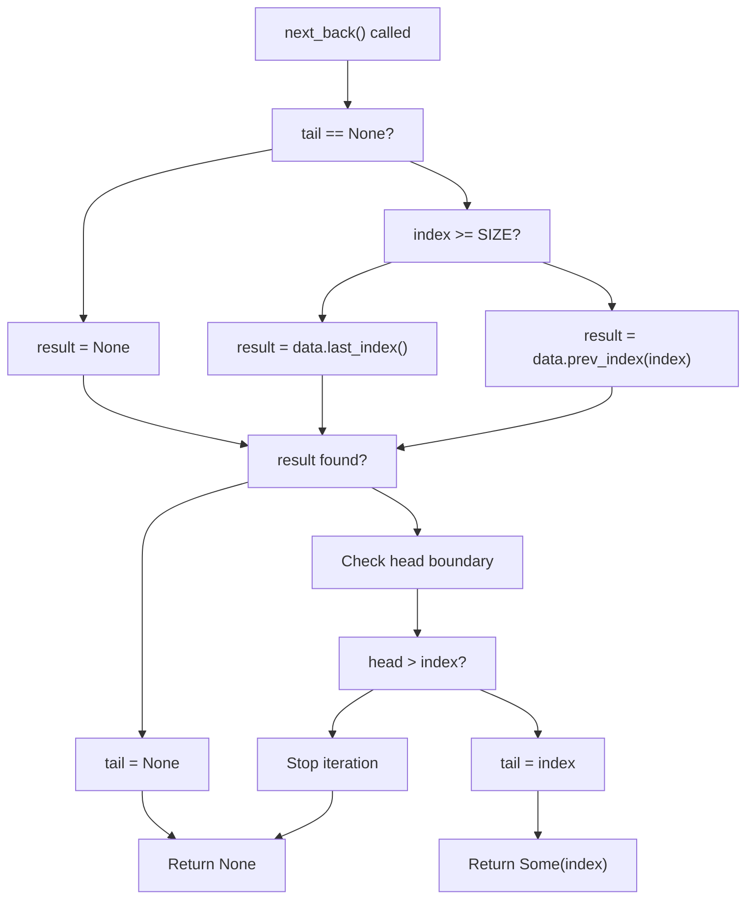

# Modification and Iteration

> **Relevant source files**
> * [src/lib.rs](https://github.com/arceos-org/cpumask/blob/a7cfa639/src/lib.rs)

This page documents the `CpuMask` methods and traits for modifying mask state after construction and for iterating over set CPU indices. For mask construction methods, see [Construction and Conversion Methods](/arceos-org/cpumask/2.1-construction-and-conversion-methods). For read-only query operations, see [Query and Inspection Operations](/arceos-org/cpumask/2.2-query-and-inspection-operations). For bitwise operations and operator overloads, see [Bitwise Operations and Traits](/arceos-org/cpumask/2.4-bitwise-operations-and-traits).

## Modification Operations

The `CpuMask` provides two primary methods for modifying the state of a mask after construction: individual bit manipulation via `set` and bulk inversion via `invert`.

### Bit Manipulation

The `set` method allows modification of individual CPU bits within the mask. It takes an index and a boolean value, sets the bit at that position, and returns the previous value of that bit.



Sources: [src/lib.rs(L177 - L180)&emsp;](https://github.com/arceos-org/cpumask/blob/a7cfa639/src/lib.rs#L177-L180)

The method includes a debug assertion to ensure the index is within the valid range (less than `SIZE`). The actual bit manipulation is delegated to the underlying `Bitmap::set` method from the bitmaps crate.

### Bulk Inversion

The `invert` method provides a way to flip all bits in the mask simultaneously, converting `true` bits to `false` and vice versa.



Sources: [src/lib.rs(L232 - L234)&emsp;](https://github.com/arceos-org/cpumask/blob/a7cfa639/src/lib.rs#L232-L234)

This operation is useful for computing the complement of a CPU set, such as finding all CPUs that are not currently assigned to a particular task.

## Iteration Interface

The `CpuMask` implements comprehensive iteration support through the `IntoIterator` trait and a custom `Iter` struct that provides both forward and backward iteration over set CPU indices.

### Iterator Implementation Architecture



Sources: [src/lib.rs(L237 - L251)&emsp;](https://github.com/arceos-org/cpumask/blob/a7cfa639/src/lib.rs#L237-L251) [src/lib.rs(L429 - L436)&emsp;](https://github.com/arceos-org/cpumask/blob/a7cfa639/src/lib.rs#L429-L436) [src/lib.rs(L438 - L480)&emsp;](https://github.com/arceos-org/cpumask/blob/a7cfa639/src/lib.rs#L438-L480) [src/lib.rs(L482 - L518)&emsp;](https://github.com/arceos-org/cpumask/blob/a7cfa639/src/lib.rs#L482-L518)

### Iterator State Management

The `Iter` struct maintains iteration state using two optional indices:

|Field|Type|Purpose|
| --- | --- | --- |
|head|Option<usize>|Tracks forward iteration position|
|tail|Option<usize>|Tracks backward iteration position|
|data|&'a CpuMask<SIZE>|Reference to the mask being iterated|

The iterator is initialized with `head` set to `None` and `tail` set to `Some(SIZE + 1)`, indicating that iteration can proceed in both directions from the extremes.

### Forward Iteration Logic



Sources: [src/lib.rs(L444 - L479)&emsp;](https://github.com/arceos-org/cpumask/blob/a7cfa639/src/lib.rs#L444-L479)

### Backward Iteration Logic

The `DoubleEndedIterator` implementation provides `next_back` functionality with similar boundary checking but in reverse:



Sources: [src/lib.rs(L486 - L517)&emsp;](https://github.com/arceos-org/cpumask/blob/a7cfa639/src/lib.rs#L486-L517)

## Usage Patterns

### Modification Examples

The modification operations enable dynamic CPU mask management:

|Operation|Purpose|Method Call|
| --- | --- | --- |
|Enable CPU|Add CPU to active set|mask.set(cpu_id, true)|
|Disable CPU|Remove CPU from active set|mask.set(cpu_id, false)|
|Toggle all CPUs|Invert entire mask|mask.invert()|

### Iteration Examples

The iterator yields `usize` indices representing CPU numbers that are set to `true` in the mask:

```javascript
// Iterate through all active CPUs
for cpu_id in &mask {
    // cpu_id is usize, represents an active CPU
}

// Collect to vector for further processing
let active_cpus: Vec<usize> = mask.into_iter().collect();

// Reverse iteration for priority-based processing
for cpu_id in mask.into_iter().rev() {
    // Process from highest to lowest CPU index
}
```

The implementation ensures that only indices with `true` bits are yielded, making it efficient for sparse CPU masks where only a few CPUs are active.

Sources: [src/lib.rs(L419 - L427)&emsp;](https://github.com/arceos-org/cpumask/blob/a7cfa639/src/lib.rs#L419-L427) [src/lib.rs(L31 - L32)&emsp;](https://github.com/arceos-org/cpumask/blob/a7cfa639/src/lib.rs#L31-L32)