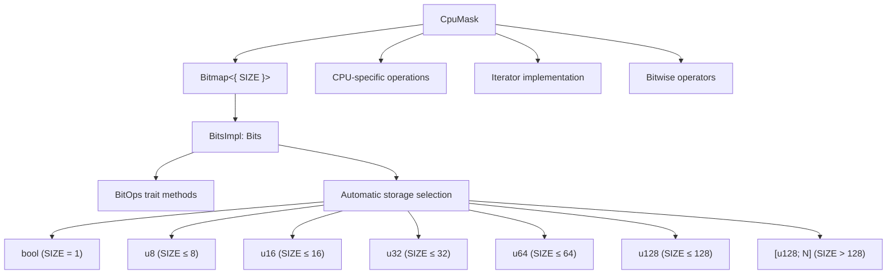
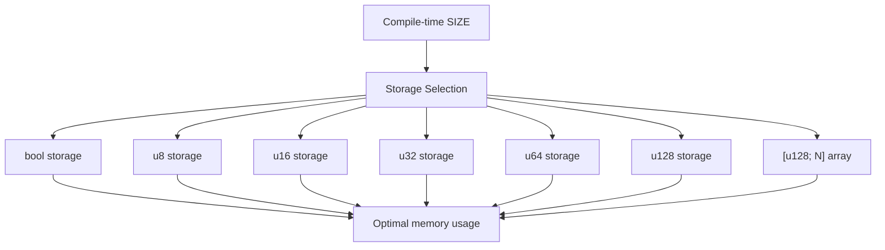
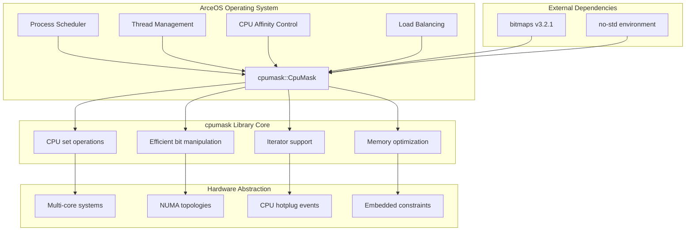

# Overview

> **Relevant source files**
> * [Cargo.toml](https://github.com/arceos-org/cpumask/blob/a7cfa639/Cargo.toml)
> * [README.md](https://github.com/arceos-org/cpumask/blob/a7cfa639/README.md)
> * [src/lib.rs](https://github.com/arceos-org/cpumask/blob/a7cfa639/src/lib.rs)

## Purpose and Scope

The `cpumask` library provides a type-safe, memory-efficient implementation of CPU affinity masks for the ArceOS operating system. It represents sets of physical CPUs as compact bitmaps, where each bit position corresponds to a CPU number in the system. This library serves as the foundational component for CPU scheduling, process affinity management, and NUMA-aware operations within ArceOS.

The library is designed as a direct Rust equivalent to Linux's `cpumask_t` data structure, providing similar functionality while leveraging Rust's type system for compile-time size optimization and memory safety. For detailed API documentation, see [API Reference](/arceos-org/cpumask/2-api-reference). For implementation details and performance characteristics, see [Architecture and Design](/arceos-org/cpumask/3-architecture-and-design).

**Sources:** [src/lib.rs(L9 - L16)&emsp;](https://github.com/arceos-org/cpumask/blob/a7cfa639/src/lib.rs#L9-L16) [README.md(L7 - L16)&emsp;](https://github.com/arceos-org/cpumask/blob/a7cfa639/README.md#L7-L16) [Cargo.toml(L6 - L12)&emsp;](https://github.com/arceos-org/cpumask/blob/a7cfa639/Cargo.toml#L6-L12)

## Core Architecture

The `cpumask` library is built around the `CpuMask<const SIZE: usize>` generic struct, which provides a strongly-typed wrapper over the `bitmaps` crate's `Bitmap` implementation. This architecture enables automatic storage optimization and type-safe CPU mask operations.



**Sources:** [src/lib.rs(L17 - L23)&emsp;](https://github.com/arceos-org/cpumask/blob/a7cfa639/src/lib.rs#L17-L23) [src/lib.rs(L7)&emsp;](https://github.com/arceos-org/cpumask/blob/a7cfa639/src/lib.rs#L7-L7)

## Storage Optimization Strategy

The `CpuMask` type automatically selects the most memory-efficient storage representation based on the compile-time `SIZE` parameter. This optimization reduces memory overhead and improves cache performance for systems with different CPU counts.

|CPU Count Range|Storage Type|Memory Usage|
| --- | --- | --- |
|1|bool|1 bit|
|2-8|u8|1 byte|
|9-16|u16|2 bytes|
|17-32|u32|4 bytes|
|33-64|u64|8 bytes|
|65-128|u128|16 bytes|
|129-1024|[u128; N]|16×N bytes|



**Sources:** [src/lib.rs(L12 - L16)&emsp;](https://github.com/arceos-org/cpumask/blob/a7cfa639/src/lib.rs#L12-L16) [src/lib.rs(L328 - L410)&emsp;](https://github.com/arceos-org/cpumask/blob/a7cfa639/src/lib.rs#L328-L410)

## API Surface Categories

The `CpuMask` API is organized into five main functional categories, providing comprehensive CPU mask manipulation capabilities:

```mermaid
flowchart TD
A["CpuMask API"]
B["Construction Methods"]
C["Query Operations"]
D["Modification Operations"]
E["Iteration Interface"]
F["Bitwise Operations"]
B1["new() - empty mask"]
B2["full() - all CPUs set"]
B3["mask(bits) - range mask"]
B4["one_shot(index) - single CPU"]
B5["from_raw_bits(value)"]
B6["from_value(data)"]
C1["get(index) - test bit"]
C2["len() - count set bits"]
C3["is_empty() / is_full()"]
C4["first_index() / last_index()"]
C5["next_index() / prev_index()"]
C6["*_false_index variants"]
D1["set(index, value)"]
D2["invert() - flip all bits"]
E1["IntoIterator trait"]
E2["Iter<'a, SIZE> struct"]
E3["DoubleEndedIterator"]
F1["BitAnd (&) - intersection"]
F2["BitOr (|) - union"]
F3["BitXor (^) - difference"]
F4["Not (!) - complement"]
F5["*Assign variants"]

A --> B
A --> C
A --> D
A --> E
A --> F
B --> B1
B --> B2
B --> B3
B --> B4
B --> B5
B --> B6
C --> C1
C --> C2
C --> C3
C --> C4
C --> C5
C --> C6
D --> D1
D --> D2
E --> E1
E --> E2
E --> E3
F --> F1
F --> F2
F --> F3
F --> F4
F --> F5
```



**Sources:** [src/lib.rs(L68 - L235)&emsp;](https://github.com/arceos-org/cpumask/blob/a7cfa639/src/lib.rs#L68-L235) [src/lib.rs(L237 - L251)&emsp;](https://github.com/arceos-org/cpumask/blob/a7cfa639/src/lib.rs#L237-L251) [src/lib.rs(L253 - L326)&emsp;](https://github.com/arceos-org/cpumask/blob/a7cfa639/src/lib.rs#L253-L326)

## Integration with ArceOS Ecosystem

The `cpumask` library serves as a foundational component within the ArceOS operating system, providing essential CPU affinity management capabilities for kernel subsystems:



The library's `no_std` compatibility makes it suitable for both kernel-space and embedded environments, while its dependency on the `bitmaps` crate provides battle-tested bitmap operations with optimal performance characteristics.

**Sources:** [Cargo.toml(L12)&emsp;](https://github.com/arceos-org/cpumask/blob/a7cfa639/Cargo.toml#L12-L12) [Cargo.toml(L14 - L15)&emsp;](https://github.com/arceos-org/cpumask/blob/a7cfa639/Cargo.toml#L14-L15) [src/lib.rs(L1)&emsp;](https://github.com/arceos-org/cpumask/blob/a7cfa639/src/lib.rs#L1-L1)

## Usage Example

The following example demonstrates typical CPU mask operations in an operating system context:

```javascript
use cpumask::CpuMask;

// Create a CPU mask for a 32-CPU system
const SMP: usize = 32;
let mut available_cpus = CpuMask::<SMP>::new();

// Set CPUs 0, 2, 4 as available
available_cpus.set(0, true);
available_cpus.set(2, true);
available_cpus.set(4, true);

// Check system state
assert_eq!(available_cpus.len(), 3);
assert_eq!(available_cpus.first_index(), Some(0));

// Create process affinity mask (restrict to even CPUs)
let even_cpus = CpuMask::<SMP>::mask(16); // CPUs 0-15
let process_affinity = available_cpus & even_cpus;

// Iterate over assigned CPUs
for cpu_id in &process_affinity {
    println!("Process can run on CPU {}", cpu_id);
}
```

**Sources:** [README.md(L20 - L57)&emsp;](https://github.com/arceos-org/cpumask/blob/a7cfa639/README.md#L20-L57) [src/lib.rs(L417 - L427)&emsp;](https://github.com/arceos-org/cpumask/blob/a7cfa639/src/lib.rs#L417-L427)