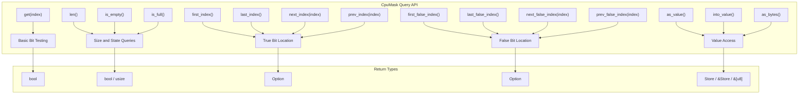
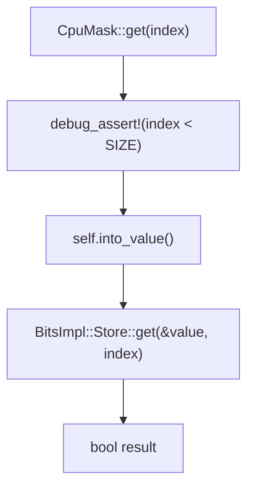
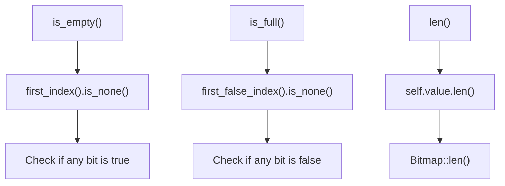
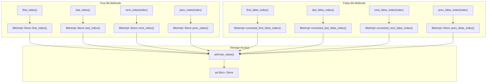
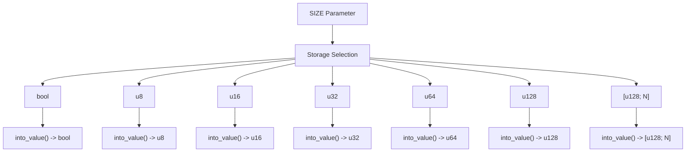

# Query and Inspection Operations

> **Relevant source files**
> * [README.md](https://github.com/arceos-org/cpumask/blob/a7cfa639/README.md)
> * [src/lib.rs](https://github.com/arceos-org/cpumask/blob/a7cfa639/src/lib.rs)

This section documents the read-only operations available on `CpuMask<SIZE>` instances for examining their state, testing individual bits, and finding set or unset CPU positions. These operations do not modify the cpumask and provide various ways to inspect its contents.

For information about creating new cpumask instances, see [Construction and Conversion Methods](/arceos-org/cpumask/2.1-construction-and-conversion-methods). For operations that modify cpumask state, see [Modification and Iteration](/arceos-org/cpumask/2.3-modification-and-iteration).

## Overview of Query Operations

The `CpuMask` struct provides comprehensive query capabilities organized into several functional categories. These operations leverage the underlying `bitmaps::Bitmap` functionality while providing a CPU-specific interface.

Sources: [src/lib.rs(L148 - L234)&emsp;](https://github.com/arceos-org/cpumask/blob/a7cfa639/src/lib.rs#L148-L234)

## Basic Bit Testing

### get Method

The `get` method tests whether a specific CPU bit is set in the mask.

|Method|Signature|Description|Performance|
| --- | --- | --- | --- |
|get|get(self, index: usize) -> bool|Returnstrueif the bit atindexis set|O(1)|

The method performs bounds checking in debug builds and delegates to the underlying `BitsImpl<SIZE>::Store::get` implementation.

Sources: [src/lib.rs(L167 - L171)&emsp;](https://github.com/arceos-org/cpumask/blob/a7cfa639/src/lib.rs#L167-L171)

## Size and State Queries

These methods provide high-level information about the cpumask's state without requiring iteration through individual bits.

|Method|Signature|Description|Performance|
| --- | --- | --- | --- |
|len|len(self) -> usize|Count oftruebits in the mask|O(n) for most storage types|
|is_empty|is_empty(self) -> bool|Tests if no bits are set|O(log n)|
|is_full|is_full(self) -> bool|Tests if all valid bits are set|O(log n)|

### Implementation Details

The `is_empty` and `is_full` methods are implemented in terms of the index-finding operations:

Sources: [src/lib.rs(L149 - L164)&emsp;](https://github.com/arceos-org/cpumask/blob/a7cfa639/src/lib.rs#L149-L164)

## Index Finding Operations

The cpumask provides efficient methods for locating set and unset bits, supporting both forward and backward traversal patterns commonly used in CPU scheduling algorithms.

### True Bit Location Methods

|Method|Signature|Description|
| --- | --- | --- |
|first_index|first_index(self) -> Option<usize>|Find first set bit|
|last_index|last_index(self) -> Option<usize>|Find last set bit|
|next_index|next_index(self, index: usize) -> Option<usize>|Find next set bit afterindex|
|prev_index|prev_index(self, index: usize) -> Option<usize>|Find previous set bit beforeindex|

### False Bit Location Methods

|Method|Signature|Description|
| --- | --- | --- |
|first_false_index|first_false_index(self) -> Option<usize>|Find first unset bit|
|last_false_index|last_false_index(self) -> Option<usize>|Find last unset bit|
|next_false_index|next_false_index(self, index: usize) -> Option<usize>|Find next unset bit afterindex|
|prev_false_index|prev_false_index(self, index: usize) -> Option<usize>|Find previous unset bit beforeindex|

### Delegation to BitsImpl

All index-finding operations delegate to the corresponding methods on the underlying storage type, with false-bit methods using corrected implementations that respect the `SIZE` boundary:

Sources: [src/lib.rs(L183 - L228)&emsp;](https://github.com/arceos-org/cpumask/blob/a7cfa639/src/lib.rs#L183-L228)

## Value Access Operations

These methods provide direct access to the underlying storage representation of the cpumask, enabling interoperability with external systems and efficient bulk operations.

|Method|Signature|Description|Usage|
| --- | --- | --- | --- |
|into_value|into_value(self) -> <BitsImpl<SIZE> as Bits>::Store|Consume and return backing store|Move semantics|
|as_value|as_value(&self) -> &<BitsImpl<SIZE> as Bits>::Store|Reference to backing store|Borrowed access|
|as_bytes|as_bytes(&self) -> &[u8]|View as byte slice|Serialization|

### Storage Type Mapping

The actual storage type returned by `into_value` and referenced by `as_value` depends on the `SIZE` parameter:

Sources: [src/lib.rs(L131 - L146)&emsp;](https://github.com/arceos-org/cpumask/blob/a7cfa639/src/lib.rs#L131-L146)

## Performance Characteristics

The query operations exhibit different performance characteristics based on the underlying storage type and operation complexity:

|Operation Category|Time Complexity|Notes|
| --- | --- | --- |
|get(index)|O(1)|Direct bit access|
|len()|O(n)|Requires bit counting|
|is_empty(),is_full()|O(log n)|Uses optimized bit scanning|
|Index finding|O(log n) to O(n)|Depends on bit density and hardware support|
|Value access|O(1)|Direct storage access|

The actual performance depends heavily on the target architecture's bit manipulation instructions and the density of set bits in the mask.

Sources: [src/lib.rs(L148 - L234)&emsp;](https://github.com/arceos-org/cpumask/blob/a7cfa639/src/lib.rs#L148-L234)