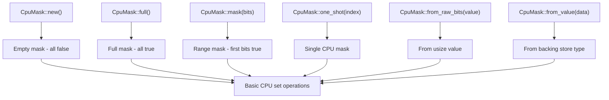
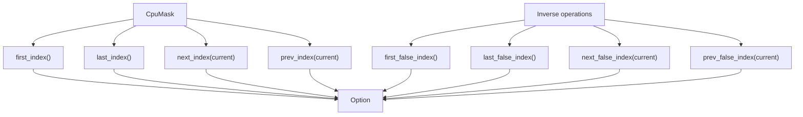
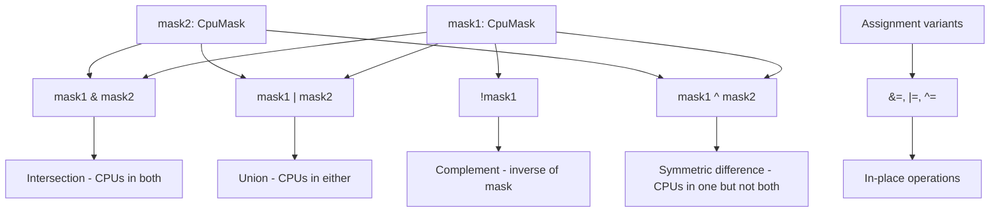
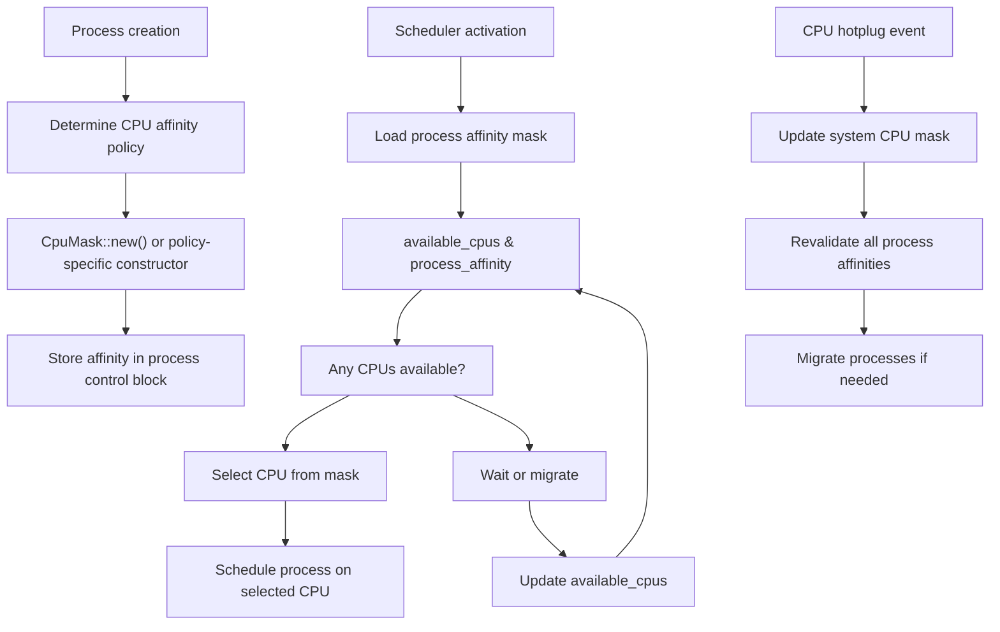
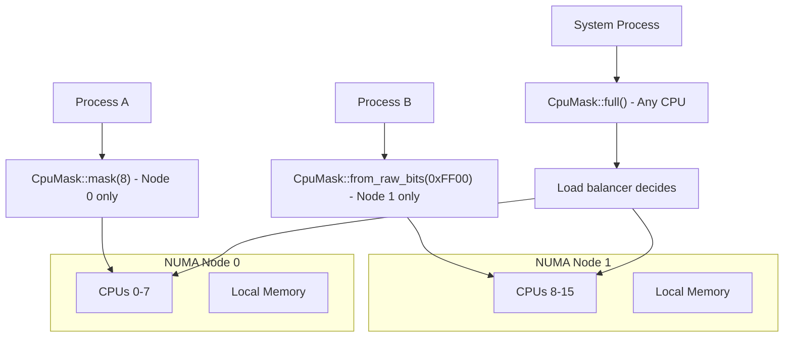

# Usage Guide and Examples

> **Relevant source files**
> * [README.md](https://github.com/arceos-org/cpumask/blob/a7cfa639/README.md)
> * [src/lib.rs](https://github.com/arceos-org/cpumask/blob/a7cfa639/src/lib.rs)

This page provides practical examples and common usage patterns for the `cpumask` library in operating system contexts. It demonstrates how to effectively use the `CpuMask<SIZE>` struct for CPU affinity management, process scheduling, and system resource allocation.

For detailed API documentation, see [API Reference](/arceos-org/cpumask/2-api-reference). For implementation details and performance characteristics, see [Architecture and Design](/arceos-org/cpumask/3-architecture-and-design).

## Basic Usage Patterns

### Creating CPU Masks

The most common way to start working with CPU masks is through the various construction methods provided by `CpuMask<SIZE>`:



Sources: [src/lib.rs(L72 - L128)&emsp;](https://github.com/arceos-org/cpumask/blob/a7cfa639/src/lib.rs#L72-L128)

### Basic Manipulation Operations

The fundamental operations for working with individual CPU bits follow a consistent pattern:

|Operation|Method|Description|Return Value|
| --- | --- | --- | --- |
|Test bit|get(index)|Check if CPU is in mask|bool|
|Set bit|set(index, value)|Add/remove CPU from mask|Previousboolvalue|
|Count bits|len()|Number of CPUs in mask|usize|
|Test empty|is_empty()|Check if no CPUs set|bool|
|Test full|is_full()|Check if all CPUs set|bool|

Sources: [src/lib.rs(L148 - L179)&emsp;](https://github.com/arceos-org/cpumask/blob/a7cfa639/src/lib.rs#L148-L179)

### Finding CPUs in Masks

The library provides efficient methods for locating specific CPUs within masks:



Sources: [src/lib.rs(L182 - L228)&emsp;](https://github.com/arceos-org/cpumask/blob/a7cfa639/src/lib.rs#L182-L228)

## Set Operations and Logic

### Bitwise Operations

CPU masks support standard bitwise operations for combining and manipulating sets of CPUs:



Sources: [src/lib.rs(L253 - L326)&emsp;](https://github.com/arceos-org/cpumask/blob/a7cfa639/src/lib.rs#L253-L326)

### Practical Set Operations Example

Consider a scenario where you need to manage CPU allocation for different process types:

1. **System processes** - CPUs 0-3 (reserved for kernel)
2. **User processes** - CPUs 4-15 (general workload)
3. **Real-time processes** - CPUs 12-15 (high-performance subset)

This demonstrates how set operations enable sophisticated CPU management policies.

Sources: [src/lib.rs(L253 - L287)&emsp;](https://github.com/arceos-org/cpumask/blob/a7cfa639/src/lib.rs#L253-L287)

## Iteration and Traversal

### Forward and Backward Iteration

The `CpuMask` implements both `Iterator` and `DoubleEndedIterator`, enabling flexible traversal patterns:

```

```

Sources: [src/lib.rs(L237 - L518)&emsp;](https://github.com/arceos-org/cpumask/blob/a7cfa639/src/lib.rs#L237-L518)

### Iteration Use Cases

The iterator yields CPU indices where the bit is set to `true`, making it ideal for:

* **Process scheduling**: Iterate through available CPUs for task assignment
* **Load balancing**: Traverse CPU sets to find optimal placement
* **Resource monitoring**: Check specific CPU states in sequence
* **Affinity enforcement**: Validate process can run on assigned CPUs

Sources: [src/lib.rs(L412 - L427)&emsp;](https://github.com/arceos-org/cpumask/blob/a7cfa639/src/lib.rs#L412-L427)

## Operating System Scenarios

### Process Scheduling Workflow

This diagram shows how `CpuMask` integrates into a typical process scheduler:



Sources: [src/lib.rs(L9 - L23)&emsp;](https://github.com/arceos-org/cpumask/blob/a7cfa639/src/lib.rs#L9-L23)

### NUMA-Aware CPU Management

In NUMA systems, CPU masks help maintain memory locality:



Sources: [src/lib.rs(L86 - L94)&emsp;](https://github.com/arceos-org/cpumask/blob/a7cfa639/src/lib.rs#L86-L94) [src/lib.rs(L106 - L119)&emsp;](https://github.com/arceos-org/cpumask/blob/a7cfa639/src/lib.rs#L106-L119)

### Thread Affinity Management

For multi-threaded applications, CPU masks enable fine-grained control:

|Thread Type|Affinity Strategy|Implementation|
| --- | --- | --- |
|Main thread|Single CPU|CpuMask::one_shot(0)|
|Worker threads|Subset of CPUs|CpuMask::mask(worker_count)|
|I/O threads|Non-main CPUs|!CpuMask::one_shot(0)|
|RT threads|Dedicated CPUs|CpuMask::from_raw_bits(rt_mask)|

Sources: [src/lib.rs(L121 - L128)&emsp;](https://github.com/arceos-org/cpumask/blob/a7cfa639/src/lib.rs#L121-L128) [src/lib.rs(L289 - L299)&emsp;](https://github.com/arceos-org/cpumask/blob/a7cfa639/src/lib.rs#L289-L299)

## Advanced Usage Patterns

### Dynamic CPU Set Management

Real systems require dynamic adjustment of CPU availability:

```

```

Sources: [src/lib.rs(L177 - L180)&emsp;](https://github.com/arceos-org/cpumask/blob/a7cfa639/src/lib.rs#L177-L180) [src/lib.rs(L301 - L326)&emsp;](https://github.com/arceos-org/cpumask/blob/a7cfa639/src/lib.rs#L301-L326)

### Performance Optimization Strategies

The choice of `SIZE` parameter significantly impacts performance:

|System Size|Recommended SIZE|Storage Type|Use Case|
| --- | --- | --- | --- |
|Single core|SIZE = 1|bool|Embedded systems|
|Small SMP (≤8)|SIZE = 8|u8|IoT devices|
|Desktop/Server (≤32)|SIZE = 32|u32|General purpose|
|Large server (≤128)|SIZE = 128|u128|HPC systems|
|Massive systems|SIZE = 1024|[u128; 8]|Cloud infrastructure|

The automatic storage selection in [src/lib.rs(L12 - L16)&emsp;](https://github.com/arceos-org/cpumask/blob/a7cfa639/src/lib.rs#L12-L16) ensures optimal memory usage and performance characteristics for each size category.

### Error Handling Patterns

While `CpuMask` operations are generally infallible, certain usage patterns require validation:

* **Bounds checking**: Methods use `debug_assert!` for index validation
* **Size validation**: `from_raw_bits()` asserts value fits in SIZE bits
* **Range validation**: `one_shot()` panics if index exceeds SIZE

In production systems, wrap these operations with appropriate error handling based on your safety requirements.

Sources: [src/lib.rs(L106 - L108)&emsp;](https://github.com/arceos-org/cpumask/blob/a7cfa639/src/lib.rs#L106-L108) [src/lib.rs(L123 - L124)&emsp;](https://github.com/arceos-org/cpumask/blob/a7cfa639/src/lib.rs#L123-L124) [src/lib.rs(L168 - L170)&emsp;](https://github.com/arceos-org/cpumask/blob/a7cfa639/src/lib.rs#L168-L170)