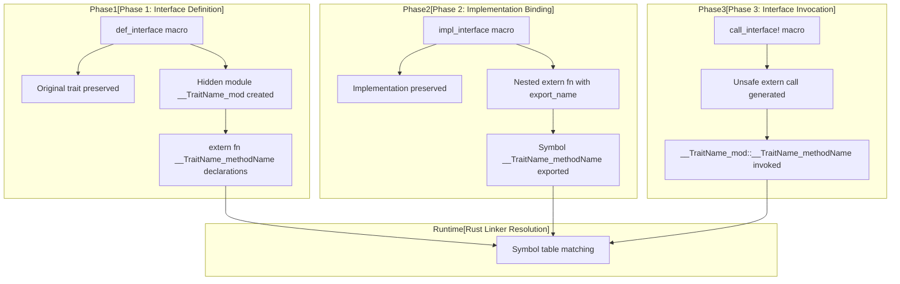
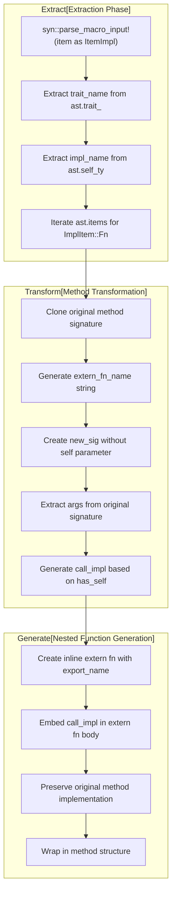
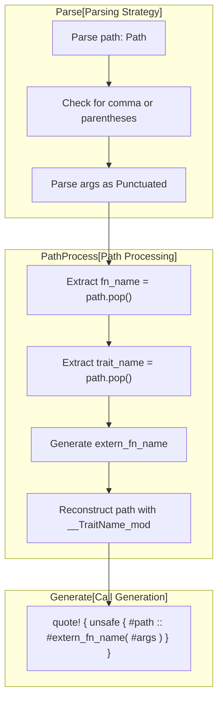
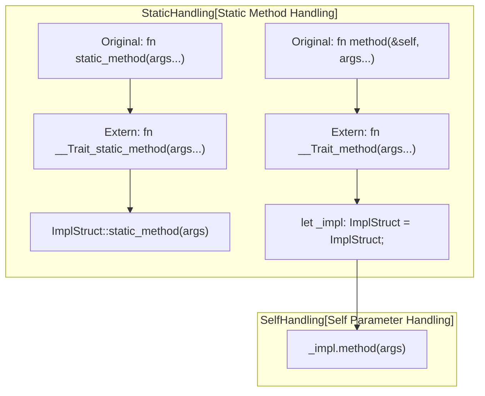

# Architecture and Internals

> **Relevant source files**
> * [README.md](https://github.com/arceos-org/crate_interface/blob/73011a44/README.md)
> * [src/lib.rs](https://github.com/arceos-org/crate_interface/blob/73011a44/src/lib.rs)

This document provides a deep technical dive into the internal architecture of the `crate_interface` procedural macro system. It explains how the three-phase macro transformation works, the extern symbol generation and linking mechanisms, and the cross-crate communication patterns that enable trait interfaces without circular dependencies.

For basic usage examples, see [Getting Started](/arceos-org/crate_interface/2-getting-started). For detailed macro syntax and options, see [Macro Reference](/arceos-org/crate_interface/3-macro-reference).

## Overall System Architecture

The `crate_interface` system implements a three-phase transformation pipeline that converts trait definitions and implementations into extern function-based cross-crate interfaces.

### Three-Phase Transformation Pipeline



**Sources:** [src/lib.rs(L28 - L75)&emsp;](https://github.com/arceos-org/crate_interface/blob/73011a44/src/lib.rs#L28-L75) [src/lib.rs(L88 - L162)&emsp;](https://github.com/arceos-org/crate_interface/blob/73011a44/src/lib.rs#L88-L162) [src/lib.rs(L193 - L210)&emsp;](https://github.com/arceos-org/crate_interface/blob/73011a44/src/lib.rs#L193-L210)

### Code Entity Mapping

```

```

**Sources:** [README.md(L47 - L85)&emsp;](https://github.com/arceos-org/crate_interface/blob/73011a44/README.md#L47-L85) [src/lib.rs(L45 - L46)&emsp;](https://github.com/arceos-org/crate_interface/blob/73011a44/src/lib.rs#L45-L46) [src/lib.rs(L113 - L116)&emsp;](https://github.com/arceos-org/crate_interface/blob/73011a44/src/lib.rs#L113-L116)

## Symbol Generation and Naming Conventions

The macro system uses a consistent naming convention to generate unique extern function symbols that can be linked across crate boundaries.

### Symbol Generation Process

|Input|Generated Symbol|Purpose|
| --- | --- | --- |
|trait MyTrait+fn my_method|__MyTrait_my_method|Extern function name|
|trait MyTrait|__MyTrait_mod|Hidden module name|
|Implementation|#[export_name = "__MyTrait_my_method"]|Linker symbol|

The symbol generation follows this pattern implemented in the macros:

```

```

**Sources:** [src/lib.rs(L45 - L46)&emsp;](https://github.com/arceos-org/crate_interface/blob/73011a44/src/lib.rs#L45-L46) [src/lib.rs(L61)&emsp;](https://github.com/arceos-org/crate_interface/blob/73011a44/src/lib.rs#L61-L61) [src/lib.rs(L113 - L116)&emsp;](https://github.com/arceos-org/crate_interface/blob/73011a44/src/lib.rs#L113-L116) [src/lib.rs(L203 - L206)&emsp;](https://github.com/arceos-org/crate_interface/blob/73011a44/src/lib.rs#L203-L206)

### Function Signature Transformation

The macros perform signature transformations to convert trait methods into extern functions:

```

```

The `self` parameter is removed from extern function signatures since the implementation struct is instantiated within the exported function body.

**Sources:** [src/lib.rs(L46 - L52)&emsp;](https://github.com/arceos-org/crate_interface/blob/73011a44/src/lib.rs#L46-L52) [src/lib.rs(L120 - L129)&emsp;](https://github.com/arceos-org/crate_interface/blob/73011a44/src/lib.rs#L120-L129)

## Cross-Crate Linking Mechanism

The system leverages Rust's extern function linking to enable cross-crate trait implementations without circular dependencies.

### Linking Architecture

```

```

**Sources:** [src/lib.rs(L69 - L71)&emsp;](https://github.com/arceos-org/crate_interface/blob/73011a44/src/lib.rs#L69-L71) [src/lib.rs(L148 - L149)&emsp;](https://github.com/arceos-org/crate_interface/blob/73011a44/src/lib.rs#L148-L149) [src/lib.rs(L209)&emsp;](https://github.com/arceos-org/crate_interface/blob/73011a44/src/lib.rs#L209-L209)

### Hidden Module System

The `def_interface` macro generates hidden modules to contain extern function declarations:

```

```

The hidden module serves several purposes:

* Namespace isolation for extern function declarations
* Visibility control with `#[doc(hidden)]`
* Snake case warnings suppression with `#[allow(non_snake_case)]`
* Access to parent scope types via `use super::*`

**Sources:** [src/lib.rs(L65 - L72)&emsp;](https://github.com/arceos-org/crate_interface/blob/73011a44/src/lib.rs#L65-L72)

## Procedural Macro Implementation Details

Each macro in the system performs specific AST transformations using the `syn`, `quote`, and `proc_macro2` crates.

### def_interface Implementation

```

```

**Sources:** [src/lib.rs(L36 - L38)&emsp;](https://github.com/arceos-org/crate_interface/blob/73011a44/src/lib.rs#L36-L38) [src/lib.rs(L41 - L58)&emsp;](https://github.com/arceos-org/crate_interface/blob/73011a44/src/lib.rs#L41-L58) [src/lib.rs(L62 - L74)&emsp;](https://github.com/arceos-org/crate_interface/blob/73011a44/src/lib.rs#L62-L74)

### impl_interface Implementation



**Sources:** [src/lib.rs(L96 - L106)&emsp;](https://github.com/arceos-org/crate_interface/blob/73011a44/src/lib.rs#L96-L106) [src/lib.rs(L108 - L138)&emsp;](https://github.com/arceos-org/crate_interface/blob/73011a44/src/lib.rs#L108-L138) [src/lib.rs(L140 - L161)&emsp;](https://github.com/arceos-org/crate_interface/blob/73011a44/src/lib.rs#L140-L161)

### call_interface Implementation

The `call_interface` macro uses a custom parser to handle multiple calling syntaxes:



**Sources:** [src/lib.rs(L164 - L184)&emsp;](https://github.com/arceos-org/crate_interface/blob/73011a44/src/lib.rs#L164-L184) [src/lib.rs(L194 - L210)&emsp;](https://github.com/arceos-org/crate_interface/blob/73011a44/src/lib.rs#L194-L210)

## Memory Layout and Safety Considerations

The system maintains memory safety by carefully managing the transition between safe trait calls and unsafe extern function calls.

### Safety Boundary Management

```

```

The safety guarantees rely on:

* **ABI Compatibility**: All functions use `extern "Rust"` calling convention
* **Type Preservation**: Function signatures are preserved exactly during transformation
* **Symbol Uniqueness**: Naming convention prevents symbol collisions
* **Linker Validation**: Missing implementations cause link-time errors, not runtime failures

**Sources:** [src/lib.rs(L54 - L56)&emsp;](https://github.com/arceos-org/crate_interface/blob/73011a44/src/lib.rs#L54-L56) [src/lib.rs(L148 - L151)&emsp;](https://github.com/arceos-org/crate_interface/blob/73011a44/src/lib.rs#L148-L151) [src/lib.rs(L209)&emsp;](https://github.com/arceos-org/crate_interface/blob/73011a44/src/lib.rs#L209-L209)

### Object Instantiation Pattern

The `impl_interface` macro generates a specific pattern for handling `self` parameters:



This pattern ensures that:

* Instance methods get a fresh instance of the implementing struct
* Static methods are called directly on the implementing type
* Memory layout is predictable and doesn't depend on external state

**Sources:** [src/lib.rs(L131 - L138)&emsp;](https://github.com/arceos-org/crate_interface/blob/73011a44/src/lib.rs#L131-L138)