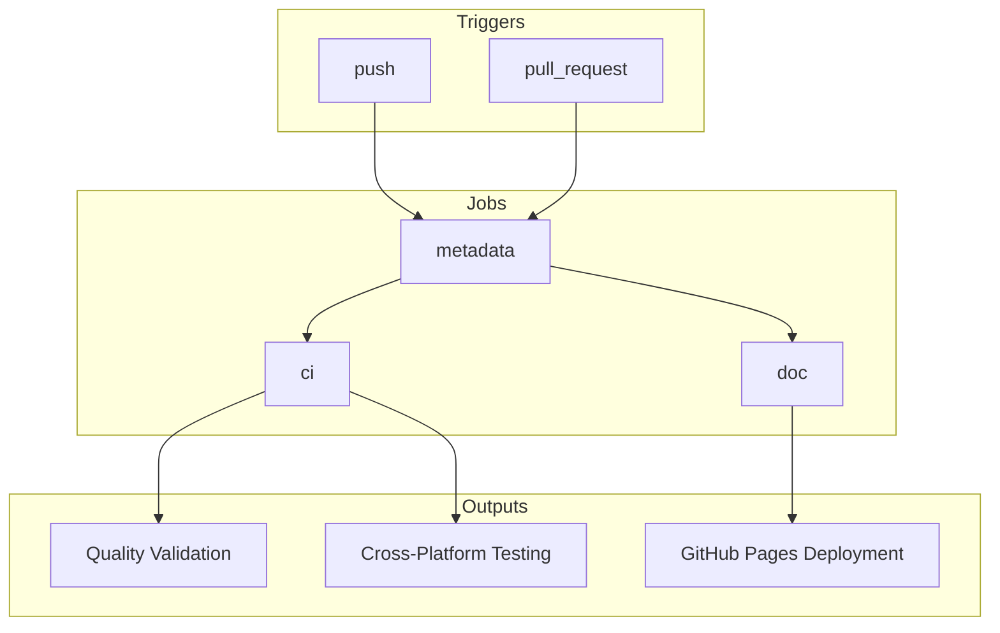
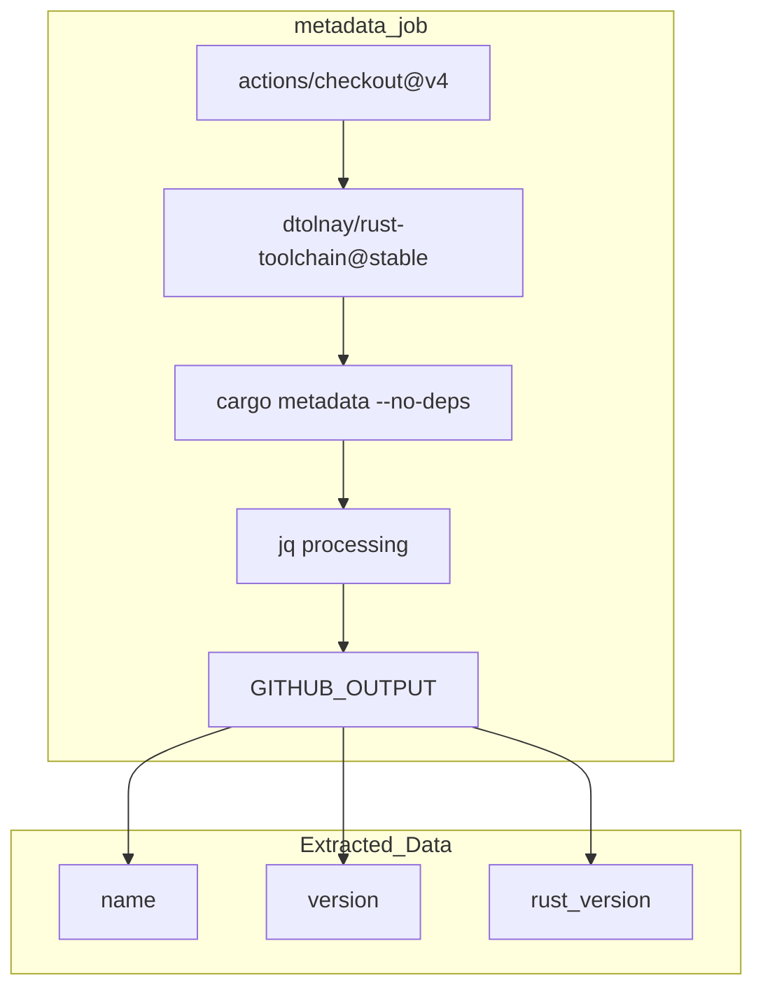
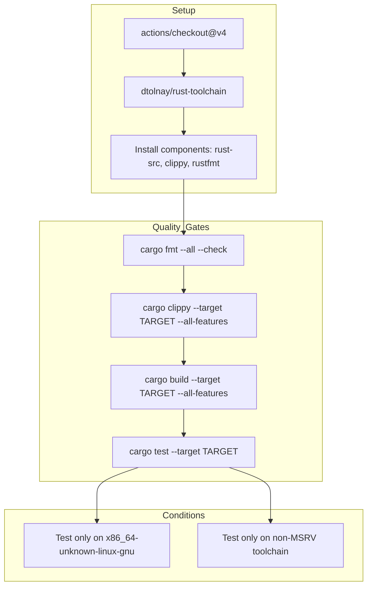
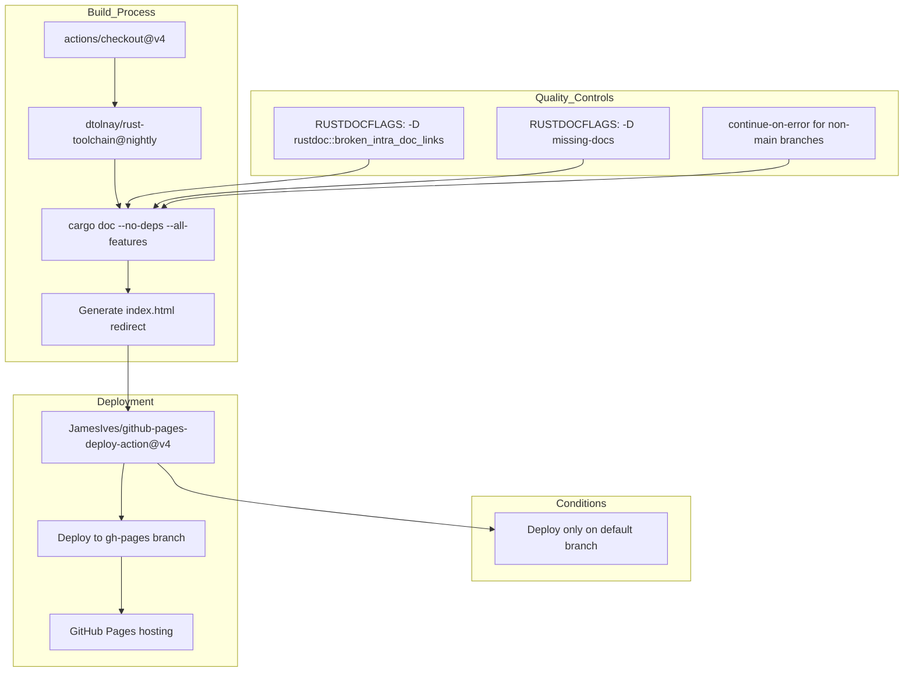

# CI/CD Pipeline

> **Relevant source files**
> * [.github/workflows/ci.yml](https://github.com/arceos-org/crate_interface/blob/73011a44/.github/workflows/ci.yml)

This document covers the continuous integration and deployment pipeline for the `crate_interface` crate, implemented using GitHub Actions. The pipeline ensures code quality, cross-platform compatibility, and automated documentation deployment.

For information about the testing strategies and test suite organization, see [Testing](/arceos-org/crate_interface/5.1-testing). For details about the overall project organization, see [Project Structure](/arceos-org/crate_interface/5.3-project-structure).

## Pipeline Overview

The CI/CD pipeline consists of three main jobs that work together to validate, test, and deploy the crate across multiple Rust toolchains and target architectures.

### CI Workflow Structure

**Sources:** [.github/workflows/ci.yml(L1 - L5)&emsp;](https://github.com/arceos-org/crate_interface/blob/73011a44/.github/workflows/ci.yml#L1-L5) [.github/workflows/ci.yml(L6 - L27)&emsp;](https://github.com/arceos-org/crate_interface/blob/73011a44/.github/workflows/ci.yml#L6-L27) [.github/workflows/ci.yml(L28 - L58)&emsp;](https://github.com/arceos-org/crate_interface/blob/73011a44/.github/workflows/ci.yml#L28-L58) [.github/workflows/ci.yml(L59 - L82)&emsp;](https://github.com/arceos-org/crate_interface/blob/73011a44/.github/workflows/ci.yml#L59-L82)

## Metadata Extraction Job

The `metadata` job extracts essential crate information that other jobs depend on, particularly the minimum supported Rust version (MSRV).

### Metadata Extraction Process

The job uses `cargo metadata --no-deps --format-version=1` to extract crate metadata and processes it with `jq` to output the crate name, version, and minimum Rust version. These outputs are made available to downstream jobs via GitHub Actions output variables.

**Sources:** [.github/workflows/ci.yml(L6 - L26)&emsp;](https://github.com/arceos-org/crate_interface/blob/73011a44/.github/workflows/ci.yml#L6-L26)

## Matrix Testing Job

The `ci` job implements a comprehensive matrix testing strategy across multiple Rust toolchains and target architectures, with specific focus on embedded and `no-std` environments.

### Testing Matrix Configuration

|Rust Toolchain|x86_64-unknown-linux-gnu|x86_64-unknown-none|riscv64gc-unknown-none-elf|aarch64-unknown-none-softfloat|
| --- | --- | --- | --- | --- |
|nightly|✅|✅|✅|✅|
|MSRV|✅|❌*|✅|✅|

*Excluded due to `rust-std` component unavailability for older toolchains on `x86_64-unknown-none`.

### Quality Gates Pipeline

The testing process enforces several quality gates in sequence:

* **Code formatting**: Ensures consistent style using `cargo fmt --all -- --check`
* **Linting**: Validates code quality with `cargo clippy` across all target architectures
* **Compilation**: Verifies successful builds for all target platforms
* **Unit testing**: Runs tests only on `x86_64-unknown-linux-gnu` with non-MSRV toolchains

**Sources:** [.github/workflows/ci.yml(L28 - L58)&emsp;](https://github.com/arceos-org/crate_interface/blob/73011a44/.github/workflows/ci.yml#L28-L58) [.github/workflows/ci.yml(L31 - L39)&emsp;](https://github.com/arceos-org/crate_interface/blob/73011a44/.github/workflows/ci.yml#L31-L39) [.github/workflows/ci.yml(L49 - L57)&emsp;](https://github.com/arceos-org/crate_interface/blob/73011a44/.github/workflows/ci.yml#L49-L57)

## Documentation Job

The `doc` job builds and deploys comprehensive documentation to GitHub Pages using a nightly Rust toolchain.

### Documentation Build and Deployment

The documentation pipeline includes:

* **Strict documentation validation**: Uses `RUSTDOCFLAGS` to enforce complete documentation coverage and valid internal links
* **Automatic index generation**: Creates a redirect from the root documentation page to the main crate documentation
* **Conditional deployment**: Only deploys to GitHub Pages when building the default branch
* **Single-commit deployment**: Uses `single-commit: true` to maintain a clean deployment history

**Sources:** [.github/workflows/ci.yml(L59 - L82)&emsp;](https://github.com/arceos-org/crate_interface/blob/73011a44/.github/workflows/ci.yml#L59-L82) [.github/workflows/ci.yml(L67 - L68)&emsp;](https://github.com/arceos-org/crate_interface/blob/73011a44/.github/workflows/ci.yml#L67-L68) [.github/workflows/ci.yml(L76 - L82)&emsp;](https://github.com/arceos-org/crate_interface/blob/73011a44/.github/workflows/ci.yml#L76-L82)

## Target Architecture Support

The pipeline specifically tests against target architectures relevant to the ArceOS ecosystem and embedded systems development:

* **`x86_64-unknown-linux-gnu`**: Standard Linux development and testing environment
* **`x86_64-unknown-none`**: Bare-metal x86_64 systems without OS
* **`riscv64gc-unknown-none-elf`**: RISC-V 64-bit bare-metal systems with compressed instructions
* **`aarch64-unknown-none-softfloat`**: ARM64 bare-metal systems with software floating-point

These targets ensure the crate functions correctly in both hosted and `no-std` environments, which is essential for the cross-crate interface functionality in kernel and embedded contexts.

**Sources:** [.github/workflows/ci.yml(L35)&emsp;](https://github.com/arceos-org/crate_interface/blob/73011a44/.github/workflows/ci.yml#L35-L35) [.github/workflows/ci.yml(L37 - L39)&emsp;](https://github.com/arceos-org/crate_interface/blob/73011a44/.github/workflows/ci.yml#L37-L39)

## Pipeline Triggers and Permissions

The workflow triggers on all `push` and `pull_request` events, ensuring comprehensive validation for both direct commits and proposed changes. The `doc` job includes `contents: write` permissions specifically for GitHub Pages deployment.

The pipeline uses modern GitHub Actions including `actions/checkout@v4` and `dtolnay/rust-toolchain` for reliable and up-to-date build environments.

**Sources:** [.github/workflows/ci.yml(L1 - L3)&emsp;](https://github.com/arceos-org/crate_interface/blob/73011a44/.github/workflows/ci.yml#L1-L3) [.github/workflows/ci.yml(L63 - L64)&emsp;](https://github.com/arceos-org/crate_interface/blob/73011a44/.github/workflows/ci.yml#L63-L64)