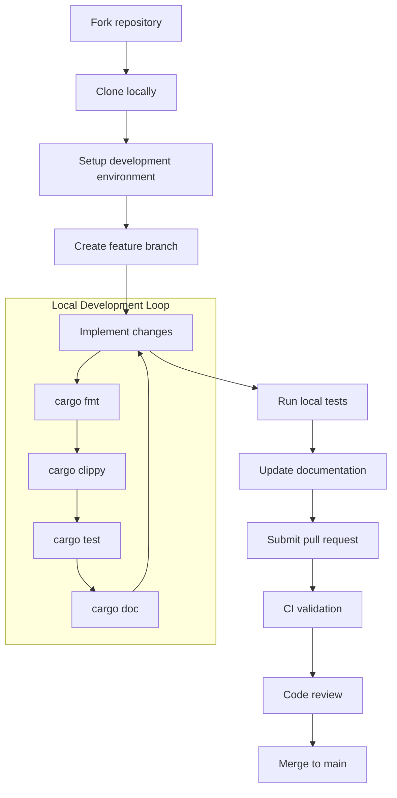
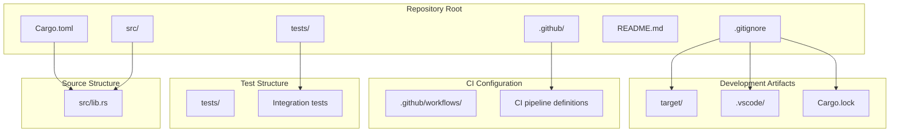
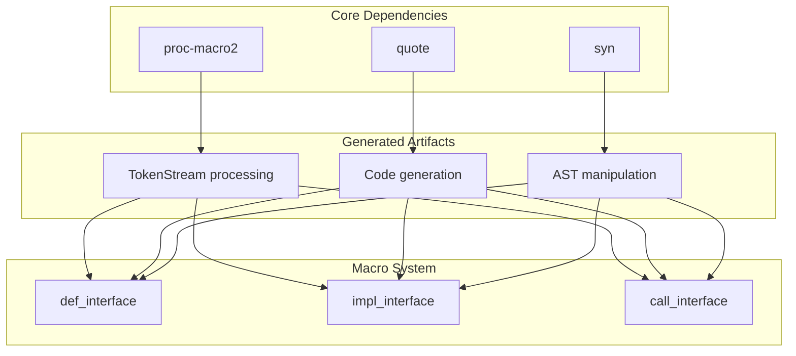

# Development Guide

> **Relevant source files**
> * [.gitignore](https://github.com/arceos-org/crate_interface/blob/73011a44/.gitignore)
> * [Cargo.toml](https://github.com/arceos-org/crate_interface/blob/73011a44/Cargo.toml)

This document provides comprehensive guidance for developers contributing to the `crate_interface` project. It covers the development environment setup, project structure, contribution workflows, and development practices specific to this procedural macro crate.

For detailed information about testing practices, see [Testing](/arceos-org/crate_interface/5.1-testing). For CI/CD pipeline specifics, see [CI/CD Pipeline](/arceos-org/crate_interface/5.2-cicd-pipeline). For in-depth project structure analysis, see [Project Structure](/arceos-org/crate_interface/5.3-project-structure).

## Development Environment Setup

The `crate_interface` project is a procedural macro crate that requires specific Rust toolchain capabilities and dependencies for development.

### Development Workflow

Sources: [Cargo.toml(L1 - L22)&emsp;](https://github.com/arceos-org/crate_interface/blob/73011a44/Cargo.toml#L1-L22)

### Required Tools and Dependencies

The project uses a minimal but specific set of dependencies for procedural macro development:

|Component|Version|Purpose|
| --- | --- | --- |
|proc-macro2|1.0|Low-level token manipulation|
|quote|1.0|Code generation from templates|
|syn|2.0|Rust syntax tree parsing|

The `syn` dependency is configured with the `full` feature to enable complete Rust syntax parsing capabilities [Cargo.toml(L18)&emsp;](https://github.com/arceos-org/crate_interface/blob/73011a44/Cargo.toml#L18-L18)

### Minimum Rust Version

The project requires Rust 1.57 or later [Cargo.toml(L13)&emsp;](https://github.com/arceos-org/crate_interface/blob/73011a44/Cargo.toml#L13-L13) which ensures compatibility with:

* Modern `syn` v2.0 APIs
* Stable procedural macro features
* Target architectures used in ArceOS ecosystem

## Project Structure and Development Architecture

Sources: [Cargo.toml(L1 - L22)&emsp;](https://github.com/arceos-org/crate_interface/blob/73011a44/Cargo.toml#L1-L22) [.gitignore(L1 - L5)&emsp;](https://github.com/arceos-org/crate_interface/blob/73011a44/.gitignore#L1-L5)

## Contribution Workflow

### Code Organization Principles

The `crate_interface` project follows a single-file library structure with all core functionality contained in `src/lib.rs`. This architectural decision supports:

* **Simplicity**: Single point of entry for all macro definitions
* **Maintainability**: Reduced complexity in navigation and understanding
* **Performance**: Minimized compilation overhead for consumers

### Development Practices

#### Procedural Macro Development

When working with the three core macros (`def_interface`, `impl_interface`, `call_interface`), follow these practices:

1. **Token Stream Handling**: Use `proc-macro2::TokenStream` for all internal processing
2. **Error Reporting**: Leverage `syn::Error` for compilation-time error messages
3. **Code Generation**: Use `quote!` macros for generating Rust code templates

#### Testing Strategy

The project employs comprehensive integration testing to validate macro functionality across different usage patterns. Test cases should cover:

* Basic interface definition and implementation scenarios
* Cross-crate compilation patterns
* Error conditions and edge cases
* Target architecture compatibility

For complete testing documentation, see [Testing](/arceos-org/crate_interface/5.1-testing).

### Dependencies and Build Configuration

Sources: [Cargo.toml(L15 - L18)&emsp;](https://github.com/arceos-org/crate_interface/blob/73011a44/Cargo.toml#L15-L18)

The build system is configured as a procedural macro crate [Cargo.toml(L20 - L21)&emsp;](https://github.com/arceos-org/crate_interface/blob/73011a44/Cargo.toml#L20-L21) which enables the `proc_macro` attribute and allows the macros to be used by consuming crates.

### Version Control and Exclusions

The project maintains a minimal `.gitignore` configuration [.gitignore(L1 - L5)&emsp;](https://github.com/arceos-org/crate_interface/blob/73011a44/.gitignore#L1-L5) that excludes:

* **Build Artifacts**: `/target` directory containing compilation outputs
* **Editor Configuration**: `.vscode` directory for development environment settings
* **System Files**: `.DS_Store` for macOS filesystem metadata
* **Lock Files**: `Cargo.lock` which is typically excluded for library crates

This configuration ensures that only source code and essential project files are tracked in version control.

### Package Metadata and Distribution

The crate is configured for distribution through multiple channels:

* **Primary Repository**: GitHub at `arceos-org/crate_interface`
* **Documentation**: Hosted on docs.rs
* **Package Registry**: Available through crates.io
* **License**: Triple-licensed under GPL-3.0-or-later, Apache-2.0, and MulanPSL-2.0

The package is categorized for procedural macro development tools and no-std compatibility [Cargo.toml(L12)&emsp;](https://github.com/arceos-org/crate_interface/blob/73011a44/Cargo.toml#L12-L12) making it discoverable for embedded and systems programming use cases.

Sources: [Cargo.toml(L7 - L12)&emsp;](https://github.com/arceos-org/crate_interface/blob/73011a44/Cargo.toml#L7-L12)