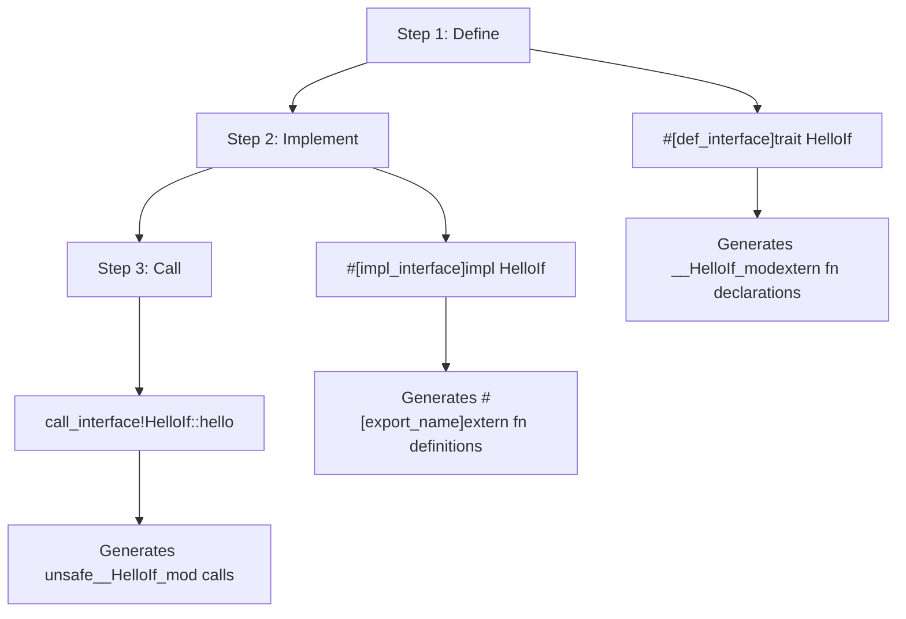
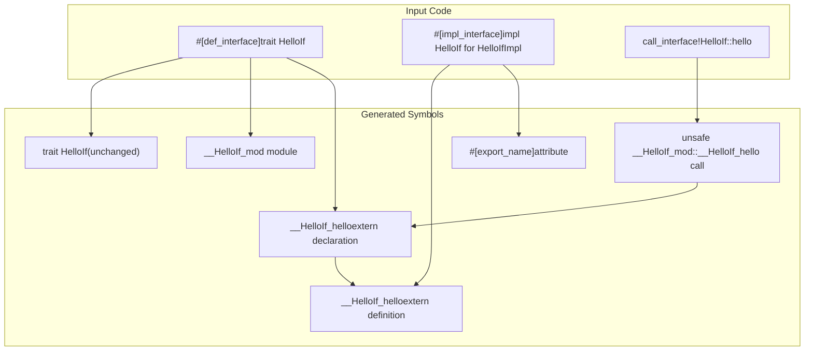

# Getting Started

> **Relevant source files**
> * [Cargo.toml](https://github.com/arceos-org/crate_interface/blob/73011a44/Cargo.toml)
> * [README.md](https://github.com/arceos-org/crate_interface/blob/73011a44/README.md)
> * [tests/test_crate_interface.rs](https://github.com/arceos-org/crate_interface/blob/73011a44/tests/test_crate_interface.rs)

This document provides a quick start guide for using the `crate_interface` crate to define trait interfaces that can be implemented and called across crate boundaries. It covers the basic three-step workflow of defining interfaces, implementing them, and calling interface methods.

For comprehensive macro syntax and options, see [Macro Reference](/arceos-org/crate_interface/3-macro-reference). For understanding the underlying implementation details, see [Architecture and Internals](/arceos-org/crate_interface/4-architecture-and-internals).

## Purpose and Scope

The `crate_interface` crate solves circular dependency problems by enabling trait definitions in one crate while allowing implementations and usage in separate crates. This guide demonstrates the essential usage patterns through practical examples using the three core macros: `def_interface`, `impl_interface`, and `call_interface!`.

## Installation

Add `crate_interface` to your `Cargo.toml` dependencies:

```
[dependencies]
crate_interface = "0.1.4"
```

The crate supports `no-std` environments and requires Rust 1.57 or later.

**Sources:** [Cargo.toml(L1 - L22)&emsp;](https://github.com/arceos-org/crate_interface/blob/73011a44/Cargo.toml#L1-L22)

## Three-Step Workflow

The `crate_interface` system follows a consistent three-step pattern that maps directly to the three procedural macros:

### Basic Workflow Diagram



**Sources:** [README.md(L13 - L40)&emsp;](https://github.com/arceos-org/crate_interface/blob/73011a44/README.md#L13-L40) [tests/test_crate_interface.rs(L3 - L11)&emsp;](https://github.com/arceos-org/crate_interface/blob/73011a44/tests/test_crate_interface.rs#L3-L11)

### Step 1: Define Interface

Use the `#[def_interface]` attribute macro to define a trait interface:

```rust
#[crate_interface::def_interface]
pub trait HelloIf {
    fn hello(&self, name: &str, id: usize) -> String;
}
```

This generates the trait plus a hidden module containing `extern "Rust"` function declarations.

### Step 2: Implement Interface

Use the `#[impl_interface]` attribute macro to implement the interface:

```rust
struct HelloIfImpl;

#[crate_interface::impl_interface]
impl HelloIf for HelloIfImpl {
    fn hello(&self, name: &str, id: usize) -> String {
        format!("Hello, {} {}!", name, id)
    }
}
```

This generates `#[export_name]` extern functions that can be linked across crates.

### Step 3: Call Interface Methods

Use the `call_interface!` function-like macro to safely call interface methods:

```javascript
use crate_interface::call_interface;

// Method-style calling
let result = call_interface!(HelloIf::hello("world", 123));

// Function-style calling  
let result = call_interface!(HelloIf::hello, "rust", 456);
```

**Sources:** [README.md(L13 - L40)&emsp;](https://github.com/arceos-org/crate_interface/blob/73011a44/README.md#L13-L40) [tests/test_crate_interface.rs(L36 - L41)&emsp;](https://github.com/arceos-org/crate_interface/blob/73011a44/tests/test_crate_interface.rs#L36-L41)

## Generated Code Structure

Understanding what code gets generated helps debug issues and optimize usage:

### Code Generation Mapping



The `def_interface` macro generates a module named `__HelloIf_mod` containing extern function declarations like `__HelloIf_hello`. The `impl_interface` macro creates matching extern function definitions with `#[export_name]` attributes. The `call_interface!` macro generates safe wrappers around unsafe extern calls.

**Sources:** [README.md(L44 - L85)&emsp;](https://github.com/arceos-org/crate_interface/blob/73011a44/README.md#L44-L85)

## Advanced Usage Patterns

### Default Method Implementations

Traits can include default implementations that will be preserved:

```rust
#[def_interface]
trait SimpleIf {
    fn foo() -> u32 {
        123  // Default implementation
    }
    
    fn bar(&self, a: u16, b: &[u8], c: &str);
}
```

### Cross-Module Calls

Interface calls work from any module scope by using appropriate path syntax:

```java
mod private {
    pub fn test_call_in_mod() {
        crate::call_interface!(super::SimpleIf::bar(123, &[2, 3, 5, 7, 11], "test"));
        crate::call_interface!(crate::SimpleIf::foo,);
    }
}
```

### Method Documentation

Documentation comments are preserved in the generated code:

```rust
#[def_interface]
trait SimpleIf {
    /// Test comments for method
    fn bar(&self, a: u16, b: &[u8], c: &str);
}

#[impl_interface]  
impl SimpleIf for SimpleIfImpl {
    /// Implementation-specific documentation
    fn bar(&self, a: u16, b: &[u8], c: &str) {
        // Implementation here
    }
}
```

**Sources:** [tests/test_crate_interface.rs(L3 - L42)&emsp;](https://github.com/arceos-org/crate_interface/blob/73011a44/tests/test_crate_interface.rs#L3-L42)

## Cross-Crate Usage

|Crate|Role|Required Items|
| --- | --- | --- |
|Interface Crate|Defines traits|#[def_interface]trait definition|
|Implementation Crate|Provides implementations|#[impl_interface]impl block + struct|
|Consumer Crate|Calls methods|call_interface!macro calls|

The implementation crate and consumer crate can be the same, different, or have multiple implementations across multiple crates.

## Next Steps

* For detailed macro syntax and all available options, see [Macro Reference](/arceos-org/crate_interface/3-macro-reference)
* For understanding how the extern function linking works, see [Architecture and Internals](/arceos-org/crate_interface/4-architecture-and-internals)
* For contributing to the project, see [Development Guide](/arceos-org/crate_interface/5-development-guide)
* For running and writing tests, see [Testing](/arceos-org/crate_interface/5.1-testing)

**Sources:** [README.md(L1 - L85)&emsp;](https://github.com/arceos-org/crate_interface/blob/73011a44/README.md#L1-L85) [tests/test_crate_interface.rs(L1 - L42)&emsp;](https://github.com/arceos-org/crate_interface/blob/73011a44/tests/test_crate_interface.rs#L1-L42) [Cargo.toml(L1 - L22)&emsp;](https://github.com/arceos-org/crate_interface/blob/73011a44/Cargo.toml#L1-L22)