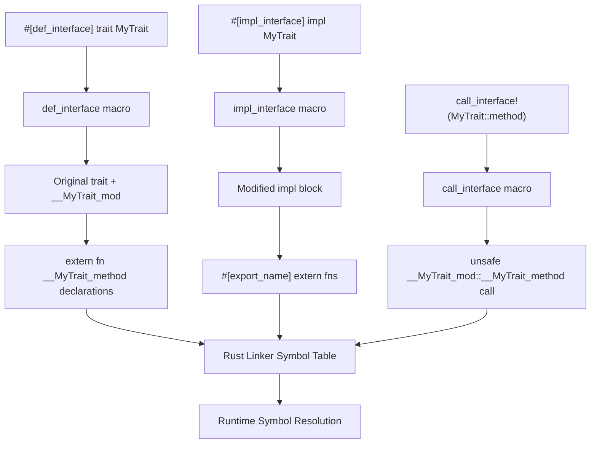
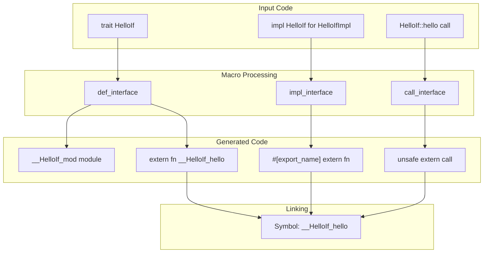
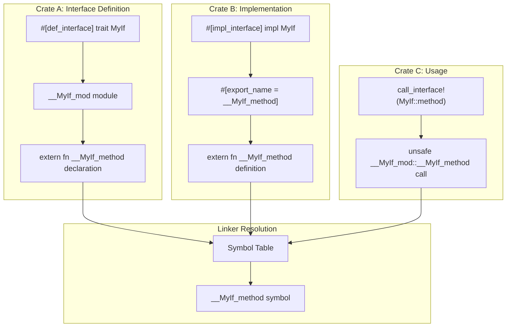

# Macro Reference

> **Relevant source files**
> * [README.md](https://github.com/arceos-org/crate_interface/blob/73011a44/README.md)
> * [src/lib.rs](https://github.com/arceos-org/crate_interface/blob/73011a44/src/lib.rs)
> * [tests/test_crate_interface.rs](https://github.com/arceos-org/crate_interface/blob/73011a44/tests/test_crate_interface.rs)

This page provides comprehensive documentation for the three core procedural macros that form the `crate_interface` system: `def_interface`, `impl_interface`, and `call_interface`. These macros work together to enable cross-crate trait interfaces by generating extern function declarations, exported implementations, and safe call wrappers.

For detailed documentation of individual macros, see [def_interface Macro](/arceos-org/crate_interface/3.1-def_interface-macro), [impl_interface Macro](/arceos-org/crate_interface/3.2-impl_interface-macro), and [call_interface Macro](/arceos-org/crate_interface/3.3-call_interface-macro). For understanding the underlying architecture and symbol linking mechanisms, see [Architecture and Internals](/arceos-org/crate_interface/4-architecture-and-internals).

## Three-Macro System Overview

The `crate_interface` system consists of three interdependent procedural macros that implement a complete cross-crate interface solution:

### Macro Interaction Flow



Sources: [src/lib.rs(L28 - L75)&emsp;](https://github.com/arceos-org/crate_interface/blob/73011a44/src/lib.rs#L28-L75) [src/lib.rs(L87 - L162)&emsp;](https://github.com/arceos-org/crate_interface/blob/73011a44/src/lib.rs#L87-L162) [src/lib.rs(L192 - L210)&emsp;](https://github.com/arceos-org/crate_interface/blob/73011a44/src/lib.rs#L192-L210)

### Core Components

|Macro|Purpose|Input|Output|
| --- | --- | --- | --- |
|def_interface|Interface definition|Trait declaration|Trait + hidden module with extern declarations|
|impl_interface|Interface implementation|Trait impl block|Modified impl with exported extern functions|
|call_interface|Interface invocation|Method call syntax|Unsafe extern function call|

## Generated Code Architecture

The macro system transforms high-level trait definitions into low-level extern function interfaces that can be linked across crate boundaries:

### Code Generation Pipeline



Sources: [src/lib.rs(L40 - L73)&emsp;](https://github.com/arceos-org/crate_interface/blob/73011a44/src/lib.rs#L40-L73) [src/lib.rs(L108 - L161)&emsp;](https://github.com/arceos-org/crate_interface/blob/73011a44/src/lib.rs#L108-L161) [src/lib.rs(L194 - L210)&emsp;](https://github.com/arceos-org/crate_interface/blob/73011a44/src/lib.rs#L194-L210) [README.md(L44 - L85)&emsp;](https://github.com/arceos-org/crate_interface/blob/73011a44/README.md#L44-L85)

## Naming Conventions

The macro system uses consistent naming patterns to ensure symbol uniqueness and avoid conflicts:

### Symbol Generation Pattern

|Element|Pattern|Example|
| --- | --- | --- |
|Hidden module|__{TraitName}_mod|__HelloIf_mod|
|Extern function|__{TraitName}_{method}|__HelloIf_hello|
|Export symbol|__{TraitName}_{method}|__HelloIf_hello|

### Implementation Details

The naming convention implementation is found in the macro code:

* Module name generation: [src/lib.rs(L61)&emsp;](https://github.com/arceos-org/crate_interface/blob/73011a44/src/lib.rs#L61-L61)
* Function name generation: [src/lib.rs(L45)&emsp;](https://github.com/arceos-org/crate_interface/blob/73011a44/src/lib.rs#L45-L45) [src/lib.rs(L113)&emsp;](https://github.com/arceos-org/crate_interface/blob/73011a44/src/lib.rs#L113-L113)
* Symbol export naming: [src/lib.rs(L113)&emsp;](https://github.com/arceos-org/crate_interface/blob/73011a44/src/lib.rs#L113-L113) [src/lib.rs(L203)&emsp;](https://github.com/arceos-org/crate_interface/blob/73011a44/src/lib.rs#L203-L203)

## Syntax Patterns

### Basic Usage Syntax

```rust
// 1. Interface Definition
#[crate_interface::def_interface]
pub trait TraitName {
    fn method_name(&self, param: Type) -> ReturnType;
}

// 2. Interface Implementation  
#[crate_interface::impl_interface]
impl TraitName for StructName {
    fn method_name(&self, param: Type) -> ReturnType {
        // implementation
    }
}

// 3. Interface Invocation
call_interface!(TraitName::method_name(args))
call_interface!(TraitName::method_name, arg1, arg2)
```

### Calling Syntax Variants

The `call_interface` macro supports two calling styles as demonstrated in the test suite:

|Style|Syntax|Example|
| --- | --- | --- |
|Parentheses|call_interface!(Trait::method(args))|call_interface!(SimpleIf::bar(123, &[2, 3], "test"))|
|Comma-separated|call_interface!(Trait::method, args)|call_interface!(SimpleIf::bar, 123, &[2, 3], "test")|

Sources: [tests/test_crate_interface.rs(L31 - L32)&emsp;](https://github.com/arceos-org/crate_interface/blob/73011a44/tests/test_crate_interface.rs#L31-L32) [tests/test_crate_interface.rs(L38 - L39)&emsp;](https://github.com/arceos-org/crate_interface/blob/73011a44/tests/test_crate_interface.rs#L38-L39)

## Cross-Crate Symbol Resolution

### Symbol Export and Import Mechanism



Sources: [src/lib.rs(L54 - L58)&emsp;](https://github.com/arceos-org/crate_interface/blob/73011a44/src/lib.rs#L54-L58) [src/lib.rs(L147 - L151)&emsp;](https://github.com/arceos-org/crate_interface/blob/73011a44/src/lib.rs#L147-L151) [src/lib.rs(L209)&emsp;](https://github.com/arceos-org/crate_interface/blob/73011a44/src/lib.rs#L209-L209)

## Macro Attributes and Visibility

### Visibility Inheritance

The macro system preserves and propagates visibility modifiers:

* `def_interface` preserves trait visibility: [src/lib.rs(L38)&emsp;](https://github.com/arceos-org/crate_interface/blob/73011a44/src/lib.rs#L38-L38) [src/lib.rs(L67)&emsp;](https://github.com/arceos-org/crate_interface/blob/73011a44/src/lib.rs#L67-L67)
* `impl_interface` preserves method attributes: [src/lib.rs(L111)&emsp;](https://github.com/arceos-org/crate_interface/blob/73011a44/src/lib.rs#L111-L111) [src/lib.rs(L142 - L143)&emsp;](https://github.com/arceos-org/crate_interface/blob/73011a44/src/lib.rs#L142-L143)
* Generated modules use `#[doc(hidden)]`: [src/lib.rs(L65)&emsp;](https://github.com/arceos-org/crate_interface/blob/73011a44/src/lib.rs#L65-L65)

### Attribute Preservation

The implementation preserves existing attributes on trait methods and impl functions, as seen in the test examples with `#[cfg(test)]` and doc comments: [tests/test_crate_interface.rs(L9)&emsp;](https://github.com/arceos-org/crate_interface/blob/73011a44/tests/test_crate_interface.rs#L9-L9) [tests/test_crate_interface.rs(L17)&emsp;](https://github.com/arceos-org/crate_interface/blob/73011a44/tests/test_crate_interface.rs#L17-L17) [tests/test_crate_interface.rs(L22)&emsp;](https://github.com/arceos-org/crate_interface/blob/73011a44/tests/test_crate_interface.rs#L22-L22)

## Error Handling

The macro system includes comprehensive error checking for common usage mistakes:

* Empty attribute validation: [src/lib.rs(L29 - L34)&emsp;](https://github.com/arceos-org/crate_interface/blob/73011a44/src/lib.rs#L29-L34) [src/lib.rs(L89 - L94)&emsp;](https://github.com/arceos-org/crate_interface/blob/73011a44/src/lib.rs#L89-L94)
* Trait implementation validation: [src/lib.rs(L97 - L106)&emsp;](https://github.com/arceos-org/crate_interface/blob/73011a44/src/lib.rs#L97-L106)
* Path parsing validation: [src/lib.rs(L198 - L200)&emsp;](https://github.com/arceos-org/crate_interface/blob/73011a44/src/lib.rs#L198-L200)

Sources: [src/lib.rs(L14 - L16)&emsp;](https://github.com/arceos-org/crate_interface/blob/73011a44/src/lib.rs#L14-L16) [src/lib.rs(L29 - L34)&emsp;](https://github.com/arceos-org/crate_interface/blob/73011a44/src/lib.rs#L29-L34) [src/lib.rs(L89 - L94)&emsp;](https://github.com/arceos-org/crate_interface/blob/73011a44/src/lib.rs#L89-L94) [src/lib.rs(L97 - L106)&emsp;](https://github.com/arceos-org/crate_interface/blob/73011a44/src/lib.rs#L97-L106) [src/lib.rs(L198 - L200)&emsp;](https://github.com/arceos-org/crate_interface/blob/73011a44/src/lib.rs#L198-L200)