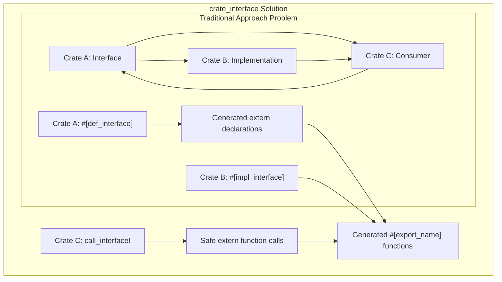
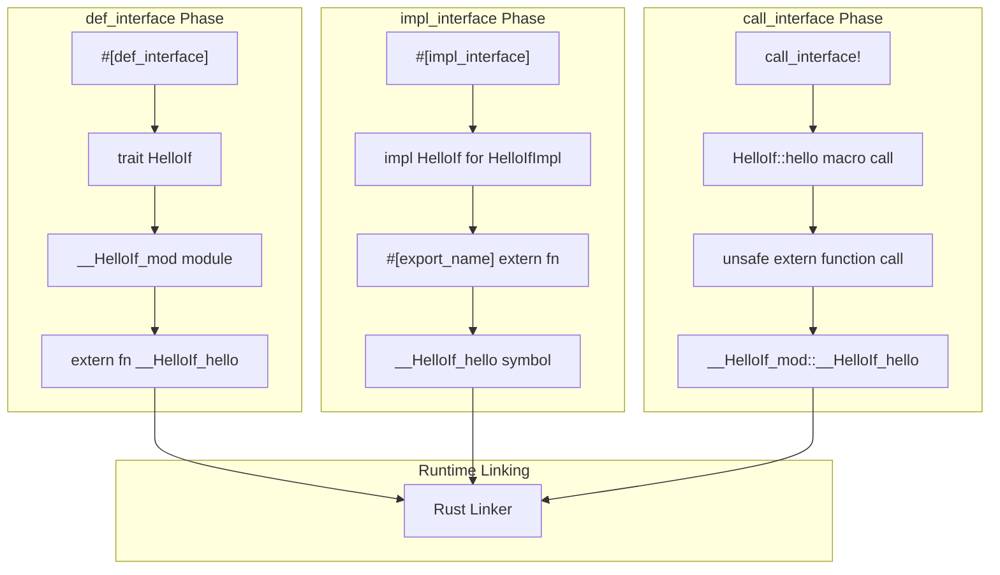
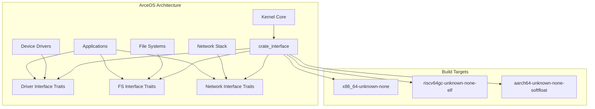

# Overview

> **Relevant source files**
> * [Cargo.toml](https://github.com/arceos-org/crate_interface/blob/73011a44/Cargo.toml)
> * [README.md](https://github.com/arceos-org/crate_interface/blob/73011a44/README.md)

## Purpose and Scope

The `crate_interface` crate is a procedural macro library that enables cross-crate trait interfaces in Rust. It provides a solution for defining trait interfaces in one crate while allowing implementations and usage in separate crates, effectively solving circular dependency problems between crates. This document covers the high-level architecture, core concepts, and integration patterns within the ArceOS ecosystem.

For detailed usage instructions, see [Getting Started](/arceos-org/crate_interface/2-getting-started). For comprehensive macro documentation, see [Macro Reference](/arceos-org/crate_interface/3-macro-reference). For implementation details, see [Architecture and Internals](/arceos-org/crate_interface/4-architecture-and-internals).

*Sources: [Cargo.toml(L1 - L22)&emsp;](https://github.com/arceos-org/crate_interface/blob/73011a44/Cargo.toml#L1-L22) [README.md(L1 - L85)&emsp;](https://github.com/arceos-org/crate_interface/blob/73011a44/README.md#L1-L85)*

## Core Problem and Solution

The crate addresses the fundamental challenge of **circular dependencies** in Rust crate ecosystems. Traditional trait definitions create tight coupling between interface definitions and their implementations, preventing modular plugin architectures.

The `crate_interface` solution employs a three-phase approach using procedural macros that generate `extern "Rust"` function declarations and implementations with specific symbol naming conventions. This allows the Rust linker to resolve cross-crate trait method calls without requiring direct crate dependencies.



*Sources: [README.md(L7 - L10)&emsp;](https://github.com/arceos-org/crate_interface/blob/73011a44/README.md#L7-L10) [Cargo.toml(L6)&emsp;](https://github.com/arceos-org/crate_interface/blob/73011a44/Cargo.toml#L6-L6)*

## Three-Macro System Architecture

The crate implements a coordinated system of three procedural macros that work together to enable cross-crate trait interfaces:



*Sources: [README.md(L13 - L40)&emsp;](https://github.com/arceos-org/crate_interface/blob/73011a44/README.md#L13-L40) [README.md(L44 - L85)&emsp;](https://github.com/arceos-org/crate_interface/blob/73011a44/README.md#L44-L85)*

## Generated Code Flow

The macro system transforms high-level trait definitions into low-level extern function interfaces that can be linked across crate boundaries:

```

```

*Sources: [README.md(L46 - L85)&emsp;](https://github.com/arceos-org/crate_interface/blob/73011a44/README.md#L46-L85)*

## Integration with ArceOS Ecosystem

The `crate_interface` crate is designed as a foundational component within the ArceOS modular operating system architecture. It enables plugin-style extensibility and cross-crate interfaces essential for kernel modularity:

|Feature|Purpose|ArceOS Use Case|
| --- | --- | --- |
|No-std compatibility|Embedded/kernel environments|Bare-metal kernel modules|
|Cross-crate interfaces|Plugin architecture|Device drivers, file systems|
|Symbol-based linking|Runtime module loading|Dynamic kernel extensions|
|Zero-overhead abstractions|Performance-critical code|Kernel syscall interfaces|



*Sources: [Cargo.toml(L8)&emsp;](https://github.com/arceos-org/crate_interface/blob/73011a44/Cargo.toml#L8-L8) [Cargo.toml(L11 - L12)&emsp;](https://github.com/arceos-org/crate_interface/blob/73011a44/Cargo.toml#L11-L12)*

## Key Design Principles

The crate follows several core design principles that make it suitable for system-level programming:

* **Symbol-based Decoupling**: Uses extern function symbols instead of direct trait object vtables
* **Compile-time Safety**: Procedural macros ensure type safety while generating unsafe extern calls
* **Zero Runtime Overhead**: Direct function calls with no dynamic dispatch or allocations
* **Cross-platform Compatibility**: Works across multiple target architectures and toolchains
* **No-std First**: Designed for embedded and kernel environments without standard library dependencies

*Sources: [Cargo.toml(L12)&emsp;](https://github.com/arceos-org/crate_interface/blob/73011a44/Cargo.toml#L12-L12) [Cargo.toml(L15 - L18)&emsp;](https://github.com/arceos-org/crate_interface/blob/73011a44/Cargo.toml#L15-L18)*