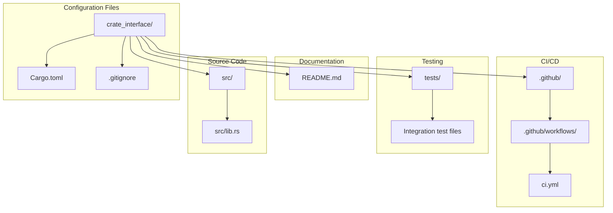
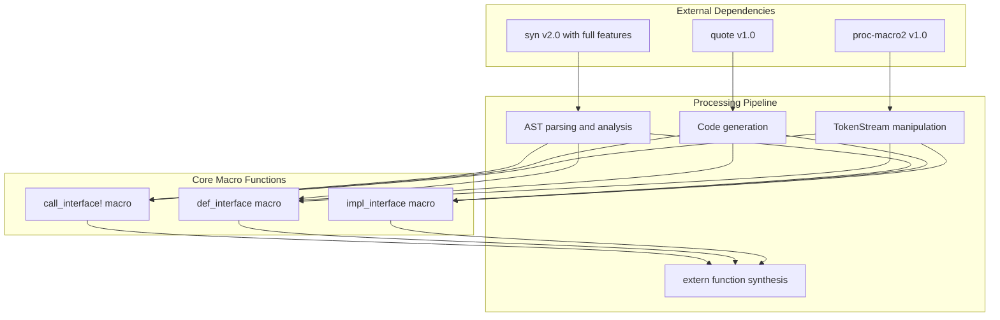
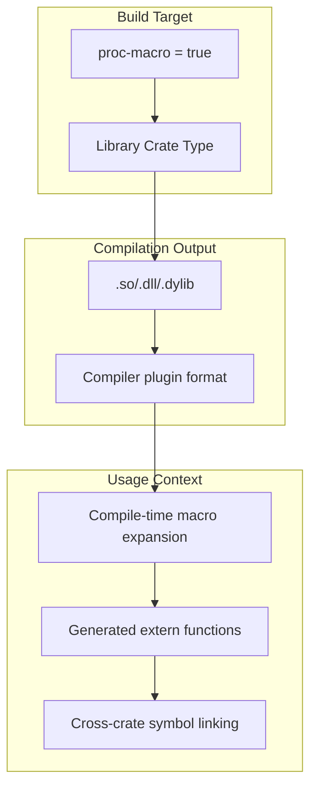
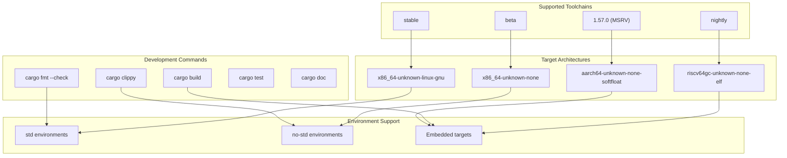

# Project Structure

> **Relevant source files**
> * [.gitignore](https://github.com/arceos-org/crate_interface/blob/73011a44/.gitignore)
> * [Cargo.toml](https://github.com/arceos-org/crate_interface/blob/73011a44/Cargo.toml)

This document covers the organization and configuration of the `crate_interface` repository, including its file structure, dependencies, build setup, and development environment. For information about the actual macro implementations and testing, see [Testing](/arceos-org/crate_interface/5.1-testing) and [Macro Reference](/arceos-org/crate_interface/3-macro-reference).

## Repository Organization

The `crate_interface` project follows a standard Rust crate structure optimized for procedural macro development. The repository is intentionally minimal, focusing on a single library crate that exports three core procedural macros.



**Repository Structure Overview**

Sources: [Cargo.toml(L1 - L22)&emsp;](https://github.com/arceos-org/crate_interface/blob/73011a44/Cargo.toml#L1-L22) [.gitignore(L1 - L5)&emsp;](https://github.com/arceos-org/crate_interface/blob/73011a44/.gitignore#L1-L5)

## Package Configuration

The project is configured as a procedural macro crate through its `Cargo.toml` manifest. The package metadata defines the crate's identity within the ArceOS ecosystem and its distribution characteristics.

```

```

**Package Configuration Details**

|Field|Value|Purpose|
| --- | --- | --- |
|name|"crate_interface"|Crate identifier for Cargo and crates.io|
|version|"0.1.4"|Semantic versioning for API compatibility|
|edition|"2021"|Rust edition for language features|
|rust-version|"1.57"|Minimum supported Rust version|
|proc-macro|true|Enables procedural macro compilation|

Sources: [Cargo.toml(L1 - L14)&emsp;](https://github.com/arceos-org/crate_interface/blob/73011a44/Cargo.toml#L1-L14) [Cargo.toml(L20 - L22)&emsp;](https://github.com/arceos-org/crate_interface/blob/73011a44/Cargo.toml#L20-L22)

## Dependencies Architecture

The crate relies on three essential procedural macro development dependencies, each serving a specific role in the macro compilation pipeline.



**Dependency Functions**

|Dependency|Version|Purpose|
| --- | --- | --- |
|proc-macro2|1.0|TokenStream manipulation and span preservation|
|quote|1.0|Rust code generation with interpolation|
|syn|2.0|Rust syntax tree parsing with full feature set|

The `syn` dependency includes the `"full"` feature set to enable parsing of complete Rust syntax, including trait definitions, implementations, and method signatures required by the macro system.

Sources: [Cargo.toml(L15 - L18)&emsp;](https://github.com/arceos-org/crate_interface/blob/73011a44/Cargo.toml#L15-L18)

## Build System Configuration

The crate is configured as a procedural macro library, which affects compilation behavior and usage patterns.



**Build Configuration Implications**

The `proc-macro = true` setting in `[lib]` configures the crate to:

* Compile as a dynamic library for use by the Rust compiler
* Load at compile-time during macro expansion phases
* Generate code that becomes part of dependent crates
* Enable cross-crate trait interface functionality

Sources: [Cargo.toml(L20 - L22)&emsp;](https://github.com/arceos-org/crate_interface/blob/73011a44/Cargo.toml#L20-L22)

## Development Environment

The project supports multiple development workflows and target environments, as configured through the CI pipeline and package metadata.



**Environment Requirements**

The development environment is designed to support:

* Standard library environments for general development
* `no-std` environments for embedded and kernel development
* Multiple architectures including x86_64, RISC-V, and ARM64
* Cross-compilation for bare-metal targets

Sources: [Cargo.toml(L12 - L13)&emsp;](https://github.com/arceos-org/crate_interface/blob/73011a44/Cargo.toml#L12-L13) [.gitignore(L1 - L5)&emsp;](https://github.com/arceos-org/crate_interface/blob/73011a44/.gitignore#L1-L5)

## Version Control Configuration

The `.gitignore` configuration excludes standard Rust development artifacts and common editor files.

**Excluded Files and Directories**

|Pattern|Purpose|
| --- | --- |
|/target|Cargo build artifacts and dependencies|
|/.vscode|Visual Studio Code workspace configuration|
|.DS_Store|macOS file system metadata|
|Cargo.lock|Dependency version lockfile (appropriate for libraries)|

The exclusion of `Cargo.lock` follows Rust library conventions, allowing dependent crates to resolve their own dependency versions while maintaining compatibility with the specified version ranges.

Sources: [.gitignore(L1 - L5)&emsp;](https://github.com/arceos-org/crate_interface/blob/73011a44/.gitignore#L1-L5)