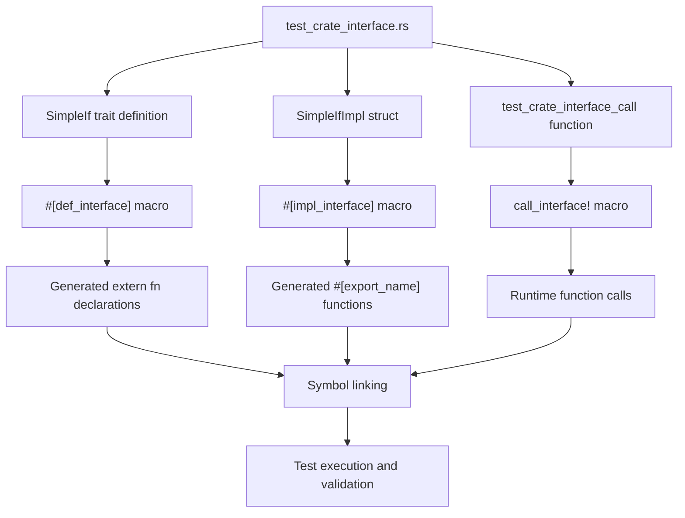
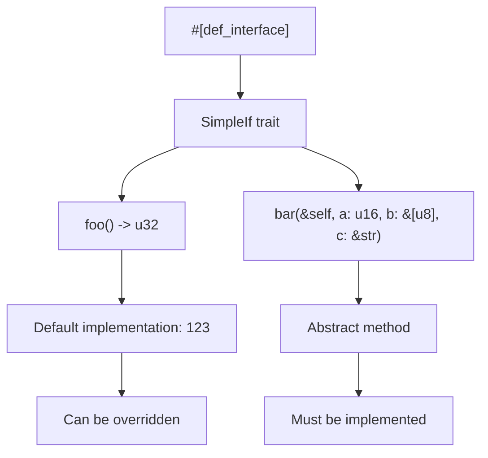
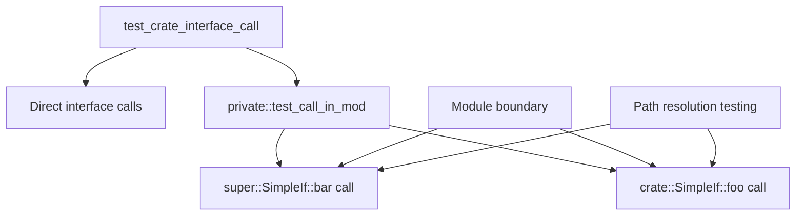
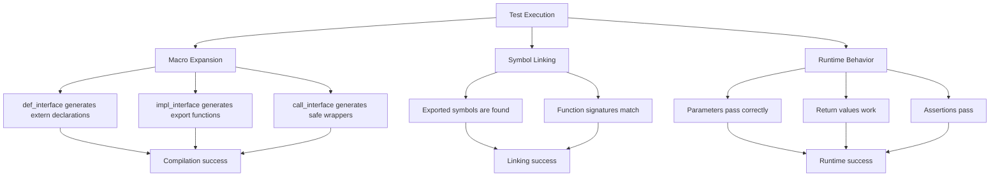

# Testing

> **Relevant source files**
> * [tests/test_crate_interface.rs](https://github.com/arceos-org/crate_interface/blob/73011a44/tests/test_crate_interface.rs)

This document covers the test suite for the `crate_interface` crate, including test structure, patterns used to validate macro functionality, and how to run the tests. The tests demonstrate practical usage of the three core macros (`def_interface`, `impl_interface`, and `call_interface!`) and verify that cross-crate trait interfaces work correctly at runtime.

For information about the CI/CD pipeline and automated testing infrastructure, see [CI/CD Pipeline](/arceos-org/crate_interface/5.2-cicd-pipeline). For details about project structure and development setup, see [Project Structure](/arceos-org/crate_interface/5.3-project-structure).

## Test Suite Overview

The `crate_interface` crate uses integration tests to validate macro functionality. The test suite is designed to verify that the generated code correctly implements cross-crate trait interfaces through extern function linking.



**Test Architecture Flow**

Sources: [tests/test_crate_interface.rs(L1 - L42)&emsp;](https://github.com/arceos-org/crate_interface/blob/73011a44/tests/test_crate_interface.rs#L1-L42)

## Test Structure and Patterns

The test file follows a specific pattern that mirrors real-world usage of the `crate_interface` system across multiple crates, but compressed into a single test file for validation.

### Interface Definition Pattern

The test defines a trait using the `#[def_interface]` attribute with both default implementations and abstract methods:



**Interface Definition Components**

The trait includes documentation comments and various parameter types to test the macro's handling of different Rust syntax elements.

Sources: [tests/test_crate_interface.rs(L3 - L11)&emsp;](https://github.com/arceos-org/crate_interface/blob/73011a44/tests/test_crate_interface.rs#L3-L11)

### Implementation Pattern

The test implements the interface using the `#[impl_interface]` attribute, demonstrating both method override and concrete implementation:

|Method|Type|Test Purpose|
| --- | --- | --- |
|foo()|Static method with override|Tests default method replacement with#[cfg(test)]|
|bar()|Instance method|Tests parameter passing and assertions|

The implementation includes conditional compilation (`#[cfg(test)]`) to test macro handling of Rust attributes.

Sources: [tests/test_crate_interface.rs(L13 - L27)&emsp;](https://github.com/arceos-org/crate_interface/blob/73011a44/tests/test_crate_interface.rs#L13-L27)

### Module Visibility Testing

The test suite includes a private module to verify that interface calls work correctly across module boundaries:



**Module Testing Pattern**

Sources: [tests/test_crate_interface.rs(L29 - L34)&emsp;](https://github.com/arceos-org/crate_interface/blob/73011a44/tests/test_crate_interface.rs#L29-L34)

## Test Execution Patterns

The main test function demonstrates different calling syntaxes supported by the `call_interface!` macro:

```

```

**Interface Call Testing Matrix**

|Call Pattern|Syntax|Purpose|
| --- | --- | --- |
|Method with args|call_interface!(SimpleIf::bar, 123, &[2, 3, 5, 7, 11], "test")|Tests parameter passing|
|Method return value|assert_eq!(call_interface!(SimpleIf::foo), 456)|Tests return value handling|
|Trailing comma|call_interface!(SimpleIf::foo,)|Tests syntax flexibility|

Sources: [tests/test_crate_interface.rs(L36 - L41)&emsp;](https://github.com/arceos-org/crate_interface/blob/73011a44/tests/test_crate_interface.rs#L36-L41)

## Running Tests

The test suite can be executed using standard Rust testing commands:

```markdown
cargo test                    # Run all tests
cargo test test_crate_interface_call  # Run specific test
```

### Test Validation Points

The tests validate several critical aspects of the macro system:



**Test Validation Flow**

The test verifies that:

1. The byte array parameter `&[2, 3, 5, 7, 11]` correctly passes through the interface
2. The assertion `assert_eq!(b[1], 3)` validates parameter integrity
3. The overridden `foo()` method returns `456` instead of the default `123`
4. Interface calls work from different module contexts

Sources: [tests/test_crate_interface.rs(L25)&emsp;](https://github.com/arceos-org/crate_interface/blob/73011a44/tests/test_crate_interface.rs#L25-L25) [tests/test_crate_interface.rs(L39)&emsp;](https://github.com/arceos-org/crate_interface/blob/73011a44/tests/test_crate_interface.rs#L39-L39)

## Test Coverage Areas

The integration test covers the complete macro workflow in a single compilation unit, which simulates the cross-crate scenario that the macros are designed to support:

|Coverage Area|Test Elements|Validation|
| --- | --- | --- |
|Trait definition|#[def_interface], default methods, abstract methods|Macro expansion correctness|
|Implementation|#[impl_interface], method override, concrete implementation|Symbol export generation|
|Interface calls|call_interface!variations, parameter types, return values|Runtime linking and execution|
|Module boundaries|Private module calls, path resolution|Cross-module functionality|
|Attribute handling|#[cfg(test)], documentation comments|Rust syntax compatibility|

Sources: [tests/test_crate_interface.rs(L1 - L42)&emsp;](https://github.com/arceos-org/crate_interface/blob/73011a44/tests/test_crate_interface.rs#L1-L42)