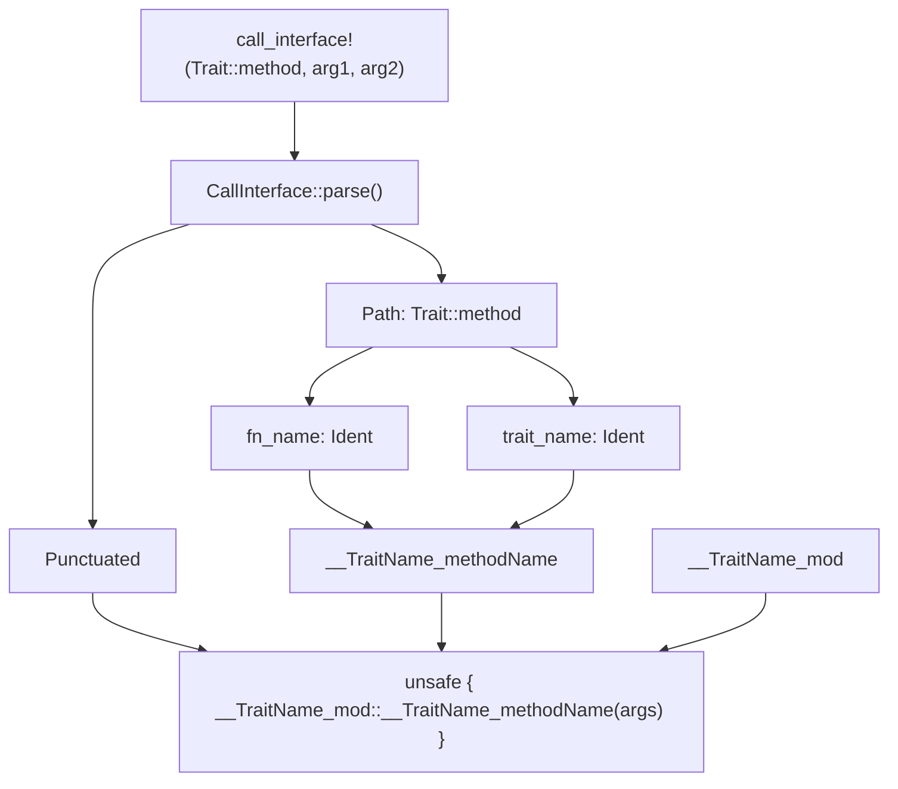
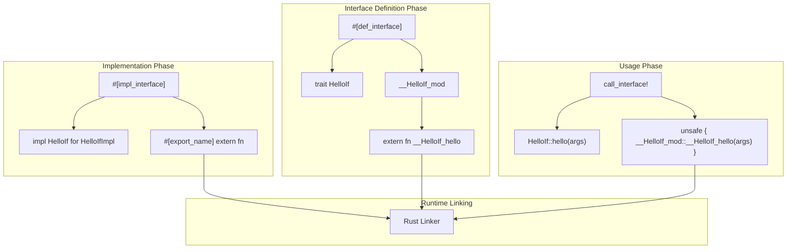

# call_interface Macro

> **Relevant source files**
> * [README.md](https://github.com/arceos-org/crate_interface/blob/73011a44/README.md)
> * [src/lib.rs](https://github.com/arceos-org/crate_interface/blob/73011a44/src/lib.rs)
> * [tests/test_crate_interface.rs](https://github.com/arceos-org/crate_interface/blob/73011a44/tests/test_crate_interface.rs)

The `call_interface` macro provides a safe wrapper for invoking methods defined by traits marked with `#[def_interface]` and implemented with `#[impl_interface]`. This procedural macro encapsulates unsafe extern function calls, enabling cross-crate trait method invocation without requiring direct dependencies between interface definitions and implementations.

For information about defining interfaces, see [def_interface Macro](/arceos-org/crate_interface/3.1-def_interface-macro). For implementing interfaces, see [impl_interface Macro](/arceos-org/crate_interface/3.2-impl_interface-macro).

## Purpose and Functionality

The `call_interface!` macro serves as the consumer-facing component of the crate_interface system. It transforms trait method calls into unsafe extern function invocations that link to implementations across crate boundaries at runtime.

### Basic Syntax Patterns

The macro supports two primary calling conventions:

|Syntax Pattern|Description|Example|
| --- | --- | --- |
|Parenthesized Arguments|Traditional function call syntax|call_interface!(HelloIf::hello("world", 123))|
|Comma-Separated Arguments|Alternative syntax with comma separator|call_interface!(HelloIf::hello, "rust", 456)|
|No Arguments|Function calls without parameters|call_interface!(SimpleIf::foo)|

Sources: [README.md(L30 - L40)&emsp;](https://github.com/arceos-org/crate_interface/blob/73011a44/README.md#L30-L40) [tests/test_crate_interface.rs(L37 - L41)&emsp;](https://github.com/arceos-org/crate_interface/blob/73011a44/tests/test_crate_interface.rs#L37-L41)

## Macro Implementation Architecture

### Call Interface Parsing Structure



Sources: [src/lib.rs(L164 - L184)&emsp;](https://github.com/arceos-org/crate_interface/blob/73011a44/src/lib.rs#L164-L184) [src/lib.rs(L192 - L210)&emsp;](https://github.com/arceos-org/crate_interface/blob/73011a44/src/lib.rs#L192-L210)

### Code Transformation Process

The macro performs a systematic transformation from trait method calls to extern function invocations:

```

```

Sources: [src/lib.rs(L194 - L210)&emsp;](https://github.com/arceos-org/crate_interface/blob/73011a44/src/lib.rs#L194-L210)

## Implementation Details

### CallInterface Structure

The macro uses a custom `CallInterface` struct to parse input tokens:

|Field|Type|Purpose|
| --- | --- | --- |
|path|Path|Contains the trait and method names (e.g.,HelloIf::hello)|
|args|Punctuated<Expr, Token![,]>|Function arguments parsed as expressions|

The parsing logic handles both parenthesized and comma-separated argument formats by checking for different token patterns.

Sources: [src/lib.rs(L164 - L184)&emsp;](https://github.com/arceos-org/crate_interface/blob/73011a44/src/lib.rs#L164-L184)

### Symbol Name Generation

The macro generates extern function names using a consistent naming convention:

```
__<TraitName>_<MethodName>
```

For example, `HelloIf::hello` becomes `__HelloIf_hello`. This naming scheme ensures unique symbol names across the entire linked binary while maintaining predictable resolution patterns.

Sources: [src/lib.rs(L203)&emsp;](https://github.com/arceos-org/crate_interface/blob/73011a44/src/lib.rs#L203-L203)

### Module Path Resolution

Generated extern functions are accessed through hidden modules created by `#[def_interface]`:

```
__<TraitName>_mod::<ExternFunctionName>
```

This module structure provides namespace isolation and enables the linker to resolve symbols correctly across crate boundaries.

Sources: [src/lib.rs(L205 - L209)&emsp;](https://github.com/arceos-org/crate_interface/blob/73011a44/src/lib.rs#L205-L209)

## Usage Patterns and Examples

### Standard Method Calls

The most common usage pattern involves calling trait methods with arguments:

```javascript
// Interface definition (in any crate)
#[def_interface]
trait HelloIf {
    fn hello(&self, name: &str, id: usize) -> String;
}

// Usage (in any other crate)
let result = call_interface!(HelloIf::hello("world", 123));
```

Sources: [README.md(L13 - L18)&emsp;](https://github.com/arceos-org/crate_interface/blob/73011a44/README.md#L13-L18) [README.md(L30 - L35)&emsp;](https://github.com/arceos-org/crate_interface/blob/73011a44/README.md#L30-L35)

### Alternative Calling Syntax

The macro supports comma-separated arguments as an alternative to parenthesized calls:

```
// Both forms are equivalent
call_interface!(HelloIf::hello("rust", 456))
call_interface!(HelloIf::hello, "rust", 456)
```

Sources: [README.md(L36 - L39)&emsp;](https://github.com/arceos-org/crate_interface/blob/73011a44/README.md#L36-L39)

### Static Method Calls

Methods without `&self` parameters (static methods) are supported:

```javascript
let value = call_interface!(SimpleIf::foo);
```

Sources: [tests/test_crate_interface.rs(L39)&emsp;](https://github.com/arceos-org/crate_interface/blob/73011a44/tests/test_crate_interface.rs#L39-L39)

### Cross-Module Usage

The macro works correctly when called from within modules or different crate contexts:

```java
mod private {
    pub fn test_call_in_mod() {
        crate::call_interface!(super::SimpleIf::bar(123, &[2, 3, 5, 7, 11], "test"));
        crate::call_interface!(crate::SimpleIf::foo,);
    }
}
```

Sources: [tests/test_crate_interface.rs(L29 - L34)&emsp;](https://github.com/arceos-org/crate_interface/blob/73011a44/tests/test_crate_interface.rs#L29-L34)

## Safety and Runtime Behavior

### Unsafe Encapsulation

The `call_interface!` macro encapsulates unsafe extern function calls, providing a safer interface while maintaining the underlying performance characteristics. The generated code always uses `unsafe` blocks because extern function calls are inherently unsafe in Rust.

### Link-Time Symbol Resolution

The macro relies on the Rust linker to resolve extern function symbols at link time. If an implementation is not linked into the final binary, the program will fail to link rather than producing runtime errors.

### Runtime Assumptions

The macro assumes that:

* The target trait was defined with `#[def_interface]`
* An implementation exists and was compiled with `#[impl_interface]`
* All required crates are linked together in the final binary

Sources: [src/lib.rs(L209)&emsp;](https://github.com/arceos-org/crate_interface/blob/73011a44/src/lib.rs#L209-L209) [README.md(L80 - L85)&emsp;](https://github.com/arceos-org/crate_interface/blob/73011a44/README.md#L80-L85)

## Integration with Interface System

### Relationship to Other Macros



Sources: [src/lib.rs(L186 - L210)&emsp;](https://github.com/arceos-org/crate_interface/blob/73011a44/src/lib.rs#L186-L210) [README.md(L42 - L85)&emsp;](https://github.com/arceos-org/crate_interface/blob/73011a44/README.md#L42-L85)

The `call_interface!` macro completes the interface system by providing the consumer interface that connects to implementations through the linker's symbol resolution mechanism.