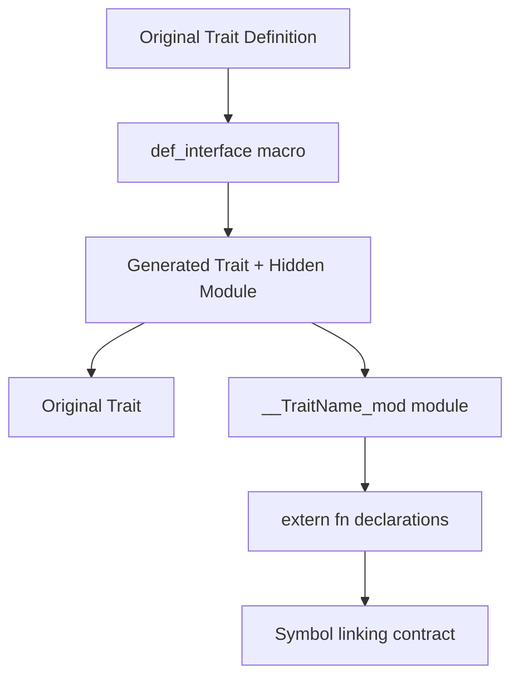
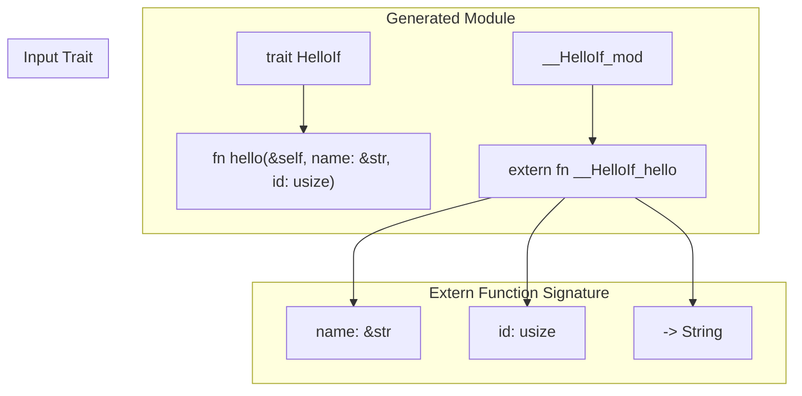
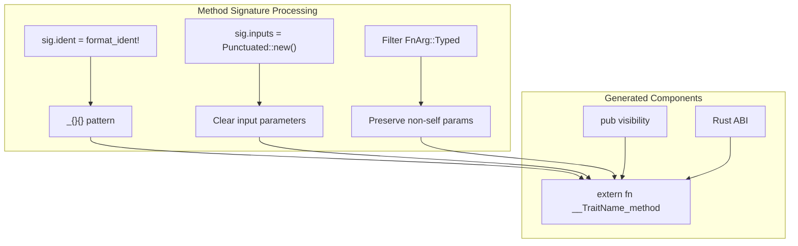
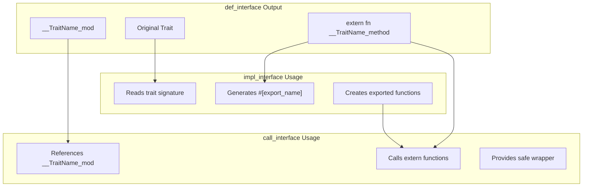

# def_interface Macro

> **Relevant source files**
> * [README.md](https://github.com/arceos-org/crate_interface/blob/73011a44/README.md)
> * [src/lib.rs](https://github.com/arceos-org/crate_interface/blob/73011a44/src/lib.rs)
> * [tests/test_crate_interface.rs](https://github.com/arceos-org/crate_interface/blob/73011a44/tests/test_crate_interface.rs)

The `def_interface` macro is a procedural attribute macro that transforms trait definitions to enable cross-crate implementations without circular dependencies. It generates extern function declarations that serve as the linking contract between trait definitions and their implementations across crate boundaries.

For information about implementing these interfaces, see [impl_interface Macro](/arceos-org/crate_interface/3.2-impl_interface-macro). For calling interface methods, see [call_interface Macro](/arceos-org/crate_interface/3.3-call_interface-macro).

## Purpose and Functionality

The `def_interface` macro solves the circular dependency problem in Rust by creating a trait interface that can be implemented in any crate. When applied to a trait definition, it generates both the original trait and a hidden module containing extern function declarations that correspond to each trait method.



**def_interface Macro Processing Flow**

Sources: [src/lib.rs(L28 - L75)&emsp;](https://github.com/arceos-org/crate_interface/blob/73011a44/src/lib.rs#L28-L75) [README.md(L14 - L18)&emsp;](https://github.com/arceos-org/crate_interface/blob/73011a44/README.md#L14-L18)

## Syntax and Usage

The macro is applied as an attribute above trait definitions with no additional parameters:

```rust
#[crate_interface::def_interface]
pub trait TraitName {
    fn method_name(&self, param: Type) -> ReturnType;
}
```

The macro accepts only empty attributes and will generate a compile error if any parameters are provided.

Sources: [src/lib.rs(L29 - L34)&emsp;](https://github.com/arceos-org/crate_interface/blob/73011a44/src/lib.rs#L29-L34) [tests/test_crate_interface.rs(L3 - L11)&emsp;](https://github.com/arceos-org/crate_interface/blob/73011a44/tests/test_crate_interface.rs#L3-L11)

## Generated Code Structure

When `def_interface` processes a trait, it generates two main components:

### 1. Original Trait Preservation

The original trait definition is preserved unchanged, maintaining all method signatures, documentation, and attributes.

### 2. Hidden Module Generation

A hidden module is created with the naming pattern `__TraitName_mod` containing extern function declarations.



**Code Generation Structure for def_interface**

Sources: [src/lib.rs(L36 - L74)&emsp;](https://github.com/arceos-org/crate_interface/blob/73011a44/src/lib.rs#L36-L74) [README.md(L47 - L58)&emsp;](https://github.com/arceos-org/crate_interface/blob/73011a44/README.md#L47-L58)

## Function Signature Transformation

The macro transforms trait method signatures into extern function signatures by:

1. **Name Transformation**: Method names become `__TraitName_methodName`
2. **Self Parameter Removal**: The `&self` parameter is stripped from extern signatures
3. **Parameter Preservation**: All typed parameters are preserved in their original order



**Function Signature Transformation Process**

Sources: [src/lib.rs(L40 - L58)&emsp;](https://github.com/arceos-org/crate_interface/blob/73011a44/src/lib.rs#L40-L58)

## Module Structure and Visibility

The generated module follows a specific structure:

|Component|Pattern|Purpose|
| --- | --- | --- |
|Module Name|__TraitName_mod|Hidden module containing extern declarations|
|Module Visibility|Inherits from trait|Matches original trait visibility|
|Module Attributes|#[doc(hidden)],#[allow(non_snake_case)]|Hide from documentation, allow naming convention|
|Extern Block|extern "Rust"|Rust ABI for cross-crate linking|

The module includes a `use super::*;` statement to inherit the parent scope, ensuring type definitions remain accessible.

Sources: [src/lib.rs(L61 - L73)&emsp;](https://github.com/arceos-org/crate_interface/blob/73011a44/src/lib.rs#L61-L73)

## Integration with Other Macros

The `def_interface` macro creates the foundation for the other two macros in the system:



**Macro System Integration**

Sources: [src/lib.rs(L88 - L162)&emsp;](https://github.com/arceos-org/crate_interface/blob/73011a44/src/lib.rs#L88-L162) [src/lib.rs(L193 - L210)&emsp;](https://github.com/arceos-org/crate_interface/blob/73011a44/src/lib.rs#L193-L210)

## Error Handling and Validation

The macro performs several validation checks:

1. **Attribute Validation**: Ensures no parameters are provided
2. **Trait Item Processing**: Only processes `TraitItem::Fn` items
3. **Method Signature Extraction**: Safely extracts method signatures and parameters

Invalid usage results in compile-time errors with descriptive messages.

Sources: [src/lib.rs(L29 - L34)&emsp;](https://github.com/arceos-org/crate_interface/blob/73011a44/src/lib.rs#L29-L34) [src/lib.rs(L14 - L16)&emsp;](https://github.com/arceos-org/crate_interface/blob/73011a44/src/lib.rs#L14-L16)

## Examples and Test Cases

The test suite demonstrates various usage patterns:

```rust
#[def_interface]
trait SimpleIf {
    fn foo() -> u32 { 123 }
    fn bar(&self, a: u16, b: &[u8], c: &str);
}
```

This generates:

* The original `SimpleIf` trait
* Module `__SimpleIf_mod` with extern declarations
* Functions `__SimpleIf_foo` and `__SimpleIf_bar`

Sources: [tests/test_crate_interface.rs(L3 - L11)&emsp;](https://github.com/arceos-org/crate_interface/blob/73011a44/tests/test_crate_interface.rs#L3-L11) [README.md(L14 - L18)&emsp;](https://github.com/arceos-org/crate_interface/blob/73011a44/README.md#L14-L18)

## Technical Implementation Details

The macro implementation uses several key Rust procedural macro components:

|Component|Purpose|Usage|
| --- | --- | --- |
|syn::ItemTrait|Parse trait definitions|Input parsing|
|format_ident!|Generate identifiers|Name transformation|
|quote!|Code generation|Output synthesis|
|proc_macro2::Span|Error reporting|Compile-time diagnostics|

The generated code uses `extern "Rust"` blocks to leverage Rust's symbol mangling and linking behavior, enabling cross-crate function resolution without runtime overhead.

Sources: [src/lib.rs(L3 - L12)&emsp;](https://github.com/arceos-org/crate_interface/blob/73011a44/src/lib.rs#L3-L12) [src/lib.rs(L36 - L74)&emsp;](https://github.com/arceos-org/crate_interface/blob/73011a44/src/lib.rs#L36-L74)