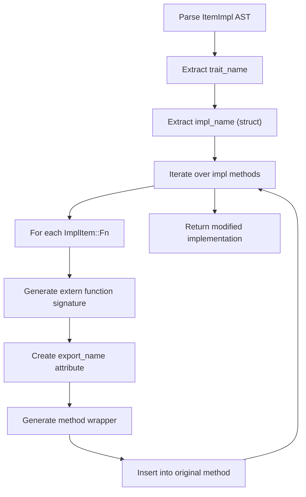
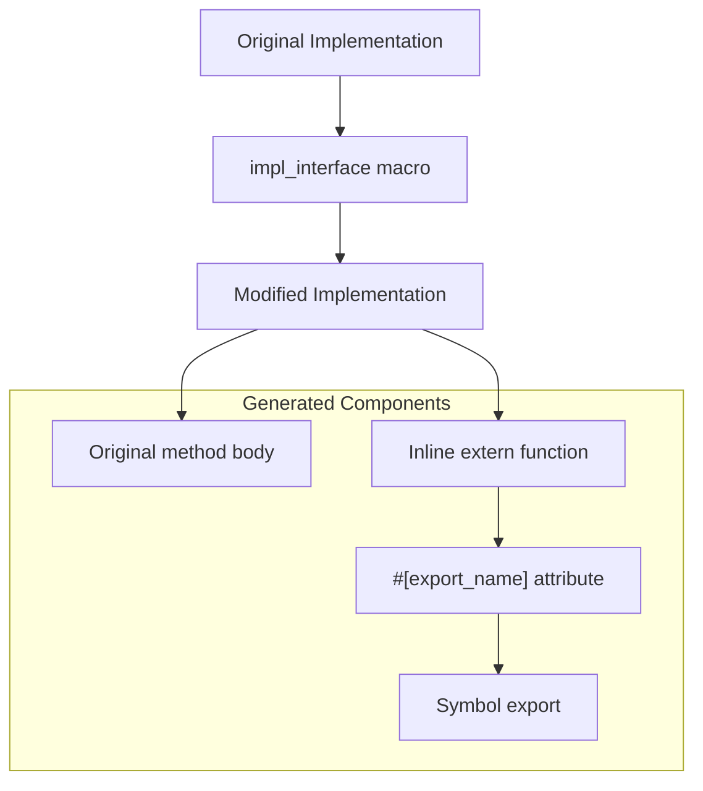
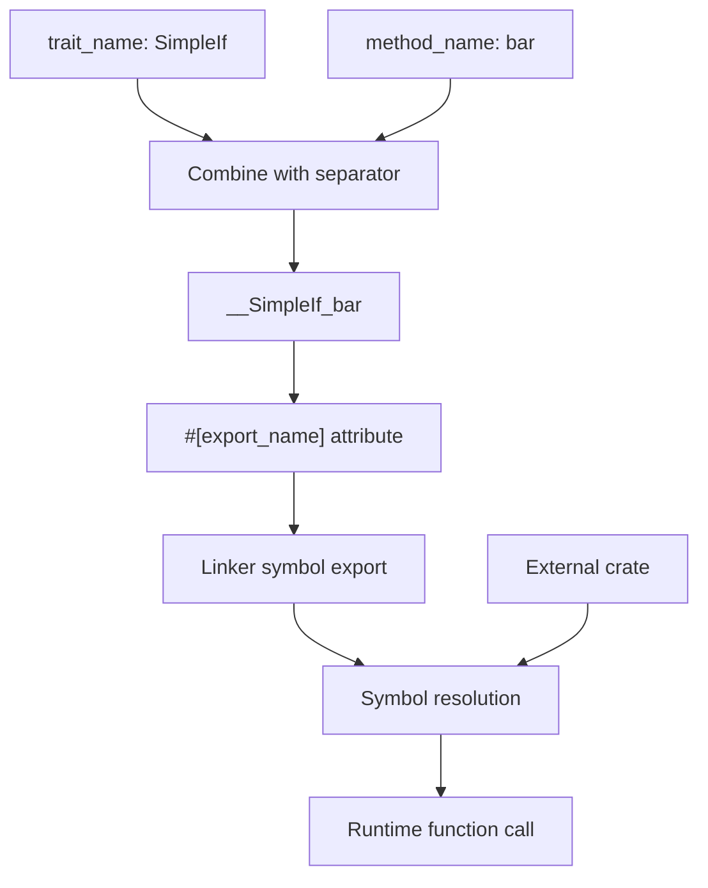
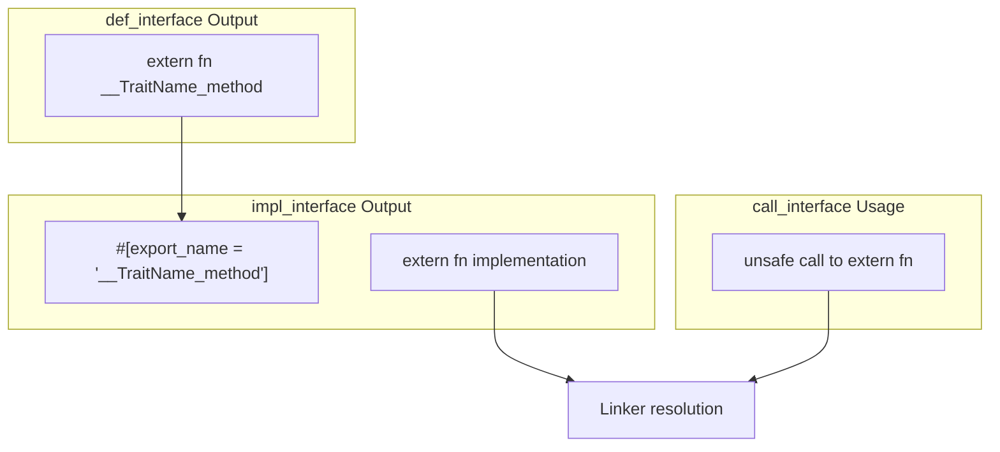

# impl_interface Macro

> **Relevant source files**
> * [README.md](https://github.com/arceos-org/crate_interface/blob/73011a44/README.md)
> * [src/lib.rs](https://github.com/arceos-org/crate_interface/blob/73011a44/src/lib.rs)
> * [tests/test_crate_interface.rs](https://github.com/arceos-org/crate_interface/blob/73011a44/tests/test_crate_interface.rs)

The `impl_interface` macro enables trait implementations to be used across crate boundaries by generating exported extern functions that can be linked at runtime. This macro transforms a standard trait implementation into a cross-crate compatible implementation by creating symbol exports that follow the interface contract established by `def_interface`.

For information about defining interfaces, see [def_interface Macro](/arceos-org/crate_interface/3.1-def_interface-macro). For information about calling cross-crate interfaces, see [call_interface Macro](/arceos-org/crate_interface/3.3-call_interface-macro).

## Purpose and Functionality

The `impl_interface` macro serves as the implementation phase of the three-macro system. It takes a trait implementation and automatically generates the necessary extern function exports that can be linked to by other crates, eliminating the need for direct crate dependencies while maintaining type safety.

**Core Functions:**

* Parses trait implementations and extracts method signatures
* Generates `#[export_name]` extern functions for each trait method
* Maintains original implementation logic while adding cross-crate compatibility
* Handles both instance methods (`&self`) and static methods

Sources: [src/lib.rs(L77 - L86)&emsp;](https://github.com/arceos-org/crate_interface/blob/73011a44/src/lib.rs#L77-L86) [README.md(L20 - L28)&emsp;](https://github.com/arceos-org/crate_interface/blob/73011a44/README.md#L20-L28)

## Syntax and Usage

The macro is applied as an attribute to trait implementations:

```
#[impl_interface]
impl TraitName for StructName {
    // method implementations
}
```

The macro requires:

* A trait implementation (not a standalone impl block)
* The trait must be previously defined with `#[def_interface]`
* The implementation struct must be a named type (not anonymous)

**Usage Example from Tests:**

```rust
#[impl_interface]
impl SimpleIf for SimpleIfImpl {
    fn foo() -> u32 { 456 }
    fn bar(&self, a: u16, b: &[u8], c: &str) { /* implementation */ }
}
```

Sources: [tests/test_crate_interface.rs(L15 - L27)&emsp;](https://github.com/arceos-org/crate_interface/blob/73011a44/tests/test_crate_interface.rs#L15-L27) [src/lib.rs(L87 - L94)&emsp;](https://github.com/arceos-org/crate_interface/blob/73011a44/src/lib.rs#L87-L94)

## Code Generation Process

### Implementation Analysis Flow



The macro performs the following transformations:

1. **Parse Implementation**: Extracts trait name and implementing struct name from the AST
2. **Method Processing**: For each method in the implementation, generates corresponding extern functions
3. **Signature Transformation**: Removes `self` parameter from extern function signatures while preserving other parameters
4. **Export Generation**: Creates `#[export_name]` attributes following the `__TraitName_methodName` convention
5. **Wrapper Injection**: Injects the extern function into the original method implementation

Sources: [src/lib.rs(L96 - L107)&emsp;](https://github.com/arceos-org/crate_interface/blob/73011a44/src/lib.rs#L96-L107) [src/lib.rs(L108 - L161)&emsp;](https://github.com/arceos-org/crate_interface/blob/73011a44/src/lib.rs#L108-L161)

### Generated Code Structure



Sources: [src/lib.rs(L140 - L157)&emsp;](https://github.com/arceos-org/crate_interface/blob/73011a44/src/lib.rs#L140-L157) [README.md(L62 - L78)&emsp;](https://github.com/arceos-org/crate_interface/blob/73011a44/README.md#L62-L78)

## Method Signature Processing

The macro handles two types of method signatures differently:

### Instance Methods (with&self)

For methods that take `&self` as the first parameter:

1. **Extern Function**: Removes `&self` from the signature
2. **Call Generation**: Creates an instance of the implementing struct and calls the method on it
3. **Parameter Forwarding**: Passes all non-self parameters to the method call

**Generated Pattern:**

```javascript
#[export_name = "__TraitName_methodName"]
extern "Rust" fn __TraitName_methodName(/* params without self */) -> ReturnType {
    let _impl: StructName = StructName;
    _impl.methodName(/* params */)
}
```

### Static Methods (no&self)

For static methods that don't take `&self`:

1. **Direct Call**: Calls the static method directly on the implementing type
2. **Parameter Preservation**: Maintains all original parameters in the extern function

**Generated Pattern:**

```rust
#[export_name = "__TraitName_methodName"]
extern "Rust" fn __TraitName_methodName(/* all params */) -> ReturnType {
    StructName::methodName(/* params */)
}
```

Sources: [src/lib.rs(L119 - L138)&emsp;](https://github.com/arceos-org/crate_interface/blob/73011a44/src/lib.rs#L119-L138) [tests/test_crate_interface.rs(L18 - L26)&emsp;](https://github.com/arceos-org/crate_interface/blob/73011a44/tests/test_crate_interface.rs#L18-L26)

## Symbol Export Mechanism

### Export Name Generation



The naming convention `__TraitName_methodName` ensures:

* **Uniqueness**: Prevents symbol collisions across different traits
* **Consistency**: Matches the naming pattern expected by `def_interface`
* **Linkability**: Creates symbols that the Rust linker can resolve across crates

Sources: [src/lib.rs(L113 - L116)&emsp;](https://github.com/arceos-org/crate_interface/blob/73011a44/src/lib.rs#L113-L116) [src/lib.rs(L148)&emsp;](https://github.com/arceos-org/crate_interface/blob/73011a44/src/lib.rs#L148-L148)

## Integration with Macro System

### Cross-Macro Coordination



The `impl_interface` macro must coordinate with the other macros:

1. **Symbol Contract**: Must export functions with names matching `def_interface` declarations
2. **Type Compatibility**: Generated extern functions must match the signatures expected by `call_interface`
3. **Linking Requirements**: Exported symbols must be available at link time for consuming crates

Sources: [src/lib.rs(L203 - L209)&emsp;](https://github.com/arceos-org/crate_interface/blob/73011a44/src/lib.rs#L203-L209) [README.md(L52 - L58)&emsp;](https://github.com/arceos-org/crate_interface/blob/73011a44/README.md#L52-L58)

## Error Handling and Validation

The macro performs several validation checks:

**Input Validation:**

* Ensures the attribute has no parameters: `#[impl_interface]` only
* Verifies the target is a trait implementation, not a standalone impl block
* Requires the implementing type to be a named struct (not anonymous)

**Error Cases:**

```css
// Invalid: attribute parameters
#[impl_interface(param)]  // Compile error

// Invalid: not a trait implementation  
#[impl_interface]
impl SomeStruct { }  // Compile error

// Invalid: anonymous type
#[impl_interface] 
impl SomeTrait for (u32, String) { }  // Compile error
```

Sources: [src/lib.rs(L88 - L94)&emsp;](https://github.com/arceos-org/crate_interface/blob/73011a44/src/lib.rs#L88-L94) [src/lib.rs(L99 - L106)&emsp;](https://github.com/arceos-org/crate_interface/blob/73011a44/src/lib.rs#L99-L106)

## Complete Transformation Example

**Input Code:**

```rust
#[impl_interface]
impl SimpleIf for SimpleIfImpl {
    fn bar(&self, a: u16, b: &[u8], c: &str) {
        println!("{} {:?} {}", a, b, c);
    }
}
```

**Generated Output (Conceptual):**

```javascript
impl SimpleIf for SimpleIfImpl {
    #[inline]
    fn bar(&self, a: u16, b: &[u8], c: &str) {
        {
            #[inline]
            #[export_name = "__SimpleIf_bar"]
            extern "Rust" fn __SimpleIf_bar(a: u16, b: &[u8], c: &str) {
                let _impl: SimpleIfImpl = SimpleIfImpl;
                _impl.bar(a, b, c)
            }
        }
        {
            println!("{} {:?} {}", a, b, c);
        }
    }
}
```

This transformation enables the implementation to be called from any crate that links to this one, without requiring direct dependency relationships.

Sources: [README.md(L62 - L78)&emsp;](https://github.com/arceos-org/crate_interface/blob/73011a44/README.md#L62-L78) [tests/test_crate_interface.rs(L23 - L26)&emsp;](https://github.com/arceos-org/crate_interface/blob/73011a44/tests/test_crate_interface.rs#L23-L26)