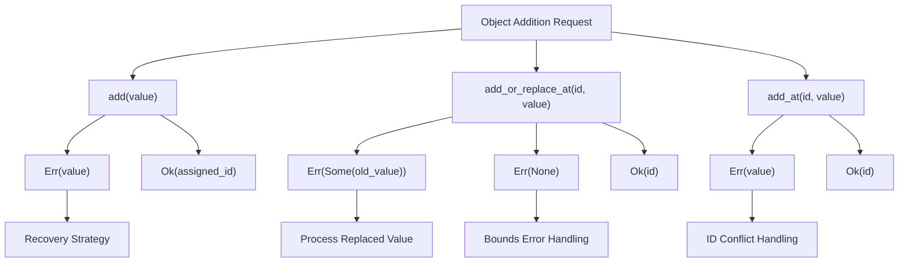
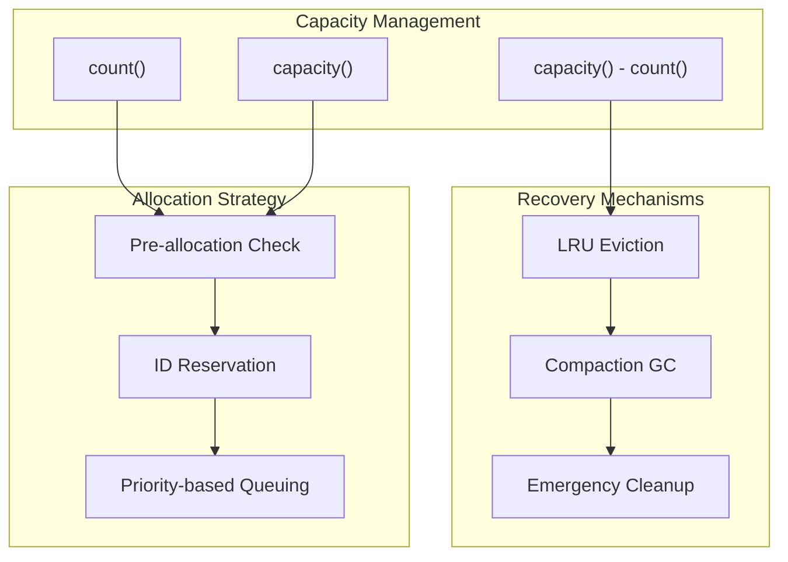
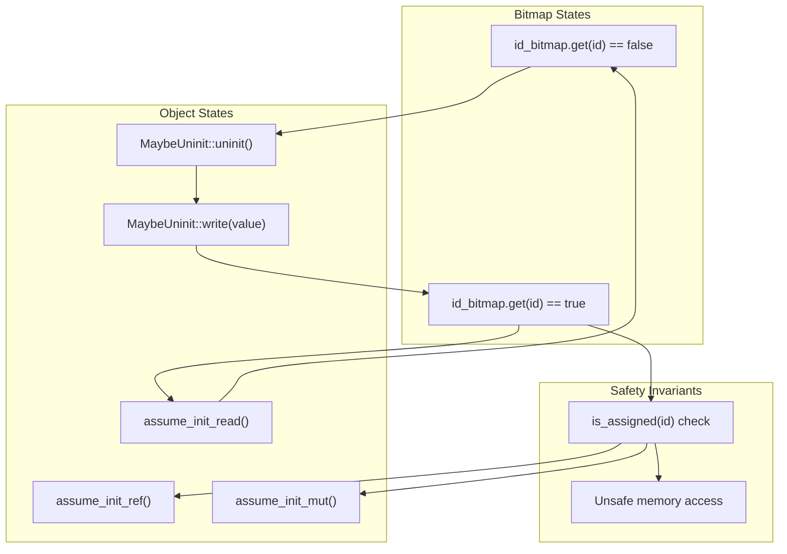
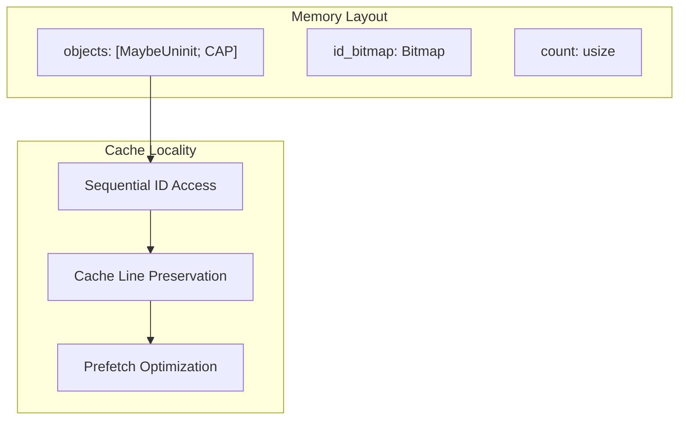
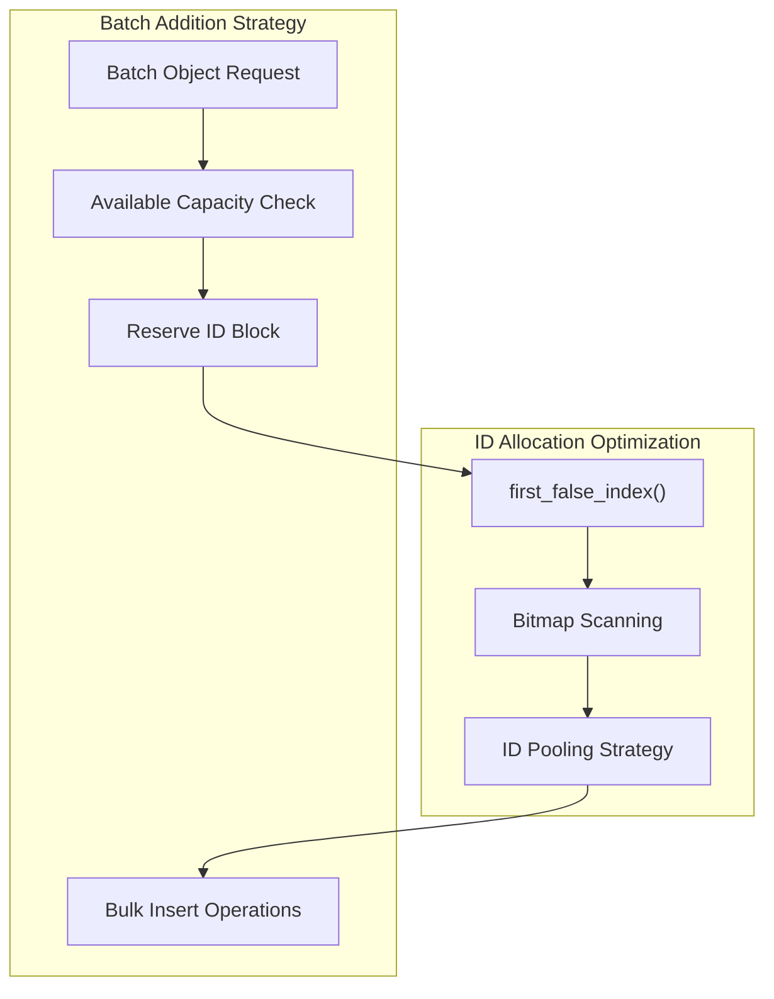
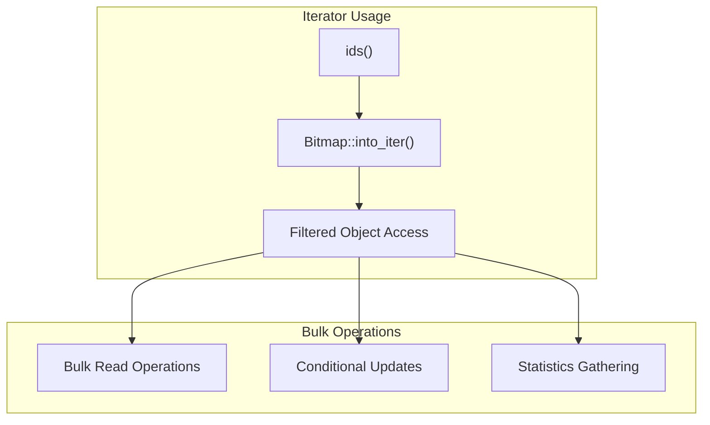
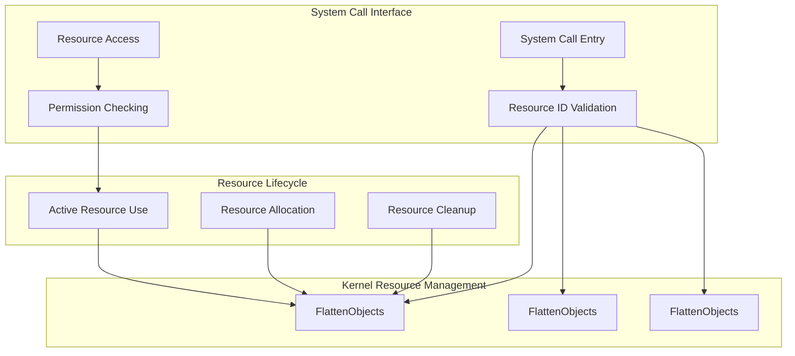
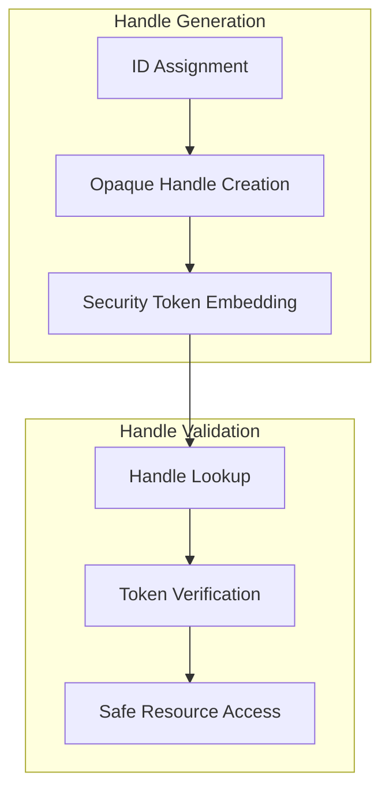
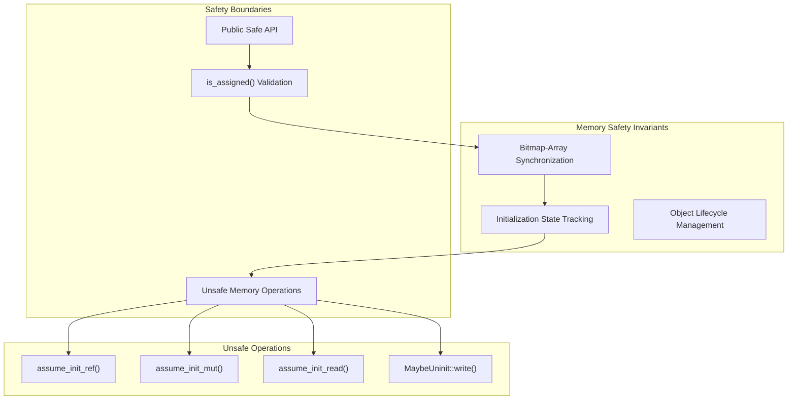
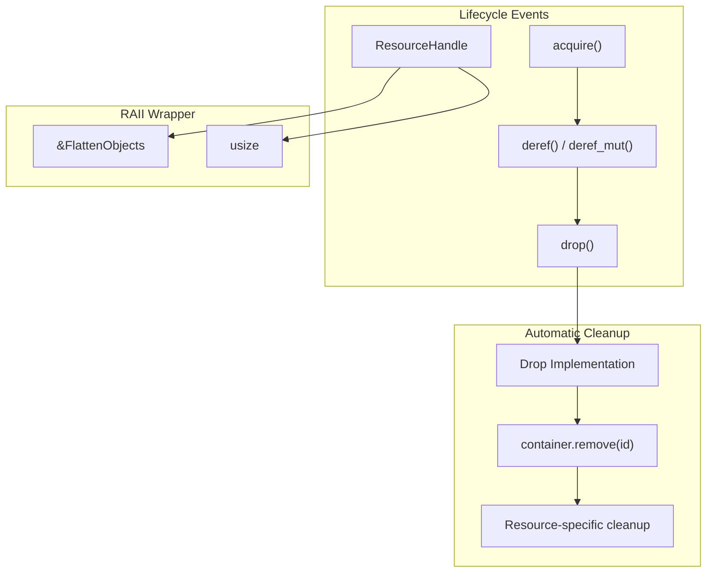

# Advanced Patterns and Best Practices

> **Relevant source files**
> * [README.md](https://github.com/arceos-org/flatten_objects/blob/ac0a74b9/README.md)
> * [src/lib.rs](https://github.com/arceos-org/flatten_objects/blob/ac0a74b9/src/lib.rs)

This document covers advanced usage patterns, error handling strategies, and integration techniques for the `FlattenObjects` container in resource-constrained and kernel environments. It focuses on production-ready patterns beyond basic operations.

For basic container operations and initialization, see [Basic Operations](/arceos-org/flatten_objects/4.1-basic-operations). For implementation details of the underlying data structures, see [Implementation Details](/arceos-org/flatten_objects/3-implementation-details).

## Error Handling Strategies

The `FlattenObjects` API provides different error handling mechanisms depending on the operation semantics. Understanding these patterns is crucial for robust system integration.

### Capacity-Aware Addition Patterns

The container provides three distinct addition methods with different error semantics:



**Pattern 1: Graceful Degradation with Automatic ID Assignment**

```
// Pattern for systems that can fallback to alternative storage
match container.add(expensive_object) {
    Ok(id) => {
        // Store ID for later retrieval
        register_object_id(id);
    }
    Err(object) => {
        // Container full - fallback to alternative storage
        fallback_storage.store(object);
    }
}
```

**Pattern 2: Pre-validation for Specific ID Assignment**

```
// Pattern for systems with predetermined ID requirements
if container.is_assigned(required_id) {
    return Err(IdAlreadyAssigned(required_id));
}
match container.add_at(required_id, object) {
    Ok(id) => process_success(id),
    Err(object) => {
        // This should not happen if pre-validation succeeded
        panic!("Unexpected ID assignment failure");
    }
}
```

Sources: [src/lib.rs(L222 - L232)&emsp;](https://github.com/arceos-org/flatten_objects/blob/ac0a74b9/src/lib.rs#L222-L232) [src/lib.rs(L249 - L257)&emsp;](https://github.com/arceos-org/flatten_objects/blob/ac0a74b9/src/lib.rs#L249-L257) [src/lib.rs(L277 - L297)&emsp;](https://github.com/arceos-org/flatten_objects/blob/ac0a74b9/src/lib.rs#L277-L297)

### Resource Exhaustion Handling

The 1024 capacity limit requires careful resource management:



Sources: [src/lib.rs(L99 - L101)&emsp;](https://github.com/arceos-org/flatten_objects/blob/ac0a74b9/src/lib.rs#L99-L101) [src/lib.rs(L122 - L124)&emsp;](https://github.com/arceos-org/flatten_objects/blob/ac0a74b9/src/lib.rs#L122-L124) [src/lib.rs(L77 - L84)&emsp;](https://github.com/arceos-org/flatten_objects/blob/ac0a74b9/src/lib.rs#L77-L84)

## Memory Management Patterns

### Zero-Copy Object Lifecycle

The `MaybeUninit<T>` backing storage enables zero-copy patterns critical for kernel environments:



**Pattern: In-Place Modification**

For large objects where copying is expensive, use `get_mut` for in-place modifications:

```javascript
// Efficient pattern for large object updates
if let Some(large_object) = container.get_mut(object_id) {
    large_object.update_field_efficiently();
    large_object.perform_in_place_operation();
}
```

Sources: [src/lib.rs(L48 - L51)&emsp;](https://github.com/arceos-org/flatten_objects/blob/ac0a74b9/src/lib.rs#L48-L51) [src/lib.rs(L194 - L202)&emsp;](https://github.com/arceos-org/flatten_objects/blob/ac0a74b9/src/lib.rs#L194-L202) [src/lib.rs(L79)&emsp;](https://github.com/arceos-org/flatten_objects/blob/ac0a74b9/src/lib.rs#L79-L79)

### Memory Layout Optimization

The fixed-size array layout provides predictable memory access patterns:



Sources: [src/lib.rs(L44 - L51)&emsp;](https://github.com/arceos-org/flatten_objects/blob/ac0a74b9/src/lib.rs#L44-L51)

## Performance Optimization Techniques

### Batch Operations Pattern

For systems that need to add multiple objects efficiently:



**Implementation Pattern:**

```javascript
// Efficient batch addition with pre-validation
let required_capacity = objects_to_add.len();
if container.count() + required_capacity > container.capacity() {
    return Err(InsufficientCapacity);
}

let mut assigned_ids = Vec::with_capacity(required_capacity);
for object in objects_to_add {
    match container.add(object) {
        Ok(id) => assigned_ids.push(id),
        Err(_) => {
            // Should not happen due to pre-validation
            // Cleanup already assigned objects
            for &cleanup_id in &assigned_ids {
                container.remove(cleanup_id);
            }
            return Err(BatchAdditionFailed);
        }
    }
}
```

Sources: [src/lib.rs(L223 - L224)&emsp;](https://github.com/arceos-org/flatten_objects/blob/ac0a74b9/src/lib.rs#L223-L224) [src/lib.rs(L222 - L232)&emsp;](https://github.com/arceos-org/flatten_objects/blob/ac0a74b9/src/lib.rs#L222-L232)

### Iterator-Based Access Patterns

The `ids()` iterator enables efficient bulk operations:



Sources: [src/lib.rs(L344 - L346)&emsp;](https://github.com/arceos-org/flatten_objects/blob/ac0a74b9/src/lib.rs#L344-L346) [src/lib.rs(L328 - L347)&emsp;](https://github.com/arceos-org/flatten_objects/blob/ac0a74b9/src/lib.rs#L328-L347)

## Kernel Integration Patterns

### Resource Table Implementation

`FlattenObjects` is commonly used to implement kernel resource tables:



**Kernel Pattern: Process Management**

```javascript
// Kernel process table implementation
pub struct ProcessManager {
    processes: FlattenObjects<ProcessDescriptor, 1024>,
}

impl ProcessManager {
    pub fn create_process(&mut self, executable: &Path) -> Result<ProcessId, ProcessError> {
        let process = ProcessDescriptor::new(executable)?;
        match self.processes.add(process) {
            Ok(pid) => Ok(ProcessId(pid)),
            Err(_) => Err(ProcessError::ProcessLimitExceeded),
        }
    }
    
    pub fn get_process(&self, pid: ProcessId) -> Option<&ProcessDescriptor> {
        self.processes.get(pid.0)
    }
}
```

Sources: [src/lib.rs(L44 - L51)&emsp;](https://github.com/arceos-org/flatten_objects/blob/ac0a74b9/src/lib.rs#L44-L51) [src/lib.rs(L32)&emsp;](https://github.com/arceos-org/flatten_objects/blob/ac0a74b9/src/lib.rs#L32-L32)

### Handle Table Pattern

For systems requiring opaque handle management:



Sources: [src/lib.rs(L164 - L173)&emsp;](https://github.com/arceos-org/flatten_objects/blob/ac0a74b9/src/lib.rs#L164-L173) [src/lib.rs(L144 - L146)&emsp;](https://github.com/arceos-org/flatten_objects/blob/ac0a74b9/src/lib.rs#L144-L146)

## Safety and Correctness Patterns

### Unsafe Code Encapsulation

The library encapsulates unsafe operations behind safe interfaces:



**Critical Safety Pattern:**

The library maintains the invariant that `id_bitmap.get(id) == true` if and only if `objects[id]` contains an initialized value. This enables safe access through the public API.

Sources: [src/lib.rs(L165 - L172)&emsp;](https://github.com/arceos-org/flatten_objects/blob/ac0a74b9/src/lib.rs#L165-L172) [src/lib.rs(L195 - L201)&emsp;](https://github.com/arceos-org/flatten_objects/blob/ac0a74b9/src/lib.rs#L195-L201) [src/lib.rs(L283 - L286)&emsp;](https://github.com/arceos-org/flatten_objects/blob/ac0a74b9/src/lib.rs#L283-L286) [src/lib.rs(L316 - L325)&emsp;](https://github.com/arceos-org/flatten_objects/blob/ac0a74b9/src/lib.rs#L316-L325)

### Const-Correctness in No-Std

The `const fn new()` pattern enables compile-time initialization:

```rust
// Static allocation pattern for kernel use
static GLOBAL_PROCESS_TABLE: FlattenObjects<ProcessDescriptor, 1024> = 
    FlattenObjects::new();

// Boot-time initialization
static mut INITIALIZED: bool = false;

pub fn init_process_system() {
    unsafe {
        if !INITIALIZED {
            // Perform additional initialization if needed
            INITIALIZED = true;
        }
    }
}
```

Sources: [src/lib.rs(L77 - L84)&emsp;](https://github.com/arceos-org/flatten_objects/blob/ac0a74b9/src/lib.rs#L77-L84) [src/lib.rs(L32)&emsp;](https://github.com/arceos-org/flatten_objects/blob/ac0a74b9/src/lib.rs#L32-L32)

## Resource Lifecycle Management

### RAII Integration Pattern

For automatic resource cleanup in kernel contexts:



**RAII Implementation Pattern:**

```typescript
pub struct ResourceHandle<'a, T> {
    container: &'a mut FlattenObjects<T, 1024>,
    id: usize,
}

impl<'a, T> Drop for ResourceHandle<'a, T> {
    fn drop(&mut self) {
        // Automatic cleanup when handle goes out of scope
        if let Some(resource) = self.container.remove(self.id) {
            // Perform resource-specific cleanup
            cleanup_resource(resource);
        }
    }
}

impl<'a, T> Deref for ResourceHandle<'a, T> {
    type Target = T;
    
    fn deref(&self) -> &Self::Target {
        self.container.get(self.id)
            .expect("Handle invariant violated")
    }
}
```

Sources: [src/lib.rs(L315 - L326)&emsp;](https://github.com/arceos-org/flatten_objects/blob/ac0a74b9/src/lib.rs#L315-L326) [src/lib.rs(L164 - L173)&emsp;](https://github.com/arceos-org/flatten_objects/blob/ac0a74b9/src/lib.rs#L164-L173)