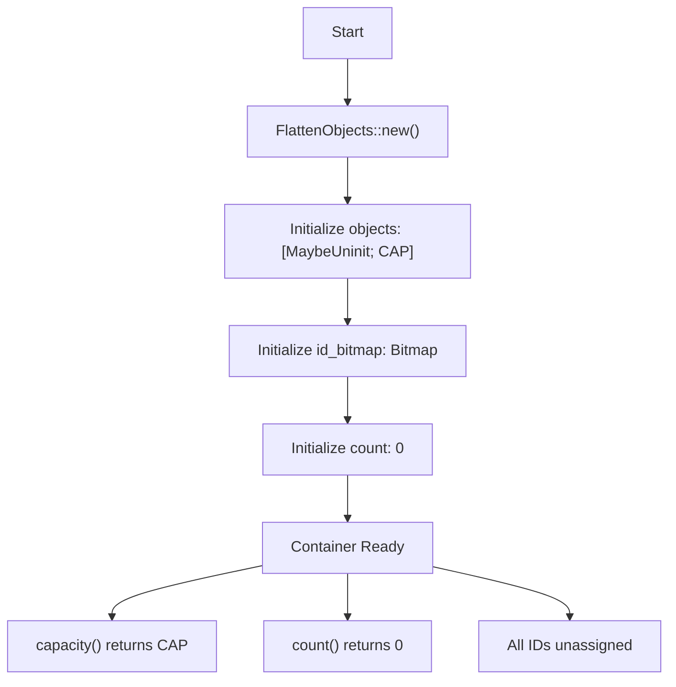
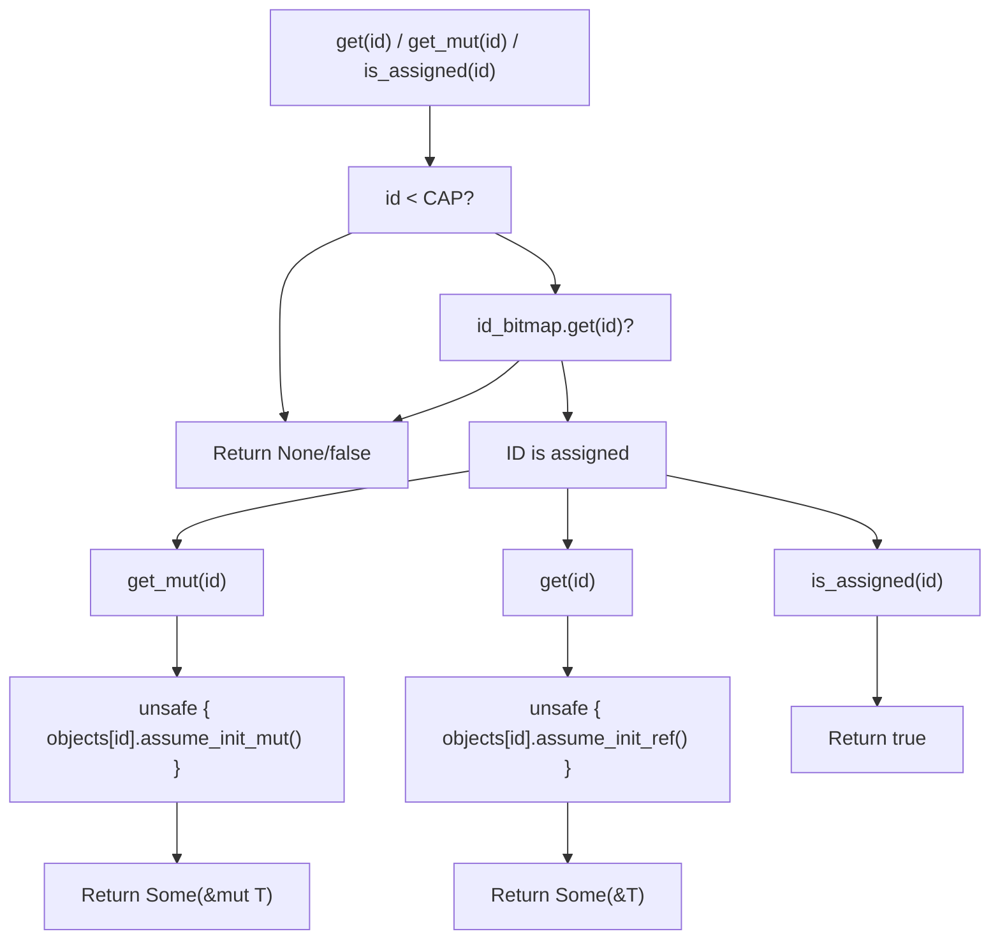
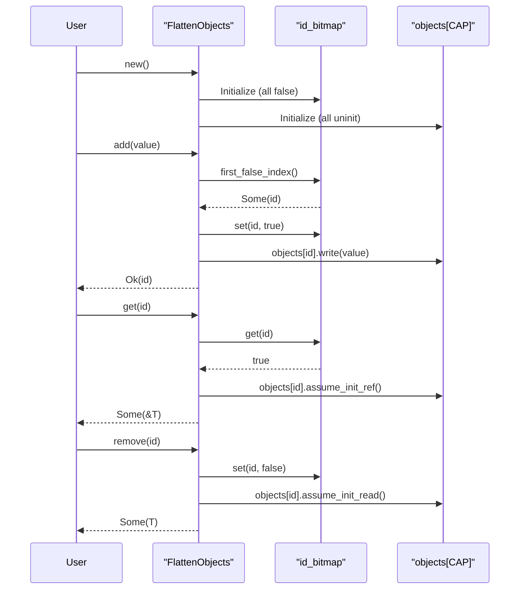

# Basic Operations

> **Relevant source files**
> * [README.md](https://github.com/arceos-org/flatten_objects/blob/ac0a74b9/README.md)
> * [src/lib.rs](https://github.com/arceos-org/flatten_objects/blob/ac0a74b9/src/lib.rs)

This document provides step-by-step examples of the fundamental operations available in the `FlattenObjects` container. It covers container creation, object addition, retrieval, removal, and state querying operations. These examples demonstrate the core functionality needed for most use cases with practical code patterns.

For detailed API documentation, see [FlattenObjects API Documentation](/arceos-org/flatten_objects/2-flattenobjects-api-documentation). For advanced usage patterns and integration strategies, see [Advanced Patterns and Best Practices](/arceos-org/flatten_objects/4.2-advanced-patterns-and-best-practices).

## Container Creation

The first step in using `FlattenObjects` is creating a new container instance. The container requires two generic parameters: the object type `T` and the maximum capacity `CAP`.

```javascript
use flatten_objects::FlattenObjects;

// Create a container that can hold up to 20 u32 values
let mut objects = FlattenObjects::<u32, 20>::new();
```

The `new()` method creates an empty container with zero-initialized internal state. The capacity is fixed at compile time and cannot exceed 1024 objects.

**Container Creation Workflow**



Sources: [src/lib.rs(L77 - L84)&emsp;](https://github.com/arceos-org/flatten_objects/blob/ac0a74b9/src/lib.rs#L77-L84) [src/lib.rs(L44 - L51)&emsp;](https://github.com/arceos-org/flatten_objects/blob/ac0a74b9/src/lib.rs#L44-L51)

## Adding Objects

The `FlattenObjects` container provides three methods for adding objects, each with different ID assignment strategies.

### Automatic ID Assignment withadd()

The `add()` method automatically assigns the smallest available ID to the object:

```javascript
let mut objects = FlattenObjects::<u32, 20>::new();

// Add objects with automatic ID assignment
let id1 = objects.add(23).unwrap();  // Returns 0
let id2 = objects.add(42).unwrap();  // Returns 1  
let id3 = objects.add(100).unwrap(); // Returns 2

assert_eq!(id1, 0);
assert_eq!(id2, 1);
assert_eq!(id3, 2);
```

When the container reaches capacity, `add()` returns `Err(value)` containing the object that couldn't be added.

### Specific ID Assignment withadd_at()

The `add_at()` method allows placing an object at a specific ID:

```javascript
let mut objects = FlattenObjects::<u32, 20>::new();

// Add objects at specific IDs
objects.add_at(5, 23).unwrap();   // Assign ID 5
objects.add_at(10, 42).unwrap();  // Assign ID 10
objects.add_at(0, 100).unwrap();  // Assign ID 0

// Attempting to use an already assigned ID fails
assert_eq!(objects.add_at(5, 999), Err(999));
```

### Replacement withadd_or_replace_at()

The `add_or_replace_at()` method adds an object at a specific ID, optionally replacing any existing object:

```javascript
let mut objects = FlattenObjects::<u32, 20>::new();

// Initial placement
objects.add_or_replace_at(5, 23).unwrap();  // Returns Ok(5)

// Replacement - returns the old value
let result = objects.add_or_replace_at(5, 42);
assert_eq!(result, Err(Some(23)));  // Old value returned
assert_eq!(objects.get(5), Some(&42));  // New value in place
```

**Object Addition State Transitions**

```

```

Sources: [src/lib.rs(L222 - L232)&emsp;](https://github.com/arceos-org/flatten_objects/blob/ac0a74b9/src/lib.rs#L222-L232) [src/lib.rs(L249 - L257)&emsp;](https://github.com/arceos-org/flatten_objects/blob/ac0a74b9/src/lib.rs#L249-L257) [src/lib.rs(L277 - L297)&emsp;](https://github.com/arceos-org/flatten_objects/blob/ac0a74b9/src/lib.rs#L277-L297)

## Retrieving Objects

Objects can be accessed using their assigned IDs through immutable and mutable reference operations.

### Immutable Access withget()

The `get()` method returns an immutable reference to the object at the specified ID:

```javascript
let mut objects = FlattenObjects::<u32, 20>::new();
objects.add_at(5, 42).unwrap();

// Get immutable reference
if let Some(value) = objects.get(5) {
    assert_eq!(*value, 42);
}

// Non-existent ID returns None
assert_eq!(objects.get(10), None);
```

### Mutable Access withget_mut()

The `get_mut()` method returns a mutable reference for in-place modification:

```javascript
let mut objects = FlattenObjects::<u32, 20>::new();
objects.add_at(5, 42).unwrap();

// Modify object in place
if let Some(value) = objects.get_mut(5) {
    *value = 100;
}

assert_eq!(objects.get(5), Some(&100));
```

### Checking Assignment Status withis_assigned()

The `is_assigned()` method checks whether a specific ID has an object assigned:

```javascript
let mut objects = FlattenObjects::<u32, 20>::new();
objects.add_at(5, 42).unwrap();

assert!(objects.is_assigned(5));   // true - ID 5 has an object
assert!(!objects.is_assigned(10)); // false - ID 10 is unassigned
assert!(!objects.is_assigned(25)); // false - ID 25 is out of range
```

**Object Retrieval Operations**



Sources: [src/lib.rs(L165 - L173)&emsp;](https://github.com/arceos-org/flatten_objects/blob/ac0a74b9/src/lib.rs#L165-L173) [src/lib.rs(L194 - L202)&emsp;](https://github.com/arceos-org/flatten_objects/blob/ac0a74b9/src/lib.rs#L194-L202) [src/lib.rs(L144 - L146)&emsp;](https://github.com/arceos-org/flatten_objects/blob/ac0a74b9/src/lib.rs#L144-L146)

## Removing Objects

The `remove()` method extracts an object from the container and frees its ID for reuse:

```javascript
let mut objects = FlattenObjects::<u32, 20>::new();
objects.add_at(5, 42).unwrap();

// Remove and return the object
let removed = objects.remove(5);
assert_eq!(removed, Some(42));

// ID is now available for reuse
assert!(!objects.is_assigned(5));

// Removing again returns None
assert_eq!(objects.remove(5), None);
```

When an object is removed, the ID becomes available for future `add()` operations, following a lowest-ID-first reuse strategy.

**ID Reuse After Removal**

```javascript
let mut objects = FlattenObjects::<u32, 20>::new();

// Fill some IDs
objects.add_at(0, 10).unwrap();
objects.add_at(1, 20).unwrap();
objects.add_at(2, 30).unwrap();

// Remove ID 1
objects.remove(1);

// Next add() will reuse ID 1 (lowest available)
let reused_id = objects.add(999).unwrap();
assert_eq!(reused_id, 1);
```

Sources: [src/lib.rs(L315 - L326)&emsp;](https://github.com/arceos-org/flatten_objects/blob/ac0a74b9/src/lib.rs#L315-L326)

## Querying Container State

The container provides several methods to inspect its current state and metadata.

### Capacity and Count

```javascript
let mut objects = FlattenObjects::<u32, 20>::new();

assert_eq!(objects.capacity(), 20);  // Maximum capacity
assert_eq!(objects.count(), 0);      // Current object count

objects.add(42).unwrap();
assert_eq!(objects.count(), 1);      // Count increases

objects.remove(0);
assert_eq!(objects.count(), 0);      // Count decreases
```

### Iterating Assigned IDs

The `ids()` method returns an iterator over all currently assigned IDs:

```javascript
let mut objects = FlattenObjects::<u32, 20>::new();
objects.add_at(0, 10).unwrap();
objects.add_at(5, 50).unwrap();
objects.add_at(2, 20).unwrap();

let assigned_ids: Vec<usize> = objects.ids().collect();
assert_eq!(assigned_ids, vec![0, 2, 5]);  // Sorted order
```

Sources: [src/lib.rs(L99 - L101)&emsp;](https://github.com/arceos-org/flatten_objects/blob/ac0a74b9/src/lib.rs#L99-L101) [src/lib.rs(L122 - L124)&emsp;](https://github.com/arceos-org/flatten_objects/blob/ac0a74b9/src/lib.rs#L122-L124) [src/lib.rs(L344 - L346)&emsp;](https://github.com/arceos-org/flatten_objects/blob/ac0a74b9/src/lib.rs#L344-L346)

## Complete Workflow Example

The following example demonstrates a complete workflow combining all basic operations:

```javascript
use flatten_objects::FlattenObjects;

// 1. Create container
let mut objects = FlattenObjects::<String, 10>::new();

// 2. Add objects with different methods
let auto_id = objects.add("First".to_string()).unwrap();  // ID 0
objects.add_at(5, "At Five".to_string()).unwrap();        // ID 5
objects.add_or_replace_at(2, "At Two".to_string()).unwrap(); // ID 2

// 3. Query state
assert_eq!(objects.count(), 3);
assert!(objects.is_assigned(0));
assert!(objects.is_assigned(2));
assert!(objects.is_assigned(5));

// 4. Access objects
if let Some(first) = objects.get(0) {
    println!("Object at ID 0: {}", first);
}

// 5. Modify object
if let Some(second) = objects.get_mut(2) {
    second.push_str(" (Modified)");
}

// 6. Remove object and reuse ID
objects.remove(0);
let reused_id = objects.add("Reused".to_string()).unwrap();
assert_eq!(reused_id, 0);  // Reuses the freed ID

// 7. Iterate over assigned IDs
for id in objects.ids() {
    println!("ID {}: {:?}", id, objects.get(id));
}
```

**Complete Operation Flow**



Sources: [src/lib.rs(L6 - L30)&emsp;](https://github.com/arceos-org/flatten_objects/blob/ac0a74b9/src/lib.rs#L6-L30) [README.md(L12 - L36)&emsp;](https://github.com/arceos-org/flatten_objects/blob/ac0a74b9/README.md#L12-L36)