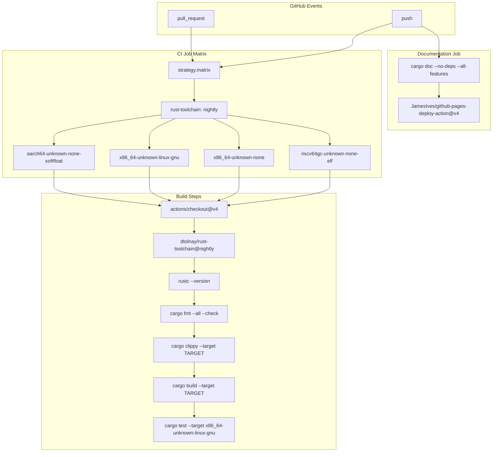
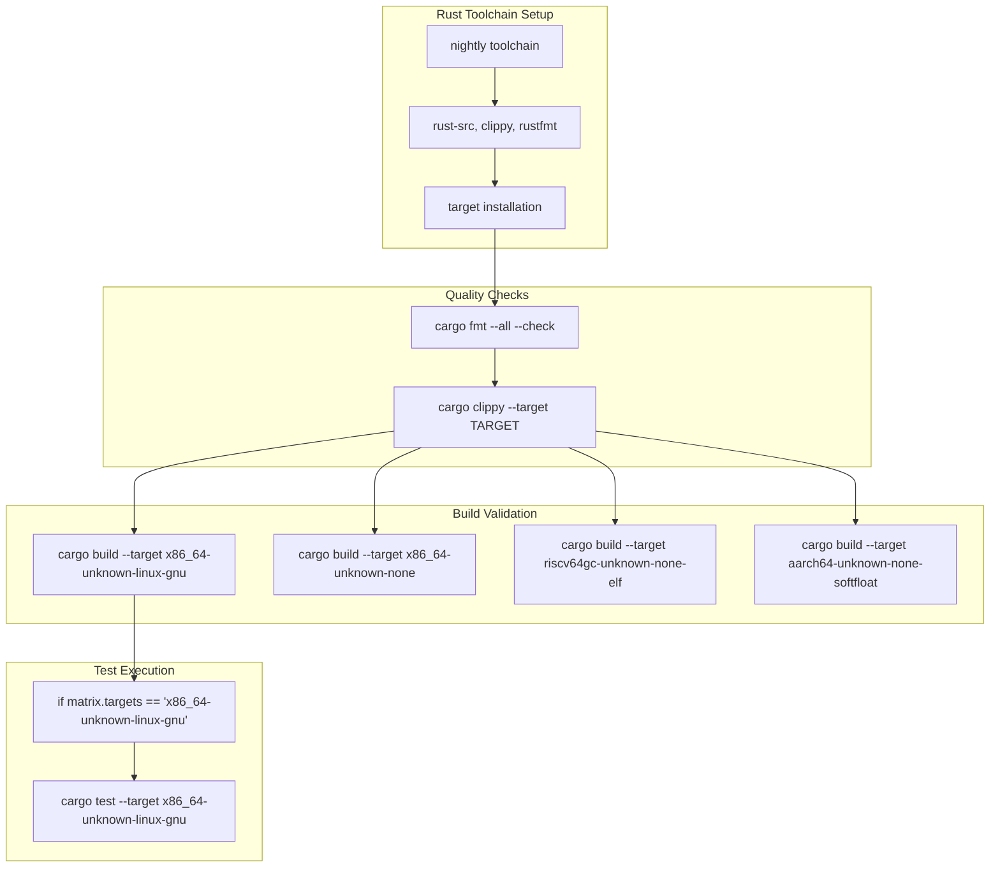
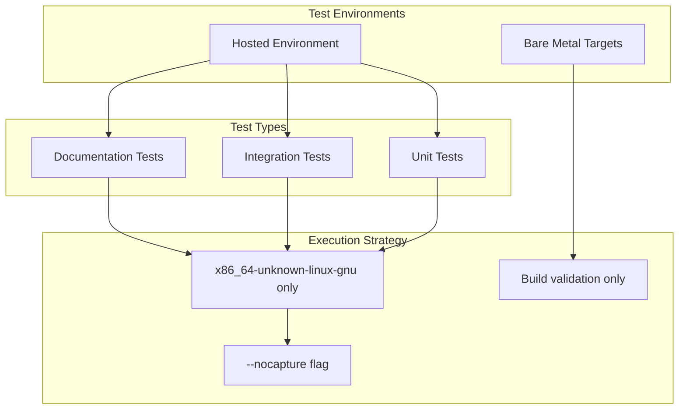
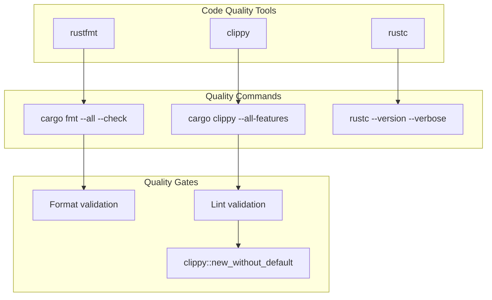
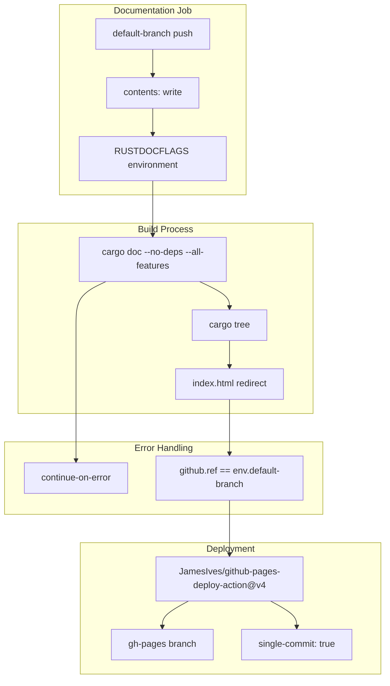
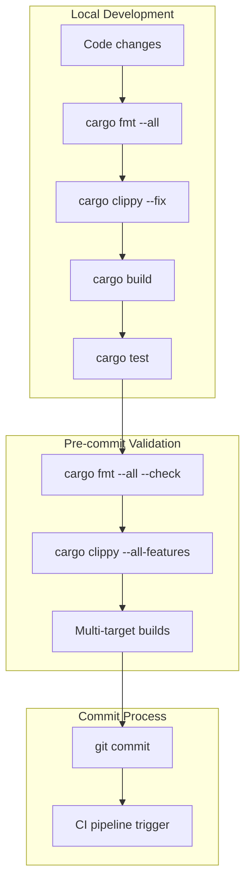

# Building and Testing

> **Relevant source files**
> * [.github/workflows/ci.yml](https://github.com/arceos-org/flatten_objects/blob/ac0a74b9/.github/workflows/ci.yml)

This document details the continuous integration pipeline, multi-target build system, testing strategy, and development workflow for the `flatten_objects` crate. It covers the automated quality assurance processes, supported target platforms, and local development practices.

For information about project configuration and development environment setup, see [Project Configuration](/arceos-org/flatten_objects/5.2-project-configuration).

## CI Pipeline Overview

The `flatten_objects` crate uses GitHub Actions for continuous integration with two primary workflows: code quality validation and documentation deployment. The pipeline ensures compatibility across multiple target platforms while maintaining code quality standards.

### CI Workflow Architecture



Sources: [.github/workflows/ci.yml(L1 - L56)&emsp;](https://github.com/arceos-org/flatten_objects/blob/ac0a74b9/.github/workflows/ci.yml#L1-L56)

### Job Matrix Configuration

The CI system uses a matrix strategy to test against multiple target platforms simultaneously:

|Target Platform|Purpose|Test Execution|
| --- | --- | --- |
|x86_64-unknown-linux-gnu|Standard Linux development|Full test suite|
|x86_64-unknown-none|Bare metal x86_64|Build only|
|riscv64gc-unknown-none-elf|RISC-V bare metal|Build only|
|aarch64-unknown-none-softfloat|ARM64 bare metal|Build only|

Sources: [.github/workflows/ci.yml(L12)&emsp;](https://github.com/arceos-org/flatten_objects/blob/ac0a74b9/.github/workflows/ci.yml#L12-L12)

## Multi-Target Build System

The crate supports multiple target architectures to ensure compatibility with various embedded and bare metal environments. The build system validates compilation across all supported targets.

### Target Platform Validation Flow



Sources: [.github/workflows/ci.yml(L15 - L30)&emsp;](https://github.com/arceos-org/flatten_objects/blob/ac0a74b9/.github/workflows/ci.yml#L15-L30)

### Target-Specific Build Commands

Each target platform uses identical build commands but with different target specifications:

* **Format Check**: `cargo fmt --all -- --check` validates code formatting consistency
* **Linting**: `cargo clippy --target ${{ matrix.targets }} --all-features -- -A clippy::new_without_default`
* **Build**: `cargo build --target ${{ matrix.targets }} --all-features`
* **Testing**: `cargo test --target ${{ matrix.targets }} -- --nocapture` (Linux only)

Sources: [.github/workflows/ci.yml(L23 - L30)&emsp;](https://github.com/arceos-org/flatten_objects/blob/ac0a74b9/.github/workflows/ci.yml#L23-L30)

## Testing Strategy

The testing approach focuses on functional validation while accommodating the constraints of bare metal target platforms.

### Test Execution Matrix



Sources: [.github/workflows/ci.yml(L28 - L30)&emsp;](https://github.com/arceos-org/flatten_objects/blob/ac0a74b9/.github/workflows/ci.yml#L28-L30)

### Test Execution Conditions

Tests are executed only on the `x86_64-unknown-linux-gnu` target due to the following constraints:

* Bare metal targets lack test harness support
* `no_std` environments have limited testing infrastructure
* The `--nocapture` flag provides detailed test output for debugging

The conditional test execution is implemented using GitHub Actions matrix conditions:

```css
if: ${{ matrix.targets == 'x86_64-unknown-linux-gnu' }}
```

Sources: [.github/workflows/ci.yml(L29)&emsp;](https://github.com/arceos-org/flatten_objects/blob/ac0a74b9/.github/workflows/ci.yml#L29-L29)

## Code Quality Checks

The CI pipeline enforces code quality through automated formatting and linting checks that run before build validation.

### Quality Assurance Pipeline



Sources: [.github/workflows/ci.yml(L20 - L25)&emsp;](https://github.com/arceos-org/flatten_objects/blob/ac0a74b9/.github/workflows/ci.yml#L20-L25)

### Clippy Configuration

The linting process uses specific allowlist configurations:

* **Suppressed Warning**: `clippy::new_without_default` is allowed since the crate provides specialized constructors
* **Target-Specific**: Clippy runs against each target platform independently
* **Feature Complete**: `--all-features` ensures comprehensive linting coverage

Sources: [.github/workflows/ci.yml(L25)&emsp;](https://github.com/arceos-org/flatten_objects/blob/ac0a74b9/.github/workflows/ci.yml#L25-L25)

## Documentation Build and Deployment

The documentation system automatically builds and deploys API documentation to GitHub Pages for the main branch.

### Documentation Workflow



Sources: [.github/workflows/ci.yml(L32 - L56)&emsp;](https://github.com/arceos-org/flatten_objects/blob/ac0a74b9/.github/workflows/ci.yml#L32-L56)

### Documentation Configuration

The documentation build process includes several important configurations:

* **Error Detection**: `RUSTDOCFLAGS: -D rustdoc::broken_intra_doc_links -D missing-docs`
* **Dependency Exclusion**: `--no-deps` focuses on crate-specific documentation
* **Branch Protection**: Deployment only occurs on the default branch
* **Index Generation**: Automatic redirect to main crate documentation

Sources: [.github/workflows/ci.yml(L40 - L48)&emsp;](https://github.com/arceos-org/flatten_objects/blob/ac0a74b9/.github/workflows/ci.yml#L40-L48)

## Local Development Workflow

For local development, developers should follow the same quality checks used in CI to ensure compatibility before pushing changes.

### Local Development Commands

|Command|Purpose|Target Requirement|
| --- | --- | --- |
|cargo fmt --all --check|Validate formatting|Any|
|cargo clippy --all-features|Run linting|Any|
|cargo build --target <TARGET>|Build validation|Specific target|
|cargo test|Execute tests|Linux host only|
|cargo doc --no-deps|Generate documentation|Any|

### Recommended Development Sequence



Sources: [.github/workflows/ci.yml(L22 - L27)&emsp;](https://github.com/arceos-org/flatten_objects/blob/ac0a74b9/.github/workflows/ci.yml#L22-L27)