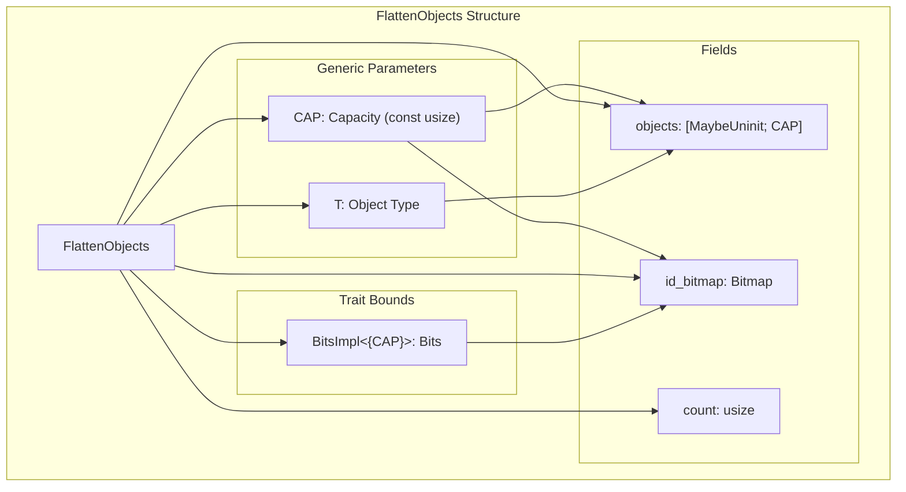
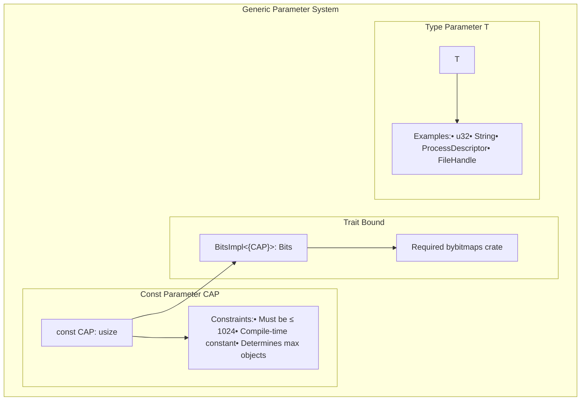
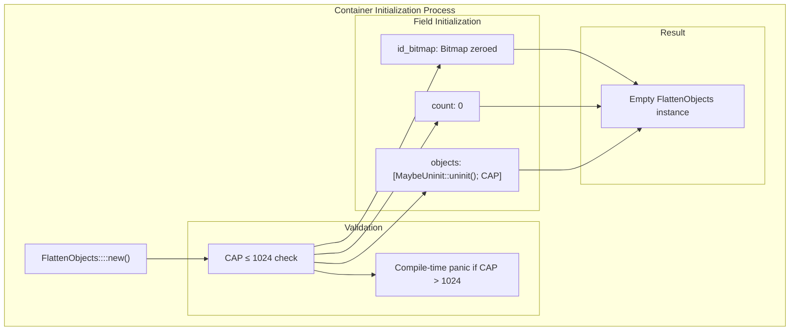

# Container Creation and Configuration

> **Relevant source files**
> * [src/lib.rs](https://github.com/arceos-org/flatten_objects/blob/ac0a74b9/src/lib.rs)

This document covers the creation and configuration of `FlattenObjects` containers, including struct definition, generic parameters, capacity constraints, and initialization methods. For information about object management operations like adding and removing objects, see [Object Management Operations](/arceos-org/flatten_objects/2.2-object-management-operations). For internal implementation details, see [Internal Data Structures](/arceos-org/flatten_objects/3.1-internal-data-structures).

## FlattenObjects Struct Definition

The `FlattenObjects<T, CAP>` struct serves as the core container for managing numbered objects with unique IDs. The structure is designed for `no_std` environments and provides compile-time capacity configuration.



The struct contains three essential fields that work together to provide efficient object storage and ID management:

|Field|Type|Purpose|
| --- | --- | --- |
|objects|[MaybeUninit<T>; CAP]|Fixed-size array storing the actual objects|
|id_bitmap|Bitmap<CAP>|Tracks which IDs are currently assigned|
|count|usize|Maintains the current number of stored objects|

**Sources:** [src/lib.rs(L44 - L51)&emsp;](https://github.com/arceos-org/flatten_objects/blob/ac0a74b9/src/lib.rs#L44-L51)

## Generic Parameters and Constraints

The `FlattenObjects` struct uses two generic parameters that determine its behavior and capabilities:



### Type ParameterT

The `T` parameter represents the type of objects stored in the container. It can be any type that implements the required traits for the operations you intend to perform. Common examples include primitive types, structs representing system resources, or handles.

### Capacity ParameterCAP

The `CAP` parameter is a compile-time constant that defines:

* Maximum number of objects the container can hold
* Maximum ID value (CAP - 1)
* Size of the internal bitmap and object array

The capacity is subject to a hard limit of 1024 objects, enforced by the `bitmaps` crate dependency.

### Trait Bounds

The constraint `BitsImpl<{ CAP }>: Bits` ensures that the `bitmaps` crate can handle the specified capacity. This trait bound is automatically satisfied for capacities up to 1024.

**Sources:** [src/lib.rs(L44 - L46)&emsp;](https://github.com/arceos-org/flatten_objects/blob/ac0a74b9/src/lib.rs#L44-L46) [src/lib.rs(L54 - L55)&emsp;](https://github.com/arceos-org/flatten_objects/blob/ac0a74b9/src/lib.rs#L54-L55)

## Container Initialization

Container creation is handled through the `new()` constructor method, which provides compile-time initialization with proper memory layout.



### Constructor Method

The `new()` method is declared as `const fn`, enabling compile-time evaluation and static initialization. Key initialization steps include:

1. **Object Array**: Initialized with `MaybeUninit::uninit()` to avoid unnecessary initialization overhead
2. **ID Bitmap**: Zero-initialized using unsafe operations, which is valid for the `Bitmap` type
3. **Count Field**: Set to 0 to indicate an empty container

### Capacity Validation

The constructor enforces the 1024 capacity limit at compile time. Attempts to create containers with `CAP > 1024` will result in compilation failure.

```javascript
// Valid - compiles successfully
let objects = FlattenObjects::<u32, 20>::new();

// Invalid - compilation error
let objects = FlattenObjects::<u32, 1025>::new();
```

### Memory Safety Considerations

The initialization process carefully handles memory safety:

* Uses `MaybeUninit<T>` to avoid constructing `T` instances prematurely
* Employs safe zero-initialization for the bitmap
* Maintains proper alignment and memory layout

**Sources:** [src/lib.rs(L77 - L84)&emsp;](https://github.com/arceos-org/flatten_objects/blob/ac0a74b9/src/lib.rs#L77-L84) [src/lib.rs(L59 - L61)&emsp;](https://github.com/arceos-org/flatten_objects/blob/ac0a74b9/src/lib.rs#L59-L61)

## Capacity Configuration and Limits

The capacity system provides both flexibility and safety through compile-time configuration with runtime access methods.

### Capacity Access

The `capacity()` method provides read-only access to the container's maximum capacity:

|Method|Return Type|Description|
| --- | --- | --- |
|capacity()|usize|Returns theCAPgeneric parameter value|
|count()|usize|Returns current number of stored objects|

### Capacity Relationship with ID Range

The capacity directly determines the valid ID range for objects:

* Valid IDs: `0` to `CAP - 1` (inclusive)
* Total possible IDs: `CAP`
* Maximum objects: `CAP`

### Implementation Constraints

The 1024 limit stems from the underlying `bitmaps` crate implementation, which uses fixed-size bitmap representations optimized for performance in constrained environments.

**Sources:** [src/lib.rs(L98 - L101)&emsp;](https://github.com/arceos-org/flatten_objects/blob/ac0a74b9/src/lib.rs#L98-L101) [src/lib.rs(L41 - L43)&emsp;](https://github.com/arceos-org/flatten_objects/blob/ac0a74b9/src/lib.rs#L41-L43)