# Development and Maintenance

> **Relevant source files**
> * [.github/workflows/ci.yml](https://github.com/arceos-org/flatten_objects/blob/ac0a74b9/.github/workflows/ci.yml)

This document covers the development infrastructure, build processes, and maintenance procedures for the `flatten_objects` crate. It provides guidance for contributors working on the codebase and maintainers responsible for releases and quality assurance.

For detailed API usage information, see [Overview](/arceos-org/flatten_objects/1-overview). For implementation specifics, see [Implementation Details](/arceos-org/flatten_objects/3-implementation-details).

## Development Workflow Overview

The `flatten_objects` crate follows a standard Rust development workflow with automated CI/CD pipelines and multi-target support for embedded and kernel environments.

### Development Workflow

```mermaid
flowchart TD
Dev["Developer"]
LocalDev["Local Development"]
Format["cargo fmt"]
Clippy["cargo clippy"]
Build["cargo build"]
Test["cargo test"]
Push["git push"]
CI["GitHub Actions CI"]
FormatCheck["Format Check"]
ClippyCheck["Clippy Analysis"]
MultiTarget["Multi-Target Build"]
UnitTest["Unit Tests"]
DocBuild["Documentation Build"]
Linux["x86_64-unknown-linux-gnu"]
BareMetal["x86_64-unknown-none"]
RISCV["riscv64gc-unknown-none-elf"]
ARM["aarch64-unknown-none-softfloat"]
DocDeploy["GitHub Pages"]
Success["✓ All Checks Pass"]
Merge["Ready for Merge"]

CI --> ClippyCheck
CI --> DocBuild
CI --> FormatCheck
CI --> MultiTarget
CI --> UnitTest
Dev --> LocalDev
DocBuild --> DocDeploy
LocalDev --> Build
LocalDev --> Clippy
LocalDev --> Format
LocalDev --> Push
LocalDev --> Test
MultiTarget --> ARM
MultiTarget --> BareMetal
MultiTarget --> Linux
MultiTarget --> RISCV
Push --> CI
Success --> Merge
UnitTest --> Success
```



Sources: [.github/workflows/ci.yml(L1 - L56)&emsp;](https://github.com/arceos-org/flatten_objects/blob/ac0a74b9/.github/workflows/ci.yml#L1-L56)

## Continuous Integration Pipeline

The CI system runs on every push and pull request, performing comprehensive validation across multiple target platforms.

### CI Job Configuration

|Component|Configuration|
| --- | --- |
|Runner|ubuntu-latest|
|Rust Toolchain|nightly|
|Required Components|rust-src,clippy,rustfmt|
|Target Platforms|4 distinct targets|
|Failure Strategy|fail-fast: false|

### CI Pipeline Stages


Sources: [.github/workflows/ci.yml(L5 - L31)&emsp;](https://github.com/arceos-org/flatten_objects/blob/ac0a74b9/.github/workflows/ci.yml#L5-L31)

## Multi-Target Build Support

The crate supports multiple target architectures to accommodate different embedded and kernel environments.

### Supported Target Platforms

|Target|Purpose|Environment|
| --- | --- | --- |
|x86_64-unknown-linux-gnu|Development and testing|Standard Linux userspace|
|x86_64-unknown-none|Bare metal x86_64|Kernel/bootloader environments|
|riscv64gc-unknown-none-elf|RISC-V bare metal|RISC-V embedded systems|
|aarch64-unknown-none-softfloat|ARM64 bare metal|ARM embedded systems|

### Build Matrix Execution


Sources: [.github/workflows/ci.yml(L8 - L30)&emsp;](https://github.com/arceos-org/flatten_objects/blob/ac0a74b9/.github/workflows/ci.yml#L8-L30)

## Code Quality Assurance

The CI pipeline enforces code quality through multiple automated checks.

### Quality Check Commands

|Check|Command|Purpose|
| --- | --- | --- |
|Formatting|cargo fmt --all -- --check|Enforce consistent code style|
|Linting|cargo clippy --target TARGET --all-features|Static analysis and best practices|
|Build Verification|cargo build --target TARGET --all-features|Compilation validation|
|Testing|cargo test --target TARGET -- --nocapture|Functional correctness|

### Clippy Configuration

The CI pipeline includes specific clippy configuration to suppress certain warnings:

* Suppressed: `clippy::new_without_default` - Allows `new()` methods without `Default` trait
* Features: `--all-features` - Enables all crate features during analysis

Sources: [.github/workflows/ci.yml(L22 - L30)&emsp;](https://github.com/arceos-org/flatten_objects/blob/ac0a74b9/.github/workflows/ci.yml#L22-L30)

## Documentation System

The crate maintains automatically generated and deployed documentation.

### Documentation Pipeline


### Documentation Configuration

|Setting|Value|Purpose|
| --- | --- | --- |
|RUSTDOCFLAGS|-D rustdoc::broken_intra_doc_links -D missing-docs|Enforce complete documentation|
|Deployment Branch|gh-pages|GitHub Pages hosting|
|Build Options|--no-deps --all-features|Generate only crate docs with all features|
|Deployment Trigger|Default branch pushes only|Automatic documentation updates|

Sources: [.github/workflows/ci.yml(L32 - L56)&emsp;](https://github.com/arceos-org/flatten_objects/blob/ac0a74b9/.github/workflows/ci.yml#L32-L56)

## Development Environment Requirements

### Required Rust Components

|Component|Purpose|
| --- | --- |
|nightly toolchain|Required for no_std development|
|rust-src|Source code for cross-compilation|
|clippy|Linting and static analysis|
|rustfmt|Code formatting|

### Target Installation

To set up a complete development environment:

```markdown
# Install nightly toolchain with required components
rustup toolchain install nightly --component rust-src clippy rustfmt

# Add target platforms
rustup target add x86_64-unknown-none
rustup target add riscv64gc-unknown-none-elf  
rustup target add aarch64-unknown-none-softfloat
```

### Local Development Commands

|Operation|Command|
| --- | --- |
|Format code|cargo fmt|
|Check formatting|cargo fmt --check|
|Run clippy|cargo clippy --all-features|
|Build for target|cargo build --target <TARGET>|
|Run tests|cargo test -- --nocapture|
|Generate docs|cargo doc --no-deps --all-features|

Sources: [.github/workflows/ci.yml(L15 - L19)&emsp;](https://github.com/arceos-org/flatten_objects/blob/ac0a74b9/.github/workflows/ci.yml#L15-L19)