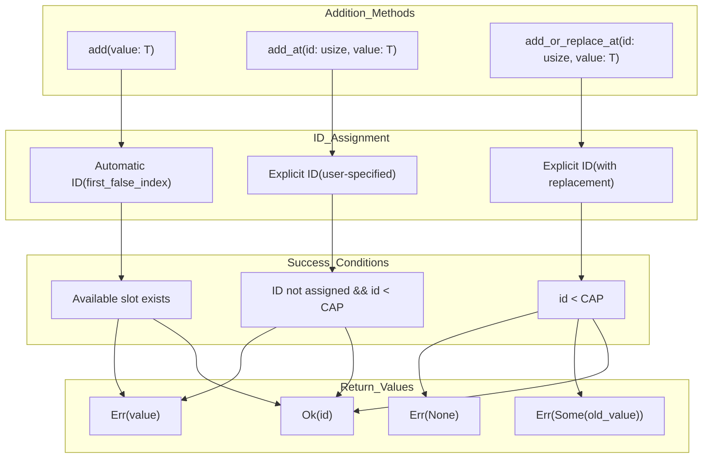
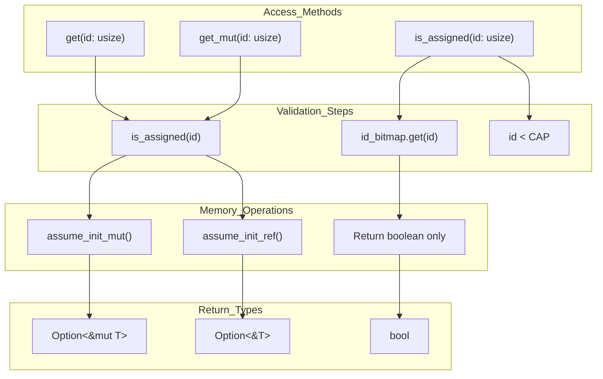

# FlattenObjects API Documentation

> **Relevant source files**
> * [src/lib.rs](https://github.com/arceos-org/flatten_objects/blob/ac0a74b9/src/lib.rs)

This document provides comprehensive API documentation for the `FlattenObjects<T, CAP>` struct, which serves as the core container type in the flatten_objects crate. The documentation covers all public methods, their signatures, behavior, error conditions, and usage patterns.

For conceptual information about the crate's purpose and design principles, see [Overview](/arceos-org/flatten_objects/1-overview). For implementation details and internal architecture, see [Implementation Details](/arceos-org/flatten_objects/3-implementation-details). For practical usage examples and patterns, see [Usage Guide and Examples](/arceos-org/flatten_objects/4-usage-guide-and-examples).

## API Structure Overview

The `FlattenObjects` API is organized around three primary operation categories: container management, object lifecycle operations, and query/inspection methods.

```mermaid
flowchart TD
subgraph Return_Types["Return_Types"]
    Result_usize_T["Result"]
    Result_usize_Option_T["Result>"]
    Option_ref_T["Option<&T>"]
    Option_mut_T["Option<&mut T>"]
    Option_T["Option"]
    Iter_CAP["Iter"]
end
subgraph subGraph6["FlattenObjects"]
    subgraph Internal_State["Internal_State"]
        objects_field["objects: [MaybeUninit; CAP]"]
        id_bitmap["id_bitmap: Bitmap"]
        count_field["count: usize"]
    end
    subgraph Iteration["Iteration"]
        ids["ids()"]
    end
    subgraph Access_Operations["Access_Operations"]
        get["get(id: usize)"]
        get_mut["get_mut(id: usize)"]
        is_assigned["is_assigned(id: usize)"]
    end
    subgraph Object_Lifecycle["Object_Lifecycle"]
        capacity["capacity()"]
        new["new()"]
        add["add(value: T)"]
        add_at["add_at(id: usize, value: T)"]
        add_or_replace["add_or_replace_at(id: usize, value: T)"]
        remove["remove(id: usize)"]
    end
    subgraph Configuration["Configuration"]
        count["count()"]
        subgraph Creation["Creation"]
            capacity["capacity()"]
            new["new()"]
        end
    end
end
bool["bool"]

add --> Result_usize_T
add --> count_field
add --> id_bitmap
add --> objects_field
add_at --> Result_usize_T
add_at --> count_field
add_at --> id_bitmap
add_at --> objects_field
add_or_replace --> Result_usize_Option_T
get --> Option_ref_T
get --> id_bitmap
get --> objects_field
get_mut --> Option_mut_T
get_mut --> id_bitmap
get_mut --> objects_field
ids --> Iter_CAP
ids --> id_bitmap
is_assigned --> bool
is_assigned --> id_bitmap
remove --> Option_T
remove --> count_field
remove --> id_bitmap
remove --> objects_field
```



Sources: [src/lib.rs(L37 - L347)&emsp;](https://github.com/arceos-org/flatten_objects/blob/ac0a74b9/src/lib.rs#L37-L347)

## Method Classification and Signatures

The API methods can be classified by their primary function and the type of operations they perform on the container state.

|Category|Method|Signature|State Changes|
| --- | --- | --- | --- |
|Creation|new|const fn new() -> Self|Initializes empty container|
|Inspection|capacity|const fn capacity(&self) -> usize|None|
|Inspection|count|const fn count(&self) -> usize|None|
|Query|is_assigned|fn is_assigned(&self, id: usize) -> bool|None|
|Access|get|fn get(&self, id: usize) -> Option<&T>|None|
|Access|get_mut|fn get_mut(&mut self, id: usize) -> Option<&mut T>|None|
|Mutation|add|fn add(&mut self, value: T) -> Result<usize, T>|Modifies objects, id_bitmap, count|
|Mutation|add_at|fn add_at(&mut self, id: usize, value: T) -> Result<usize, T>|Modifies objects, id_bitmap, count|
|Mutation|add_or_replace_at|fn add_or_replace_at(&mut self, id: usize, value: T) -> Result<usize, Option<T>>|Modifies objects, id_bitmap, potentially count|
|Mutation|remove|fn remove(&mut self, id: usize) -> Option<T>|Modifies objects, id_bitmap, count|
|Iteration|ids|fn ids(&self) -> Iter<CAP>|None|

Sources: [src/lib.rs(L77 - L84)&emsp;](https://github.com/arceos-org/flatten_objects/blob/ac0a74b9/src/lib.rs#L77-L84) [src/lib.rs(L98 - L101)&emsp;](https://github.com/arceos-org/flatten_objects/blob/ac0a74b9/src/lib.rs#L98-L101) [src/lib.rs(L121 - L124)&emsp;](https://github.com/arceos-org/flatten_objects/blob/ac0a74b9/src/lib.rs#L121-L124) [src/lib.rs(L143 - L146)&emsp;](https://github.com/arceos-org/flatten_objects/blob/ac0a74b9/src/lib.rs#L143-L146) [src/lib.rs(L164 - L173)&emsp;](https://github.com/arceos-org/flatten_objects/blob/ac0a74b9/src/lib.rs#L164-L173) [src/lib.rs(L193 - L202)&emsp;](https://github.com/arceos-org/flatten_objects/blob/ac0a74b9/src/lib.rs#L193-L202) [src/lib.rs(L222 - L232)&emsp;](https://github.com/arceos-org/flatten_objects/blob/ac0a74b9/src/lib.rs#L222-L232) [src/lib.rs(L249 - L257)&emsp;](https://github.com/arceos-org/flatten_objects/blob/ac0a74b9/src/lib.rs#L249-L257) [src/lib.rs(L277 - L297)&emsp;](https://github.com/arceos-org/flatten_objects/blob/ac0a74b9/src/lib.rs#L277-L297) [src/lib.rs(L315 - L326)&emsp;](https://github.com/arceos-org/flatten_objects/blob/ac0a74b9/src/lib.rs#L315-L326) [src/lib.rs(L343 - L346)&emsp;](https://github.com/arceos-org/flatten_objects/blob/ac0a74b9/src/lib.rs#L343-L346)

## Object Lifecycle State Machine

The following diagram shows how objects transition through different states within the `FlattenObjects` container, mapped to specific API operations.

```mermaid
stateDiagram-v2
[*] --> Unallocated : "new()"
[*] --> Available
Available --> Available
Available --> Available : "Failed add/add_at calls"
Available --> Available
[*] --> Assigned
Assigned --> Modified : "get_mut(id)"
Modified --> Assigned : "Access complete"
Assigned --> Modified
Modified --> Modified : "get(id), is_assigned(id)"
Modified --> Assigned
note left of Available----note : ['"id_bitmap.get(id) == false<br>objects[id] uninitialized"']
note left of Available : ['"id_bitmap.get(id) == false<br>objects[id] uninitialized"']
note left of Assigned : ['"id_bitmap.get(id) == true<br>objects[id] contains valid T"']
note left of Modified : ['"Mutable reference active<br>Temporary state during get_mut"']
[*] --> alloc_start : "add(), add_at(), add_or_replace_at()"
[*] --> unalloc_start : "remove(id)"
note left of alloc_start : ['"id_bitmap.get(id) == false<br>objects[id] uninitialized"']
note left of Available----note : ['"id_bitmap.get(id) == false<br>objects[id] uninitialized"']
```

Sources: [src/lib.rs(L222 - L232)&emsp;](https://github.com/arceos-org/flatten_objects/blob/ac0a74b9/src/lib.rs#L222-L232) [src/lib.rs(L249 - L257)&emsp;](https://github.com/arceos-org/flatten_objects/blob/ac0a74b9/src/lib.rs#L249-L257) [src/lib.rs(L277 - L297)&emsp;](https://github.com/arceos-org/flatten_objects/blob/ac0a74b9/src/lib.rs#L277-L297) [src/lib.rs(L315 - L326)&emsp;](https://github.com/arceos-org/flatten_objects/blob/ac0a74b9/src/lib.rs#L315-L326) [src/lib.rs(L164 - L173)&emsp;](https://github.com/arceos-org/flatten_objects/blob/ac0a74b9/src/lib.rs#L164-L173) [src/lib.rs(L193 - L202)&emsp;](https://github.com/arceos-org/flatten_objects/blob/ac0a74b9/src/lib.rs#L193-L202) [src/lib.rs(L143 - L146)&emsp;](https://github.com/arceos-org/flatten_objects/blob/ac0a74b9/src/lib.rs#L143-L146)

## Container Creation and Configuration

### Constructor Method

The `new()` method creates an empty `FlattenObjects` container with all slots unallocated.

```javascript
// From src/lib.rs:77-84
pub const fn new() -> Self
```

**Constraints:**

* `CAP` must not exceed 1024 (enforced at compile time)
* Function is `const`, enabling compile-time initialization
* Zero-initializes the `id_bitmap` safely using `MaybeUninit::zeroed()`

**Example behavior:**

```javascript
let objects = FlattenObjects::<u32, 20>::new();
// All IDs 0..19 are available
// count() returns 0
// No memory is initialized for objects
```

Sources: [src/lib.rs(L77 - L84)&emsp;](https://github.com/arceos-org/flatten_objects/blob/ac0a74b9/src/lib.rs#L77-L84)

### Capacity and Size Methods

The container provides compile-time and runtime information about its configuration and current state.

|Method|Return Type|Description|
| --- | --- | --- |
|capacity()|usize|Maximum objects that can be stored (CAP)|
|count()|usize|Current number of assigned objects|

The relationship between these values follows the invariant: `0 <= count() <= capacity()`.

Sources: [src/lib.rs(L98 - L101)&emsp;](https://github.com/arceos-org/flatten_objects/blob/ac0a74b9/src/lib.rs#L98-L101) [src/lib.rs(L121 - L124)&emsp;](https://github.com/arceos-org/flatten_objects/blob/ac0a74b9/src/lib.rs#L121-L124)

## Object Management Operations

### Addition Methods

The container provides three distinct methods for adding objects, each with different ID assignment strategies:



Sources: [src/lib.rs(L222 - L232)&emsp;](https://github.com/arceos-org/flatten_objects/blob/ac0a74b9/src/lib.rs#L222-L232) [src/lib.rs(L249 - L257)&emsp;](https://github.com/arceos-org/flatten_objects/blob/ac0a74b9/src/lib.rs#L249-L257) [src/lib.rs(L277 - L297)&emsp;](https://github.com/arceos-org/flatten_objects/blob/ac0a74b9/src/lib.rs#L277-L297)

#### Automatic ID Assignment:add()

```rust
// From src/lib.rs:222-232
pub fn add(&mut self, value: T) -> Result<usize, T>
```

**Behavior:**

1. Finds the first available ID using `id_bitmap.first_false_index()`
2. Assigns the object to that ID if available
3. Updates `count`, `id_bitmap`, and initializes `objects[id]`

**Error conditions:**

* Returns `Err(value)` if no available slots exist
* Returns `Err(value)` if `first_false_index()` returns ID >= `CAP`

#### Explicit ID Assignment:add_at()

```rust
// From src/lib.rs:249-257
pub fn add_at(&mut self, id: usize, value: T) -> Result<usize, T>
```

**Behavior:**

1. Validates `id < CAP` and `!is_assigned(id)`
2. Assigns object to specified ID if validation passes
3. Updates `count`, `id_bitmap`, and initializes `objects[id]`

**Error conditions:**

* Returns `Err(value)` if `id >= CAP`
* Returns `Err(value)` if `is_assigned(id)` returns `true`

#### Replacement Assignment:add_or_replace_at()

```rust
// From src/lib.rs:277-297
pub fn add_or_replace_at(&mut self, id: usize, value: T) -> Result<usize, Option<T>>
```

**Behavior:**

1. Validates `id < CAP`
2. If ID assigned: replaces object and returns `Err(Some(old_value))`
3. If ID unassigned: assigns object and returns `Ok(id)`

**Error conditions:**

* Returns `Err(None)` if `id >= CAP`
* Returns `Err(Some(old))` if replacing existing object

Sources: [src/lib.rs(L222 - L232)&emsp;](https://github.com/arceos-org/flatten_objects/blob/ac0a74b9/src/lib.rs#L222-L232) [src/lib.rs(L249 - L257)&emsp;](https://github.com/arceos-org/flatten_objects/blob/ac0a74b9/src/lib.rs#L249-L257) [src/lib.rs(L277 - L297)&emsp;](https://github.com/arceos-org/flatten_objects/blob/ac0a74b9/src/lib.rs#L277-L297)

### Removal Method

```rust
// From src/lib.rs:315-326
pub fn remove(&mut self, id: usize) -> Option<T>
```

**State changes:**

1. Sets `id_bitmap.set(id, false)` to mark ID as available
2. Decrements `count`
3. Reads and returns object using `assume_init_read()`

**Safety considerations:**

* Object memory is not overwritten, only marked as uninitialized
* ID becomes available for reuse immediately
* Calling `remove()` on unassigned ID returns `None` without side effects

Sources: [src/lib.rs(L315 - L326)&emsp;](https://github.com/arceos-org/flatten_objects/blob/ac0a74b9/src/lib.rs#L315-L326)

## Query and Inspection Methods

### Access Methods

The container provides immutable and mutable access to stored objects through bounds-checked operations.



Sources: [src/lib.rs(L164 - L173)&emsp;](https://github.com/arceos-org/flatten_objects/blob/ac0a74b9/src/lib.rs#L164-L173) [src/lib.rs(L193 - L202)&emsp;](https://github.com/arceos-org/flatten_objects/blob/ac0a74b9/src/lib.rs#L193-L202) [src/lib.rs(L143 - L146)&emsp;](https://github.com/arceos-org/flatten_objects/blob/ac0a74b9/src/lib.rs#L143-L146)

#### Immutable Access:get()

```rust
// From src/lib.rs:164-173
pub fn get(&self, id: usize) -> Option<&T>
```

**Implementation details:**

* Calls `is_assigned(id)` for validation
* Uses `assume_init_ref()` to create reference from `MaybeUninit<T>`
* Returns `None` for unassigned IDs or out-of-bounds access

#### Mutable Access:get_mut()

```rust
// From src/lib.rs:193-202
pub fn get_mut(&mut self, id: usize) -> Option<&mut T>
```

**Implementation details:**

* Identical validation logic to `get()`
* Uses `assume_init_mut()` to create mutable reference
* Requires exclusive container access (`&mut self`)

#### Assignment Check:is_assigned()

```rust
// From src/lib.rs:143-146
pub fn is_assigned(&self, id: usize) -> bool
```

**Implementation details:**

* Returns `false` for `id >= CAP` (bounds check)
* Returns `id_bitmap.get(id)` for valid IDs
* Does not access object memory, only bitmap state

Sources: [src/lib.rs(L164 - L173)&emsp;](https://github.com/arceos-org/flatten_objects/blob/ac0a74b9/src/lib.rs#L164-L173) [src/lib.rs(L193 - L202)&emsp;](https://github.com/arceos-org/flatten_objects/blob/ac0a74b9/src/lib.rs#L193-L202) [src/lib.rs(L143 - L146)&emsp;](https://github.com/arceos-org/flatten_objects/blob/ac0a74b9/src/lib.rs#L143-L146)

### Iteration Support

```rust
// From src/lib.rs:343-346
pub fn ids(&self) -> Iter<CAP>
```

The `ids()` method provides an iterator over assigned object IDs by delegating to the bitmap's iterator implementation.

**Characteristics:**

* Returns `Iter<CAP>` from the `bitmaps` crate
* Iterates only over assigned IDs (where bitmap bit is `true`)
* Order follows the bitmap's internal iteration order (typically ascending)
* Iterator is independent of object values, only reads bitmap state

Sources: [src/lib.rs(L343 - L346)&emsp;](https://github.com/arceos-org/flatten_objects/blob/ac0a74b9/src/lib.rs#L343-L346)