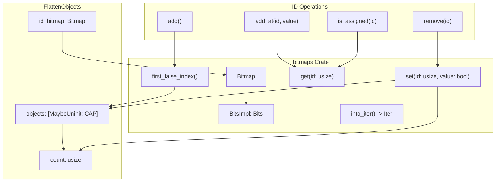
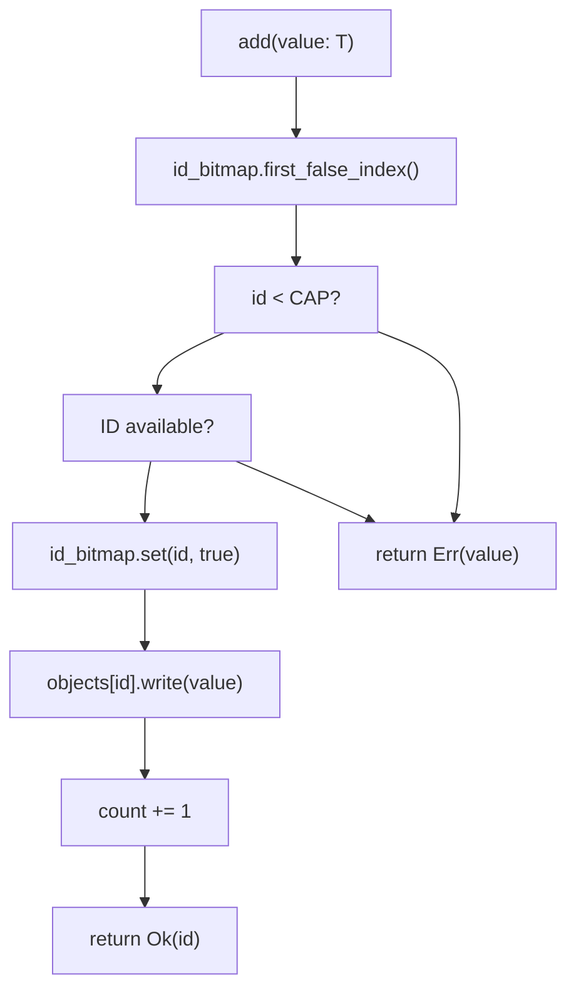
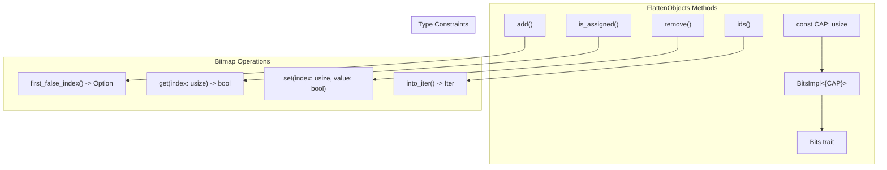
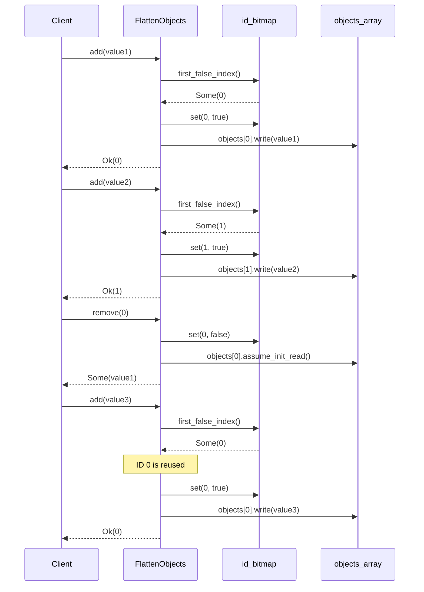
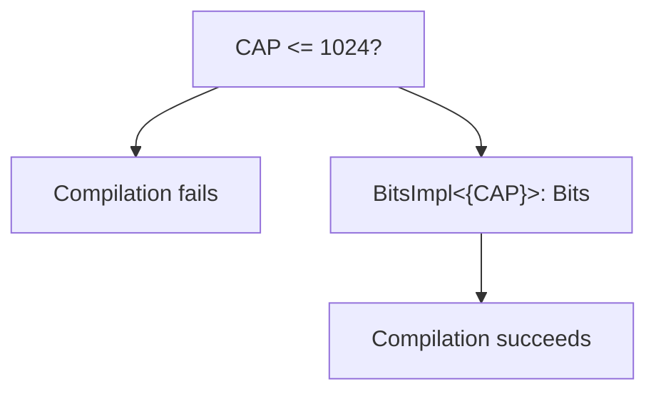
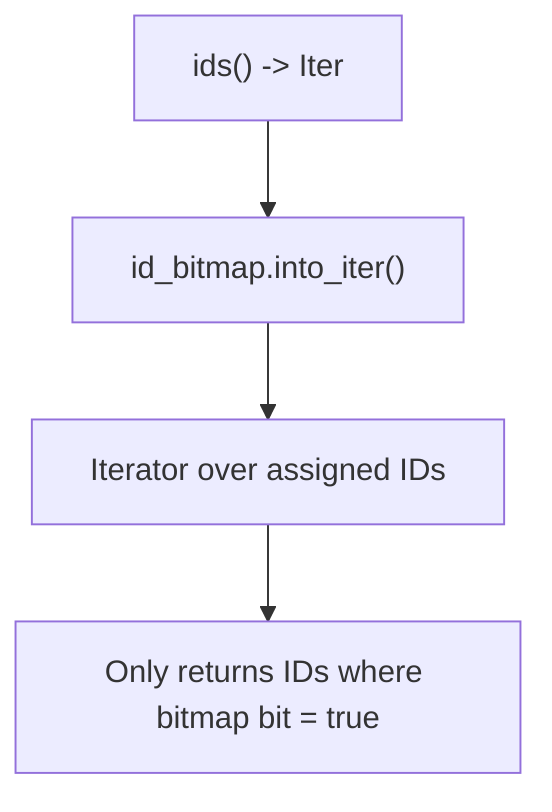

# ID Management System

> **Relevant source files**
> * [Cargo.toml](https://github.com/arceos-org/flatten_objects/blob/ac0a74b9/Cargo.toml)
> * [src/lib.rs](https://github.com/arceos-org/flatten_objects/blob/ac0a74b9/src/lib.rs)

This document covers the bitmap-based ID allocation and management system used by `FlattenObjects` to assign unique identifiers to stored objects. The system provides efficient ID allocation, reuse, and tracking using a bitmap data structure from the external `bitmaps` crate.

For information about the overall container architecture, see [Internal Data Structures](/arceos-org/flatten_objects/3.1-internal-data-structures). For details about memory safety and object lifecycle, see [Memory Management and Safety](/arceos-org/flatten_objects/3.2-memory-management-and-safety).

## Core ID Management Architecture

The ID management system centers around a bitmap that tracks which IDs are currently assigned. Each bit position corresponds to a potential object ID, with `true` indicating an assigned ID and `false` indicating an available ID.



**Bitmap-based ID Management**

Sources: [src/lib.rs(L34)&emsp;](https://github.com/arceos-org/flatten_objects/blob/ac0a74b9/src/lib.rs#L34-L34) [src/lib.rs(L49)&emsp;](https://github.com/arceos-org/flatten_objects/blob/ac0a74b9/src/lib.rs#L49-L49) [Cargo.toml(L16)&emsp;](https://github.com/arceos-org/flatten_objects/blob/ac0a74b9/Cargo.toml#L16-L16)

## ID Allocation Algorithm

The system uses a "first-fit" allocation strategy where new objects receive the smallest available ID. This is implemented through the `first_false_index()` method from the `bitmaps` crate.



**ID Allocation Flow**

Sources: [src/lib.rs(L222 - L232)&emsp;](https://github.com/arceos-org/flatten_objects/blob/ac0a74b9/src/lib.rs#L222-L232) [src/lib.rs(L223)&emsp;](https://github.com/arceos-org/flatten_objects/blob/ac0a74b9/src/lib.rs#L223-L223) [src/lib.rs(L226)&emsp;](https://github.com/arceos-org/flatten_objects/blob/ac0a74b9/src/lib.rs#L226-L226)

## ID State Transitions

Each ID in the system can be in one of two states, tracked by the corresponding bitmap bit. The state transitions occur during object lifecycle operations.

|Operation|Bitmap Bit Change|Count Change|Object Array Effect|
| --- | --- | --- | --- |
|add()|false→true|+1|MaybeUninit::uninit()→MaybeUninit::new(value)|
|add_at(id)|false→true|+1|MaybeUninit::uninit()→MaybeUninit::new(value)|
|remove(id)|true→false|-1|MaybeUninit::new(value)→MaybeUninit::uninit()|
|add_or_replace_at(id)|unchanged|0or+1|Replaces existing value|

**ID State Transition Table**

Sources: [src/lib.rs(L226)&emsp;](https://github.com/arceos-org/flatten_objects/blob/ac0a74b9/src/lib.rs#L226-L226) [src/lib.rs(L254)&emsp;](https://github.com/arceos-org/flatten_objects/blob/ac0a74b9/src/lib.rs#L254-L254) [src/lib.rs(L317)&emsp;](https://github.com/arceos-org/flatten_objects/blob/ac0a74b9/src/lib.rs#L317-L317) [src/lib.rs(L292)&emsp;](https://github.com/arceos-org/flatten_objects/blob/ac0a74b9/src/lib.rs#L292-L292)

## Bitmap Integration Details

The system integrates with the `bitmaps` crate v3.2, which provides efficient bitmap operations with compile-time size verification through the `Bits` trait constraint.



**Bitmap Integration Architecture**

Sources: [src/lib.rs(L46)&emsp;](https://github.com/arceos-org/flatten_objects/blob/ac0a74b9/src/lib.rs#L46-L46) [src/lib.rs(L34)&emsp;](https://github.com/arceos-org/flatten_objects/blob/ac0a74b9/src/lib.rs#L34-L34) [src/lib.rs(L144 - L146)&emsp;](https://github.com/arceos-org/flatten_objects/blob/ac0a74b9/src/lib.rs#L144-L146) [src/lib.rs(L344 - L346)&emsp;](https://github.com/arceos-org/flatten_objects/blob/ac0a74b9/src/lib.rs#L344-L346)

## ID Reuse Strategy

The system implements immediate ID reuse - when an object is removed, its ID becomes immediately available for the next allocation. This is achieved by setting the corresponding bitmap bit to `false`.



**ID Reuse Sequence**

Sources: [src/lib.rs(L315 - L326)&emsp;](https://github.com/arceos-org/flatten_objects/blob/ac0a74b9/src/lib.rs#L315-L326) [src/lib.rs(L317)&emsp;](https://github.com/arceos-org/flatten_objects/blob/ac0a74b9/src/lib.rs#L317-L317) [src/lib.rs(L322)&emsp;](https://github.com/arceos-org/flatten_objects/blob/ac0a74b9/src/lib.rs#L322-L322)

## Capacity Constraints and Limitations

The ID management system has several built-in constraints that ensure safe operation within the bounds of the `bitmaps` crate implementation.

### Maximum Capacity Constraint

The system enforces a maximum capacity of 1024 objects, which is a limitation of the underlying `bitmaps` crate implementation.



**Capacity Constraint Validation**

Sources: [src/lib.rs(L42 - L43)&emsp;](https://github.com/arceos-org/flatten_objects/blob/ac0a74b9/src/lib.rs#L42-L43) [src/lib.rs(L61)&emsp;](https://github.com/arceos-org/flatten_objects/blob/ac0a74b9/src/lib.rs#L61-L61) [src/lib.rs(L75 - L76)&emsp;](https://github.com/arceos-org/flatten_objects/blob/ac0a74b9/src/lib.rs#L75-L76)

### ID Range Validation

All ID operations include bounds checking to ensure IDs remain within the valid range `<FileRef file-url="https://github.com/arceos-org/flatten_objects/blob/ac0a74b9/0, CAP)`.\n\n| Method | ID Validation | Behavior on Invalid ID |\n|--------|---------------|----------------------|\n| `is_assigned(id)` | `id < CAP` | Returns `false` |\n| `add_at(id, value)` | `id >= CAP` | Returns `Err(value)` |\n| `add_or_replace_at(id, value)` | `id >= CAP` | Returns `Err(None)` |\n| `get(id)` / `get_mut(id)` | Via `is_assigned(id)` | Returns `None` |\n\n**ID Validation Table**\n\nSources#LNaN-LNaN" NaN  file-path="0, CAP)`.\n\n| Method | ID Validation | Behavior on Invalid ID |\n|--------|---------------|----------------------|\n|`is_assigned(id)`|`id < CAP`| Returns`false`|\n|`add_at(id, value)`|`id >= CAP`| Returns`Err(value)`|\n|`add_or_replace_at(id, value)`|`id >= CAP`| Returns`Err(None)`|\n|`get(id)`/`get_mut(id)`| Via`is_assigned(id)`| Returns`None` |\n\n**ID Validation Table**\n\nSources">Hii [src/lib.rs(L250)&emsp;](https://github.com/arceos-org/flatten_objects/blob/ac0a74b9/src/lib.rs#L250-L250) [src/lib.rs(L278)&emsp;](https://github.com/arceos-org/flatten_objects/blob/ac0a74b9/src/lib.rs#L278-L278)

## Bitmap Initialization and Safety

The bitmap is initialized with zero values, ensuring all IDs start as available. This initialization uses `unsafe` code but is considered safe because zero-initialization is valid for integer arrays.

```css
// From new() method - line 81
id_bitmap: unsafe { MaybeUninit::zeroed().assume_init() }
```

The zero-initialization strategy ensures:

* All bitmap bits start as `false` (available)
* No undefined behavior from uninitialized memory
* Deterministic initial state for ID allocation

Sources: [src/lib.rs(L80 - L82)&emsp;](https://github.com/arceos-org/flatten_objects/blob/ac0a74b9/src/lib.rs#L80-L82)

## Iterator Support

The system provides iteration over assigned IDs through the `ids()` method, which returns an iterator from the underlying bitmap.



**ID Iterator Implementation**

Sources: [src/lib.rs(L344 - L346)&emsp;](https://github.com/arceos-org/flatten_objects/blob/ac0a74b9/src/lib.rs#L344-L346)