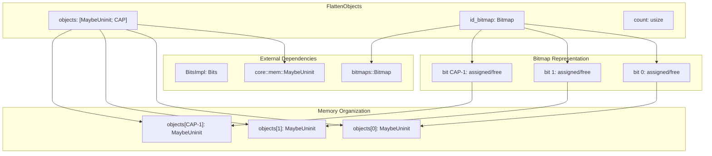
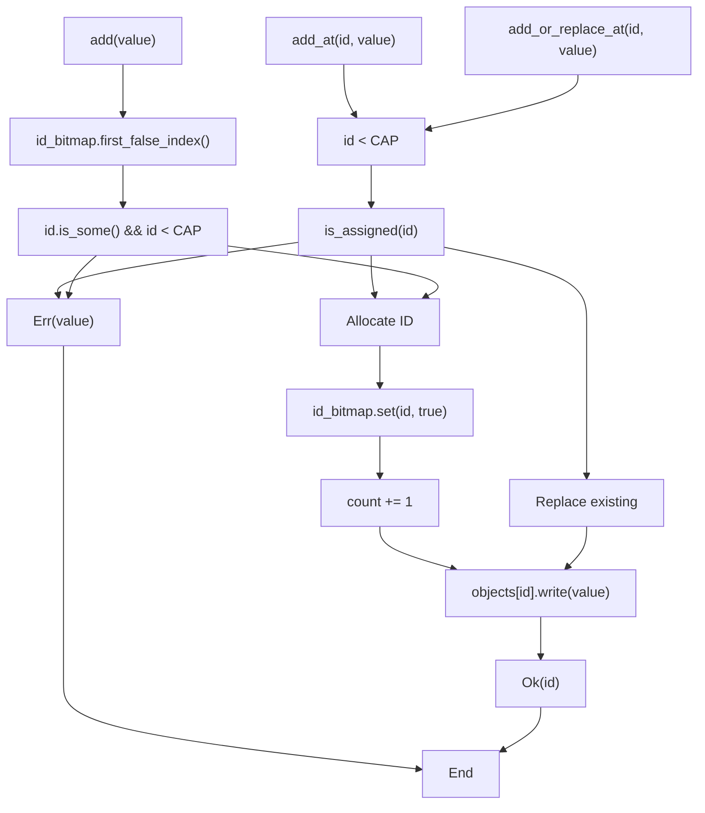

# Implementation Details

> **Relevant source files**
> * [src/lib.rs](https://github.com/arceos-org/flatten_objects/blob/ac0a74b9/src/lib.rs)

This document provides a comprehensive analysis of the internal architecture, data structures, and implementation strategies used in the `flatten_objects` crate. It covers the low-level details of how the `FlattenObjects` container manages memory, maintains safety invariants, and implements efficient ID allocation.

For high-level API usage patterns, see [Usage Guide and Examples](/arceos-org/flatten_objects/4-usage-guide-and-examples). For specific API method documentation, see [FlattenObjects API Documentation](/arceos-org/flatten_objects/2-flattenobjects-api-documentation).

## Core Architecture Overview

The `FlattenObjects<T, CAP>` struct implements a fixed-capacity object container through three interconnected components that work together to provide safe, efficient object storage with unique ID assignment.

### Internal Data Structure Layout



The structure maintains three critical invariants:

* `id_bitmap.get(i) == true` if and only if `objects[i]` contains an initialized value
* `count` equals the number of set bits in `id_bitmap`
* All operations preserve these relationships atomically

Sources: [src/lib.rs(L44 - L51)&emsp;](https://github.com/arceos-org/flatten_objects/blob/ac0a74b9/src/lib.rs#L44-L51)

### Generic Parameter Constraints

The `FlattenObjects` implementation relies on compile-time constraints that ensure type safety and capacity limits:

|Parameter|Constraint|Purpose|
| --- | --- | --- |
|T|Any type|The stored object type|
|CAP|const usize|Maximum container capacity|
|BitsImpl<{CAP}>|Bits|Enables bitmap operations for the given capacity|

The capacity constraint `CAP <= 1024` is enforced through the `bitmaps` crate's type system and validated at construction time in `new()`.

Sources: [src/lib.rs(L44 - L46)&emsp;](https://github.com/arceos-org/flatten_objects/blob/ac0a74b9/src/lib.rs#L44-L46) [src/lib.rs(L59 - L61)&emsp;](https://github.com/arceos-org/flatten_objects/blob/ac0a74b9/src/lib.rs#L59-L61)

## Memory Management Strategy

The implementation uses `MaybeUninit<T>` to avoid unnecessary initialization overhead and enable precise control over object lifecycle:

### Initialization States and Transitions

```

```

The bitmap serves as the authoritative source of truth for memory initialization state. All access to `objects[i]` is guarded by checking `id_bitmap.get(i)` first.

Sources: [src/lib.rs(L48 - L49)&emsp;](https://github.com/arceos-org/flatten_objects/blob/ac0a74b9/src/lib.rs#L48-L49) [src/lib.rs(L77 - L84)&emsp;](https://github.com/arceos-org/flatten_objects/blob/ac0a74b9/src/lib.rs#L77-L84)

### Unsafe Operation Boundaries

The implementation carefully encapsulates unsafe operations within safe method boundaries:

|Unsafe Operation|Location|Safety Guarantee|
| --- | --- | --- |
|assume_init_ref()|get()method|Protected byis_assigned()check|
|assume_init_mut()|get_mut()method|Protected byis_assigned()check|
|assume_init_read()|remove()andadd_or_replace_at()|Protected byis_assigned()check|
|MaybeUninit::zeroed().assume_init()|new()method|Valid forBitmap<CAP>type|

Sources: [src/lib.rs(L169)&emsp;](https://github.com/arceos-org/flatten_objects/blob/ac0a74b9/src/lib.rs#L169-L169) [src/lib.rs(L198)&emsp;](https://github.com/arceos-org/flatten_objects/blob/ac0a74b9/src/lib.rs#L198-L198) [src/lib.rs(L286)&emsp;](https://github.com/arceos-org/flatten_objects/blob/ac0a74b9/src/lib.rs#L286-L286) [src/lib.rs(L322)&emsp;](https://github.com/arceos-org/flatten_objects/blob/ac0a74b9/src/lib.rs#L322-L322) [src/lib.rs(L81)&emsp;](https://github.com/arceos-org/flatten_objects/blob/ac0a74b9/src/lib.rs#L81-L81)

## ID Allocation and Management

The ID management system uses the `bitmaps` crate to efficiently track available slots and implement ID reuse:

### ID Allocation Flow



The `first_false_index()` method from the `bitmaps` crate provides O(1) amortized ID allocation by efficiently finding the first unset bit.

Sources: [src/lib.rs(L222 - L232)&emsp;](https://github.com/arceos-org/flatten_objects/blob/ac0a74b9/src/lib.rs#L222-L232) [src/lib.rs(L249 - L257)&emsp;](https://github.com/arceos-org/flatten_objects/blob/ac0a74b9/src/lib.rs#L249-L257) [src/lib.rs(L277 - L297)&emsp;](https://github.com/arceos-org/flatten_objects/blob/ac0a74b9/src/lib.rs#L277-L297)

### Critical Safety Invariants

The implementation maintains several critical invariants that ensure memory safety:

1. **Bitmap-Memory Synchronization**: `id_bitmap.get(i) == true` if and only if `objects[i]` is initialized
2. **Count Consistency**: `count` equals `id_bitmap.into_iter().count()`
3. **Bounds Safety**: All array access is bounds-checked against `CAP`
4. **Initialization Ordering**: `id_bitmap.set(id, true)` occurs before `objects[id].write(value)`
5. **Deinitialization Ordering**: `id_bitmap.set(id, false)` occurs after `objects[id].assume_init_read()`

These invariants are maintained through careful ordering in methods like `add()`, `remove()`, and `add_or_replace_at()`.

Sources: [src/lib.rs(L225 - L228)&emsp;](https://github.com/arceos-org/flatten_objects/blob/ac0a74b9/src/lib.rs#L225-L228) [src/lib.rs(L253 - L256)&emsp;](https://github.com/arceos-org/flatten_objects/blob/ac0a74b9/src/lib.rs#L253-L256) [src/lib.rs(L317 - L322)&emsp;](https://github.com/arceos-org/flatten_objects/blob/ac0a74b9/src/lib.rs#L317-L322)

## Capacity Constraints and Compilation

The `CAP` parameter is constrained by the `bitmaps` crate's `Bits` trait implementation, which currently supports capacities up to 1024. This constraint is enforced at compile time through the trait bound `BitsImpl<{CAP}>: Bits`.

The `new()` method includes a runtime panic for capacities exceeding 1024, providing clear error messaging during development while maintaining `const fn` compatibility.

Sources: [src/lib.rs(L46)&emsp;](https://github.com/arceos-org/flatten_objects/blob/ac0a74b9/src/lib.rs#L46-L46) [src/lib.rs(L59 - L61)&emsp;](https://github.com/arceos-org/flatten_objects/blob/ac0a74b9/src/lib.rs#L59-L61) [src/lib.rs(L77)&emsp;](https://github.com/arceos-org/flatten_objects/blob/ac0a74b9/src/lib.rs#L77-L77)