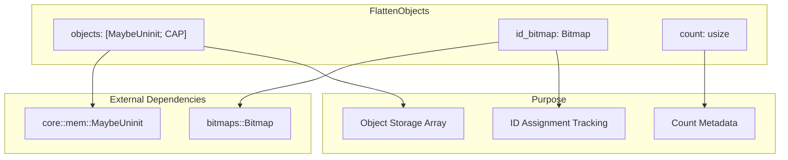
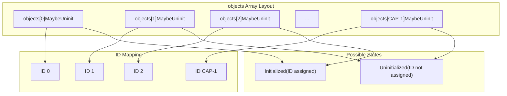
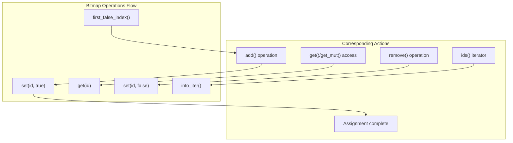
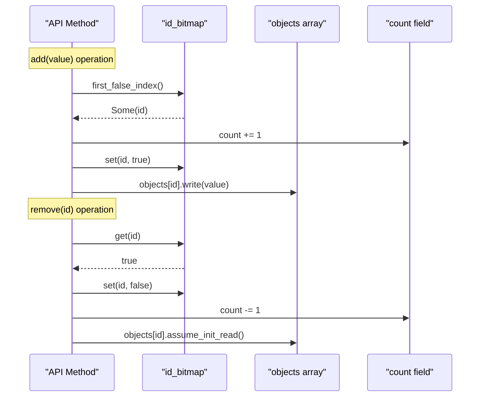

# Internal Data Structures

> **Relevant source files**
> * [src/lib.rs](https://github.com/arceos-org/flatten_objects/blob/ac0a74b9/src/lib.rs)

This document details the internal data structures that comprise the `FlattenObjects` container, explaining how the three core fields work together to provide efficient object storage with bitmap-based ID management. This covers the memory layout, field purposes, and structural relationships that enable the container's functionality.

For information about the public API methods that operate on these structures, see [Object Management Operations](/arceos-org/flatten_objects/2.2-object-management-operations). For details about memory safety and `MaybeUninit` usage, see [Memory Management and Safety](/arceos-org/flatten_objects/3.2-memory-management-and-safety).

## Core Data Structure Overview

The `FlattenObjects<T, CAP>` struct contains exactly three fields that work in coordination to manage object storage and ID assignment. Each field serves a distinct purpose in maintaining the container's invariants.



**Core Fields Summary**

|Field|Type|Purpose|Size|
| --- | --- | --- | --- |
|objects|[MaybeUninit<T>; CAP]|Stores the actual objects|CAP * size_of::<T>()bytes|
|id_bitmap|Bitmap<CAP>|Tracks which IDs are assigned|Implementation-dependent|
|count|usize|Number of currently assigned objects|8 bytes (on 64-bit)|

Sources: [src/lib.rs(L44 - L51)&emsp;](https://github.com/arceos-org/flatten_objects/blob/ac0a74b9/src/lib.rs#L44-L51)

## Object Storage Array

The `objects` field is a fixed-size array that provides the actual storage space for objects. Each array slot corresponds directly to a potential ID, creating a one-to-one mapping between array indices and object IDs.

### MaybeUninit Wrapper

The array uses `MaybeUninit<T>` rather than `T` directly, which allows the container to:

* Avoid default initialization of unused slots
* Safely represent uninitialized memory states
* Enable manual control over object lifecycle



### Array Operations

The container performs these operations on the `objects` array:

* **Write**: `self.objects[id].write(value)` - Initialize a slot with a new object
* **Read**: `self.objects[id].assume_init_read()` - Move an object out of a slot
* **Borrow**: `self.objects[id].assume_init_ref()` - Get an immutable reference
* **Borrow Mut**: `self.objects[id].assume_init_mut()` - Get a mutable reference

Sources: [src/lib.rs(L48)&emsp;](https://github.com/arceos-org/flatten_objects/blob/ac0a74b9/src/lib.rs#L48-L48) [src/lib.rs(L227)&emsp;](https://github.com/arceos-org/flatten_objects/blob/ac0a74b9/src/lib.rs#L227-L227) [src/lib.rs(L255)&emsp;](https://github.com/arceos-org/flatten_objects/blob/ac0a74b9/src/lib.rs#L255-L255) [src/lib.rs(L287)&emsp;](https://github.com/arceos-org/flatten_objects/blob/ac0a74b9/src/lib.rs#L287-L287) [src/lib.rs(L322)&emsp;](https://github.com/arceos-org/flatten_objects/blob/ac0a74b9/src/lib.rs#L322-L322)

## ID Bitmap Management

The `id_bitmap` field uses the external `bitmaps` crate to efficiently track which IDs are currently assigned. Each bit position corresponds to an array index in the `objects` field.

### Bitmap State Representation

|Bit Value|ID State|Objects Array State|
| --- | --- | --- |
|false(0)|ID available|MaybeUninituninitialized|
|true(1)|ID assigned|MaybeUninitcontains validT|

### Key Bitmap Operations

The container uses these bitmap operations:

* **Assignment Check**: `self.id_bitmap.get(id)` - Test if an ID is assigned
* **Mark Assigned**: `self.id_bitmap.set(id, true)` - Mark an ID as assigned
* **Mark Available**: `self.id_bitmap.set(id, false)` - Free an ID for reuse
* **Find Available**: `self.id_bitmap.first_false_index()` - Locate next available ID
* **Iterate Assigned**: `self.id_bitmap.into_iter()` - Enumerate all assigned IDs



Sources: [src/lib.rs(L49)&emsp;](https://github.com/arceos-org/flatten_objects/blob/ac0a74b9/src/lib.rs#L49-L49) [src/lib.rs(L145)&emsp;](https://github.com/arceos-org/flatten_objects/blob/ac0a74b9/src/lib.rs#L145-L145) [src/lib.rs(L223)&emsp;](https://github.com/arceos-org/flatten_objects/blob/ac0a74b9/src/lib.rs#L223-L223) [src/lib.rs(L226)&emsp;](https://github.com/arceos-org/flatten_objects/blob/ac0a74b9/src/lib.rs#L226-L226) [src/lib.rs(L317)&emsp;](https://github.com/arceos-org/flatten_objects/blob/ac0a74b9/src/lib.rs#L317-L317) [src/lib.rs(L344 - L346)&emsp;](https://github.com/arceos-org/flatten_objects/blob/ac0a74b9/src/lib.rs#L344-L346)

## Count Field

The `count` field maintains an accurate count of currently assigned objects, eliminating the need to iterate through the bitmap for this common query.

### Count Maintenance

The `count` field is updated during these operations:

|Operation|Count Change|Condition|
| --- | --- | --- |
|add()|+1|When ID assignment succeeds|
|add_at()|+1|When ID is available|
|add_or_replace_at()|+1|When ID was not previously assigned|
|remove()|-1|When ID was assigned|

### Invariant Relationship

The container maintains this invariant at all times:

```
count == number of true bits in id_bitmap == number of initialized slots in objects
```

This invariant ensures that `count()` method calls execute in constant time rather than requiring bitmap iteration.

Sources: [src/lib.rs(L50)&emsp;](https://github.com/arceos-org/flatten_objects/blob/ac0a74b9/src/lib.rs#L50-L50) [src/lib.rs(L122 - L124)&emsp;](https://github.com/arceos-org/flatten_objects/blob/ac0a74b9/src/lib.rs#L122-L124) [src/lib.rs(L225)&emsp;](https://github.com/arceos-org/flatten_objects/blob/ac0a74b9/src/lib.rs#L225-L225) [src/lib.rs(L253)&emsp;](https://github.com/arceos-org/flatten_objects/blob/ac0a74b9/src/lib.rs#L253-L253) [src/lib.rs(L291)&emsp;](https://github.com/arceos-org/flatten_objects/blob/ac0a74b9/src/lib.rs#L291-L291) [src/lib.rs(L318)&emsp;](https://github.com/arceos-org/flatten_objects/blob/ac0a74b9/src/lib.rs#L318-L318)

## Data Structure Coordination

The three fields work together to maintain consistency through coordinated updates. Every operation that modifies the container state updates multiple fields atomically.



### Synchronization Requirements

Since all operations are performed through `&mut self`, the Rust borrow checker ensures that no concurrent modifications can occur. This eliminates the need for internal synchronization primitives while maintaining data structure integrity.

### Memory Layout Considerations

The struct fields are laid out in declaration order, with potential padding for alignment:

1. `objects: [MaybeUninit<T>; CAP]` - Largest field, aligned to `T`'s alignment
2. `id_bitmap: Bitmap<CAP>` - Size depends on `CAP` and bitmap implementation
3. `count: usize` - 8 bytes on 64-bit platforms

The total memory footprint is approximately `CAP * size_of::<T>() + bitmap_size + 8` bytes, making it suitable for resource-constrained environments when `CAP` is chosen appropriately.

Sources: [src/lib.rs(L44 - L51)&emsp;](https://github.com/arceos-org/flatten_objects/blob/ac0a74b9/src/lib.rs#L44-L51) [src/lib.rs(L222 - L232)&emsp;](https://github.com/arceos-org/flatten_objects/blob/ac0a74b9/src/lib.rs#L222-L232) [src/lib.rs(L315 - L326)&emsp;](https://github.com/arceos-org/flatten_objects/blob/ac0a74b9/src/lib.rs#L315-L326)