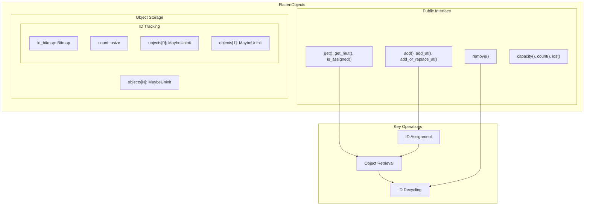
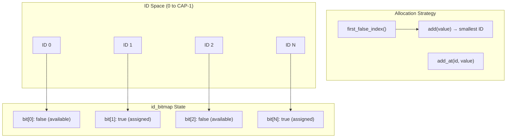
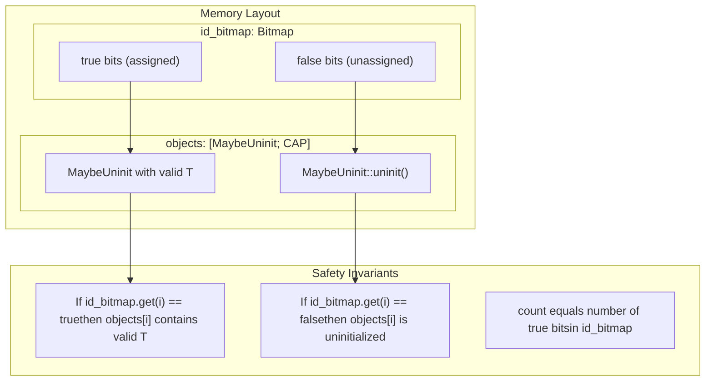

# Key Concepts and Terminology

> **Relevant source files**
> * [README.md](https://github.com/arceos-org/flatten_objects/blob/ac0a74b9/README.md)
> * [src/lib.rs](https://github.com/arceos-org/flatten_objects/blob/ac0a74b9/src/lib.rs)

This document explains the fundamental concepts and terminology used throughout the `flatten_objects` crate. It covers the core principles of object containers, unique ID assignment, ID reuse strategies, and memory management in `no_std` environments. For implementation details of the data structures, see [Internal Data Structures](/arceos-org/flatten_objects/3.1-internal-data-structures). For specific API usage patterns, see [Basic Operations](/arceos-org/flatten_objects/4.1-basic-operations).

## Object Container Fundamentals

The `flatten_objects` crate provides a specialized container called `FlattenObjects<T, CAP>` that stores objects of type `T` with a fixed capacity of `CAP` items. Unlike standard collections, this container assigns each stored object a unique numerical identifier (ID) that can be used for subsequent access.



**Container Characteristics**

* **Fixed capacity**: The container can hold at most `CAP` objects, where `CAP` is a compile-time constant
* **Numbered storage**: Each object is stored at a specific index corresponding to its ID
* **Sparse allocation**: Not all slots need to be filled; IDs can have gaps
* **Type safety**: All objects in the container must be of the same type `T`

Sources: [src/lib.rs(L44 - L51)&emsp;](https://github.com/arceos-org/flatten_objects/blob/ac0a74b9/src/lib.rs#L44-L51) [src/lib.rs(L1 - L4)&emsp;](https://github.com/arceos-org/flatten_objects/blob/ac0a74b9/src/lib.rs#L1-L4)

## Unique ID Assignment System

The container assigns unique IDs to objects using a bitmap-based allocation strategy. IDs are non-negative integers ranging from 0 to `CAP-1`.



**Assignment Methods**

* **Automatic assignment**: `add(value)` finds the smallest available ID using `id_bitmap.first_false_index()`
* **Explicit assignment**: `add_at(id, value)` assigns a specific ID if available
* **Replacement assignment**: `add_or_replace_at(id, value)` overwrites existing objects

**ID Constraints**

* IDs must be in range `<FileRef file-url="https://github.com/arceos-org/flatten_objects/blob/ac0a74b9/0, CAP)`\n- Each ID can be assigned to at most one object at a time\n- The maximum capacity `CAP` is limited to 1024 due to bitmap implementation constraints\n\nSources#LNaN-LNaN" NaN  file-path="0, CAP)`\n- Each ID can be assigned to at most one object at a time\n- The maximum capacity`CAP` is limited to 1024 due to bitmap implementation constraints\n\nSources">Hii [src/lib.rs(L249 - L257)&emsp;](https://github.com/arceos-org/flatten_objects/blob/ac0a74b9/src/lib.rs#L249-L257) [src/lib.rs(L42 - L43)&emsp;](https://github.com/arceos-org/flatten_objects/blob/ac0a74b9/src/lib.rs#L42-L43)

## ID Reuse and Lifecycle Management

When objects are removed from the container, their IDs become available for reuse. This recycling mechanism ensures efficient utilization of the limited ID space.

```mermaid
stateDiagram-v2
[*] --> Unassigned
Unassigned --> Reserved : "add() or add_at()"
note left of Reserved : ['"id_bitmap.set(id, true)<br>count += 1"']
[*] --> Occupied
Occupied --> Accessed : "get() or get_mut()"
Accessed --> Occupied : "Reference dropped"
note left of Occupied : ['"Object stored at objects[id]<br>MaybeUninit contains valid T"']
[*] --> root_start : "Container initialized"
[*] --> Assigned_start : "Object added"
[*] --> Available_start : "remove(id)"
note left of Available----note : []
note left of Occupied : ['"Bitmap bit = true<br>Slot contains valid object"']
```

**Lifecycle States**

* **Available**: ID slot is free and can be assigned (`id_bitmap.get(id) == false`)
* **Assigned**: ID slot contains a valid object (`id_bitmap.get(id) == true`)
* **Recycled**: Previously assigned ID becomes available again after `remove()`

**Reuse Strategy**

* IDs are reused in ascending order when `add()` is called
* The `first_false_index()` method finds the lowest available ID
* No guarantees about ID ordering when mixing `add()` and `add_at()` calls

Sources: [src/lib.rs(L315 - L326)&emsp;](https://github.com/arceos-org/flatten_objects/blob/ac0a74b9/src/lib.rs#L315-L326) [src/lib.rs(L223 - L224)&emsp;](https://github.com/arceos-org/flatten_objects/blob/ac0a74b9/src/lib.rs#L223-L224)

## Memory Safety inno_stdEnvironments

The crate operates in `no_std` environments, which imposes specific constraints on memory management and available standard library features.

**`no_std` Implications**

* No heap allocation: All storage uses stack-allocated arrays
* No `std::collections`: Custom container implementation required
* Limited error handling: No `std::error` trait or panic handling
* Core library only: Restricted to `core::mem` and similar basic utilities

**Memory Safety Mechanisms**

* **`MaybeUninit<T>` wrapper**: Safely handles uninitialized memory slots
* **Bitmap synchronization**: Ensures `id_bitmap` state matches object initialization
* **Unsafe operations**: Contained within safe public interfaces with documented invariants



**Safety Guarantees**

* Objects are only accessible when their corresponding bitmap bit is set
* `assume_init_ref()` and `assume_init_mut()` are only called on initialized slots
* Memory is properly cleaned up when objects are removed via `assume_init_read()`

Sources: [src/lib.rs(L32)&emsp;](https://github.com/arceos-org/flatten_objects/blob/ac0a74b9/src/lib.rs#L32-L32) [src/lib.rs(L48)&emsp;](https://github.com/arceos-org/flatten_objects/blob/ac0a74b9/src/lib.rs#L48-L48) [src/lib.rs(L79 - L83)&emsp;](https://github.com/arceos-org/flatten_objects/blob/ac0a74b9/src/lib.rs#L79-L83) [src/lib.rs(L165 - L172)&emsp;](https://github.com/arceos-org/flatten_objects/blob/ac0a74b9/src/lib.rs#L165-L172)

## Capacity Constraints and Generic Parameters

The container uses compile-time generic parameters to ensure type safety and memory efficiency.

**Generic Parameters**

* `T`: The type of objects stored in the container
* `CAP`: Compile-time constant defining maximum capacity

**Type Constraints**

* `BitsImpl<{ CAP }>: Bits`: Ensures the bitmap implementation supports the specified capacity
* `CAP` must not exceed 1024 due to bitmap library limitations

**Capacity Characteristics**

* **Fixed size**: Memory allocation is determined at compile time
* **Zero-cost abstraction**: No runtime overhead for capacity checks
* **Stack allocated**: Entire container lives on the stack (no heap allocation)

Sources: [src/lib.rs(L44 - L46)&emsp;](https://github.com/arceos-org/flatten_objects/blob/ac0a74b9/src/lib.rs#L44-L46) [src/lib.rs(L61)&emsp;](https://github.com/arceos-org/flatten_objects/blob/ac0a74b9/src/lib.rs#L61-L61) [src/lib.rs(L86 - L101)&emsp;](https://github.com/arceos-org/flatten_objects/blob/ac0a74b9/src/lib.rs#L86-L101)

## Dependency Integration

The crate integrates with the `bitmaps` crate for efficient ID tracking and management.

**External Dependencies**

* `bitmaps` crate (v3.2): Provides `Bitmap<CAP>` implementation
* `core::mem`: Provides `MaybeUninit` for safe uninitialized memory handling

**Bitmap Integration**

* `Bitmap<CAP>` tracks which IDs are assigned
* `first_false_index()` method enables efficient ID allocation
* `Iter<CAP>` provides iteration over assigned IDs via `ids()` method

Sources: [src/lib.rs(L34)&emsp;](https://github.com/arceos-org/flatten_objects/blob/ac0a74b9/src/lib.rs#L34-L34) [src/lib.rs(L344 - L346)&emsp;](https://github.com/arceos-org/flatten_objects/blob/ac0a74b9/src/lib.rs#L344-L346)