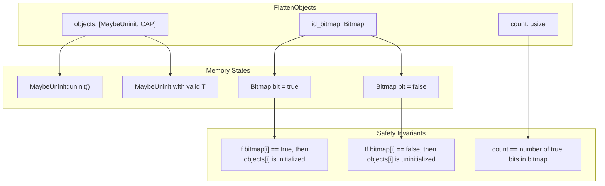
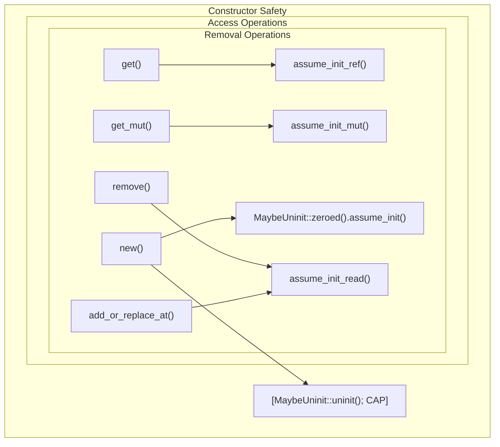
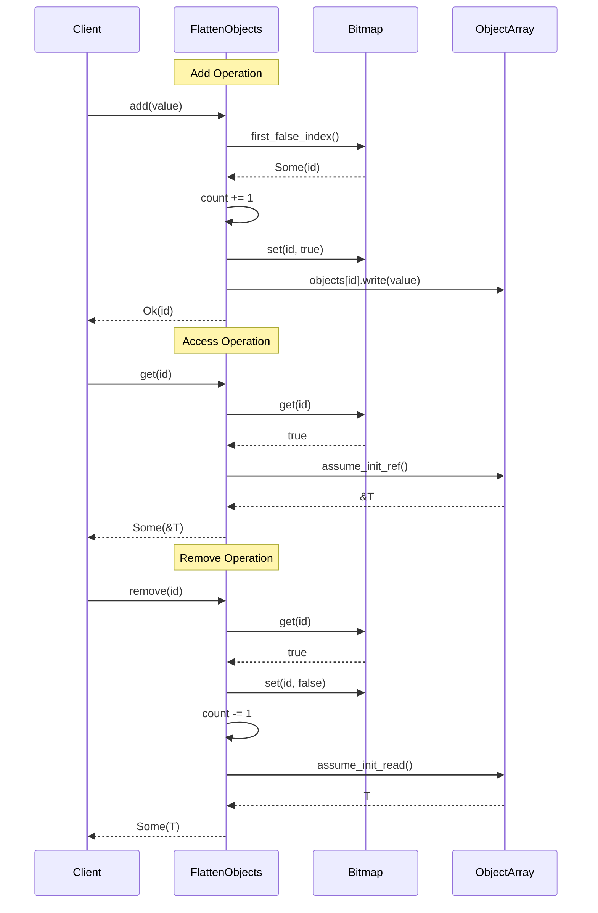
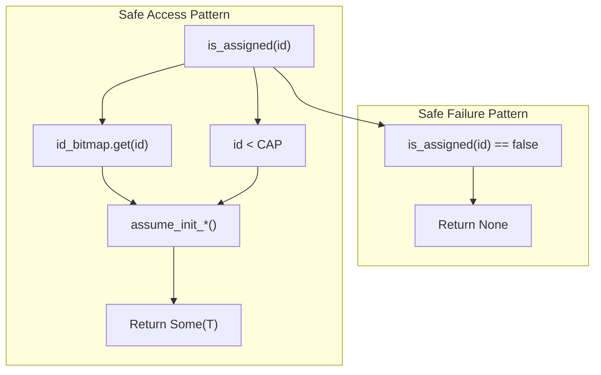
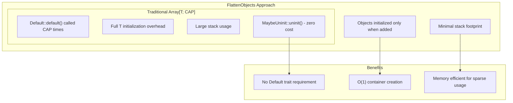
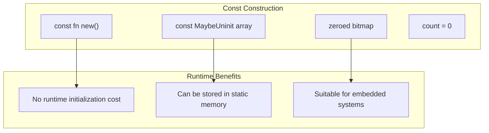

# Memory Management and Safety

> **Relevant source files**
> * [src/lib.rs](https://github.com/arceos-org/flatten_objects/blob/ac0a74b9/src/lib.rs)

This document details the memory management strategies and safety mechanisms employed by the `FlattenObjects` container. It covers the use of uninitialized memory, unsafe operations, and the critical safety invariants that ensure memory safety despite storing objects in a fixed-capacity array.

For information about the ID management system that works alongside these memory safety mechanisms, see [ID Management System](/arceos-org/flatten_objects/3.3-id-management-system). For details about the public API that maintains these safety guarantees, see [Object Management Operations](/arceos-org/flatten_objects/2.2-object-management-operations).

## Memory Layout and Data Structures

The `FlattenObjects` container uses a carefully designed memory layout that balances performance with safety in `no_std` environments.

### Core Memory Components



Sources: [src/lib.rs(L44 - L51)&emsp;](https://github.com/arceos-org/flatten_objects/blob/ac0a74b9/src/lib.rs#L44-L51)

The container maintains three core fields that work together to provide safe object storage:

|Field|Type|Purpose|
| --- | --- | --- |
|objects|[MaybeUninit<T>; CAP]|Stores potentially uninitialized objects|
|id_bitmap|Bitmap<CAP>|Tracks which array slots contain valid objects|
|count|usize|Number of currently stored objects|

### MaybeUninit Usage Pattern

The container uses `MaybeUninit<T>` to defer object initialization until actually needed, avoiding the overhead of default initialization for the entire array.

```

```

Sources: [src/lib.rs(L79)&emsp;](https://github.com/arceos-org/flatten_objects/blob/ac0a74b9/src/lib.rs#L79-L79) [src/lib.rs(L227)&emsp;](https://github.com/arceos-org/flatten_objects/blob/ac0a74b9/src/lib.rs#L227-L227) [src/lib.rs(L255)&emsp;](https://github.com/arceos-org/flatten_objects/blob/ac0a74b9/src/lib.rs#L255-L255) [src/lib.rs(L286 - L287)&emsp;](https://github.com/arceos-org/flatten_objects/blob/ac0a74b9/src/lib.rs#L286-L287) [src/lib.rs(L322)&emsp;](https://github.com/arceos-org/flatten_objects/blob/ac0a74b9/src/lib.rs#L322-L322)

## Safety Mechanisms and Unsafe Operations

The `FlattenObjects` implementation contains several unsafe operations that are carefully controlled by safety invariants.

### Unsafe Operation Sites



Sources: [src/lib.rs(L77 - L84)&emsp;](https://github.com/arceos-org/flatten_objects/blob/ac0a74b9/src/lib.rs#L77-L84) [src/lib.rs(L165 - L173)&emsp;](https://github.com/arceos-org/flatten_objects/blob/ac0a74b9/src/lib.rs#L165-L173) [src/lib.rs(L194 - L202)&emsp;](https://github.com/arceos-org/flatten_objects/blob/ac0a74b9/src/lib.rs#L194-L202) [src/lib.rs(L315 - L326)&emsp;](https://github.com/arceos-org/flatten_objects/blob/ac0a74b9/src/lib.rs#L315-L326) [src/lib.rs(L277 - L297)&emsp;](https://github.com/arceos-org/flatten_objects/blob/ac0a74b9/src/lib.rs#L277-L297)

### Critical Safety Contracts

Each unsafe operation in the codebase follows specific safety contracts:

|Operation|Location|Safety Contract|
| --- | --- | --- |
|MaybeUninit::zeroed().assume_init()|src/lib.rs81|Safe for bitmap (array of integers)|
|assume_init_ref()|src/lib.rs169|Called only whenis_assigned(id)returns true|
|assume_init_mut()|src/lib.rs198|Called only whenis_assigned(id)returns true|
|assume_init_read()|src/lib.rs286src/lib.rs322|Called only whenis_assigned(id)returns true|

## Safety Invariant Enforcement

The container maintains critical safety invariants through careful coordination between the bitmap and object array states.

### Invariant Maintenance Operations



Sources: [src/lib.rs(L222 - L232)&emsp;](https://github.com/arceos-org/flatten_objects/blob/ac0a74b9/src/lib.rs#L222-L232) [src/lib.rs(L165 - L173)&emsp;](https://github.com/arceos-org/flatten_objects/blob/ac0a74b9/src/lib.rs#L165-L173) [src/lib.rs(L315 - L326)&emsp;](https://github.com/arceos-org/flatten_objects/blob/ac0a74b9/src/lib.rs#L315-L326)

### Bitmap Synchronization Strategy

The `id_bitmap` field serves as the authoritative source of truth for object initialization state. All access to `MaybeUninit` storage goes through bitmap checks:



Sources: [src/lib.rs(L144 - L146)&emsp;](https://github.com/arceos-org/flatten_objects/blob/ac0a74b9/src/lib.rs#L144-L146) [src/lib.rs(L166)&emsp;](https://github.com/arceos-org/flatten_objects/blob/ac0a74b9/src/lib.rs#L166-L166) [src/lib.rs(L195)&emsp;](https://github.com/arceos-org/flatten_objects/blob/ac0a74b9/src/lib.rs#L195-L195)

## Memory Efficiency Considerations

The design prioritizes memory efficiency through several strategies suitable for resource-constrained environments.

### Zero-Initialization Avoidance



Sources: [src/lib.rs(L79)&emsp;](https://github.com/arceos-org/flatten_objects/blob/ac0a74b9/src/lib.rs#L79-L79) [src/lib.rs(L227)&emsp;](https://github.com/arceos-org/flatten_objects/blob/ac0a74b9/src/lib.rs#L227-L227)

### Const Construction Support

The container supports `const` construction for compile-time initialization in embedded contexts:



Sources: [src/lib.rs(L77 - L84)&emsp;](https://github.com/arceos-org/flatten_objects/blob/ac0a74b9/src/lib.rs#L77-L84)

The memory management strategy ensures that `FlattenObjects` maintains safety guarantees while providing efficient object storage suitable for kernel-level and embedded programming contexts where traditional heap allocation is not available.