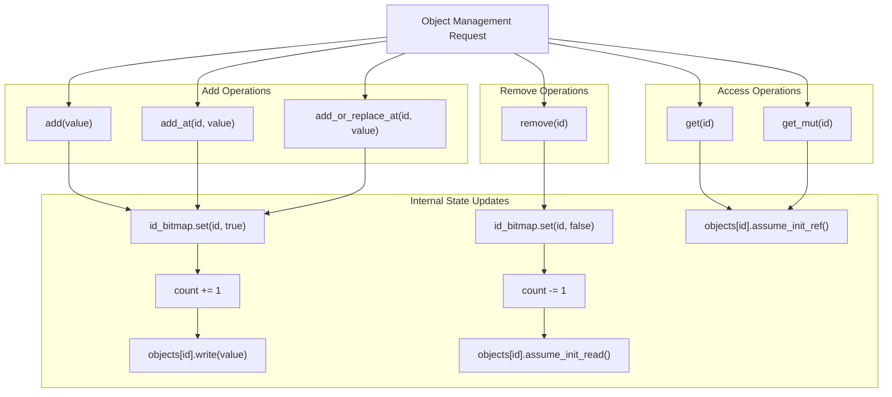
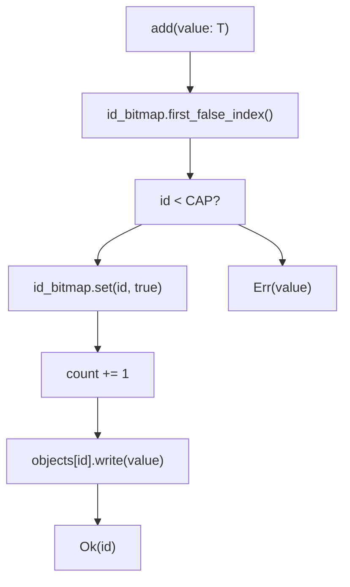

# Object Management Operations

> **Relevant source files**
> * [src/lib.rs](https://github.com/arceos-org/flatten_objects/blob/ac0a74b9/src/lib.rs)

This document covers the core object management operations provided by the `FlattenObjects<T, CAP>` container. These operations enable adding, removing, and accessing objects within the fixed-capacity container while maintaining unique ID assignments and memory safety.

The operations documented here handle the fundamental lifecycle of objects within the container. For information about container creation and configuration, see [Container Creation and Configuration](/arceos-org/flatten_objects/2.1-container-creation-and-configuration). For query and inspection methods that don't modify objects, see [Query and Inspection Methods](/arceos-org/flatten_objects/2.3-query-and-inspection-methods).

## Operation Categories Overview

The `FlattenObjects` container provides three primary categories of object management operations:

|Category|Methods|Purpose|
| --- | --- | --- |
|Adding Objects|add(),add_at(),add_or_replace_at()|Insert objects with automatic or manual ID assignment|
|Removing Objects|remove()|Remove objects and free their IDs for reuse|
|Accessing Objects|get(),get_mut()|Retrieve immutable or mutable references to stored objects|

Each operation maintains the invariant relationship between the `id_bitmap` and `objects` array, ensuring that only initialized memory locations are accessible and that ID assignments remain consistent.

**Object Management Operation Flow**



Sources: [src/lib.rs(L222 - L347)&emsp;](https://github.com/arceos-org/flatten_objects/blob/ac0a74b9/src/lib.rs#L222-L347)

## Adding Objects

The container provides three methods for adding objects, each with different ID assignment strategies and error handling behaviors.

### Automatic ID Assignment:add()

The `add()` method assigns the smallest available ID to a new object using the bitmap's `first_false_index()` function.



**Method Signature**: `pub fn add(&mut self, value: T) -> Result<usize, T>`

**Behavior**:

* Searches for the first unassigned ID using `first_false_index()`
* Validates the ID is within capacity bounds (`id < CAP`)
* Updates `id_bitmap`, increments `count`, and writes the object
* Returns the assigned ID on success, or the original value on failure

**Error Conditions**:

* Container is at full capacity
* No available IDs found

Sources: [src/lib.rs(L222 - L232)&emsp;](https://github.com/arceos-org/flatten_objects/blob/ac0a74b9/src/lib.rs#L222-L232)

### Manual ID Assignment:add_at()

The `add_at()` method places an object at a specific ID if that ID is available.

**Method Signature**: `pub fn add_at(&mut self, id: usize, value: T) -> Result<usize, T>`

**Behavior**:

* Validates `id < CAP` and `!is_assigned(id)`
* If valid, performs the same state updates as `add()`
* Returns the specified ID on success

**Error Conditions**:

* ID is out of range (`id >= CAP`)
* ID is already assigned (`is_assigned(id)` returns `true`)

Sources: [src/lib.rs(L249 - L257)&emsp;](https://github.com/arceos-org/flatten_objects/blob/ac0a74b9/src/lib.rs#L249-L257)

### Replace-or-Add:add_or_replace_at()

The `add_or_replace_at()` method either adds a new object or replaces an existing one at the specified ID.

**Method Signature**: `pub fn add_or_replace_at(&mut self, id: usize, value: T) -> Result<usize, Option<T>>`

**Behavior**:

* If ID is unassigned: performs standard add operation
* If ID is assigned: replaces existing object without changing `count`
* Uses `assume_init_read()` to safely extract the old value

**Return Values**:

* `Ok(id)`: Object added successfully at the specified ID
* `Err(Some(old_value))`: ID was assigned, old object returned
* `Err(None)`: ID is out of range

Sources: [src/lib.rs(L277 - L297)&emsp;](https://github.com/arceos-org/flatten_objects/blob/ac0a74b9/src/lib.rs#L277-L297)

## Removing Objects

The `remove()` method extracts an object from the container and frees its ID for reuse.

**Object Removal State Transition**

```mermaid
stateDiagram-v2
state Assigned ID {
    [*] --> BitmapTrue : "id_bitmap.get(id) == true"
    [*] --> ObjectInit : "objects[id] contains valid T"
    [*] --> CountIncluded : "included in count"
}
state Remove Operation {
    [*] --> CheckAssigned : "remove(id) called"
    CheckAssigned --> ClearBitmap : "is_assigned(id) == true"
    ClearBitmap --> DecrCount : "id_bitmap.set(id, false)"
    DecrCount --> ReadObject : "count -= 1"
    ReadObject --> ReturnObject : "assume_init_read()"
    CheckAssigned --> ReturnNone : "is_assigned(id) == false"
}
state Available ID {
    [*] --> BitmapFalse : "id_bitmap.get(id) == false"
    [*] --> ObjectUninit : "objects[id] uninitialized"
    [*] --> CountExcluded : "not included in count"
}
[*] --> Assigned ID : "object added"
Assigned ID --> Remove Operation : "remove(id)"
Remove Operation --> Available ID : "success"
Remove Operation --> Assigned ID : "failure (return None)"
```

**Method Signature**: `pub fn remove(&mut self, id: usize) -> Option<T>`

**Behavior**:

1. Checks `is_assigned(id)` to validate the operation
2. Clears the bitmap bit: `id_bitmap.set(id, false)`
3. Decrements the object count: `count -= 1`
4. Safely reads the object value using `assume_init_read()`
5. Returns the extracted object

**Memory Safety**: The method uses `assume_init_read()` which is safe because the bitmap ensures only initialized memory locations are accessed.

Sources: [src/lib.rs(L315 - L326)&emsp;](https://github.com/arceos-org/flatten_objects/blob/ac0a74b9/src/lib.rs#L315-L326)

## Accessing Objects

The container provides both immutable and mutable access to stored objects through bounds-checked operations.

### Immutable Access:get()

**Method Signature**: `pub fn get(&self, id: usize) -> Option<&T>`

**Behavior**:

* Validates ID assignment using `is_assigned(id)`
* Returns immutable reference via `assume_init_ref()`
* Returns `None` for unassigned or out-of-range IDs

### Mutable Access:get_mut()

**Method Signature**: `pub fn get_mut(&mut self, id: usize) -> Option<&mut T>`

**Behavior**:

* Identical validation to `get()`
* Returns mutable reference via `assume_init_mut()`
* Enables in-place modification of stored objects

**Safety Invariant**: Both methods rely on the bitmap to ensure that only initialized `MaybeUninit<T>` slots are accessed, maintaining memory safety without runtime initialization checks.

Sources: [src/lib.rs(L165 - L202)&emsp;](https://github.com/arceos-org/flatten_objects/blob/ac0a74b9/src/lib.rs#L165-L202)

## Error Handling Patterns

The object management operations use consistent error handling patterns that preserve the original values when operations fail:

|Operation|Success Type|Error Type|Error Preservation|
| --- | --- | --- | --- |
|add()|Ok(usize)|Err(T)|Returns original value|
|add_at()|Ok(usize)|Err(T)|Returns original value|
|add_or_replace_at()|Ok(usize)|Err(Option<T>)|Returns old value orNone|
|remove()|Some(T)|None|N/A|
|get()|Some(&T)|None|N/A|
|get_mut()|Some(&mut T)|None|N/A|

This design ensures that failed operations don't consume the input values, allowing callers to retry or handle errors appropriately.

## ID Assignment and Reuse Logic

The container implements an efficient ID reuse strategy through the bitmap-based allocation system:

1. **Initial Assignment**: `add()` uses `first_false_index()` to find the lowest available ID
2. **ID Liberation**: `remove()` immediately marks IDs as available by clearing bitmap bits
3. **Reuse Priority**: Newly available IDs become candidates for the next `add()` operation
4. **Capacity Bounds**: All operations respect the compile-time `CAP` limit

This approach ensures optimal ID utilization while maintaining O(1) allocation performance for most operations.

Sources: [src/lib.rs(L223 - L231)&emsp;](https://github.com/arceos-org/flatten_objects/blob/ac0a74b9/src/lib.rs#L223-L231) [src/lib.rs(L315 - L325)&emsp;](https://github.com/arceos-org/flatten_objects/blob/ac0a74b9/src/lib.rs#L315-L325)