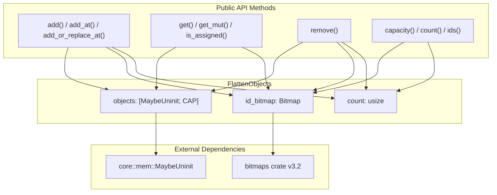
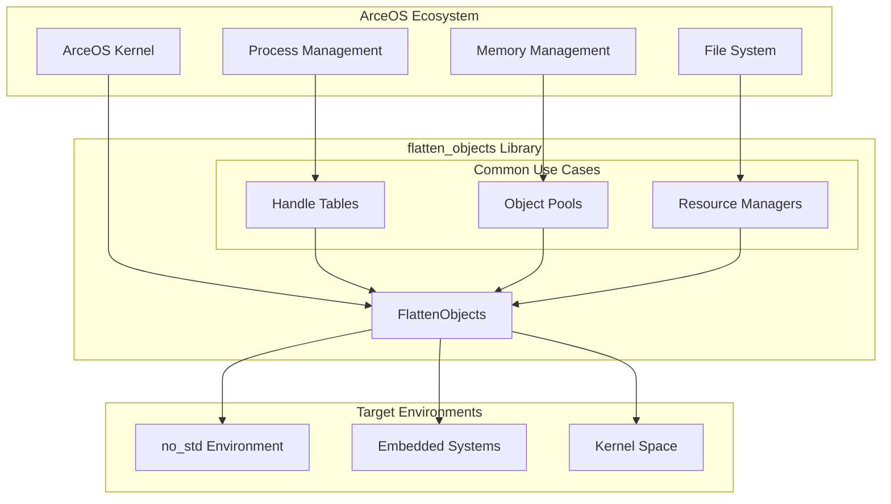

# Overview

> **Relevant source files**
> * [Cargo.toml](https://github.com/arceos-org/flatten_objects/blob/ac0a74b9/Cargo.toml)
> * [README.md](https://github.com/arceos-org/flatten_objects/blob/ac0a74b9/README.md)

## Purpose and Scope

This document provides an overview of the `flatten_objects` crate, a specialized Rust library that implements a container data structure for managing numbered objects with unique ID assignment. The crate is designed specifically for resource-constrained environments such as operating system kernels and embedded systems where the standard library is unavailable (`no_std`).

This overview covers the fundamental concepts, core data structures, and high-level architecture of the library. For detailed API documentation, see [FlattenObjects API Documentation](/arceos-org/flatten_objects/2-flattenobjects-api-documentation). For implementation specifics and memory management details, see [Implementation Details](/arceos-org/flatten_objects/3-implementation-details). For practical usage examples and integration patterns, see [Usage Guide and Examples](/arceos-org/flatten_objects/4-usage-guide-and-examples).

**Sources:** [Cargo.toml(L1 - L17)&emsp;](https://github.com/arceos-org/flatten_objects/blob/ac0a74b9/Cargo.toml#L1-L17) [README.md(L1 - L37)&emsp;](https://github.com/arceos-org/flatten_objects/blob/ac0a74b9/README.md#L1-L37)

## Core Functionality

The `flatten_objects` crate provides the `FlattenObjects<T, CAP>` container, which serves as a fixed-capacity array-like structure that automatically assigns unique integer IDs to stored objects. The container supports efficient ID reuse, allowing previously removed object IDs to be reassigned to new objects, making it ideal for implementing object pools, handle tables, and resource management systems in kernel environments.

The primary operations include:

* **Object Addition**: `add()` for automatic ID assignment, `add_at()` for specific ID placement
* **Object Removal**: `remove()` to free objects and make their IDs available for reuse
* **Object Access**: `get()` and `get_mut()` for safe reference retrieval
* **State Inspection**: `is_assigned()`, `count()`, `capacity()`, and `ids()` for container introspection

**Sources:** [README.md(L7 - L11)&emsp;](https://github.com/arceos-org/flatten_objects/blob/ac0a74b9/README.md#L7-L11) [README.md(L14 - L36)&emsp;](https://github.com/arceos-org/flatten_objects/blob/ac0a74b9/README.md#L14-L36)

## System Architecture

### Core Components Diagram

**Sources:** [Cargo.toml(L15 - L16)&emsp;](https://github.com/arceos-org/flatten_objects/blob/ac0a74b9/Cargo.toml#L15-L16) [README.md(L14 - L36)&emsp;](https://github.com/arceos-org/flatten_objects/blob/ac0a74b9/README.md#L14-L36)

### Integration Context Diagram

**Sources:** [Cargo.toml(L8 - L12)&emsp;](https://github.com/arceos-org/flatten_objects/blob/ac0a74b9/Cargo.toml#L8-L12) [Cargo.toml(L15 - L16)&emsp;](https://github.com/arceos-org/flatten_objects/blob/ac0a74b9/Cargo.toml#L15-L16)

## Key Characteristics

|Characteristic|Description|
| --- | --- |
|Fixed Capacity|Compile-time constantCAPparameter defines maximum object count|
|ID Reuse Strategy|Automatically reuses IDs from removed objects via bitmap tracking|
|Memory Efficiency|UsesMaybeUninit<T>to avoid unnecessary object initialization|
|no_std Compatible|Designed for environments without standard library support|
|Type Safety|Maintains safe abstractions over unsafe memory operations|
|Zero Runtime Allocation|All memory allocated at compile-time, no heap usage|

The library is particularly well-suited for scenarios requiring predictable memory usage and deterministic performance characteristics, such as real-time systems, kernel modules, and embedded applications where dynamic allocation is prohibited or undesirable.

**Sources:** [Cargo.toml(L12)&emsp;](https://github.com/arceos-org/flatten_objects/blob/ac0a74b9/Cargo.toml#L12-L12) [Cargo.toml(L15 - L16)&emsp;](https://github.com/arceos-org/flatten_objects/blob/ac0a74b9/Cargo.toml#L15-L16) [README.md(L17 - L36)&emsp;](https://github.com/arceos-org/flatten_objects/blob/ac0a74b9/README.md#L17-L36)