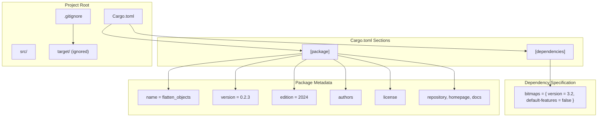
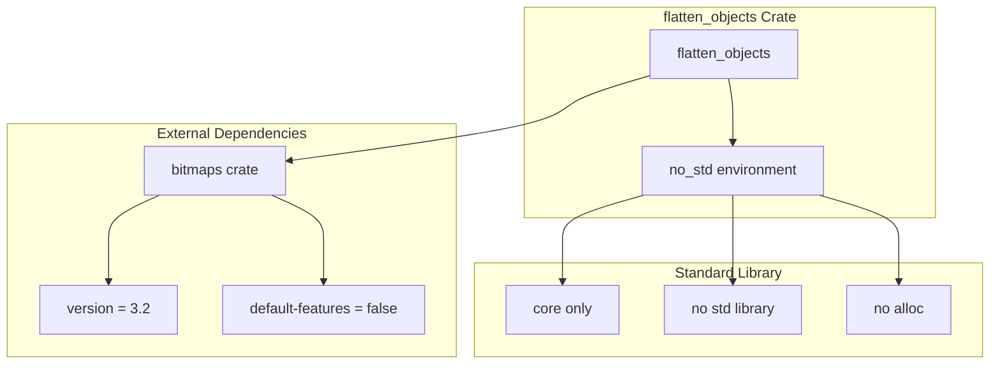
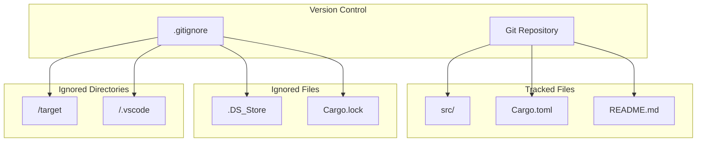
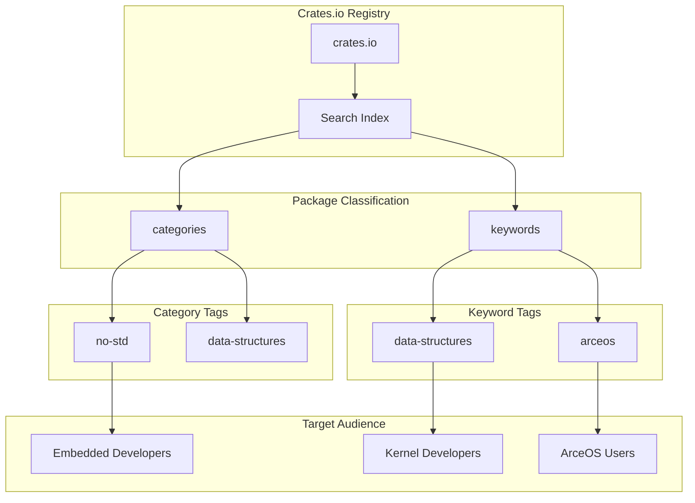

# Project Configuration

> **Relevant source files**
> * [.gitignore](https://github.com/arceos-org/flatten_objects/blob/ac0a74b9/.gitignore)
> * [Cargo.toml](https://github.com/arceos-org/flatten_objects/blob/ac0a74b9/Cargo.toml)

This document covers the configuration files and settings that control the development environment, build process, and distribution of the `flatten_objects` crate. It focuses on the static configuration files that define project metadata, dependencies, and development workflows.

For information about the actual build and testing processes, see [Building and Testing](/arceos-org/flatten_objects/5.1-building-and-testing). For details about the codebase structure and implementation, see [Implementation Details](/arceos-org/flatten_objects/3-implementation-details).

## Package Configuration

The primary configuration for the `flatten_objects` crate is defined in `Cargo.toml`, which contains all package metadata, dependency specifications, and publication settings.

### Package Metadata

The crate is configured as a library package with the following key attributes:

|Field|Value|Purpose|
| --- | --- | --- |
|name|"flatten_objects"|Crate identifier for Cargo registry|
|version|"0.2.3"|Semantic version following SemVer|
|edition|"2024"|Rust edition (latest available)|
|rust-version|"1.85"|Minimum supported Rust version (MSRV)|

The package description clearly identifies its purpose: "A container that stores numbered objects. Each object can be assigned with a unique ID." This aligns with the crate's role as a specialized data structure for resource-constrained environments.

**Project Configuration Structure**



Sources: [Cargo.toml(L1 - L17)&emsp;](https://github.com/arceos-org/flatten_objects/blob/ac0a74b9/Cargo.toml#L1-L17)

### Licensing and Legal Configuration

The crate uses a triple-license configuration to maximize compatibility across different ecosystems:

```
license = "GPL-3.0-or-later OR Apache-2.0 OR MulanPSL-2.0"
```

This licensing strategy accommodates:

* **GPL-3.0-or-later**: Copyleft compatibility for GPL projects
* **Apache-2.0**: Permissive licensing for commercial use
* **MulanPSL-2.0**: Chinese legal framework compliance

Sources: [Cargo.toml(L7)&emsp;](https://github.com/arceos-org/flatten_objects/blob/ac0a74b9/Cargo.toml#L7-L7)

### Repository and Documentation Links

The configuration establishes the project's presence in the Rust ecosystem:

|Field|URL|Purpose|
| --- | --- | --- |
|homepage|https://github.com/arceos-org/arceos|Links to parent ArceOS project|
|repository|https://github.com/arceos-org/flatten_objects|Source code location|
|documentation|https://docs.rs/flatten_objects|Auto-generated API docs|

Sources: [Cargo.toml(L8 - L10)&emsp;](https://github.com/arceos-org/flatten_objects/blob/ac0a74b9/Cargo.toml#L8-L10)

## Dependency Management

The crate maintains a minimal dependency footprint with only one external dependency, reflecting its design for resource-constrained environments.

### External Dependencies

**Dependency Configuration Analysis**



The single dependency is carefully configured:

```
bitmaps = { version = "3.2", default-features = false }
```

Key aspects of this dependency configuration:

* **Version constraint**: `3.2` provides stable bitmap operations
* **Feature configuration**: `default-features = false` ensures `no_std` compatibility
* **Minimal footprint**: Only includes essential bitmap functionality

Sources: [Cargo.toml(L15 - L16)&emsp;](https://github.com/arceos-org/flatten_objects/blob/ac0a74b9/Cargo.toml#L15-L16)

### No Standard Library Dependencies

The crate is designed for `no_std` environments, which means:

* No implicit dependency on the Rust standard library
* Only uses `core` library functionality
* Compatible with embedded and kernel environments
* Suitable for ArceOS integration

This configuration is reflected in the package categories: `["no-std", "data-structures"]`.

Sources: [Cargo.toml(L12)&emsp;](https://github.com/arceos-org/flatten_objects/blob/ac0a74b9/Cargo.toml#L12-L12)

## Development Environment Configuration

### Version Control Configuration

The `.gitignore` file defines which files and directories are excluded from version control:

**Version Control Exclusions**



|Ignored Item|Type|Reason|
| --- | --- | --- |
|/target|Directory|Build artifacts and compiled output|
|/.vscode|Directory|Editor-specific configuration|
|.DS_Store|File|macOS system metadata|
|Cargo.lock|File|Dependency lock file (library crate)|

The exclusion of `Cargo.lock` is significant because this is a library crate, not an application. Library crates typically don't commit their lock files to allow downstream users flexibility in dependency resolution.

Sources: [.gitignore(L1 - L4)&emsp;](https://github.com/arceos-org/flatten_objects/blob/ac0a74b9/.gitignore#L1-L4)

### Editor Configuration

The `.gitignore` configuration shows consideration for multiple development environments:

* **VS Code**: Excludes `.vscode/` directory for editor settings
* **macOS**: Excludes `.DS_Store` system files
* **Cross-platform**: Standard Rust build artifact exclusions

This configuration supports a diverse development team working across different platforms and editors.

Sources: [.gitignore(L2 - L3)&emsp;](https://github.com/arceos-org/flatten_objects/blob/ac0a74b9/.gitignore#L2-L3)

## Publication and Distribution Settings

### Crates.io Configuration

The package is configured for publication to the official Rust package registry with appropriate metadata for discoverability:

```
keywords = ["arceos", "data-structures"]
categories = ["no-std", "data-structures"]
```

**Distribution Categories and Keywords**



These classifications help users discover the crate when searching for:

* **ArceOS-related** components
* **Data structure** libraries
* **no_std compatible** crates

Sources: [Cargo.toml(L11 - L12)&emsp;](https://github.com/arceos-org/flatten_objects/blob/ac0a74b9/Cargo.toml#L11-L12)

### Documentation Configuration

The crate leverages automatic documentation generation through docs.rs:

* Documentation URL: `https://docs.rs/flatten_objects`
* Automatic builds on crate publication
* API documentation generated from source code comments

This configuration ensures that comprehensive documentation is available to users without requiring separate hosting infrastructure.

Sources: [Cargo.toml(L10)&emsp;](https://github.com/arceos-org/flatten_objects/blob/ac0a74b9/Cargo.toml#L10-L10)