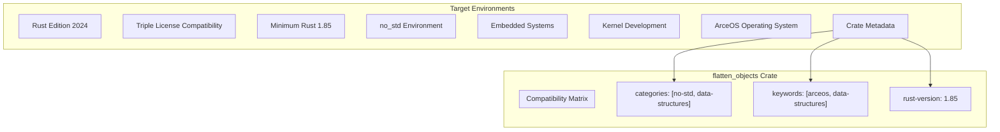
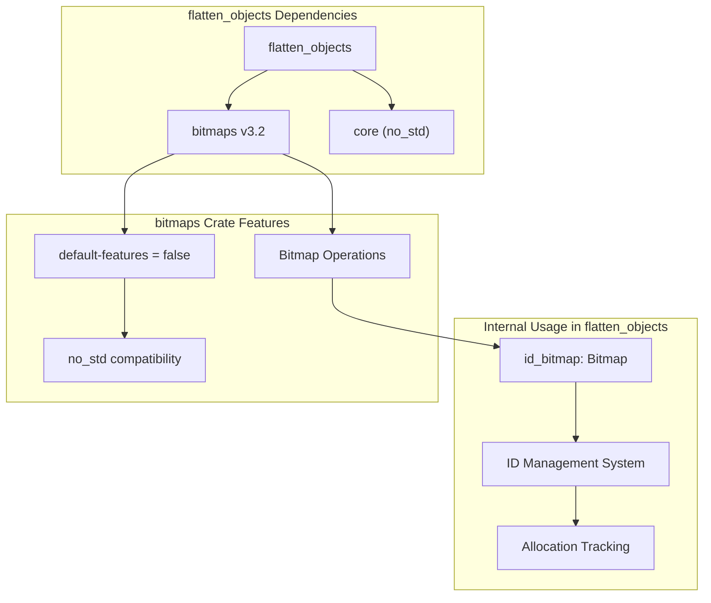
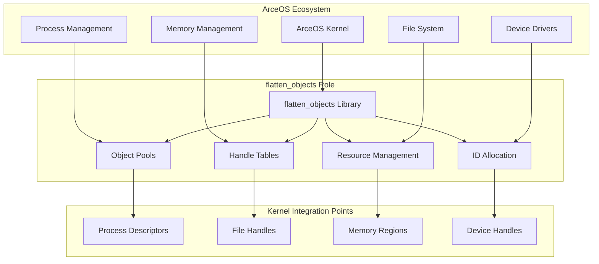
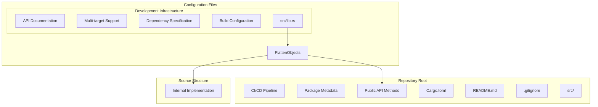

# Project Structure and Dependencies

> **Relevant source files**
> * [Cargo.toml](https://github.com/arceos-org/flatten_objects/blob/ac0a74b9/Cargo.toml)

This document details the crate configuration, external dependencies, and organizational structure of the `flatten_objects` library. It explains how the project is configured for the ArceOS ecosystem and its role as a `no_std` compatible container library.

For implementation details of the core data structures, see [Internal Data Structures](/arceos-org/flatten_objects/3.1-internal-data-structures). For build and testing procedures, see [Building and Testing](/arceos-org/flatten_objects/5.1-building-and-testing).

## Crate Configuration and Metadata

The `flatten_objects` crate is configured as a library package targeting resource-constrained environments. The crate metadata defines its purpose as a numbered object container with unique ID assignment capabilities.

### Project Metadata

|Field|Value|Purpose|
| --- | --- | --- |
|name|flatten_objects|Crate identifier for the Rust ecosystem|
|version|0.2.3|Current release version following semantic versioning|
|edition|2024|Uses Rust 2024 edition features|
|description|"A container that stores numbered objects..."|Describes the core functionality|
|license|GPL-3.0-or-later OR Apache-2.0 OR MulanPSL-2.0|Triple-licensed for maximum compatibility|
|homepage|https://github.com/arceos-org/arceos|Links to the broader ArceOS project|
|repository|https://github.com/arceos-org/flatten_objects|Source code location|
|rust-version|1.85|Minimum supported Rust version|

The crate is categorized under `no-std` and `data-structures`, indicating its suitability for embedded and kernel development environments where the standard library is unavailable.

**Crate Classification and Targets**



Sources: [Cargo.toml(L1 - L13)&emsp;](https://github.com/arceos-org/flatten_objects/blob/ac0a74b9/Cargo.toml#L1-L13)

## Dependencies Analysis

The crate maintains a minimal dependency footprint with only one external dependency to ensure compatibility with resource-constrained environments.

### External Dependencies

The `bitmaps` crate version `3.2` serves as the sole external dependency, providing efficient bitmap operations for ID management:

```
[dependencies]
bitmaps = { version = "3.2", default-features = false }
```

The `default-features = false` configuration ensures `no_std` compatibility by disabling standard library features of the `bitmaps` crate.

**Dependency Relationship Diagram**



### Dependency Rationale

|Dependency|Version|Configuration|Purpose|
| --- | --- | --- | --- |
|bitmaps|3.2|default-features = false|ProvidesBitmap<CAP>for efficient ID tracking|
|Standard Library|N/A|Excluded (no_std)|Maintains compatibility with kernel environments|
|core|Implicit|Always available|ProvidesMaybeUninitand essential types|

The `bitmaps` crate integration enables the `FlattenObjects` container to efficiently track which IDs are allocated using bitwise operations, essential for the ID reuse mechanism.

Sources: [Cargo.toml(L15 - L16)&emsp;](https://github.com/arceos-org/flatten_objects/blob/ac0a74b9/Cargo.toml#L15-L16)

## ArceOS Ecosystem Integration

The `flatten_objects` crate is designed specifically for integration within the ArceOS operating system ecosystem, serving as a foundational data structure for kernel-level resource management.

### Ecosystem Positioning

The crate's homepage points to the broader ArceOS project (`https://github.com/arceos-org/arceos`), indicating its role as a component within a larger operating system framework.

**ArceOS Integration Architecture**



### Target Use Cases

The crate addresses specific requirements in kernel and embedded development:

* **Fixed-capacity containers**: Essential for predictable memory usage in kernel environments
* **Efficient ID reuse**: Critical for long-running systems that create and destroy many objects
* **No heap allocation**: Required for kernel code and embedded systems with limited memory
* **Type-safe object storage**: Maintains memory safety while allowing low-level optimizations

Sources: [Cargo.toml(L8 - L11)&emsp;](https://github.com/arceos-org/flatten_objects/blob/ac0a74b9/Cargo.toml#L8-L11)

## Project Structure Overview

Based on the crate configuration and typical Rust library conventions, the project follows a standard structure optimized for library distribution and ArceOS integration.

### Repository Structure

**Project Organization Diagram**



### Build and Distribution Configuration

The crate is configured for distribution through the standard Rust package ecosystem while maintaining specialized requirements for kernel development:

|Configuration Aspect|Setting|Impact|
| --- | --- | --- |
|Edition|2024|Access to latest Rust language features|
|Categories|["no-std", "data-structures"]|Discoverable by embedded/kernel developers|
|Keywords|["arceos", "data-structures"]|Associated with ArceOS ecosystem|
|Documentation|docs.rsintegration|Automatic API documentation generation|
|Multi-target support|Implicit viano_std|Compatible with diverse hardware platforms|

The minimal dependency configuration ensures fast compilation and reduces the attack surface for security-critical kernel components.

Sources: [Cargo.toml(L1 - L17)&emsp;](https://github.com/arceos-org/flatten_objects/blob/ac0a74b9/Cargo.toml#L1-L17)