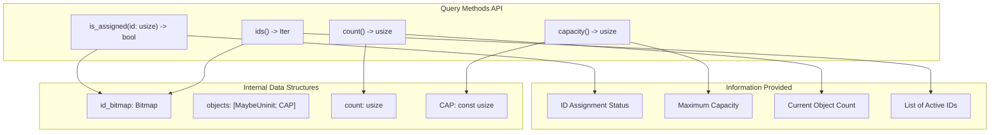
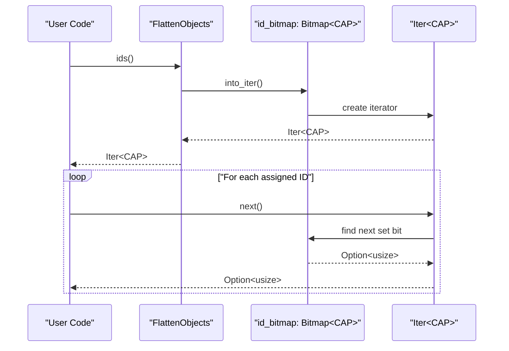
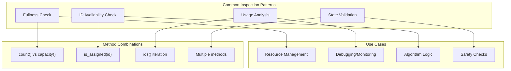
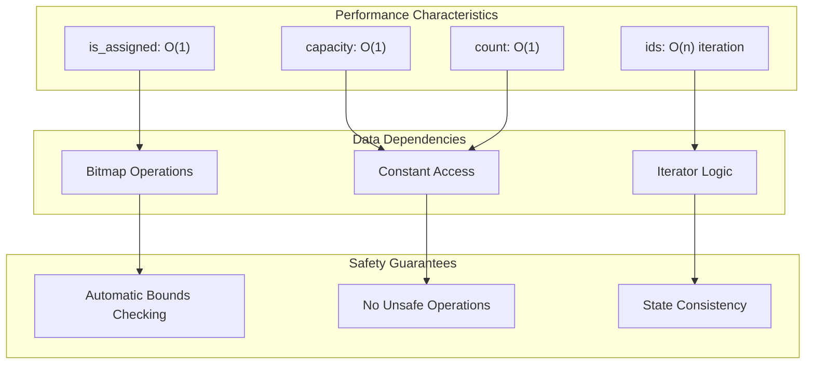

# Query and Inspection Methods

> **Relevant source files**
> * [src/lib.rs](https://github.com/arceos-org/flatten_objects/blob/ac0a74b9/src/lib.rs)

This document covers the read-only methods provided by `FlattenObjects` for inspecting container state and querying information about stored objects. These methods allow users to check object assignment status, retrieve container metadata, and iterate over assigned IDs without modifying the container's contents.

For methods that modify container contents (adding, removing, and accessing objects), see [Object Management Operations](/arceos-org/flatten_objects/2.2-object-management-operations). For details about the underlying data structures, see [Internal Data Structures](/arceos-org/flatten_objects/3.1-internal-data-structures).

## Core State Inspection Methods

The `FlattenObjects` container provides several fundamental methods for querying its current state. These methods form the foundation for understanding what objects are stored and how the container's capacity is being utilized.

**Title: Query Methods and Data Structure Relationships**

Sources: [src/lib.rs(L44 - L51)&emsp;](https://github.com/arceos-org/flatten_objects/blob/ac0a74b9/src/lib.rs#L44-L51) [src/lib.rs(L86 - L146)&emsp;](https://github.com/arceos-org/flatten_objects/blob/ac0a74b9/src/lib.rs#L86-L146) [src/lib.rs(L328 - L346)&emsp;](https://github.com/arceos-org/flatten_objects/blob/ac0a74b9/src/lib.rs#L328-L346)

### Assignment Status Checking

The `is_assigned` method determines whether a specific ID currently has an object assigned to it. This method provides bounds checking and bitmap consultation in a single operation.

|Method|Parameters|Return Type|Purpose|
| --- | --- | --- | --- |
|is_assigned|id: usize|bool|Check if ID is assigned and valid|

The method returns `false` for IDs that are out of range (≥ `CAP`) or unassigned. This dual behavior eliminates the need for separate bounds checking in user code.

Sources: [src/lib.rs(L126 - L146)&emsp;](https://github.com/arceos-org/flatten_objects/blob/ac0a74b9/src/lib.rs#L126-L146)

### Container Capacity Information

The `capacity` method returns the compile-time constant `CAP`, representing the maximum number of objects the container can hold. This value also represents the highest valid ID plus one.

|Method|Parameters|Return Type|Purpose|
| --- | --- | --- | --- |
|capacity|None|usize|Get maximum container capacity|

The capacity is immutable and determined at compile time through the generic parameter `CAP`.

Sources: [src/lib.rs(L86 - L101)&emsp;](https://github.com/arceos-org/flatten_objects/blob/ac0a74b9/src/lib.rs#L86-L101)

### Current Usage Tracking

The `count` method provides the current number of assigned objects in the container. This count is maintained automatically as objects are added and removed.

|Method|Parameters|Return Type|Purpose|
| --- | --- | --- | --- |
|count|None|usize|Get current number of stored objects|

The count reflects only assigned objects and decreases when objects are removed, allowing IDs to be reused.

Sources: [src/lib.rs(L103 - L124)&emsp;](https://github.com/arceos-org/flatten_objects/blob/ac0a74b9/src/lib.rs#L103-L124)

## Container Iteration

The `ids` method provides an iterator over all currently assigned IDs, enabling enumeration of active objects without accessing their values.

**Title: ID Iterator Workflow**

The iterator is provided by the `bitmaps` crate and efficiently traverses only the set bits in the bitmap, skipping unassigned IDs.

|Method|Parameters|Return Type|Purpose|
| --- | --- | --- | --- |
|ids|None|Iter<CAP>|Iterator over assigned IDs|

Sources: [src/lib.rs(L328 - L346)&emsp;](https://github.com/arceos-org/flatten_objects/blob/ac0a74b9/src/lib.rs#L328-L346) [src/lib.rs(L34)&emsp;](https://github.com/arceos-org/flatten_objects/blob/ac0a74b9/src/lib.rs#L34-L34)

## State Inspection Patterns

These query methods are commonly used together to implement various inspection patterns for understanding container state.

**Title: Query Method Usage Patterns**

### Capacity and Usage Analysis

Comparing `count()` and `capacity()` provides insight into container utilization:

* Full container: `count() == capacity()`
* Empty container: `count() == 0`
* Utilization ratio: `count() as f32 / capacity() as f32`

### ID Validation Workflows

The `is_assigned` method serves multiple validation purposes:

* Pre-access validation before calling `get` or `get_mut`
* Availability checking before `add_at` operations
* State consistency verification in algorithms

### Comprehensive State Enumeration

The `ids()` iterator enables complete state inspection:

* Enumerating all active objects without accessing values
* Building secondary data structures based on assigned IDs
* Implementing custom iteration patterns over active objects

Sources: [src/lib.rs(L8 - L30)&emsp;](https://github.com/arceos-org/flatten_objects/blob/ac0a74b9/src/lib.rs#L8-L30) [src/lib.rs(L332 - L342)&emsp;](https://github.com/arceos-org/flatten_objects/blob/ac0a74b9/src/lib.rs#L332-L342)

## Implementation Details

The query methods leverage the internal bitmap and counter to provide efficient, constant-time operations for most queries.

**Title: Query Method Implementation Characteristics**

### Bounds Checking Integration

The `is_assigned` method combines bounds checking with bitmap lookup: `id < CAP && self.id_bitmap.get(id)`. This ensures that out-of-range IDs are handled safely without requiring separate validation.

### Bitmap Integration

All query operations rely on the `bitmaps` crate for efficient bit manipulation. The bitmap provides O(1) bit access and optimized iteration over set bits.

### Memory Safety

Unlike the object management methods, query methods require no unsafe operations. They only access the bitmap and counter fields, which are always in a valid state.

Sources: [src/lib.rs(L144 - L146)&emsp;](https://github.com/arceos-org/flatten_objects/blob/ac0a74b9/src/lib.rs#L144-L146) [src/lib.rs(L98 - L100)&emsp;](https://github.com/arceos-org/flatten_objects/blob/ac0a74b9/src/lib.rs#L98-L100) [src/lib.rs(L121 - L123)&emsp;](https://github.com/arceos-org/flatten_objects/blob/ac0a74b9/src/lib.rs#L121-L123) [src/lib.rs(L343 - L345)&emsp;](https://github.com/arceos-org/flatten_objects/blob/ac0a74b9/src/lib.rs#L343-L345)