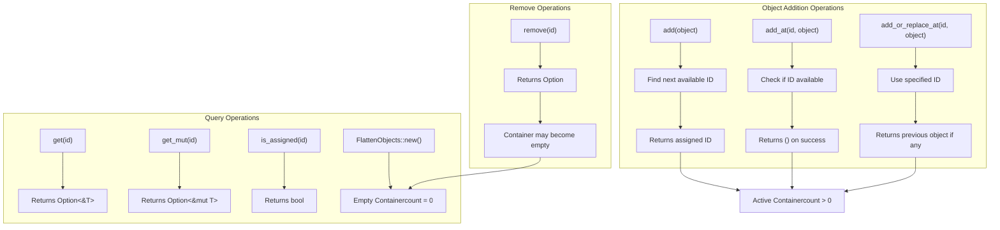
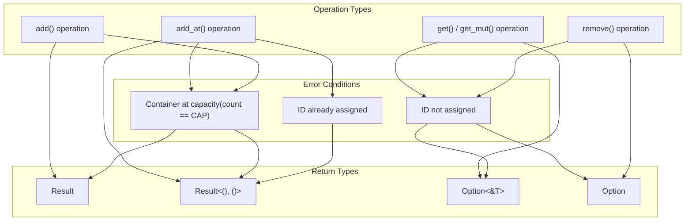
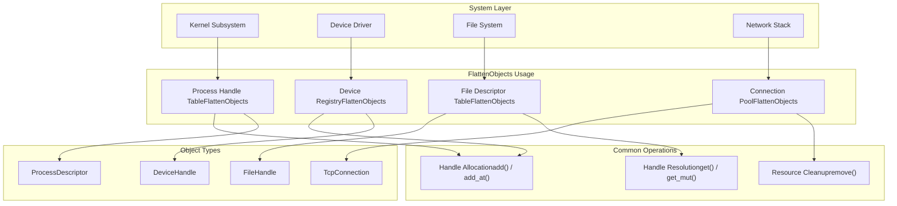

# Usage Guide and Examples

> **Relevant source files**
> * [README.md](https://github.com/arceos-org/flatten_objects/blob/ac0a74b9/README.md)

This document provides practical guidance for using the `FlattenObjects` container in real-world applications. It covers common usage patterns, best practices, and integration strategies for kernel-level and embedded systems development.

For detailed API documentation, see [FlattenObjects API Documentation](/arceos-org/flatten_objects/2-flattenobjects-api-documentation). For implementation details and internal architecture, see [Implementation Details](/arceos-org/flatten_objects/3-implementation-details).

## Container Creation and Basic Operations

The `FlattenObjects` container requires compile-time specification of both the object type and maximum capacity. This design ensures memory efficiency and predictable behavior in resource-constrained environments.

### Basic Container Workflow



**Basic Usage Example from README**

The fundamental usage pattern demonstrates object insertion, retrieval, and removal:

[README.md(L14 - L36)&emsp;](https://github.com/arceos-org/flatten_objects/blob/ac0a74b9/README.md#L14-L36)

This example shows:

* Container creation with `FlattenObjects::<u32, 20>::new()`
* Sequential ID assignment using `add_at()`
* Object removal with `remove()`
* Automatic ID reuse when using `add()`
* State checking with `is_assigned()`

Sources: [README.md(L14 - L36)&emsp;](https://github.com/arceos-org/flatten_objects/blob/ac0a74b9/README.md#L14-L36)

### Object Lifecycle Management

```

```

Sources: [README.md(L19 - L35)&emsp;](https://github.com/arceos-org/flatten_objects/blob/ac0a74b9/README.md#L19-L35)

## ID Management Patterns

The container provides flexible ID assignment strategies for different use cases:

### Automatic ID Assignment

```javascript
// From README example - automatic ID assignment
let id = objects.add(42).unwrap();
// ID 6 was reused from previously removed object
assert_eq!(id, 6);
```

This pattern uses `add()` to let the container find the next available ID, prioritizing ID reuse for memory efficiency.

### Explicit ID Assignment

```
// From README example - explicit ID assignment
for i in 0..=9 {
    objects.add_at(i, 23).unwrap();
}
```

This pattern uses `add_at()` when specific ID values are required, such as for handle tables or slot-based allocation systems.

### ID Assignment Strategy Comparison

|Method|Use Case|ID Selection|Error on Conflict|
| --- | --- | --- | --- |
|add()|General object pooling|Automatic (reuses lowest)|No (finds available)|
|add_at()|Handle tables, specific slots|Explicit|Yes (fails if occupied)|
|add_or_replace_at()|Overwrite semantics|Explicit|No (replaces existing)|

Sources: [README.md(L19 - L35)&emsp;](https://github.com/arceos-org/flatten_objects/blob/ac0a74b9/README.md#L19-L35)

## Error Handling Strategies

The container uses `Result` types for operations that can fail, enabling robust error handling in system code:

### Common Error Scenarios



**Error Handling Pattern Example**

```css
// Based on README pattern - defensive programming
match objects.add(value) {
    Ok(id) => {
        // Successfully added, use the returned ID
        println!("Object assigned ID: {}", id);
    }
    Err(()) => {
        // Container is full, handle gracefully
        eprintln!("Container capacity exceeded");
    }
}
```

Sources: [README.md(L30 - L31)&emsp;](https://github.com/arceos-org/flatten_objects/blob/ac0a74b9/README.md#L30-L31)

## Integration with System Components

The `FlattenObjects` container is designed for integration into kernel and embedded system components:

### Typical Integration Patterns



### Resource Management Pattern

```rust
// Typical kernel subsystem integration pattern
struct ProcessManager {
    processes: FlattenObjects<ProcessDescriptor, MAX_PROCESSES>,
}

impl ProcessManager {
    pub fn spawn_process(&mut self, descriptor: ProcessDescriptor) -> Result<ProcessId, SpawnError> {
        match self.processes.add(descriptor) {
            Ok(pid) => Ok(ProcessId(pid)),
            Err(()) => Err(SpawnError::TooManyProcesses),
        }
    }
    
    pub fn get_process(&self, pid: ProcessId) -> Option<&ProcessDescriptor> {
        self.processes.get(pid.0)
    }
    
    pub fn terminate_process(&mut self, pid: ProcessId) -> Option<ProcessDescriptor> {
        self.processes.remove(pid.0)
    }
}
```

This pattern demonstrates:

* Wrapping `FlattenObjects` in higher-level abstractions
* Converting container IDs to domain-specific handle types
* Providing semantic error types for integration

Sources: [README.md(L7 - L11)&emsp;](https://github.com/arceos-org/flatten_objects/blob/ac0a74b9/README.md#L7-L11)

## Container State Inspection

The container provides methods for monitoring and debugging:

### State Inspection Methods

|Method|Return Type|Purpose|
| --- | --- | --- |
|capacity()|usize|Maximum number of objects|
|count()|usize|Current number of objects|
|is_assigned(id)|bool|Check if specific ID is in use|
|ids()|Iterator<usize>|Iterate over assigned IDs|

### Monitoring Pattern

```javascript
// Based on available methods from API
fn print_container_status<T, const CAP: usize>(container: &FlattenObjects<T, CAP>) {
    println!("Capacity: {}/{}", container.count(), container.capacity());
    println!("Assigned IDs: {:?}", container.ids().collect::<Vec<_>>());
    
    // Check specific ID ranges
    for id in 0..container.capacity() {
        if container.is_assigned(id) {
            println!("ID {} is assigned", id);
        }
    }
}
```

This monitoring approach is essential for:

* Resource usage tracking in kernel subsystems
* Debugging handle leaks
* Capacity planning for system limits

Sources: [README.md(L22 - L32)&emsp;](https://github.com/arceos-org/flatten_objects/blob/ac0a74b9/README.md#L22-L32)