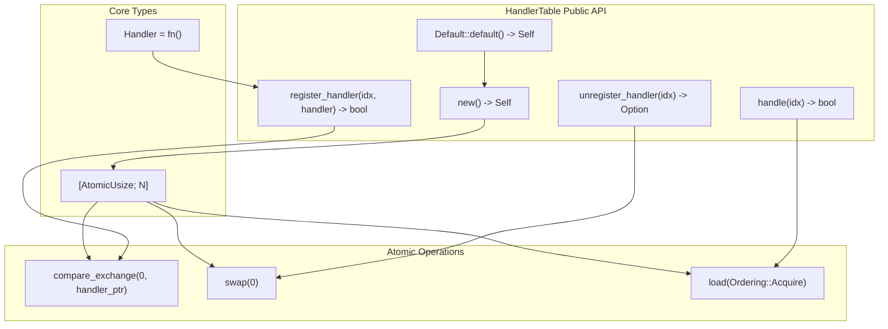
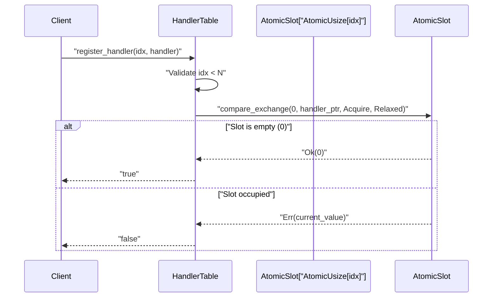
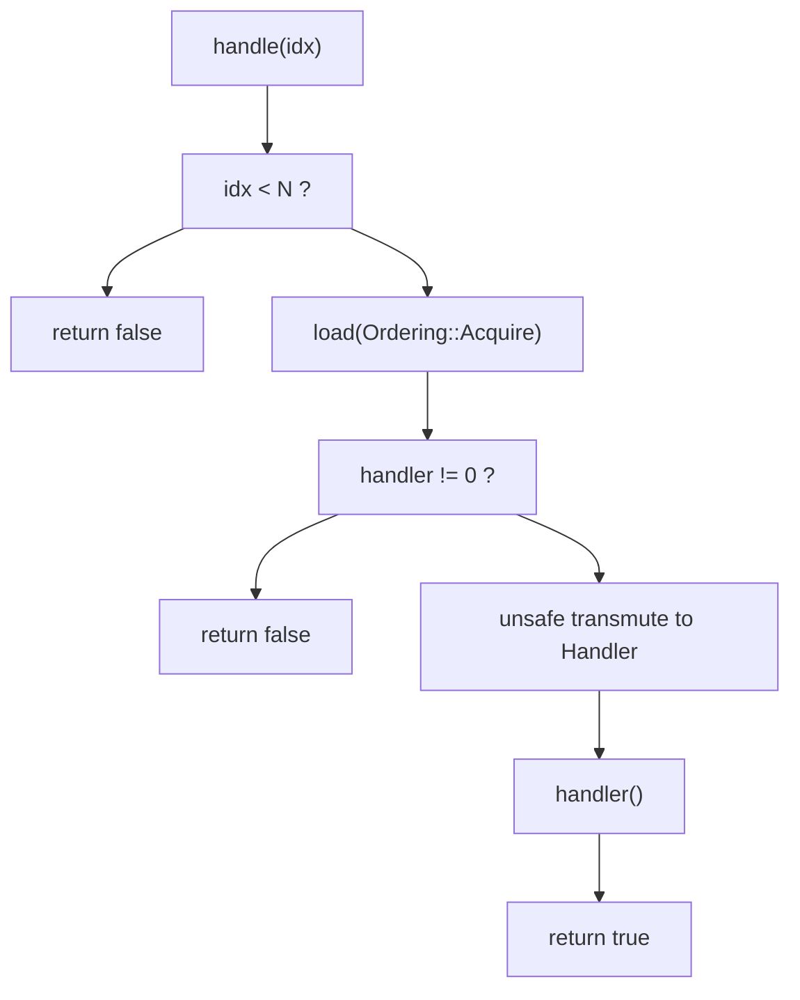

# API Reference

> **Relevant source files**
> * [README.md](https://github.com/arceos-org/handler_table/blob/036a12c4/README.md)
> * [src/lib.rs](https://github.com/arceos-org/handler_table/blob/036a12c4/src/lib.rs)

This page provides comprehensive documentation for all public APIs in the `handler_table` crate. It covers the core `HandlerTable<N>` data structure, its methods, and the `Handler` type alias.

For practical usage examples and integration patterns, see [Usage Examples](/arceos-org/handler_table/2.2-usage-examples). For detailed information about the underlying atomic operations and memory safety guarantees, see [Implementation Details](/arceos-org/handler_table/3-implementation-details).

## Core Types

### Handler Type Alias

The `Handler` type represents a function pointer to an event handler with no parameters and no return value.

```
pub type Handler = fn();
```

**Key Characteristics:**

* Zero-argument function pointer
* No return value
* Suitable for simple event callbacks
* Compatible with closures that capture no variables

Sources: [src/lib.rs(L6 - L9)&emsp;](https://github.com/arceos-org/handler_table/blob/036a12c4/src/lib.rs#L6-L9)

### HandlerTable Struct

The `HandlerTable<N>` is a generic data structure that stores up to `N` event handlers in a lock-free manner using atomic operations.

```javascript
pub struct HandlerTable<const N: usize> {
    handlers: [AtomicUsize; N],
}
```

**Key Characteristics:**

* Compile-time fixed size determined by const generic `N`
* Uses `AtomicUsize` array for lock-free operation
* Stores function pointers as `usize` values via transmutation
* Zero-initialized (empty) slots contain value `0`

Sources: [src/lib.rs(L11 - L16)&emsp;](https://github.com/arceos-org/handler_table/blob/036a12c4/src/lib.rs#L11-L16)

## API Structure Overview



Sources: [src/lib.rs(L18 - L77)&emsp;](https://github.com/arceos-org/handler_table/blob/036a12c4/src/lib.rs#L18-L77)

## Constructor Methods

### new()

Creates a new `HandlerTable<N>` with all handler slots initialized to empty.

**Signature:**

```javascript
pub const fn new() -> Self
```

**Behavior:**

* Initializes all `N` slots to zero using `AtomicUsize::new(0)`
* Can be used in `const` contexts for static allocation
* All slots are initially unregistered

**Example Usage:**

```
static TABLE: HandlerTable<8> = HandlerTable::new();
```

Sources: [src/lib.rs(L19 - L24)&emsp;](https://github.com/arceos-org/handler_table/blob/036a12c4/src/lib.rs#L19-L24)

### Default Implementation

The `Default` trait is implemented to delegate to `new()`.

**Signature:**

```javascript
impl<const N: usize> Default for HandlerTable<N>
```

**Behavior:**

* Calls `Self::new()` internally
* Provides standard Rust default initialization pattern

Sources: [src/lib.rs(L73 - L77)&emsp;](https://github.com/arceos-org/handler_table/blob/036a12c4/src/lib.rs#L73-L77)

## Handler Registration

### register_handler()

Registers an event handler for a specific index slot.

**Signature:**

```rust
pub fn register_handler(&self, idx: usize, handler: Handler) -> bool
```

**Parameters:**

|Parameter|Type|Description|
| --- | --- | --- |
|idx|usize|Index of the handler slot (must be < N)|
|handler|Handler|Function pointer to register|

**Return Value:**

* `true` - Registration successful
* `false` - Registration failed (index out of bounds or slot already occupied)

**Behavior:**

1. Validates `idx < N`
2. Attempts atomic compare-and-exchange from `0` to `handler as usize`
3. Uses `Ordering::Acquire` for success and `Ordering::Relaxed` for failure
4. Fails if slot is already occupied (non-zero value)

**Atomic Operation Details:**



Sources: [src/lib.rs(L26 - L37)&emsp;](https://github.com/arceos-org/handler_table/blob/036a12c4/src/lib.rs#L26-L37)

## Handler Deregistration

### unregister_handler()

Removes and returns the handler for a specific index slot.

**Signature:**

```rust
pub fn unregister_handler(&self, idx: usize) -> Option<Handler>
```

**Parameters:**

|Parameter|Type|Description|
| --- | --- | --- |
|idx|usize|Index of the handler slot to unregister|

**Return Value:**

* `Some(Handler)` - Previously registered handler
* `None` - No handler was registered or index out of bounds

**Behavior:**

1. Validates `idx < N`
2. Performs atomic swap with `0` using `Ordering::Acquire`
3. If previous value was non-zero, transmutes back to `Handler`
4. Returns `None` if slot was already empty

**Safety Considerations:**

* Uses `unsafe { core::mem::transmute::<usize, fn()>(handler) }` for pointer conversion
* Safe because only valid function pointers are stored via `register_handler`

Sources: [src/lib.rs(L39 - L52)&emsp;](https://github.com/arceos-org/handler_table/blob/036a12c4/src/lib.rs#L39-L52)

## Event Handling

### handle()

Executes the handler registered for a specific index.

**Signature:**

```rust
pub fn handle(&self, idx: usize) -> bool
```

**Parameters:**

|Parameter|Type|Description|
| --- | --- | --- |
|idx|usize|Index of the event to handle|

**Return Value:**

* `true` - Event was handled (handler existed and was called)
* `false` - No handler registered or index out of bounds

**Behavior:**

1. Validates `idx < N`
2. Loads handler value atomically with `Ordering::Acquire`
3. If non-zero, transmutes to `Handler` and calls it
4. Handler execution is synchronous

**Event Handling Flow:**



**Safety Considerations:**

* Uses `unsafe { core::mem::transmute(handler) }` for pointer conversion
* Safe because only valid function pointers can be stored in slots

Sources: [src/lib.rs(L54 - L70)&emsp;](https://github.com/arceos-org/handler_table/blob/036a12c4/src/lib.rs#L54-L70)

## Memory Ordering and Thread Safety

All atomic operations use `Ordering::Acquire` for loads and successful compare-exchange operations, ensuring proper synchronization between threads.

|Operation|Memory Ordering|Purpose|
| --- | --- | --- |
|compare_exchangesuccess|Ordering::Acquire|Synchronize handler registration|
|compare_exchangefailure|Ordering::Relaxed|No synchronization needed on failure|
|swap|Ordering::Acquire|Synchronize handler removal|
|load|Ordering::Acquire|Synchronize handler access|

**Thread Safety Guarantees:**

* Multiple threads can safely call any method concurrently
* Registration is atomic and will never corrupt existing handlers
* Handler execution is exclusive per slot but concurrent across slots
* No locks or blocking operations are used

Sources: [src/lib.rs(L34 - L62)&emsp;](https://github.com/arceos-org/handler_table/blob/036a12c4/src/lib.rs#L34-L62)

## Index Bounds Validation

All methods that accept an `idx` parameter perform bounds checking against the compile-time constant `N`.

**Validation Pattern:**

```
if idx >= N {
    return false; // or None for unregister_handler
}
```

**Characteristics:**

* Bounds check occurs before any atomic operations
* Out-of-bounds access returns failure indicators rather than panicking
* Provides safe API even with invalid indices

Sources: [src/lib.rs(L31 - L61)&emsp;](https://github.com/arceos-org/handler_table/blob/036a12c4/src/lib.rs#L31-L61)