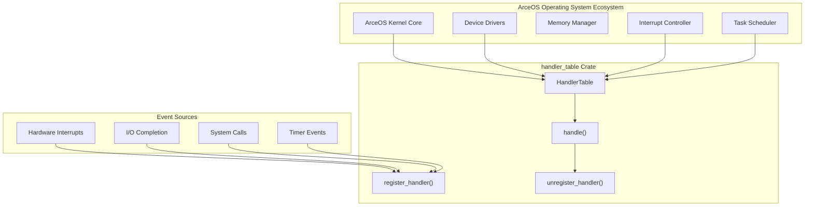
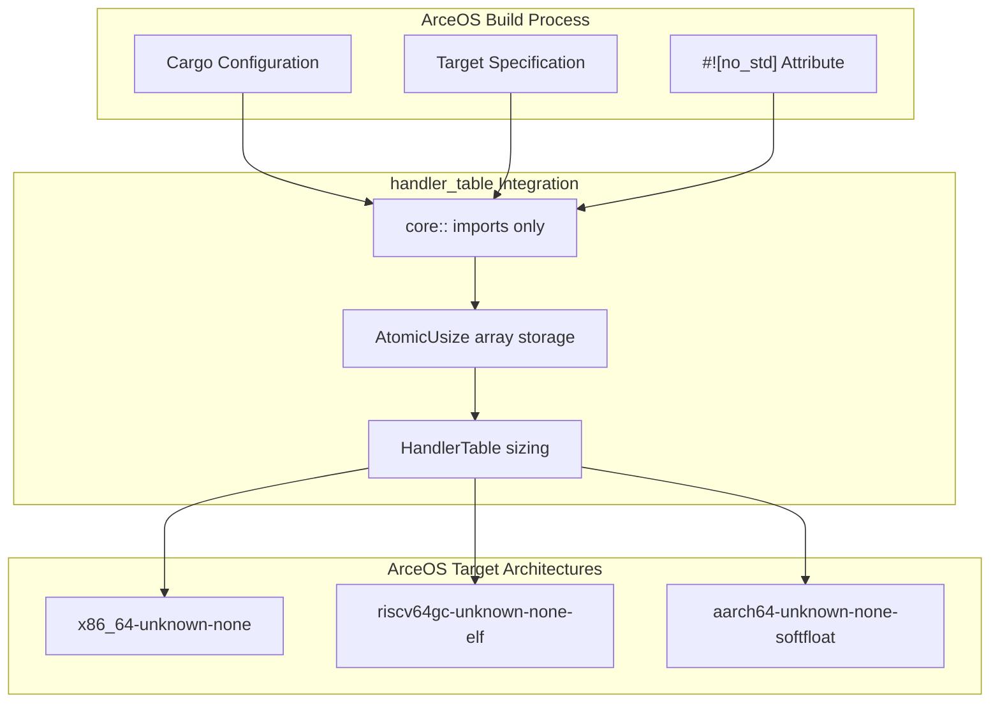
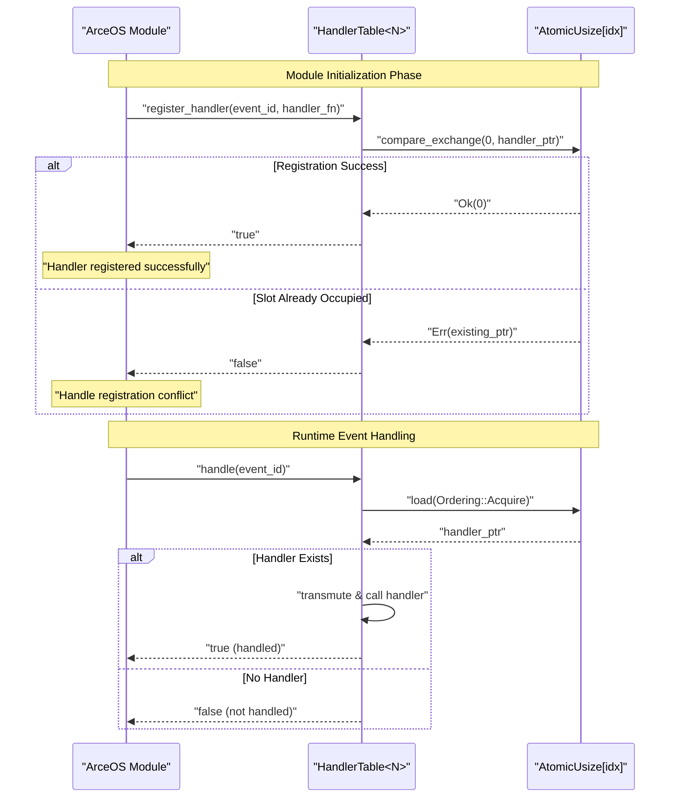
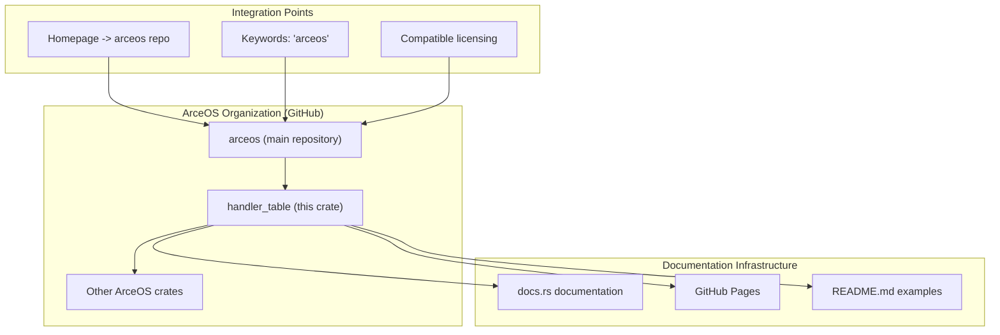

# ArceOS Integration

> **Relevant source files**
> * [Cargo.toml](https://github.com/arceos-org/handler_table/blob/036a12c4/Cargo.toml)

This document explains how the `handler_table` crate integrates into the ArceOS operating system ecosystem and serves as a foundational component for lock-free event handling in kernel and embedded environments.

The scope covers the architectural role of `handler_table` within ArceOS, its `no_std` design constraints, and how it fits into the broader operating system infrastructure. For details about the lock-free programming concepts and performance benefits, see [Lock-free Design Benefits](/arceos-org/handler_table/1.2-lock-free-design-benefits). For implementation specifics, see [Implementation Details](/arceos-org/handler_table/3-implementation-details).

## Purpose and Role in ArceOS

The `handler_table` crate provides a core event handling mechanism designed specifically for the ArceOS operating system. ArceOS is a modular, component-based operating system written in Rust that targets both traditional and embedded computing environments.

**ArceOS Integration Architecture**

The crate serves as a central dispatch mechanism that allows different ArceOS subsystems to register event handlers without requiring traditional locking mechanisms that would introduce latency and complexity in kernel code.

Sources: [Cargo.toml(L1 - L15)&emsp;](https://github.com/arceos-org/handler_table/blob/036a12c4/Cargo.toml#L1-L15)

## No-std Environment Design

The `handler_table` crate is specifically designed for `no_std` environments, making it suitable for embedded systems and kernel-level code where the standard library is not available.

|Design Constraint|Implementation|ArceOS Benefit|
| --- | --- | --- |
|No heap allocation|Fixed-size arrays with compile-time bounds|Predictable memory usage in kernel|
|No standard library|Core atomics and primitive types only|Minimal dependencies for embedded targets|
|Zero-cost abstractions|Direct atomic operations without runtime overhead|High-performance event handling|
|Compile-time sizing|GenericHandlerTable<N>with const parameter|Memory layout known at build time|

**No-std Integration Flow**

This design enables ArceOS to use `handler_table` across different target architectures without modification, supporting both traditional x86_64 systems and embedded RISC-V and ARM platforms.

Sources: [Cargo.toml(L12)&emsp;](https://github.com/arceos-org/handler_table/blob/036a12c4/Cargo.toml#L12-L12)

## Integration Patterns

ArceOS components integrate with `handler_table` through several common patterns that leverage the crate's lock-free design.

**Event Registration Pattern**

This pattern allows ArceOS modules to register event handlers during system initialization and efficiently dispatch events during runtime without locks.

Sources: [Cargo.toml(L6)&emsp;](https://github.com/arceos-org/handler_table/blob/036a12c4/Cargo.toml#L6-L6)

## Repository and Documentation Structure

The crate is maintained as part of the broader ArceOS organization, with integration points designed to support the operating system's modular architecture.

**ArceOS Organization Structure**

The repository structure ensures that `handler_table` can be discovered and integrated by ArceOS developers while maintaining independent versioning and documentation.

Sources: [Cargo.toml(L8 - L11)&emsp;](https://github.com/arceos-org/handler_table/blob/036a12c4/Cargo.toml#L8-L11)

## Version and Compatibility

The current version `0.1.2` indicates this is an early-stage crate that is being actively developed alongside the ArceOS ecosystem. The version strategy supports incremental improvements while maintaining API stability for core ArceOS components.

|Aspect|Current State|ArceOS Integration Impact|
| --- | --- | --- |
|Version|0.1.2|Early development, compatible with ArceOS components|
|License|GPL-3.0-or-later OR Apache-2.0 OR MulanPSL-2.0|Multiple license options for different ArceOS use cases|
|Edition|2021|Modern Rust features available for ArceOS development|
|Dependencies|None|Zero-dependency design reduces ArceOS build complexity|

The tri-license approach provides flexibility for different ArceOS deployment scenarios, supporting both open-source and commercial use cases.

Sources: [Cargo.toml(L3 - L7)&emsp;](https://github.com/arceos-org/handler_table/blob/036a12c4/Cargo.toml#L3-L7) [Cargo.toml(L14 - L15)&emsp;](https://github.com/arceos-org/handler_table/blob/036a12c4/Cargo.toml#L14-L15)