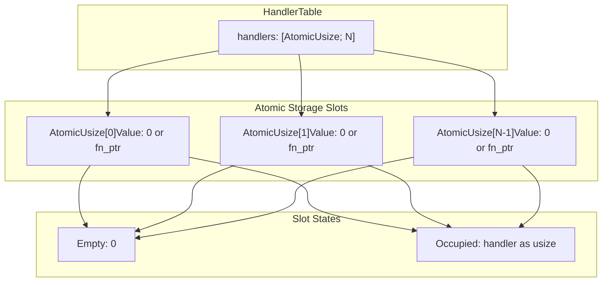
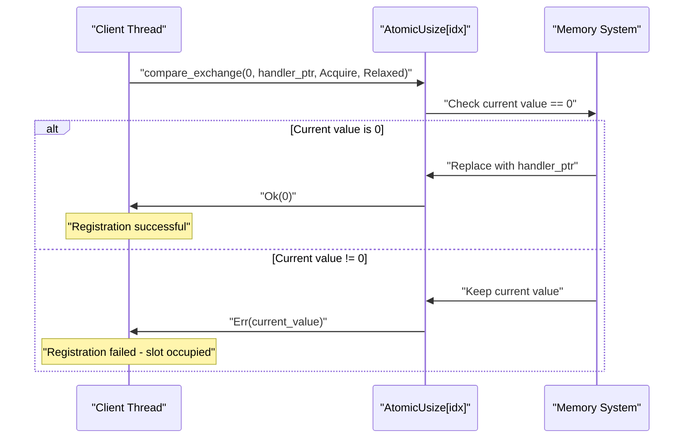
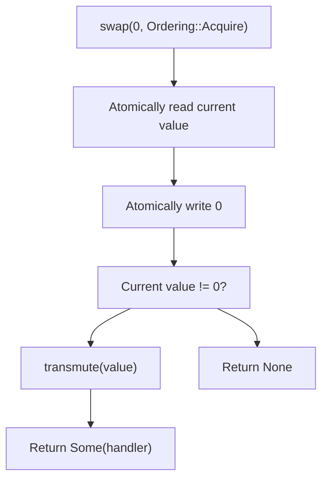
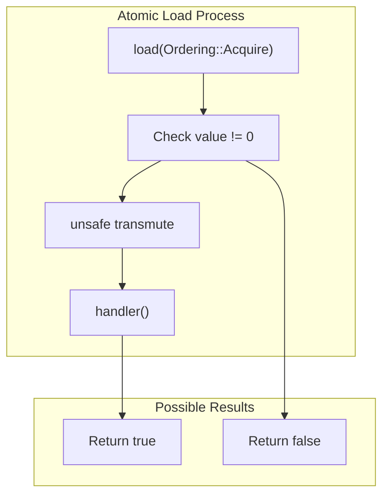
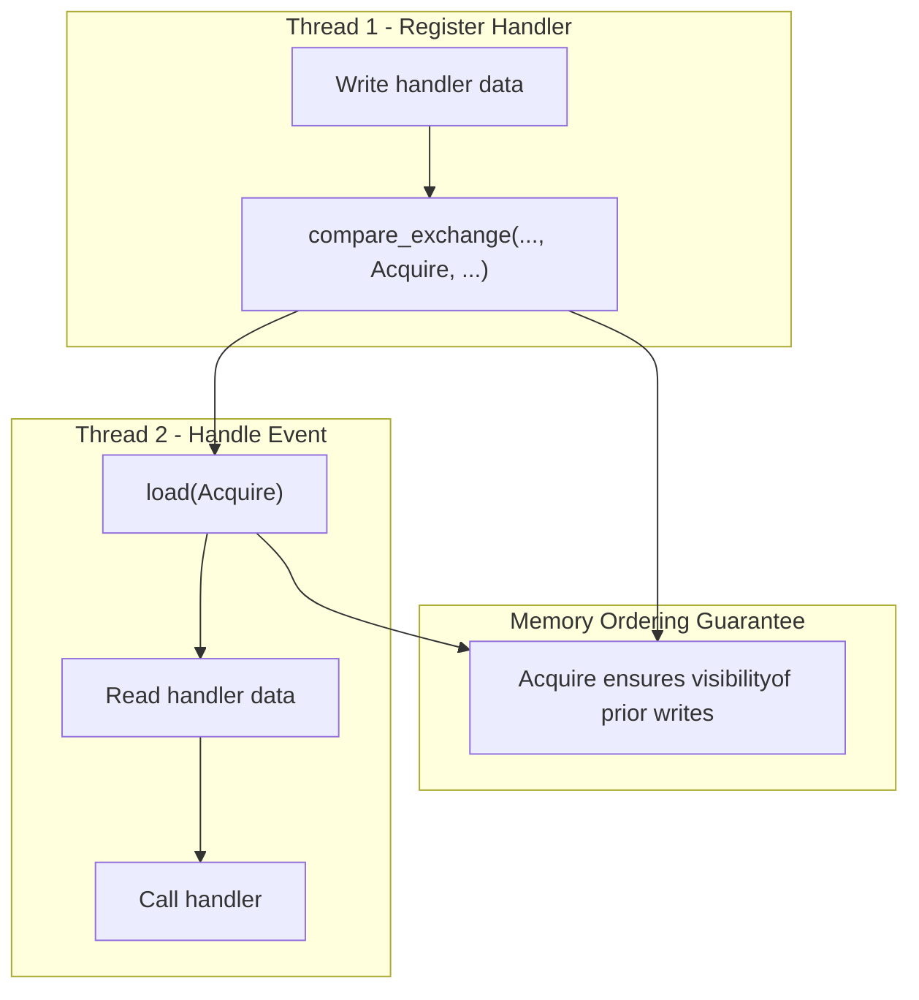
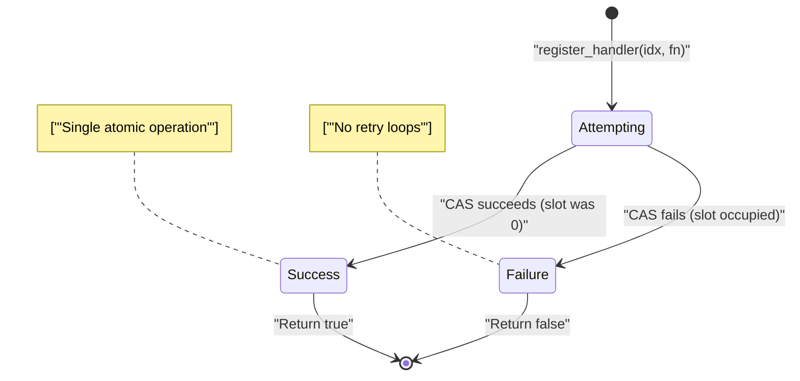
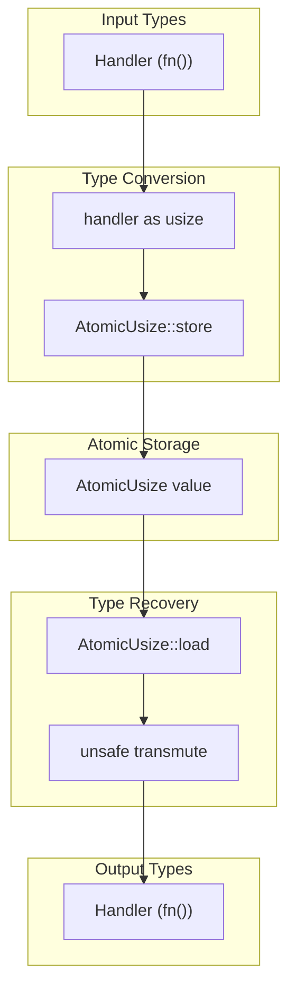

# Atomic Operations

> **Relevant source files**
> * [src/lib.rs](https://github.com/arceos-org/handler_table/blob/036a12c4/src/lib.rs)

This document explains the atomic operations that form the foundation of the `HandlerTable`'s lock-free design. It covers the specific atomic primitives used, memory ordering guarantees, and how these operations ensure thread safety without traditional locking mechanisms.

For information about the overall implementation architecture and memory safety aspects, see [Memory Layout and Safety](/arceos-org/handler_table/3.2-memory-layout-and-safety). For practical usage of the lock-free API, see [API Reference](/arceos-org/handler_table/2.1-api-reference).

## Atomic Data Structure Foundation

The `HandlerTable` uses an array of `AtomicUsize` values as its core storage mechanism. Each slot in the array can atomically hold either a null value (0) or a function pointer cast to `usize`.

### Core Atomic Array Structure

Sources: [src/lib.rs(L14 - L16)&emsp;](https://github.com/arceos-org/handler_table/blob/036a12c4/src/lib.rs#L14-L16) [src/lib.rs(L21 - L23)&emsp;](https://github.com/arceos-org/handler_table/blob/036a12c4/src/lib.rs#L21-L23)

The atomic array is initialized with zero values using const generics, ensuring compile-time allocation without heap usage. Each `AtomicUsize` slot represents either an empty handler position (value 0) or contains a function pointer cast to `usize`.

## Core Atomic Operations

The `HandlerTable` implements three primary atomic operations that provide lock-free access to the handler storage.

### Compare-Exchange Operation

The `compare_exchange` operation is used in `register_handler` to atomically install a new handler only if the slot is currently empty.

Sources: [src/lib.rs(L34 - L36)&emsp;](https://github.com/arceos-org/handler_table/blob/036a12c4/src/lib.rs#L34-L36)

The operation uses `Ordering::Acquire` for success and `Ordering::Relaxed` for failure, ensuring proper synchronization when a handler is successfully installed.

### Atomic Swap Operation

The `swap` operation in `unregister_handler` atomically replaces the current handler with zero and returns the previous value.

Sources: [src/lib.rs(L46)&emsp;](https://github.com/arceos-org/handler_table/blob/036a12c4/src/lib.rs#L46-L46) [src/lib.rs(L47 - L51)&emsp;](https://github.com/arceos-org/handler_table/blob/036a12c4/src/lib.rs#L47-L51)

### Atomic Load Operation

The `load` operation in `handle` reads the current handler value without modification, using acquire ordering to ensure proper synchronization.

Sources: [src/lib.rs(L62)&emsp;](https://github.com/arceos-org/handler_table/blob/036a12c4/src/lib.rs#L62-L62) [src/lib.rs(L63 - L66)&emsp;](https://github.com/arceos-org/handler_table/blob/036a12c4/src/lib.rs#L63-L66)

## Memory Ordering Guarantees

The atomic operations use specific memory ordering to ensure correct synchronization across threads while minimizing performance overhead.

### Ordering Usage Patterns

|Operation|Success Ordering|Failure Ordering|Purpose|
| --- | --- | --- | --- |
|compare_exchange|Acquire|Relaxed|Synchronize on successful registration|
|swap|Acquire|N/A|Synchronize when removing handler|
|load|Acquire|N/A|Synchronize when reading handler|

Sources: [src/lib.rs(L35)&emsp;](https://github.com/arceos-org/handler_table/blob/036a12c4/src/lib.rs#L35-L35) [src/lib.rs(L46)&emsp;](https://github.com/arceos-org/handler_table/blob/036a12c4/src/lib.rs#L46-L46) [src/lib.rs(L62)&emsp;](https://github.com/arceos-org/handler_table/blob/036a12c4/src/lib.rs#L62-L62)

### Acquire Ordering Semantics

Sources: [src/lib.rs(L35)&emsp;](https://github.com/arceos-org/handler_table/blob/036a12c4/src/lib.rs#L35-L35) [src/lib.rs(L62)&emsp;](https://github.com/arceos-org/handler_table/blob/036a12c4/src/lib.rs#L62-L62)

The `Acquire` ordering ensures that when a thread successfully reads a non-zero handler value, it observes all memory writes that happened-before the handler was stored.

## Lock-Free Properties

The atomic operations provide several lock-free guarantees essential for kernel-level event handling.

### Wait-Free Registration

Sources: [src/lib.rs(L30 - L37)&emsp;](https://github.com/arceos-org/handler_table/blob/036a12c4/src/lib.rs#L30-L37)

The registration operation is wait-free - it completes in a bounded number of steps regardless of other thread activity. Either the compare-exchange succeeds immediately, or it fails immediately if another handler is already registered.

### Non-Blocking Event Handling

The `handle` operation never blocks and provides consistent performance characteristics:

* **Constant Time**: Single atomic load operation
* **No Contention**: Multiple threads can simultaneously handle different events
* **Real-Time Safe**: No unbounded waiting or priority inversion

Sources: [src/lib.rs(L58 - L70)&emsp;](https://github.com/arceos-org/handler_table/blob/036a12c4/src/lib.rs#L58-L70)

## Function Pointer Storage Mechanism

The atomic operations work on `usize` values that represent function pointers, requiring careful handling to maintain type safety.

### Pointer-to-Integer Conversion

Sources: [src/lib.rs(L35)&emsp;](https://github.com/arceos-org/handler_table/blob/036a12c4/src/lib.rs#L35-L35) [src/lib.rs(L48)&emsp;](https://github.com/arceos-org/handler_table/blob/036a12c4/src/lib.rs#L48-L48) [src/lib.rs(L64)&emsp;](https://github.com/arceos-org/handler_table/blob/036a12c4/src/lib.rs#L64-L64)

The conversion relies on the platform guarantee that function pointers can be safely cast to `usize` and back. The `unsafe` transmute operations are necessary because the atomic types only work with integer values, but the conversions preserve the original function pointer values exactly.