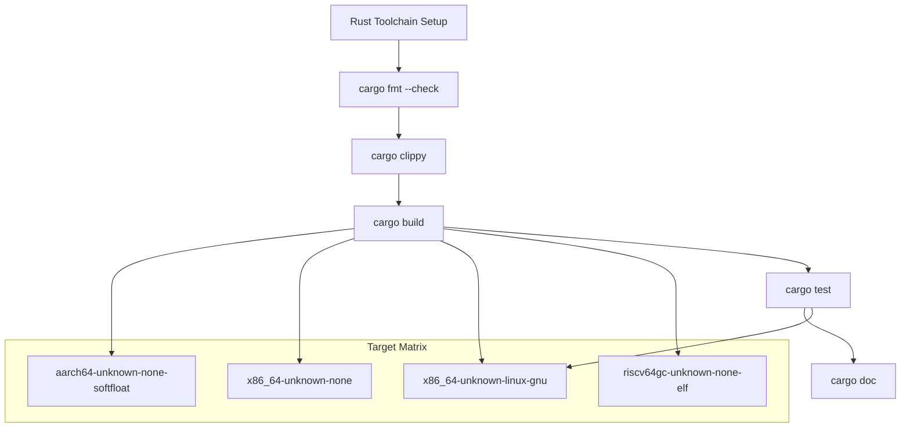
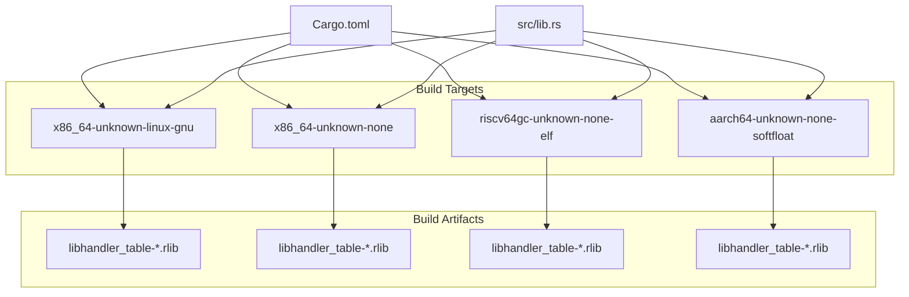
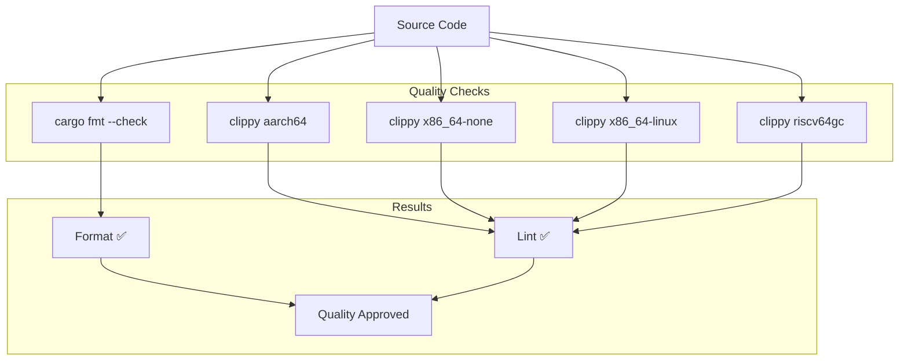

# Building and Testing

> **Relevant source files**
> * [.github/workflows/ci.yml](https://github.com/arceos-org/handler_table/blob/036a12c4/.github/workflows/ci.yml)
> * [.gitignore](https://github.com/arceos-org/handler_table/blob/036a12c4/.gitignore)

This page covers how to set up a local development environment for the `handler_table` crate, including building, testing, and code quality verification. The build process is designed to support multiple target architectures, including bare metal environments required for ArceOS integration.

For information about the automated CI/CD pipeline and deployment process, see [CI/CD Pipeline](/arceos-org/handler_table/4.2-cicd-pipeline).

## Prerequisites

The `handler_table` crate requires specific toolchain components and target platforms to build successfully across all supported architectures.

### Required Rust Toolchain

The crate requires the **nightly** Rust toolchain with specific components:

|Component|Purpose|
| --- | --- |
|rust-src|Source code for cross-compilation to bare metal targets|
|clippy|Lint checking for code quality|
|rustfmt|Code formatting verification|

### Supported Target Architectures

The crate builds for multiple target platforms as defined in the CI matrix:

|Target|Environment|Test Support|
| --- | --- | --- |
|x86_64-unknown-linux-gnu|Linux development|✅ Full testing|
|x86_64-unknown-none|Bare metal x86_64|✅ Build only|
|riscv64gc-unknown-none-elf|Bare metal RISC-V|✅ Build only|
|aarch64-unknown-none-softfloat|Bare metal ARM64|✅ Build only|

**Build and Test Workflow**



Sources: [.github/workflows/ci.yml(L11 - L19)&emsp;](https://github.com/arceos-org/handler_table/blob/036a12c4/.github/workflows/ci.yml#L11-L19) [.github/workflows/ci.yml(L22 - L30)&emsp;](https://github.com/arceos-org/handler_table/blob/036a12c4/.github/workflows/ci.yml#L22-L30)

## Local Development Setup

### Installing Required Components

Install the nightly toolchain and required components:

```markdown
# Install nightly toolchain
rustup toolchain install nightly

# Add required components
rustup component add --toolchain nightly rust-src clippy rustfmt

# Add target platforms
rustup target add --toolchain nightly x86_64-unknown-none
rustup target add --toolchain nightly riscv64gc-unknown-none-elf
rustup target add --toolchain nightly aarch64-unknown-none-softfloat
```

### Setting Default Toolchain

Set nightly as the default for the project:

```
rustup override set nightly
```

Verify the installation:

```
rustc --version --verbose
```

Sources: [.github/workflows/ci.yml(L15 - L21)&emsp;](https://github.com/arceos-org/handler_table/blob/036a12c4/.github/workflows/ci.yml#L15-L21)

## Building the Crate

### Standard Build

Build for the default target (host platform):

```
cargo build --all-features
```

### Multi-Target Building

Build for specific target architectures:

```markdown
# Linux target (default)
cargo build --target x86_64-unknown-linux-gnu --all-features

# Bare metal x86_64
cargo build --target x86_64-unknown-none --all-features

# Bare metal RISC-V
cargo build --target riscv64gc-unknown-none-elf --all-features

# Bare metal ARM64
cargo build --target aarch64-unknown-none-softfloat --all-features
```

**Multi-Target Build Process**



Sources: [.github/workflows/ci.yml(L26 - L27)&emsp;](https://github.com/arceos-org/handler_table/blob/036a12c4/.github/workflows/ci.yml#L26-L27)

## Running Tests

### Unit Tests

Unit tests can only be executed on the `x86_64-unknown-linux-gnu` target due to the `no_std` nature of the crate and bare metal target limitations:

```
cargo test --target x86_64-unknown-linux-gnu -- --nocapture
```

The `--nocapture` flag allows `println!` statements in tests to be visible during test execution.

### Test Limitations

|Target|Test Support|Reason|
| --- | --- | --- |
|x86_64-unknown-linux-gnu|✅ Full|Standard library available|
|x86_64-unknown-none|❌ None|No test framework in bare metal|
|riscv64gc-unknown-none-elf|❌ None|No test framework in bare metal|
|aarch64-unknown-none-softfloat|❌ None|No test framework in bare metal|

Sources: [.github/workflows/ci.yml(L28 - L30)&emsp;](https://github.com/arceos-org/handler_table/blob/036a12c4/.github/workflows/ci.yml#L28-L30)

## Code Quality Checks

### Format Checking

Verify code formatting compliance:

```
cargo fmt --all -- --check
```

This command checks that all code follows the standard Rust formatting rules without modifying files.

### Lint Checking

Run Clippy for all targets:

```markdown
# Check specific target
cargo clippy --target x86_64-unknown-linux-gnu --all-features
cargo clippy --target x86_64-unknown-none --all-features
cargo clippy --target riscv64gc-unknown-none-elf --all-features
cargo clippy --target aarch64-unknown-none-softfloat --all-features
```

**Code Quality Pipeline**



Sources: [.github/workflows/ci.yml(L22 - L25)&emsp;](https://github.com/arceos-org/handler_table/blob/036a12c4/.github/workflows/ci.yml#L22-L25)

## Documentation Generation

### Building Documentation

Generate crate documentation:

```
cargo doc --no-deps --all-features
```

The `--no-deps` flag excludes dependency documentation, focusing only on the `handler_table` crate.

### Documentation Configuration

The documentation build process uses specific `RUSTDOCFLAGS` for strict documentation requirements:

```
export RUSTDOCFLAGS="-D rustdoc::broken_intra_doc_links -D missing-docs"
cargo doc --no-deps --all-features
```

|Flag|Purpose|
| --- | --- |
|-D rustdoc::broken_intra_doc_links|Fail on broken internal documentation links|
|-D missing-docs|Fail on missing documentation comments|

### Viewing Documentation

After building, documentation is available at:

```
target/doc/handler_table/index.html
```

Sources: [.github/workflows/ci.yml(L40)&emsp;](https://github.com/arceos-org/handler_table/blob/036a12c4/.github/workflows/ci.yml#L40-L40) [.github/workflows/ci.yml(L44 - L48)&emsp;](https://github.com/arceos-org/handler_table/blob/036a12c4/.github/workflows/ci.yml#L44-L48)

## Development Workflow

### Complete Development Cycle

A typical development workflow combines all verification steps:

```markdown
# 1. Format check
cargo fmt --all -- --check

# 2. Lint check for primary target
cargo clippy --target x86_64-unknown-linux-gnu --all-features

# 3. Build all targets
cargo build --target x86_64-unknown-linux-gnu --all-features
cargo build --target x86_64-unknown-none --all-features
cargo build --target riscv64gc-unknown-none-elf --all-features
cargo build --target aarch64-unknown-none-softfloat --all-features

# 4. Run tests
cargo test --target x86_64-unknown-linux-gnu -- --nocapture

# 5. Generate documentation
cargo doc --no-deps --all-features
```

### Ignored Files

The development environment excludes certain files and directories from version control:

|Path|Purpose|
| --- | --- |
|/target|Build artifacts and compiled output|
|/.vscode|Visual Studio Code configuration|
|.DS_Store|macOS system files|
|Cargo.lock|Dependency lock file (library crate)|

Sources: [.gitignore(L1 - L4)&emsp;](https://github.com/arceos-org/handler_table/blob/036a12c4/.gitignore#L1-L4)