# CI/CD Pipeline

> **Relevant source files**
> * [.github/workflows/ci.yml](https://github.com/arceos-org/handler_table/blob/036a12c4/.github/workflows/ci.yml)

This page documents the Continuous Integration and Continuous Deployment (CI/CD) pipeline for the `handler_table` crate. The pipeline ensures code quality, compatibility across multiple architectures, and automated documentation deployment through GitHub Actions workflows.

For information about building and testing locally during development, see [Building and Testing](/arceos-org/handler_table/4.1-building-and-testing).

## Pipeline Overview

The CI/CD system consists of two primary GitHub Actions workflows that execute on push and pull request events. The pipeline validates code across multiple target architectures and automatically deploys documentation to GitHub Pages.

### CI/CD Workflow Architecture

Sources: [.github/workflows/ci.yml(L1 - L56)&emsp;](https://github.com/arceos-org/handler_table/blob/036a12c4/.github/workflows/ci.yml#L1-L56)

## Multi-Architecture Testing Strategy

The CI pipeline validates compatibility across four distinct target architectures to ensure the `handler_table` crate functions correctly in diverse embedded and system environments.

### Architecture Testing Matrix

|Target|Environment|Test Coverage|
| --- | --- | --- |
|x86_64-unknown-linux-gnu|Standard Linux|Full (fmt, clippy, build, test)|
|x86_64-unknown-none|Bare metal x86_64|Build and lint only|
|riscv64gc-unknown-none-elf|RISC-V bare metal|Build and lint only|
|aarch64-unknown-none-softfloat|ARM64 bare metal|Build and lint only|

The pipeline uses a fail-fast strategy set to `false`, ensuring all target combinations are tested even if one fails.

### Target-Specific Execution Flow

Sources: [.github/workflows/ci.yml(L8 - L12)&emsp;](https://github.com/arceos-org/handler_table/blob/036a12c4/.github/workflows/ci.yml#L8-L12) [.github/workflows/ci.yml(L25 - L30)&emsp;](https://github.com/arceos-org/handler_table/blob/036a12c4/.github/workflows/ci.yml#L25-L30)

## Documentation Deployment

The documentation pipeline builds API documentation using `cargo doc` and deploys it to GitHub Pages. The deployment only occurs on pushes to the default branch, while documentation building is attempted on all branches and pull requests.

### Documentation Build Process

The documentation job includes specific configurations for documentation quality:

* **Environment Variables**: `RUSTDOCFLAGS` set to `-D rustdoc::broken_intra_doc_links -D missing-docs` to enforce documentation standards
* **Build Command**: `cargo doc --no-deps --all-features` to generate comprehensive API documentation
* **Index Generation**: Automatic creation of a redirect `index.html` pointing to the crate's documentation root

### Documentation Deployment Flow

Sources: [.github/workflows/ci.yml(L32 - L56)&emsp;](https://github.com/arceos-org/handler_table/blob/036a12c4/.github/workflows/ci.yml#L32-L56) [.github/workflows/ci.yml(L40)&emsp;](https://github.com/arceos-org/handler_table/blob/036a12c4/.github/workflows/ci.yml#L40-L40) [.github/workflows/ci.yml(L47 - L48)&emsp;](https://github.com/arceos-org/handler_table/blob/036a12c4/.github/workflows/ci.yml#L47-L48)

## Workflow Job Structure

The CI/CD pipeline is organized into two distinct GitHub Actions jobs with different responsibilities and execution contexts.

### Job Configuration Details

**CI Job (`ci`)**:

* **Runner**: `ubuntu-latest`
* **Strategy**: Matrix execution across rust toolchain and target combinations
* **Purpose**: Code quality validation and multi-architecture compatibility testing

**Documentation Job (`doc`)**:

* **Runner**: `ubuntu-latest`
* **Strategy**: Single execution context
* **Permissions**: `contents: write` for GitHub Pages deployment
* **Purpose**: API documentation generation and deployment

### Complete Workflow Structure

```mermaid
flowchart TD
subgraph subGraph4["Doc Job Steps"]
    DocStep1["actions/checkout@v4"]
    DocStep2["dtolnay/rust-toolchain@nightly"]
    DocStep3["cargo doc --no-deps --all-features"]
    DocStep4["generate index.html redirect"]
    DocStep5["JamesIves/github-pages-deploy-action@v4"]
end
subgraph subGraph3["Doc Job Configuration"]
    DocRunner["runs-on: ubuntu-latest"]
    DocPerms["permissions: contents: write"]
    DocEnv["RUSTDOCFLAGS environment"]
end
subgraph subGraph2["CI Job Steps"]
    CIStep1["actions/checkout@v4"]
    CIStep2["dtolnay/rust-toolchain@nightly"]
    CIStep3["rustc --version --verbose"]
    CIStep4["cargo fmt --all -- --check"]
    CIStep5["cargo clippy --target TARGET"]
    CIStep6["cargo build --target TARGET"]
    CIStep7["cargo test (conditional)"]
end
subgraph subGraph1["CI Job Configuration"]
    CIRunner["runs-on: ubuntu-latest"]
    CIStrategy["strategy.fail-fast: false"]
    CIMatrix["matrix: nightly × 4 targets"]
end
subgraph subGraph0["Workflow Triggers"]
    PushEvent["on: push"]
    PREvent["on: pull_request"]
end

CIMatrix --> CIStep1
CIRunner --> CIStrategy
CIStep1 --> CIStep2
CIStep2 --> CIStep3
CIStep3 --> CIStep4
CIStep4 --> CIStep5
CIStep5 --> CIStep6
CIStep6 --> CIStep7
CIStrategy --> CIMatrix
DocEnv --> DocStep1
DocPerms --> DocEnv
DocRunner --> DocPerms
DocStep1 --> DocStep2
DocStep2 --> DocStep3
DocStep3 --> DocStep4
DocStep4 --> DocStep5
PREvent --> CIRunner
PREvent --> DocRunner
PushEvent --> CIRunner
PushEvent --> DocRunner
```

Sources: [.github/workflows/ci.yml(L1 - L31)&emsp;](https://github.com/arceos-org/handler_table/blob/036a12c4/.github/workflows/ci.yml#L1-L31) [.github/workflows/ci.yml(L32 - L56)&emsp;](https://github.com/arceos-org/handler_table/blob/036a12c4/.github/workflows/ci.yml#L32-L56) [.github/workflows/ci.yml(L36 - L37)&emsp;](https://github.com/arceos-org/handler_table/blob/036a12c4/.github/workflows/ci.yml#L36-L37)